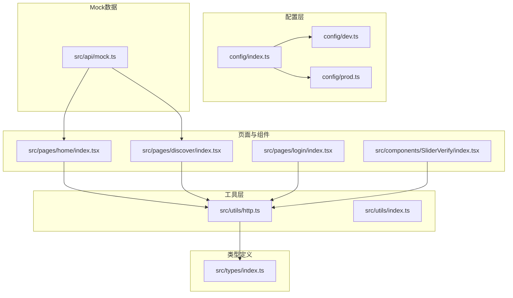
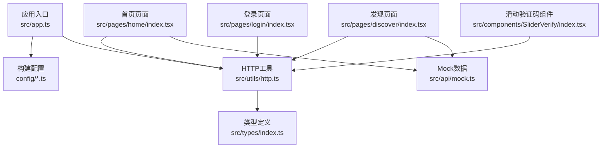
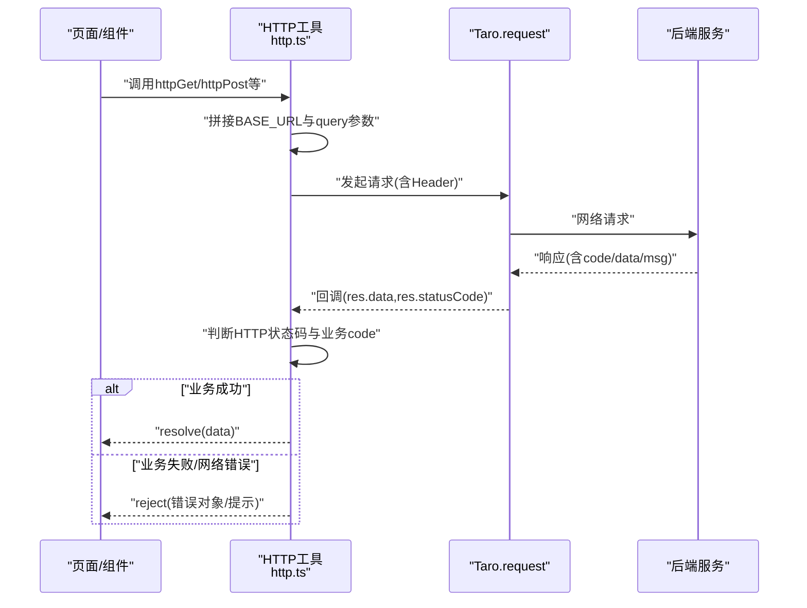
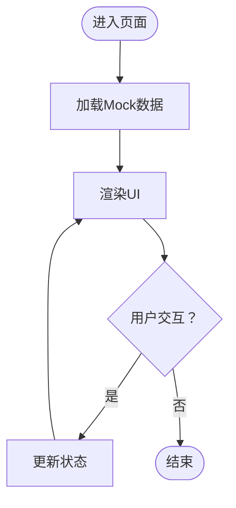
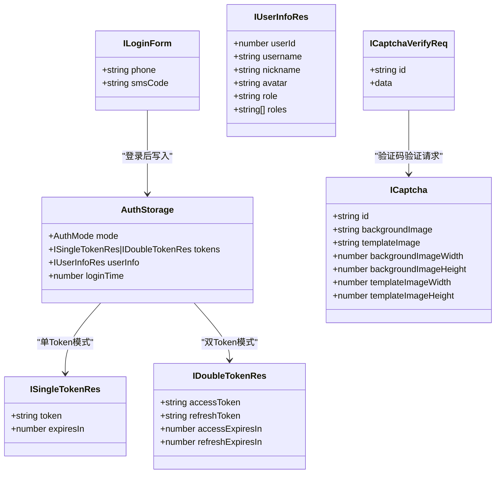
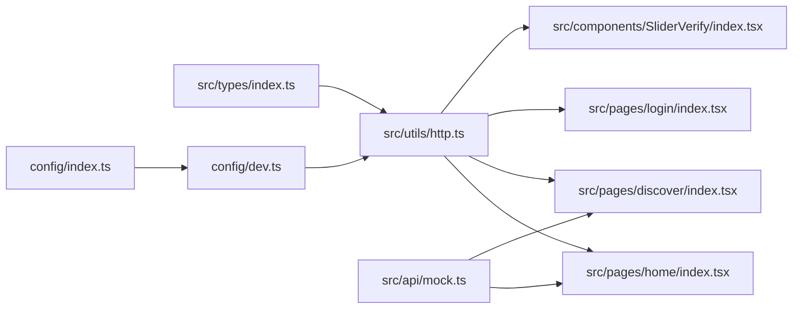

# API集成

<cite>
**本文引用的文件**
- [src/utils/http.ts](file://src/utils/http.ts)
- [src/api/mock.ts](file://src/api/mock.ts)
- [src/types/index.ts](file://src/types/index.ts)
- [config/index.ts](file://config/index.ts)
- [config/dev.ts](file://config/dev.ts)
- [config/prod.ts](file://config/prod.ts)
- [package.json](file://package.json)
- [src/pages/home/index.tsx](file://src/pages/home/index.tsx)
- [src/pages/discover/index.tsx](file://src/pages/discover/index.tsx)
- [src/pages/login/index.tsx](file://src/pages/login/index.tsx)
- [src/components/SliderVerify/index.tsx](file://src/components/SliderVerify/index.tsx)
- [src/utils/index.ts](file://src/utils/index.ts)
- [src/app.ts](file://src/app.ts)
</cite>

## 目录
1. [引言](#引言)
2. [项目结构](#项目结构)
3. [核心组件](#核心组件)
4. [架构总览](#架构总览)
5. [详细组件分析](#详细组件分析)
6. [依赖关系分析](#依赖关系分析)
7. [性能考虑](#性能考虑)
8. [故障排查指南](#故障排查指南)
9. [结论](#结论)
10. [附录](#附录)

## 引言
本文件面向红书项目的API集成与Mock系统，系统性阐述HTTP请求封装、响应处理、错误管理与重试策略；Mock数据的生成规则、持久化与动态更新机制；API调用方式、参数传递与响应处理流程；认证机制（Token管理、权限验证与安全策略）；API版本管理、缓存策略与性能优化建议；以及前后端协作与第三方服务集成的接口规范与开发指南。目标是帮助开发者快速理解并高效扩展API层能力。

## 项目结构
项目采用多端统一框架（Taro），前端以React为基础，通过配置在不同平台（H5、微信小程序等）下构建。API层位于通用工具模块中，Mock数据独立于真实后端，便于联调与演示。

图示来源
- [config/index.ts:1-82](file://config/index.ts#L1-L82)
- [config/dev.ts:1-23](file://config/dev.ts#L1-L23)
- [config/prod.ts:1-34](file://config/prod.ts#L1-L34)
- [src/utils/http.ts:1-172](file://src/utils/http.ts#L1-L172)
- [src/utils/index.ts:1-49](file://src/utils/index.ts#L1-L49)
- [src/types/index.ts:1-147](file://src/types/index.ts#L1-L147)
- [src/api/mock.ts:1-98](file://src/api/mock.ts#L1-L98)
- [src/pages/home/index.tsx:1-151](file://src/pages/home/index.tsx#L1-L151)
- [src/pages/discover/index.tsx:1-119](file://src/pages/discover/index.tsx#L1-L119)
- [src/pages/login/index.tsx:1-243](file://src/pages/login/index.tsx#L1-L243)
- [src/components/SliderVerify/index.tsx:94-202](file://src/components/SliderVerify/index.tsx#L94-L202)

章节来源
- [config/index.ts:1-82](file://config/index.ts#L1-L82)
- [config/dev.ts:1-23](file://config/dev.ts#L1-L23)
- [config/prod.ts:1-34](file://config/prod.ts#L1-L34)

## 核心组件
- HTTP请求封装：统一构建URL、拼接查询参数、设置默认Header、集中处理业务状态码与HTTP状态码，并提供便捷的GET/POST/PUT/DELETE方法。
- Mock数据系统：提供用户、笔记、话题三类基础Mock数据，用于前端联调与演示。
- 类型系统：定义Post、User、Comment、Message、Topic、验证码、登录表单、用户信息、认证存储等类型，支撑强类型开发与Token模式判断。
- 配置体系：根据环境与平台动态选择API基础地址与H5代理配置，支持开发与生产差异化部署。

章节来源
- [src/utils/http.ts:1-172](file://src/utils/http.ts#L1-L172)
- [src/api/mock.ts:1-98](file://src/api/mock.ts#L1-L98)
- [src/types/index.ts:1-147](file://src/types/index.ts#L1-L147)
- [config/dev.ts:1-23](file://config/dev.ts#L1-L23)

## 架构总览
整体架构围绕“配置—工具—类型—页面/组件—Mock”的分层组织，API调用通过统一的http工具发起，响应按约定格式解析，错误统一提示，Mock数据在本地提供基础数据源。

图示来源
- [src/app.ts:1-14](file://src/app.ts#L1-L14)
- [config/index.ts:1-82](file://config/index.ts#L1-L82)
- [src/utils/http.ts:1-172](file://src/utils/http.ts#L1-L172)
- [src/types/index.ts:1-147](file://src/types/index.ts#L1-L147)
- [src/api/mock.ts:1-98](file://src/api/mock.ts#L1-L98)
- [src/pages/home/index.tsx:1-151](file://src/pages/home/index.tsx#L1-L151)
- [src/pages/discover/index.tsx:1-119](file://src/pages/discover/index.tsx#L1-L119)
- [src/pages/login/index.tsx:1-243](file://src/pages/login/index.tsx#L1-L243)
- [src/components/SliderVerify/index.tsx:94-202](file://src/components/SliderVerify/index.tsx#L94-L202)

## 详细组件分析

### HTTP请求封装与调用流程
- 平台与环境适配：根据运行环境（H5/微信小程序）与开发/生产环境动态确定API基础地址；H5环境支持通过代理前缀访问后端。
- URL构建：将BASE_URL与相对路径拼接，支持query参数自动编码拼接到URL。
- Header与数据：默认JSON Content-Type，允许自定义Header；data作为请求体传入。
- 响应处理：
  - HTTP状态码2xx视为网络层成功；
  - 业务状态码：约定code为0或200表示业务成功，否则视为业务错误并弹出提示；
  - 失败场景：网络异常或HTTP非2xx时统一弹出错误提示。
- 方法封装：提供httpGet/httpPost/httpPut/httpDelete四个便捷方法，复用统一逻辑。

图示来源
- [src/utils/http.ts:53-117](file://src/utils/http.ts#L53-L117)

章节来源
- [src/utils/http.ts:1-172](file://src/utils/http.ts#L1-L172)

### Mock数据系统
- 数据结构：提供用户列表、笔记列表、话题列表三类Mock数据，字段覆盖头像、标题、封面、点赞数、评论数、收藏数、标签、位置、时间等。
- 使用方式：首页与发现页直接引入Mock数据进行展示；登录页与验证码组件当前为占位逻辑，后续可替换为真实API调用。
- 动态更新：页面内部通过状态更新触发渲染，Mock数据可作为初始数据源，配合后端接口逐步替换。

图示来源
- [src/api/mock.ts:1-98](file://src/api/mock.ts#L1-L98)
- [src/pages/home/index.tsx:17-26](file://src/pages/home/index.tsx#L17-L26)
- [src/pages/discover/index.tsx:7-31](file://src/pages/discover/index.tsx#L7-L31)

章节来源
- [src/api/mock.ts:1-98](file://src/api/mock.ts#L1-L98)
- [src/pages/home/index.tsx:1-151](file://src/pages/home/index.tsx#L1-L151)
- [src/pages/discover/index.tsx:1-119](file://src/pages/discover/index.tsx#L1-L119)

### 认证机制与安全策略
- 类型与模式：
  - 支持单Token与双Token两种认证模式，分别对应ISingleTokenRes与IDoubleTokenRes；
  - 提供登录表单I LoginForm与用户信息IUserInfoRes；
  - 认证存储结构AuthStorage包含mode、tokens、userInfo、loginTime等字段；
  - 提供isSingleTokenRes与isDoubleTokenRes辅助判断。
- 安全策略建议：
  - Token存储：优先使用安全存储（如加密存储），避免明文持久化；
  - 过期处理：双Token模式下，使用refreshToken在access过期前刷新；
  - 权限控制：后端接口应严格校验权限，前端仅做UI引导；
  - 传输安全：生产环境必须启用HTTPS，避免Token在传输中泄露；
  - 验证码：登录前强制滑动验证码，降低自动化攻击风险。

图示来源
- [src/types/index.ts:63-146](file://src/types/index.ts#L63-L146)

章节来源
- [src/types/index.ts:1-147](file://src/types/index.ts#L1-L147)

### API调用方式、参数传递与响应处理
- 调用方式：页面组件通过httpGet/httpPost等方法发起请求；例如滑动验证码组件在初始化时调用后端接口获取验证码数据。
- 参数传递：支持query（查询参数）、data（请求体）、header（自定义Header）与可选的hideErrorToast（隐藏错误提示）。
- 响应处理：统一解析IResponse<T>，区分HTTP状态与业务code，错误时统一Toast提示，成功时返回data。

章节来源
- [src/utils/http.ts:40-172](file://src/utils/http.ts#L40-L172)
- [src/components/SliderVerify/index.tsx:127-142](file://src/components/SliderVerify/index.tsx#L127-L142)

### 配置与环境管理
- 平台适配：H5环境使用代理前缀，微信小程序开发/生产环境分别指向测试/正式地址。
- 开发代理：H5开发服务器通过Webpack DevServer代理到后端服务，路径重写保留后端API前缀。
- 生产配置：预留生产优化插件（如Bundle Analyzer、预渲染等）占位，便于后续启用。

章节来源
- [config/index.ts:1-82](file://config/index.ts#L1-L82)
- [config/dev.ts:1-23](file://config/dev.ts#L1-L23)
- [config/prod.ts:1-34](file://config/prod.ts#L1-L34)

### 页面与组件中的API使用示例
- 首页与发现页：引入Mock数据进行展示，体现数据驱动的页面渲染。
- 登录页：包含手机号输入、验证码发送、登录流程与滑动验证码组件集成点。
- 滑动验证码组件：通过httpPost调用后端接口生成验证码数据，完成验证后回调上层。

章节来源
- [src/pages/home/index.tsx:1-151](file://src/pages/home/index.tsx#L1-L151)
- [src/pages/discover/index.tsx:1-119](file://src/pages/discover/index.tsx#L1-L119)
- [src/pages/login/index.tsx:1-243](file://src/pages/login/index.tsx#L1-L243)
- [src/components/SliderVerify/index.tsx:127-142](file://src/components/SliderVerify/index.tsx#L127-L142)

## 依赖关系分析
- 工具依赖：http.ts依赖Taro进行跨端请求；依赖types.ts提供的类型定义。
- 页面依赖：各页面依赖http.ts进行API调用；部分页面依赖Mock数据。
- 组件依赖：滑动验证码组件依赖http.ts进行验证码生成与验证。
- 配置依赖：构建配置决定API基础地址与H5代理行为。

图示来源
- [src/types/index.ts:1-147](file://src/types/index.ts#L1-L147)
- [src/utils/http.ts:1-172](file://src/utils/http.ts#L1-L172)
- [src/api/mock.ts:1-98](file://src/api/mock.ts#L1-L98)
- [src/pages/home/index.tsx:1-151](file://src/pages/home/index.tsx#L1-L151)
- [src/pages/discover/index.tsx:1-119](file://src/pages/discover/index.tsx#L1-L119)
- [src/pages/login/index.tsx:1-243](file://src/pages/login/index.tsx#L1-L243)
- [src/components/SliderVerify/index.tsx:94-202](file://src/components/SliderVerify/index.tsx#L94-L202)
- [config/dev.ts:1-23](file://config/dev.ts#L1-L23)
- [config/index.ts:1-82](file://config/index.ts#L1-L82)

章节来源
- [package.json:1-93](file://package.json#L1-L93)

## 性能考虑
- 请求合并与去抖：对频繁触发的请求使用防抖/节流（工具库已提供debounce/throttle），减少无效请求。
- 缓存策略：对静态或低频变更的数据（如话题、热门分类）可采用内存缓存；对列表分页数据采用增量缓存与失效策略。
- 图片与资源：懒加载图片、压缩资源、CDN加速；移动端注意带宽限制。
- 网络优化：H5开发阶段使用代理避免跨域；生产环境启用HTTPS与合理的缓存头。
- 重试策略：对瞬时网络波动（如超时、5xx）可增加有限次数的指数退避重试，但需避免对幂等性无保障的POST请求滥用。

## 故障排查指南
- 请求失败提示：当HTTP状态非2xx或业务code非0/200时，会弹出Toast提示；若hideErrorToast为true则不弹出。
- 网络异常：fail回调中统一记录错误日志并提示“网络错误，请检查网络连接”。
- 平台差异：H5与小程序的API基础地址不同，需确认环境变量与代理配置正确。
- Mock数据问题：若页面显示为空白，检查Mock数据是否正确导入与渲染。

章节来源
- [src/utils/http.ts:76-117](file://src/utils/http.ts#L76-L117)

## 结论
本项目通过统一的HTTP工具与清晰的类型系统，实现了跨端一致的API调用体验；Mock数据为前端联调提供了稳定的数据源；配置体系支持多环境与多平台部署。建议在后续迭代中补充真实后端接口、完善Token管理与权限控制、引入缓存与重试策略，并持续优化性能与用户体验。

## 附录
- 开发命令：提供多端构建脚本，便于快速构建与调试。
- 版本管理：建议在接口URL中加入版本前缀（如/v1/xxx），以便平滑演进与灰度发布。
- 第三方服务集成：滑动验证码组件预留了与后端验证码接口对接的调用点，后续接入时需确保HTTPS与严格的风控策略。

章节来源
- [package.json:12-32](file://package.json#L12-L32)