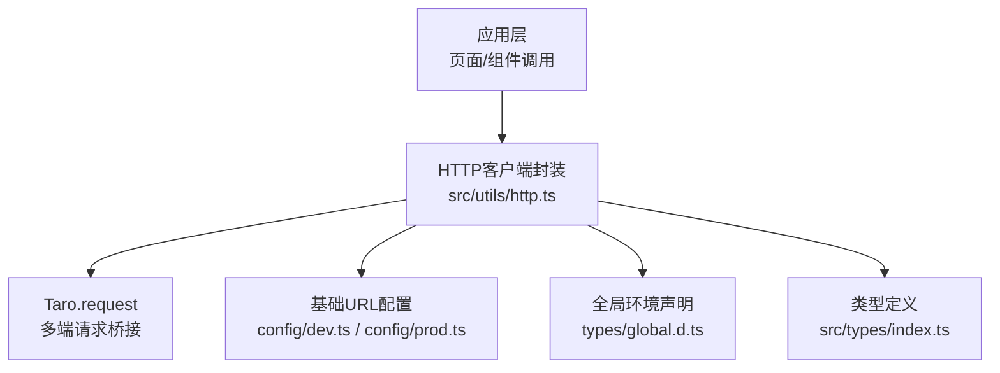
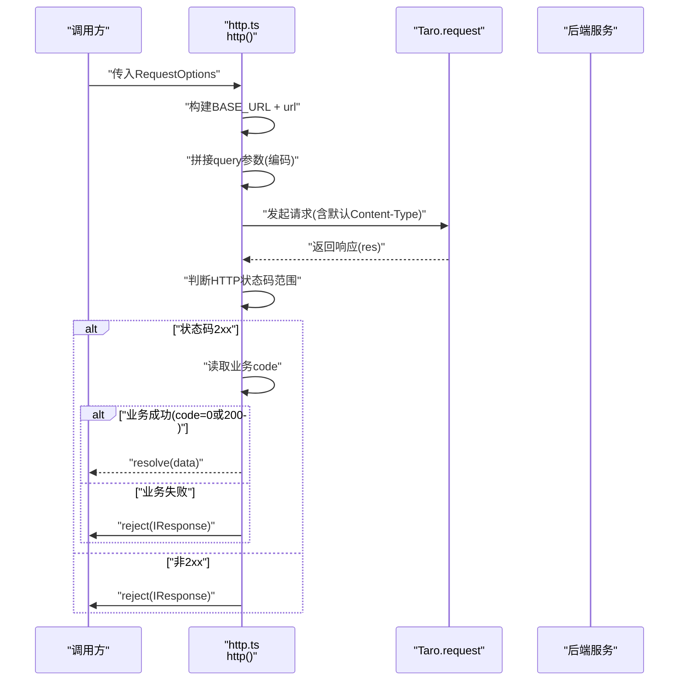
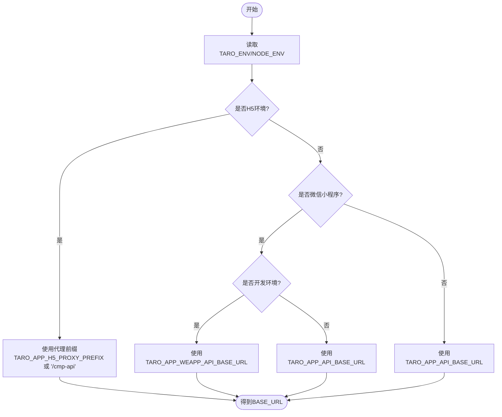
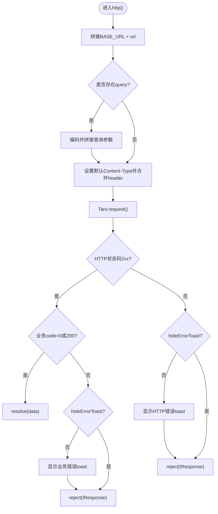
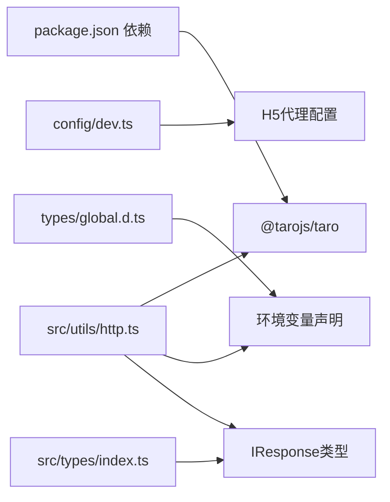

# HTTP客户端封装

<cite>
**本文档引用的文件**
- [http.ts](file://src/utils/http.ts)
- [dev.ts](file://config/dev.ts)
- [prod.ts](file://config/prod.ts)
- [global.d.ts](file://types/global.d.ts)
- [index.ts](file://src/types/index.ts)
- [index.ts](file://src/utils/index.ts)
- [package.json](file://package.json)
- [index.ts](file://src/components/SliderVerify/index.tsx)
</cite>

## 目录
1. [简介](#简介)
2. [项目结构](#项目结构)
3. [核心组件](#核心组件)
4. [架构总览](#架构总览)
5. [详细组件分析](#详细组件分析)
6. [依赖关系分析](#依赖关系分析)
7. [性能考量](#性能考量)
8. [故障排查指南](#故障排查指南)
9. [结论](#结论)
10. [附录](#附录)

## 简介
本文件面向红书项目的HTTP客户端封装，系统性解析src/utils/http.ts中的实现机制与设计思想，涵盖基础URL配置、环境变量处理、多平台适配策略；详解IResponse与RequestOptions接口的设计理念与使用方法；梳理HTTP请求核心流程（URL构建、查询参数、请求头、响应解析）与错误处理策略（业务错误、HTTP状态码、网络异常）；并提供GET/POST/PUT/DELETE等方法的使用示例与最佳实践，以及hideErrorToast选项在用户体验方面的优化考量。

## 项目结构
该模块位于src/utils/http.ts，采用统一的HTTP请求封装，结合Taro多端运行时（微信小程序、H5等），通过环境变量与配置文件实现不同环境下的基础URL与代理策略。

图表来源
- [http.ts:1-172](file://src/utils/http.ts#L1-L172)
- [dev.ts:1-23](file://config/dev.ts#L1-L23)
- [prod.ts:1-34](file://config/prod.ts#L1-L34)
- [global.d.ts:1-30](file://types/global.d.ts#L1-L30)
- [index.ts:1-147](file://src/types/index.ts#L1-L147)

章节来源
- [http.ts:1-172](file://src/utils/http.ts#L1-L172)
- [dev.ts:1-23](file://config/dev.ts#L1-L23)
- [prod.ts:1-34](file://config/prod.ts#L1-L34)
- [global.d.ts:1-30](file://types/global.d.ts#L1-L30)
- [index.ts:1-147](file://src/types/index.ts#L1-L147)

## 核心组件
- 基础URL与环境适配：根据TARO_ENV与NODE_ENV动态选择BASE_URL，H5使用代理前缀，微信小程序开发/生产环境分别指向不同API地址。
- IResponse接口：统一响应结构（code、data、msg/message），便于前端统一处理业务成功与失败。
- RequestOptions接口：统一请求参数（url、method、data、query、header、hideErrorToast），简化调用方传参。
- http核心函数：负责URL拼接、查询参数编码、请求头设置、响应状态与业务码判断、错误提示与抛错。
- 方法别名：httpGet/httpPost/httpPut/httpDelete，提供更语义化的调用入口。

章节来源
- [http.ts:3-28](file://src/utils/http.ts#L3-L28)
- [http.ts:32-48](file://src/utils/http.ts#L32-L48)
- [http.ts:53-117](file://src/utils/http.ts#L53-L117)
- [http.ts:122-171](file://src/utils/http.ts#L122-L171)

## 架构总览
下图展示HTTP客户端在多端环境中的工作流与关键决策点。

图表来源
- [http.ts:53-117](file://src/utils/http.ts#L53-L117)

## 详细组件分析

### 基础URL与环境变量处理
- 平台识别：通过process.env.TARO_ENV识别当前运行环境（如h5、weapp等）。
- 环境识别：通过process.env.NODE_ENV区分开发/生产。
- H5环境：优先使用process.env.TARO_APP_H5_PROXY_PREFIX作为代理前缀，默认值为'/cmp-api'；配合config/dev.ts中的Webpack DevServer代理规则，将'/cmp-api'路径转发到后端API地址。
- 小程序环境：开发环境使用process.env.TARO_APP_WEAPP_API_BASE_URL，生产环境使用process.env.TARO_APP_API_BASE_URL；若未配置则为空字符串。
- 其他环境：回退使用process.env.TARO_APP_API_BASE_URL。

图表来源
- [http.ts:4-28](file://src/utils/http.ts#L4-L28)
- [dev.ts:3-22](file://config/dev.ts#L3-L22)

章节来源
- [http.ts:4-28](file://src/utils/http.ts#L4-L28)
- [dev.ts:3-22](file://config/dev.ts#L3-L22)
- [global.d.ts:14-27](file://types/global.d.ts#L14-L27)

### IResponse接口设计
- 字段定义：code（业务状态码）、data（泛型业务数据）、msg与message（错误信息字段，兼容不同后端命名）。
- 设计理念：统一后端响应格式，前端无需关心具体字段差异，便于集中处理业务错误与提示。
- 使用建议：调用方通过http<T>()返回Promise<T>，当业务成功时直接获得data；当业务失败或HTTP错误时通过reject返回IResponse，便于统一toast提示与错误处理。

章节来源
- [http.ts:32-38](file://src/utils/http.ts#L32-L38)
- [index.ts:66-98](file://src/types/index.ts#L66-L98)

### RequestOptions接口与参数配置
- 必填/可选：url必填，method默认GET，其余data/query/header可选。
- 查询参数：query对象会被序列化为查询字符串并自动编码，支持已存在查询串的拼接。
- 请求头：默认添加'Content-Type': 'application/json'，同时合并用户自定义header。
- hideErrorToast：控制是否显示错误toast，用于需要静默处理或自定义错误提示的场景。

章节来源
- [http.ts:40-48](file://src/utils/http.ts#L40-L48)
- [http.ts:53-75](file://src/utils/http.ts#L53-L75)

### HTTP请求核心流程
- URL构建：BASE_URL + url，自动处理已有查询串的拼接。
- 查询参数：对键值进行URL编码后拼接到URL。
- 请求头：固定JSON内容类型，并合并自定义头。
- 成功分支：HTTP状态码2xx视为请求成功；进一步判断业务code（0或200）视为业务成功，否则视为业务失败并触发错误提示。
- 失败分支：HTTP状态码非2xx或业务code非0/200均reject；若未设置hideErrorToast，则弹出toast提示。
- 网络异常：fail回调中记录日志并弹出“网络错误”提示。

图表来源
- [http.ts:53-117](file://src/utils/http.ts#L53-L117)

章节来源
- [http.ts:53-117](file://src/utils/http.ts#L53-L117)

### HTTP方法别名与最佳实践
- httpGet：适用于查询类操作，推荐使用query传参，避免在url中硬编码。
- httpPost：适用于新增资源，注意data为对象且默认JSON传输。
- httpPut：适用于更新资源，建议携带必要的版本/条件头以避免并发覆盖。
- httpDelete：适用于删除资源，谨慎处理副作用，必要时二次确认。
- 统一错误处理：建议在调用方捕获异常并根据IResponse.msg/message进行友好提示；对于可预期的业务错误，结合hideErrorToast实现静默处理或自定义提示。

章节来源
- [http.ts:122-171](file://src/utils/http.ts#L122-L171)

### hideErrorToast选项与用户体验优化
- 适用场景：批量操作、后台刷新、静默登录、无感校验等不需要打扰用户的场景。
- 体验建议：在需要用户感知的交互（如提交失败、网络异常）时保持默认行为；在需要自定义提示或统一处理时开启hideErrorToast，由上层组件决定toast策略。
- 注意事项：即使隐藏toast，仍需在catch中处理错误，确保异常不会被吞掉。

章节来源
- [http.ts](file://src/utils/http.ts#L47)
- [http.ts:87-93](file://src/utils/http.ts#L87-L93)
- [http.ts:97-103](file://src/utils/http.ts#L97-L103)
- [http.ts:107-113](file://src/utils/http.ts#L107-L113)

### 实际使用示例与集成点
- 组件内调用：SliderVerify组件通过httpPost调用验证码生成与校验接口，展示了data与query的组合使用。
- 类型安全：通过泛型httpPost<CaptchaResponse>(...)确保返回值类型明确，便于后续UI渲染与状态管理。

章节来源
- [index.ts:129-132](file://src/components/SliderVerify/index.tsx#L129-L132)
- [index.ts:320-337](file://src/components/SliderVerify/index.tsx#L320-L337)

## 依赖关系分析
- 运行时依赖：@tarojs/taro提供跨端请求能力，http.ts基于Taro.request实现。
- 环境变量：通过global.d.ts声明NODE_ENV与TARO_ENV；通过config/dev.ts注入API基础地址与H5代理配置。
- 类型体系：src/types/index.ts提供业务类型定义，http.ts通过IResponse与泛型实现类型安全的响应处理。

图表来源
- [package.json:39-91](file://package.json#L39-L91)
- [dev.ts:3-22](file://config/dev.ts#L3-L22)
- [global.d.ts:14-27](file://types/global.d.ts#L14-L27)
- [index.ts:66-98](file://src/types/index.ts#L66-L98)
- [http.ts:1-172](file://src/utils/http.ts#L1-L172)

章节来源
- [package.json:39-91](file://package.json#L39-L91)
- [dev.ts:3-22](file://config/dev.ts#L3-L22)
- [global.d.ts:14-27](file://types/global.d.ts#L14-L27)
- [index.ts:66-98](file://src/types/index.ts#L66-L98)
- [http.ts:1-172](file://src/utils/http.ts#L1-L172)

## 性能考量
- 请求头复用：统一JSON内容类型减少不必要的协商成本。
- 查询参数编码：对键值进行编码避免重复转义与错误拼接。
- 代理策略：H5开发环境下通过代理避免跨域问题，提升联调效率。
- 错误早返回：HTTP状态码非2xx或业务失败时尽早reject，避免无效的数据解析与UI渲染。

## 故障排查指南
- 网络错误：检查网络连接与代理配置；确认config/dev.ts中代理target是否正确指向后端地址。
- 业务错误：关注IResponse.code与msg/message字段，结合hideErrorToast选项判断是否需要自定义提示。
- 参数问题：确认query对象键值类型与编码；data对象结构与后端期望一致。
- 多端差异：H5与小程序的基础URL来源不同，确保对应环境变量已正确设置。

章节来源
- [http.ts:96-114](file://src/utils/http.ts#L96-L114)
- [dev.ts:8-21](file://config/dev.ts#L8-L21)
- [global.d.ts:14-27](file://types/global.d.ts#L14-L27)

## 结论
该HTTP客户端封装以简洁的接口与清晰的错误处理为核心，结合多端适配与环境变量策略，实现了在H5与小程序环境下的稳定请求能力。通过IResponse与RequestOptions的标准化，提升了前后端协作效率与类型安全性；通过hideErrorToast选项，兼顾了用户体验与灵活的错误处理策略。建议在后续迭代中持续完善错误分类与重试机制，以进一步增强稳定性与可维护性。

## 附录
- 接口速查
  - http(options: RequestOptions): Promise<T>
  - httpGet(url, query?, header?, options?): Promise<T>
  - httpPost(url, data?, query?, header?, options?): Promise<T>
  - httpPut(url, data?, query?, header?, options?): Promise<T>
  - httpDelete(url, query?, header?, options?): Promise<T>
- 关键字段
  - IResponse.code：业务状态码
  - IResponse.data：业务数据
  - IResponse.msg/message：错误信息
  - RequestOptions.hideErrorToast：是否隐藏错误toast