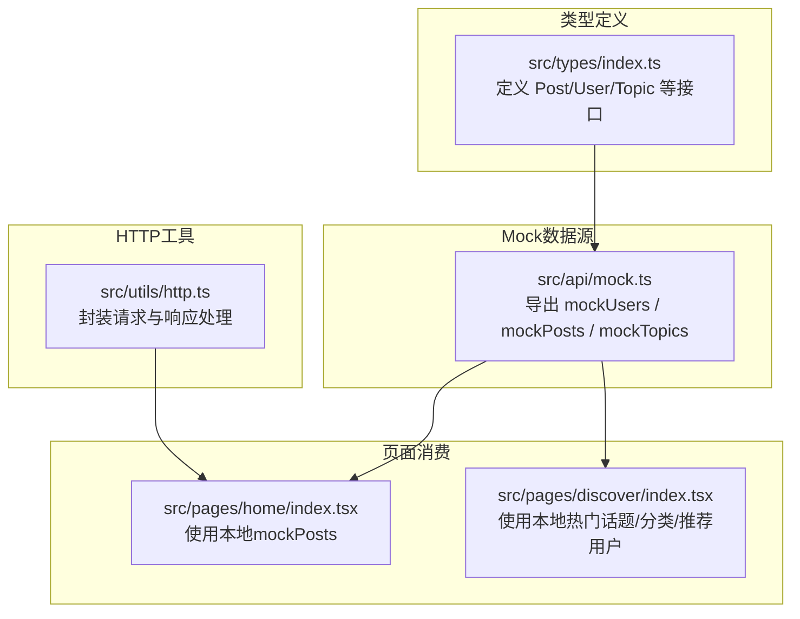
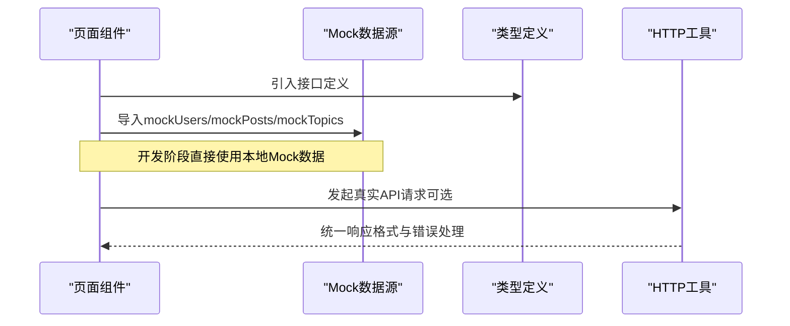
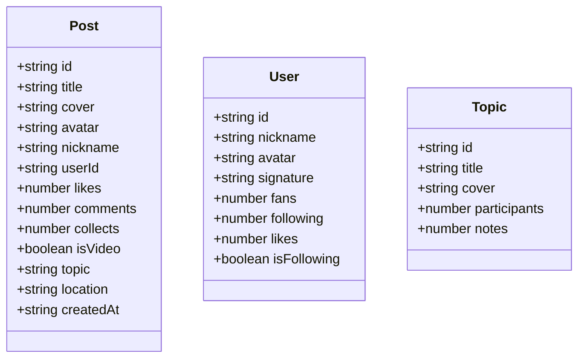
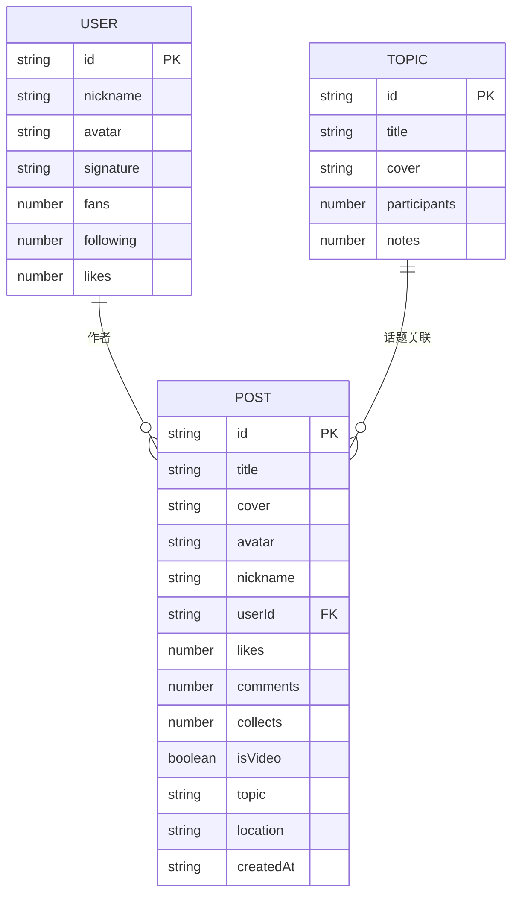
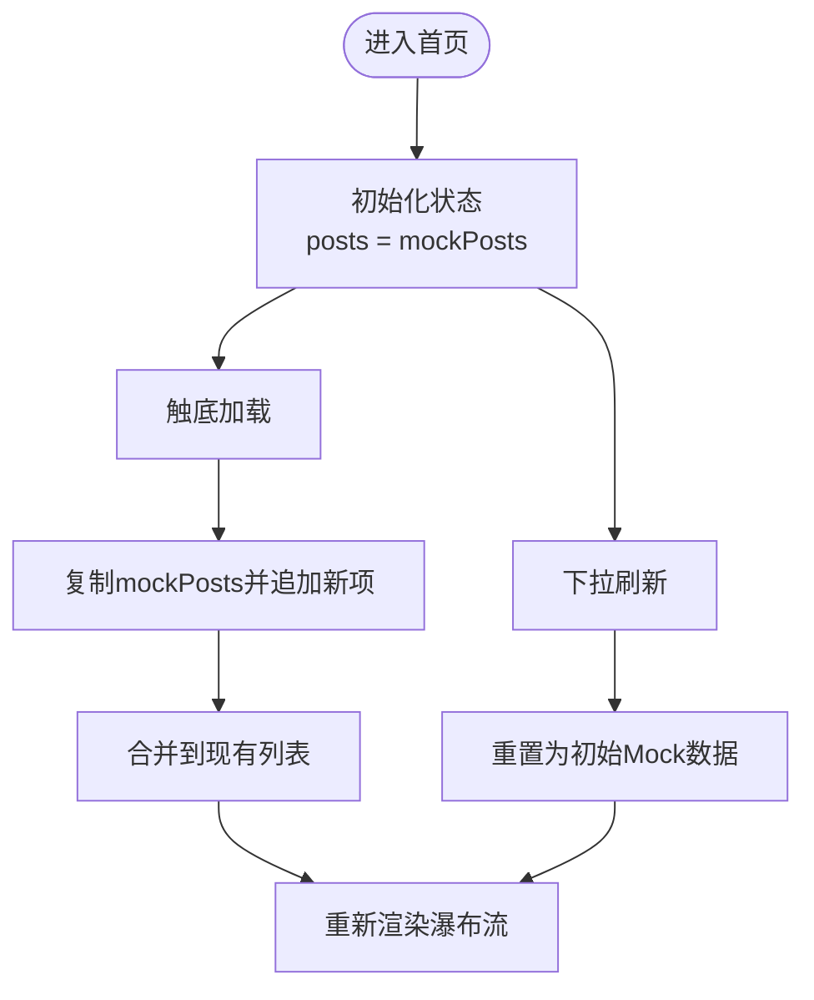
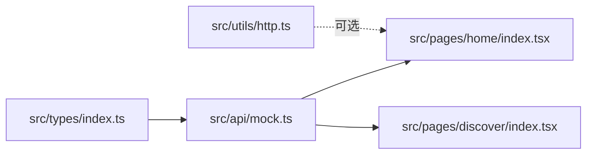

# Mock数据系统

<cite>
**本文引用的文件**
- [mock.ts](file://src/api/mock.ts)
- [index.tsx（首页）](file://src/pages/home/index.tsx)
- [index.tsx（发现页）](file://src/pages/discover/index.tsx)
- [index.ts](file://src/types/index.ts)
- [http.ts](file://src/utils/http.ts)
- [index.ts（项目配置）](file://config/index.ts)
- [dev.ts](file://config/dev.ts)
- [package.json](file://package.json)
</cite>

## 目录
1. [简介](#简介)
2. [项目结构](#项目结构)
3. [核心组件](#核心组件)
4. [架构总览](#架构总览)
5. [详细组件分析](#详细组件分析)
6. [依赖分析](#依赖分析)
7. [性能考虑](#性能考虑)
8. [故障排查指南](#故障排查指南)
9. [结论](#结论)
10. [附录](#附录)

## 简介
本文件面向红书项目的Mock数据系统，聚焦于src/api/mock.ts的架构设计与数据生成机制，系统性阐述以下内容：
- 模拟用户数据、帖子数据、话题数据的结构定义与字段语义
- Mock数据的生成规则与随机化策略
- 数据之间的关联关系与依赖关系
- 动态更新机制与实时性保障（当前实现）
- 开发环境中的使用场景与配置方法（含与真实API的切换思路）
- 扩展与定制指南（新增数据类型与修改现有结构）
- 调试技巧与性能优化建议

## 项目结构
Mock数据系统主要由三部分组成：
- 类型定义：统一的数据模型规范，确保Mock数据与真实API一致
- Mock数据源：集中管理模拟用户、帖子、话题等静态数据
- 页面消费：页面组件直接使用Mock数据或通过HTTP工具发起请求（当前以本地Mock为主）

图表来源
- [index.ts:1-60](file://src/types/index.ts#L1-L60)
- [mock.ts:1-98](file://src/api/mock.ts#L1-L98)
- [index.tsx（首页）:1-151](file://src/pages/home/index.tsx#L1-L151)
- [index.tsx（发现页）:1-119](file://src/pages/discover/index.tsx#L1-L119)
- [http.ts:1-157](file://src/utils/http.ts#L1-L157)

章节来源
- [index.ts:1-60](file://src/types/index.ts#L1-L60)
- [mock.ts:1-98](file://src/api/mock.ts#L1-L98)
- [index.tsx（首页）:1-151](file://src/pages/home/index.tsx#L1-L151)
- [index.tsx（发现页）:1-119](file://src/pages/discover/index.tsx#L1-L119)
- [http.ts:1-157](file://src/utils/http.ts#L1-L157)

## 核心组件
- 类型定义模块：提供Post、User、Topic等接口，明确字段含义与可选性，确保Mock数据结构与真实API一致
- Mock数据模块：集中导出mockUsers、mockPosts、mockTopics三类静态数组，作为前端开发与联调的基础数据
- 页面消费模块：首页组件直接使用本地mockPosts；发现页使用本地热门话题、分类与推荐用户；未来可通过HTTP工具切换到真实API
- HTTP工具模块：封装请求构建、参数拼接、响应处理与错误提示，为后续接入真实API提供统一入口

章节来源
- [index.ts:1-60](file://src/types/index.ts#L1-L60)
- [mock.ts:1-98](file://src/api/mock.ts#L1-L98)
- [index.tsx（首页）:17-26](file://src/pages/home/index.tsx#L17-L26)
- [index.tsx（发现页）:7-31](file://src/pages/discover/index.tsx#L7-L31)
- [http.ts:38-101](file://src/utils/http.ts#L38-L101)

## 架构总览
Mock数据系统采用“类型驱动 + 静态数据 + 页面直取”的轻量架构。类型定义先行，确保Mock数据结构稳定；页面组件直接消费Mock数据，减少网络依赖，提升开发效率；同时保留HTTP工具作为与真实API对接的桥梁。

图表来源
- [index.ts:1-60](file://src/types/index.ts#L1-L60)
- [mock.ts:1-98](file://src/api/mock.ts#L1-L98)
- [index.tsx（首页）:70-102](file://src/pages/home/index.tsx#L70-L102)
- [http.ts:38-101](file://src/utils/http.ts#L38-L101)

## 详细组件分析

### 类型定义（Post/User/Topic）
- Post：描述笔记条目，包含封面、标题、作者头像与昵称、点赞/评论/收藏计数、是否视频、话题、位置、创建时间等字段
- User：描述用户档案，包含id、昵称、头像、签名、粉丝数、关注数、获赞数、是否已关注等字段
- Topic：描述话题卡片，包含id、标题、封面、参与人数、笔记数量等字段

图表来源
- [index.ts:1-60](file://src/types/index.ts#L1-L60)

章节来源
- [index.ts:1-60](file://src/types/index.ts#L1-L60)

### Mock数据生成与随机化策略
- 随机化图片：通过外部图片服务生成随机封面/头像/多图，便于快速展示不同视觉效果
- 数值范围控制：粉丝数、关注数、获赞数、点赞/评论/收藏计数等均设置合理范围，贴近真实场景
- 时间戳一致性：createdAt字段采用固定或递减时间，便于列表排序与分页测试
- 视频标识：isVideo字段用于界面渲染视频角标，增强交互体验

章节来源
- [mock.ts:3-97](file://src/api/mock.ts#L3-L97)

### 数据关联关系与依赖
- 帖子与用户：Post.userId与User.id建立一对一关联，用于作者信息展示
- 帖子与话题：Post.topic与Topic.title/Topic.id形成弱关联，支持话题聚合与跳转
- 页面消费：首页瀑布流直接消费mockPosts；发现页消费本地热门话题与推荐用户；详情页可按id映射到对应帖子

图表来源
- [index.ts:1-60](file://src/types/index.ts#L1-L60)
- [mock.ts:3-97](file://src/api/mock.ts#L3-L97)

### 动态更新机制与实时性保障
- 首页瀑布流：下拉刷新重置为初始Mock数据；上拉加载通过复制并追加带时间戳的新数据，模拟增量加载
- 实时性：当前实现为本地内存态，未涉及WebSocket或轮询；如需真实实时性，可在HTTP工具层引入轮询或订阅机制

图表来源
- [index.tsx（首页）:83-102](file://src/pages/home/index.tsx#L83-L102)

章节来源
- [index.tsx（首页）:70-102](file://src/pages/home/index.tsx#L70-L102)

### 开发环境使用场景与配置方法
- 开发环境：通过环境变量与配置文件决定基础URL与代理路径，H5端默认使用代理前缀，便于联调真实后端
- 切换机制：当前页面直接消费本地Mock；若需切换至真实API，可在页面中替换为HTTP工具发起请求，并根据环境变量选择真实域名

章节来源
- [http.ts:4-13](file://src/utils/http.ts#L4-L13)
- [dev.ts:3-19](file://config/dev.ts#L3-L19)
- [index.ts（项目配置）:77-80](file://config/index.ts#L77-L80)

### 扩展与定制指南
- 新增数据类型：在类型定义模块添加新接口，随后在Mock数据模块导出对应数组，并在页面中引入使用
- 修改现有结构：优先保持向后兼容字段，新增字段设为可选；在页面消费处做好空值判断
- Mock数据扩展：按需增加用户、帖子、话题样本，注意字段完整性与一致性

章节来源
- [index.ts:1-60](file://src/types/index.ts#L1-L60)
- [mock.ts:1-98](file://src/api/mock.ts#L1-L98)

## 依赖分析
- 类型定义被Mock数据模块与页面组件共同依赖，确保结构一致性
- 页面组件对Mock数据模块存在直接依赖，便于快速开发与联调
- HTTP工具为可选依赖，用于后续接入真实API

图表来源
- [index.ts:1-60](file://src/types/index.ts#L1-L60)
- [mock.ts:1-98](file://src/api/mock.ts#L1-L98)
- [index.tsx（首页）:1-151](file://src/pages/home/index.tsx#L1-L151)
- [index.tsx（发现页）:1-119](file://src/pages/discover/index.tsx#L1-L119)
- [http.ts:1-157](file://src/utils/http.ts#L1-L157)

章节来源
- [index.ts:1-60](file://src/types/index.ts#L1-L60)
- [mock.ts:1-98](file://src/api/mock.ts#L1-L98)
- [index.tsx（首页）:1-151](file://src/pages/home/index.tsx#L1-L151)
- [index.tsx（发现页）:1-119](file://src/pages/discover/index.tsx#L1-L119)
- [http.ts:1-157](file://src/utils/http.ts#L1-L157)

## 性能考虑
- 图片加载：使用懒加载与合适的尺寸，避免一次性加载过多大图
- 列表渲染：按列分割渲染，减少DOM压力；上拉加载采用批量追加，避免频繁重排
- 缓存策略：当前为内存态，建议在需要时引入本地缓存或会话缓存，降低重复计算与网络请求
- 错误处理：统一的HTTP错误提示与降级策略，保证用户体验

## 故障排查指南
- 网络请求失败：检查环境变量与代理配置，确认H5端代理前缀与目标地址正确
- 数据不一致：核对类型定义与Mock数据字段，确保字段名称与类型一致
- 页面渲染异常：检查页面消费处的空值与默认值处理，避免因缺失字段导致崩溃

章节来源
- [http.ts:82-98](file://src/utils/http.ts#L82-L98)
- [dev.ts:3-19](file://config/dev.ts#L3-L19)

## 结论
红书项目的Mock数据系统以类型定义为核心，配合集中式Mock数据与页面直取策略，实现了高效、可控的前端开发与联调流程。通过HTTP工具预留的真实API接入点，系统具备良好的扩展性与演进空间。建议在后续迭代中逐步引入缓存与实时性机制，进一步提升Mock数据的可用性与真实性。

## 附录
- 环境变量与脚本：通过package.json脚本与配置文件控制构建与代理行为
- 页面示例：首页与发现页展示了Mock数据的典型使用方式

章节来源
- [package.json:12-32](file://package.json#L12-L32)
- [index.tsx（首页）:1-151](file://src/pages/home/index.tsx#L1-L151)
- [index.tsx（发现页）:1-119](file://src/pages/discover/index.tsx#L1-L119)