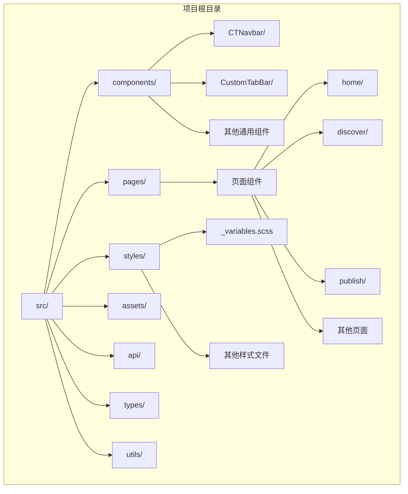
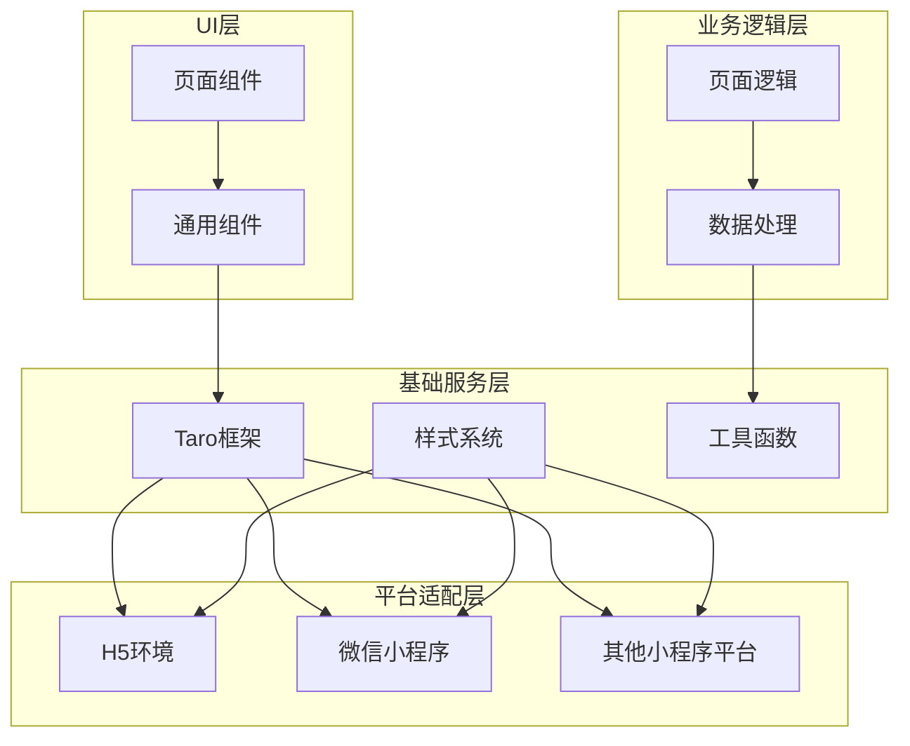
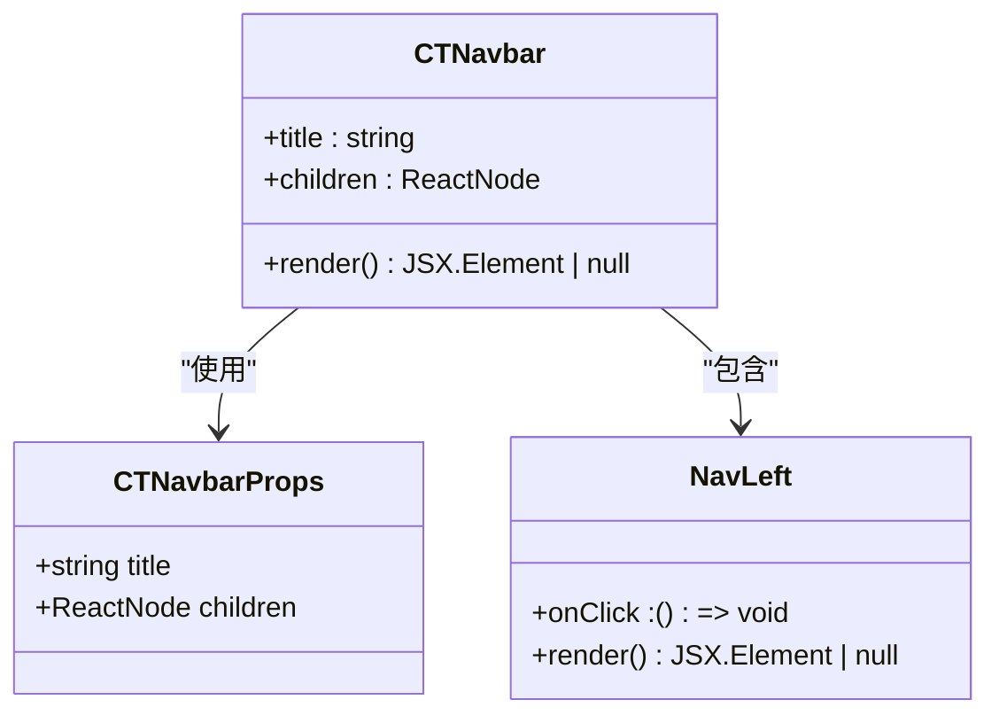
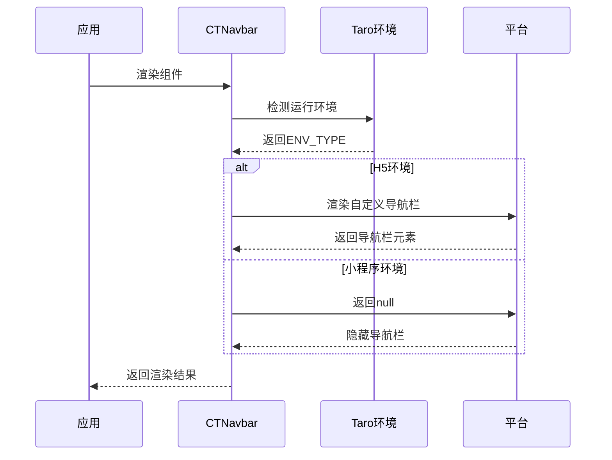
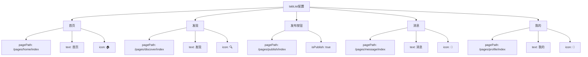
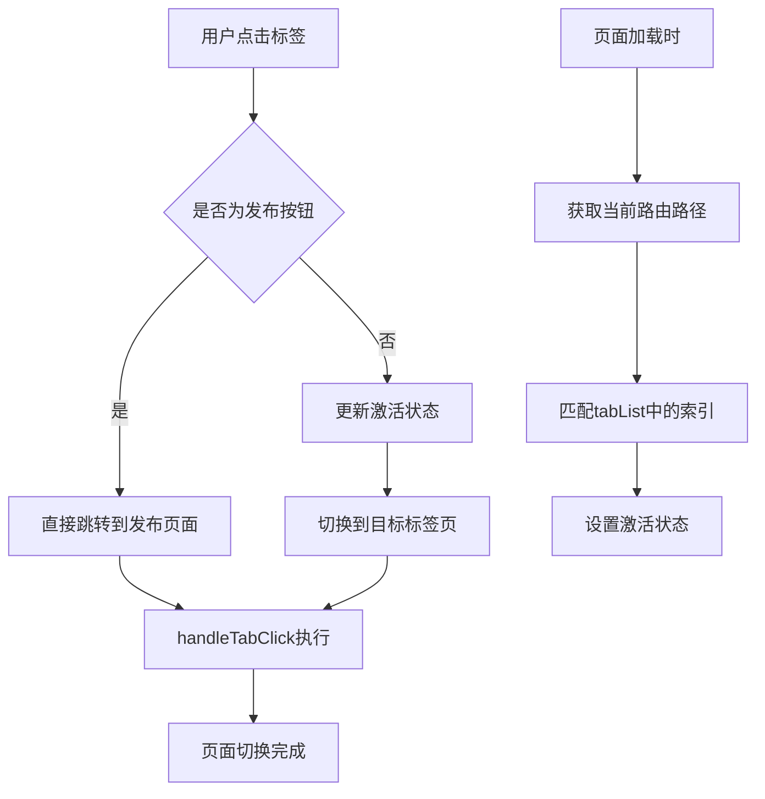
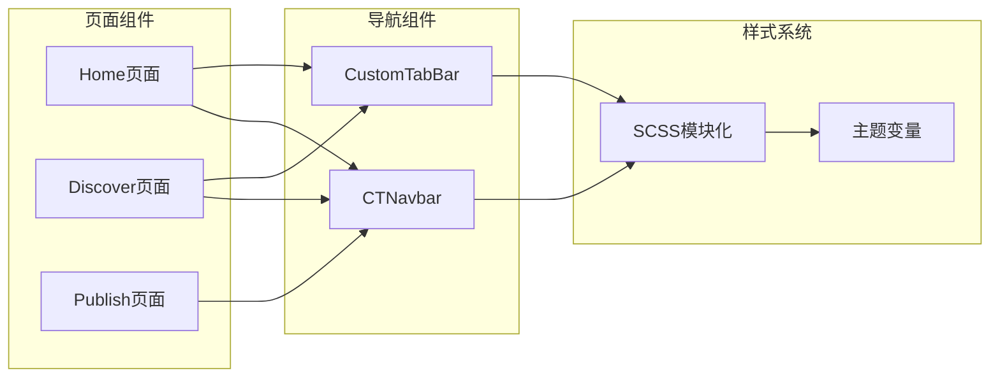
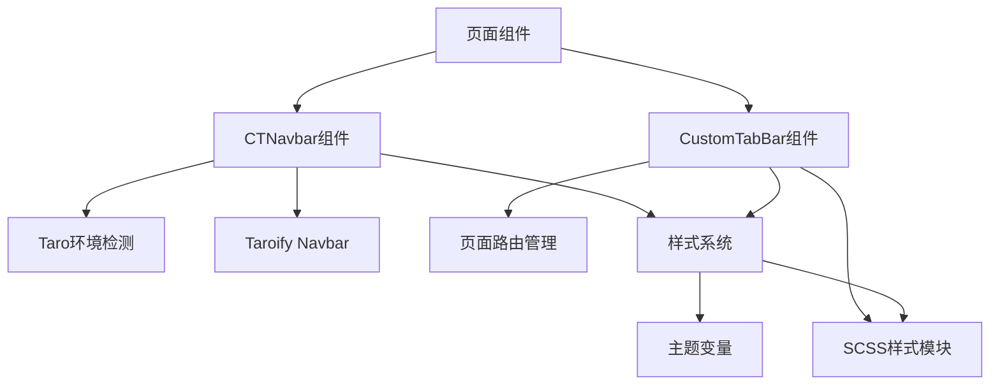

# CTNavbar跨平台导航栏组件

<cite>
**本文档引用的文件**
- [src/components/CTNavbar/index.tsx](file://src/components/CTNavbar/index.tsx)
- [src/components/CustomTabBar/index.tsx](file://src/components/CustomTabBar/index.tsx)
- [src/components/CustomTabBar/index.module.scss](file://src/components/CustomTabBar/index.module.scss)
- [src/app.config.ts](file://src/app.config.ts)
- [src/pages/home/index.tsx](file://src/pages/home/index.tsx)
- [src/pages/discover/index.tsx](file://src/pages/discover/index.tsx)
- [src/pages/publish/index.tsx](file://src/pages/publish/index.tsx)
- [src/styles/_variables.scss](file://src/styles/_variables.scss)
- [src/pages/home/index.module.scss](file://src/pages/home/index.module.scss)
- [src/pages/discover/index.module.scss](file://src/pages/discover/index.module.scss)
- [package.json](file://package.json)
</cite>

## 目录
1. [简介](#简介)
2. [项目结构](#项目结构)
3. [核心组件](#核心组件)
4. [架构概览](#架构概览)
5. [详细组件分析](#详细组件分析)
6. [依赖关系分析](#依赖关系分析)
7. [性能考虑](#性能考虑)
8. [故障排除指南](#故障排除指南)
9. [结论](#结论)

## 简介

CTNavbar是一个跨平台的导航栏组件，专门为Taro多端开发框架设计。该组件能够根据不同的运行环境（H5网页端和微信小程序）自动适配导航栏的显示方式，提供统一的用户体验。

在H5环境下，CTNavbar会渲染自定义的导航栏组件；而在微信小程序环境中，则使用原生导航栏，避免重复渲染导致的性能问题。同时，项目还包含了一个自定义底部标签栏组件，为用户提供完整的移动端导航体验。

## 项目结构

该项目采用Taro框架构建的跨平台应用，支持多种小程序平台和H5网页端。主要目录结构如下：



**图表来源**
- [src/components/CTNavbar/index.tsx:1-46](file://src/components/CTNavbar/index.tsx#L1-L46)
- [src/components/CustomTabBar/index.tsx:1-67](file://src/components/CustomTabBar/index.tsx#L1-L67)
- [src/pages/home/index.tsx:1-151](file://src/pages/home/index.tsx#L1-L151)

**章节来源**
- [src/app.config.ts:1-24](file://src/app.config.ts#L1-L24)
- [package.json:1-98](file://package.json#L1-L98)

## 核心组件

### CTNavbar导航栏组件

CTNavbar是本项目的核心导航组件，具有以下特点：

- **平台适配**：根据运行环境自动选择显示方式
- **类型安全**：完整的TypeScript接口定义
- **可扩展性**：支持自定义左侧按钮等子组件
- **轻量级**：避免在小程序中重复渲染导航栏

#### 主要功能特性

1. **环境检测**：通过Taro的`getEnv()`方法检测当前运行环境
2. **条件渲染**：H5环境下渲染自定义导航栏，小程序环境下返回null
3. **子组件支持**：提供NavLeft子组件用于左侧返回按钮
4. **响应式设计**：支持安全区域适配

**章节来源**
- [src/components/CTNavbar/index.tsx:1-46](file://src/components/CTNavbar/index.tsx#L1-L46)

### CustomTabBar自定义标签栏

CustomTabBar是一个功能完整的底部导航组件，提供以下功能：

- **多页面支持**：支持首页、发现、发布、消息、我的五个主要页面
- **状态管理**：自动识别当前激活的页面
- **特殊按钮**：中间的发布按钮具有特殊的交互行为
- **样式定制**：完全可定制的视觉效果

**章节来源**
- [src/components/CustomTabBar/index.tsx:1-67](file://src/components/CustomTabBar/index.tsx#L1-L67)
- [src/components/CustomTabBar/index.module.scss:1-64](file://src/components/CustomTabBar/index.module.scss#L1-L64)

## 架构概览

项目的整体架构采用分层设计，确保不同平台间的代码复用和一致性：



**图表来源**
- [src/components/CTNavbar/index.tsx:1-46](file://src/components/CTNavbar/index.tsx#L1-L46)
- [src/components/CustomTabBar/index.tsx:1-67](file://src/components/CustomTabBar/index.tsx#L1-L67)
- [package.json:39-53](file://package.json#L39-L53)

## 详细组件分析

### CTNavbar组件深度解析

#### 类型定义和接口

CTNavbar组件采用了严格的TypeScript类型系统：



**图表来源**
- [src/components/CTNavbar/index.tsx:5-8](file://src/components/CTNavbar/index.tsx#L5-L8)
- [src/components/CTNavbar/index.tsx:38-43](file://src/components/CTNavbar/index.tsx#L38-L43)

#### 渲染流程分析



**图表来源**
- [src/components/CTNavbar/index.tsx:20-32](file://src/components/CTNavbar/index.tsx#L20-L32)

#### 环境适配策略

CTNavbar采用条件渲染策略，针对不同平台进行优化：

| 平台 | 导航栏显示 | 性能影响 | 用户体验 |
|------|------------|----------|----------|
| H5网页 | 自定义导航栏 | 需要额外渲染 | 可定制性强 |
| 微信小程序 | 原生导航栏 | 无额外开销 | 符合平台规范 |

**章节来源**
- [src/components/CTNavbar/index.tsx:10-19](file://src/components/CTNavbar/index.tsx#L10-L19)

### CustomTabBar组件详细分析

#### 标签栏数据结构

CustomTabBar使用静态配置数组管理导航项：



**图表来源**
- [src/components/CustomTabBar/index.tsx:6-12](file://src/components/CustomTabBar/index.tsx#L6-L12)

#### 交互逻辑分析



**图表来源**
- [src/components/CustomTabBar/index.tsx:25-32](file://src/components/CustomTabBar/index.tsx#L25-L32)

**章节来源**
- [src/components/CustomTabBar/index.tsx:14-66](file://src/components/CustomTabBar/index.tsx#L14-L66)

### 页面集成模式

各页面组件如何集成导航栏和标签栏：



**图表来源**
- [src/pages/home/index.tsx:4-147](file://src/pages/home/index.tsx#L4-L147)
- [src/pages/discover/index.tsx:4-115](file://src/pages/discover/index.tsx#L4-L115)

**章节来源**
- [src/pages/home/index.tsx:70-147](file://src/pages/home/index.tsx#L70-L147)
- [src/pages/discover/index.tsx:33-115](file://src/pages/discover/index.tsx#L33-L115)

## 依赖关系分析

### 外部依赖

项目使用了现代化的前端技术栈，主要依赖包括：

```mermaid
graph TB
subgraph "核心框架"
A[Taro 4.1.11]
B[React 18.0.0]
end
subgraph "UI组件库"
C[@taroify/core 0.9.2]
D[@taroify/hooks 0.9.2]
E[@taroify/icons 0.9.2]
end
subgraph "构建工具"
F[Vite]
G[Sass]
H[TypeScript]
end
subgraph "平台插件"
I[@tarojs/plugin-platform-*]
end
A --> B
A --> C
A --> D
A --> E
A --> F
F --> G
F --> H
A --> I
```

**图表来源**
- [package.json:39-53](file://package.json#L39-L53)
- [package.json:54-96](file://package.json#L54-L96)

### 内部依赖关系



**图表来源**
- [src/components/CTNavbar/index.tsx:1-3](file://src/components/CTNavbar/index.tsx#L1-L3)
- [src/components/CustomTabBar/index.tsx:1-4](file://src/components/CustomTabBar/index.tsx#L1-L4)

**章节来源**
- [package.json:39-96](file://package.json#L39-L96)

## 性能考虑

### 渲染优化

1. **条件渲染**：CTNavbar在小程序环境下返回null，避免不必要的DOM树节点
2. **懒加载**：标签栏组件按需加载，减少初始渲染时间
3. **样式分离**：使用CSS Modules避免全局样式污染

### 内存管理

1. **组件卸载**：正确处理组件生命周期，避免内存泄漏
2. **事件监听**：及时清理事件监听器
3. **状态管理**：合理使用useState和useEffect

### 跨平台兼容性

1. **环境检测**：使用Taro的ENV_TYPE常量进行精确的平台判断
2. **API适配**：不同平台使用相应的导航API
3. **样式适配**：支持安全区域和不同屏幕尺寸

## 故障排除指南

### 常见问题及解决方案

#### 1. 导航栏不显示问题

**症状**：在H5环境下导航栏没有显示

**可能原因**：
- Taro环境检测失败
- Navbar组件导入错误
- 样式冲突

**解决方案**：
- 检查Taro版本兼容性
- 确认@taroify/core版本
- 检查CSS优先级

#### 2. 标签栏激活状态异常

**症状**：点击标签后激活状态不正确

**可能原因**：
- 路由路径不匹配
- useEffect执行时机问题
- 状态更新顺序错误

**解决方案**：
- 确认tabList中的pagePath与实际页面路径一致
- 检查路由实例获取方式
- 使用useEffect的依赖数组

#### 3. 平台适配问题

**症状**：在某些平台上出现布局异常

**可能原因**：
- 安全区域适配问题
- 屏幕尺寸差异
- 平台API差异

**解决方案**：
- 检查env(safe-area-inset-bottom)的使用
- 测试不同屏幕尺寸
- 验证平台特定的API调用

**章节来源**
- [src/components/CTNavbar/index.tsx:20-32](file://src/components/CTNavbar/index.tsx#L20-L32)
- [src/components/CustomTabBar/index.tsx:17-23](file://src/components/CustomTabBar/index.tsx#L17-L23)

## 结论

CTNavbar跨平台导航栏组件是一个设计精良的通用组件，具有以下优势：

1. **优秀的跨平台适配**：通过智能的环境检测机制，为不同平台提供最优的用户体验
2. **清晰的架构设计**：组件职责明确，易于维护和扩展
3. **完善的类型支持**：全面的TypeScript类型定义确保开发安全性
4. **良好的性能表现**：通过条件渲染和懒加载优化性能
5. **灵活的扩展能力**：支持自定义子组件和样式定制

该组件为Taro多端开发提供了可靠的导航解决方案，既满足了H5环境下的高度定制需求，又充分利用了小程序平台的原生能力，是现代跨平台移动应用开发的优秀实践。

在未来的发展中，可以考虑增加更多的平台支持、增强主题定制能力和优化性能表现，以适应更复杂的应用场景需求。