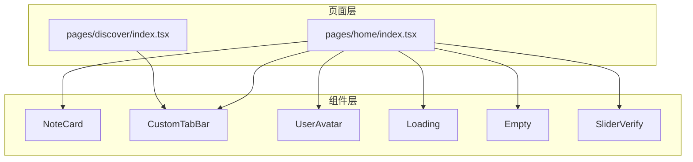
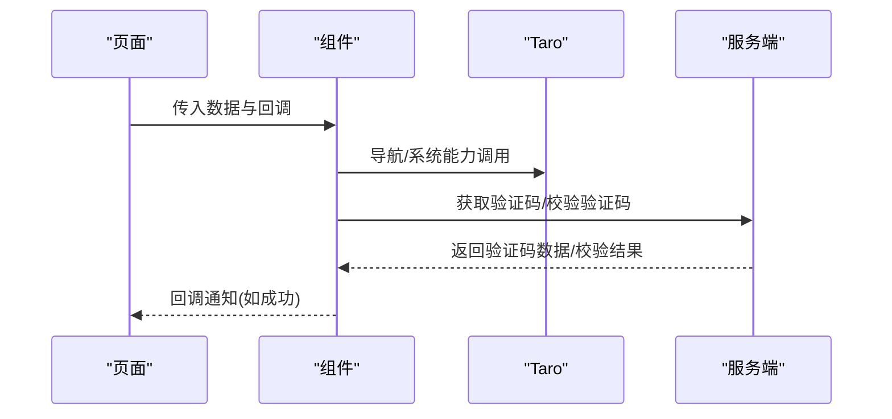
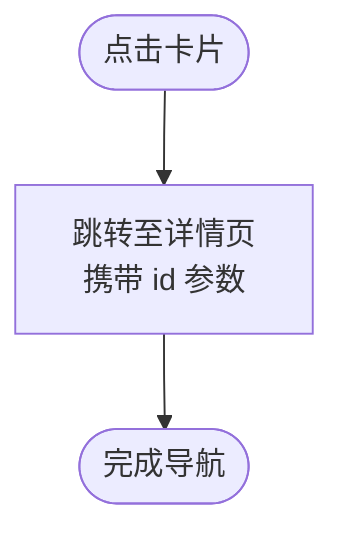
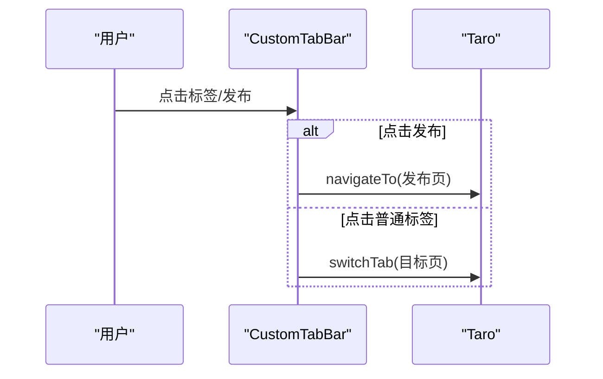
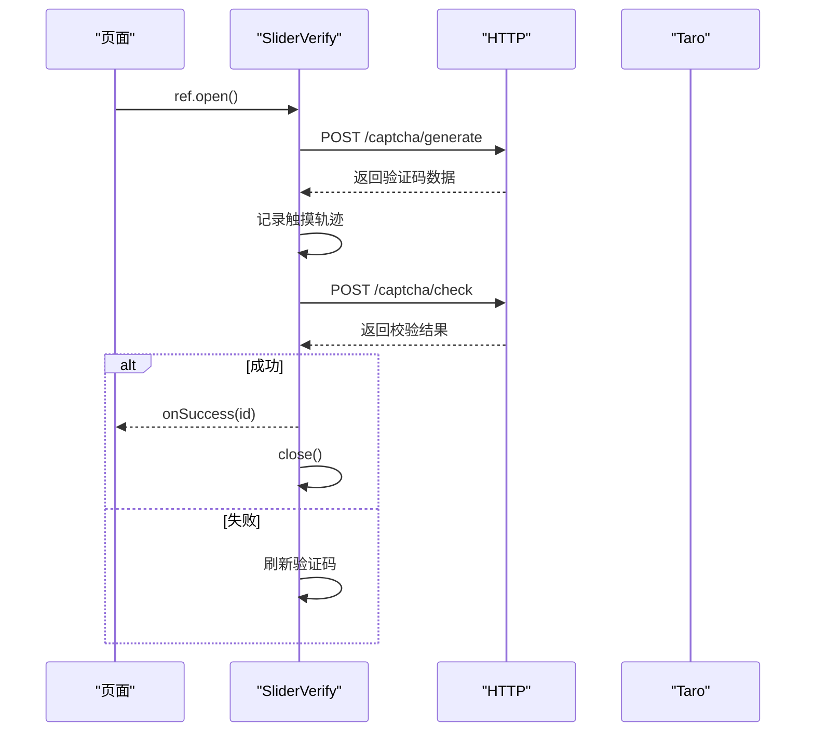
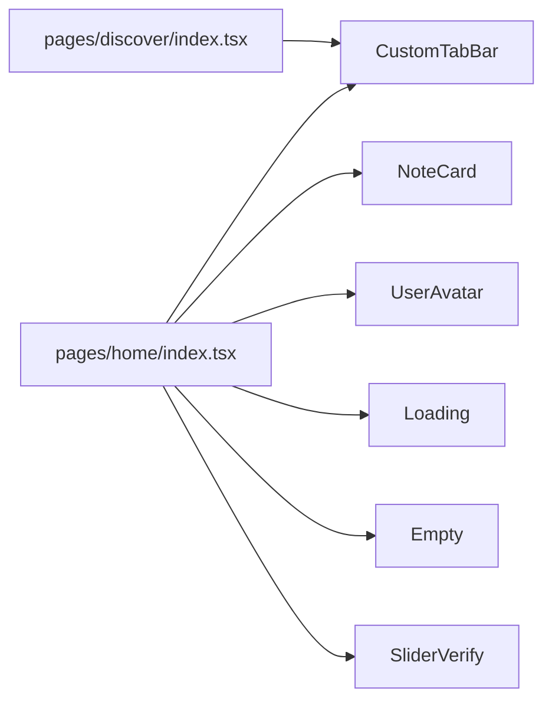

# UI组件库

<cite>
**本文引用的文件**
- [src/components/NoteCard/index.tsx](file://src/components/NoteCard/index.tsx)
- [src/components/NoteCard/index.scss](file://src/components/NoteCard/index.scss)
- [src/components/CustomTabBar/index.tsx](file://src/components/CustomTabBar/index.tsx)
- [src/components/CustomTabBar/index.module.scss](file://src/components/CustomTabBar/index.module.scss)
- [src/components/UserAvatar/index.tsx](file://src/components/UserAvatar/index.tsx)
- [src/components/UserAvatar/index.scss](file://src/components/UserAvatar/index.scss)
- [src/components/Loading/index.tsx](file://src/components/Loading/index.tsx)
- [src/components/Loading/index.scss](file://src/components/Loading/index.scss)
- [src/components/Empty/index.tsx](file://src/components/Empty/index.tsx)
- [src/components/Empty/index.scss](file://src/components/Empty/index.scss)
- [src/components/SliderVerify/index.tsx](file://src/components/SliderVerify/index.tsx)
- [src/components/SliderVerify/index.module.scss](file://src/components/SliderVerify/index.module.scss)
- [src/pages/home/index.tsx](file://src/pages/home/index.tsx)
- [src/pages/discover/index.tsx](file://src/pages/discover/index.tsx)
- [src/app.config.ts](file://src/app.config.ts)
</cite>

## 目录
1. [简介](#简介)
2. [项目结构](#项目结构)
3. [核心组件](#核心组件)
4. [架构总览](#架构总览)
5. [组件详解](#组件详解)
6. [依赖关系分析](#依赖关系分析)
7. [性能与体验](#性能与体验)
8. [无障碍与兼容性](#无障碍与兼容性)
9. [故障排查](#故障排查)
10. [结论](#结论)
11. [附录：最佳实践与组合模式](#附录最佳实践与组合模式)

## 简介
本文件为“红书”项目的UI组件库使用与扩展指南，聚焦以下核心组件：笔记卡片、自定义标签栏、用户头像、加载组件、空状态组件与滑动验证码。文档从设计理念、使用场景、属性与事件、样式与主题适配、交互流程到性能与可访问性进行系统化说明，并提供组合使用模式与最佳实践，帮助设计师与开发者高效落地。

## 项目结构
组件集中于 src/components 下，按功能模块划分；页面位于 src/pages，展示组件在真实业务中的使用方式；全局样式变量位于 src/styles/_variables.scss（被各组件样式通过 SCSS 引入）。

图表来源
- [src/pages/home/index.tsx](file://src/pages/home/index.tsx)
- [src/pages/discover/index.tsx](file://src/pages/discover/index.tsx)
- [src/components/NoteCard/index.tsx](file://src/components/NoteCard/index.tsx)
- [src/components/CustomTabBar/index.tsx](file://src/components/CustomTabBar/index.tsx)
- [src/components/UserAvatar/index.tsx](file://src/components/UserAvatar/index.tsx)
- [src/components/Loading/index.tsx](file://src/components/Loading/index.tsx)
- [src/components/Empty/index.tsx](file://src/components/Empty/index.tsx)
- [src/components/SliderVerify/index.tsx](file://src/components/SliderVerify/index.tsx)

章节来源
- [src/app.config.ts](file://src/app.config.ts)

## 核心组件
- 笔记卡片：用于展示图文/视频笔记的缩略信息，支持封面、作者头像昵称、点赞数与视频角标。
- 自定义标签栏：底部导航，内置“发布”悬浮按钮，支持当前页高亮与路由切换。
- 用户头像：支持多尺寸与描边边框，统一头像展示风格。
- 加载组件：轻量加载指示器，可自定义提示文案。
- 空状态组件：统一的“无数据/无内容”占位展示，支持图标、标题与描述。
- 滑动验证码：基于轨迹模拟与后端校验的图形拼图验证，支持刷新与错误反馈。

章节来源
- [src/components/NoteCard/index.tsx](file://src/components/NoteCard/index.tsx)
- [src/components/CustomTabBar/index.tsx](file://src/components/CustomTabBar/index.tsx)
- [src/components/UserAvatar/index.tsx](file://src/components/UserAvatar/index.tsx)
- [src/components/Loading/index.tsx](file://src/components/Loading/index.tsx)
- [src/components/Empty/index.tsx](file://src/components/Empty/index.tsx)
- [src/components/SliderVerify/index.tsx](file://src/components/SliderVerify/index.tsx)

## 架构总览
组件以页面为入口，通过 props 传递数据与回调，内部通过 Taro API 进行页面跳转或系统能力调用。滑动验证码通过 HTTP 接口拉取验证码数据并提交轨迹进行校验。

图表来源
- [src/components/NoteCard/index.tsx](file://src/components/NoteCard/index.tsx)
- [src/components/CustomTabBar/index.tsx](file://src/components/CustomTabBar/index.tsx)
- [src/components/SliderVerify/index.tsx](file://src/components/SliderVerify/index.tsx)

## 组件详解

### 笔记卡片（NoteCard）
- 设计理念
  - 将封面、作者信息与互动数据整合在一个卡片容器内，突出视觉与信息密度。
  - 支持视频角标，便于用户快速识别多媒体内容。
- 使用场景
  - 首页瀑布流、发现页推荐列表、个人主页内容列表。
- 属性与事件
  - 属性：id、title、cover、avatar、nickname、likes、isVideo（可选）。
  - 事件：点击卡片触发详情页跳转。
- 样式与主题
  - 使用 SCSS 变量控制主色、文本色与圆角；标题采用双行省略；作者区支持头像与昵称。
- 无障碍与交互
  - 提供点击态与跳转行为，建议在业务侧补充 aria-label 或 role 以增强可访问性。
- 性能建议
  - 图片懒加载与固定宽高比，减少重排；避免在滚动容器中频繁更新大图。

图表来源
- [src/components/NoteCard/index.tsx](file://src/components/NoteCard/index.tsx)

章节来源
- [src/components/NoteCard/index.tsx](file://src/components/NoteCard/index.tsx)
- [src/components/NoteCard/index.scss](file://src/components/NoteCard/index.scss)

### 自定义标签栏（CustomTabBar）
- 设计理念
  - 底部导航统一入口，居中“发布”按钮作为强引导，其余标签支持高亮与切换。
- 使用场景
  - 主应用底部导航，覆盖首页、发现、消息、我的等页面。
- 属性与事件
  - 内置标签列表与当前路径联动；点击非发布项触发 switchTab，点击发布项触发 navigateTo。
- 样式与主题
  - 使用 SCSS 变量控制主色与文本色；发布按钮采用渐变背景与安全区适配。
- 无障碍与交互
  - 建议为图标与文字提供语义化标签；移动端点击区域充足，符合触控体验。
- 性能建议
  - 避免在切换时重复渲染重型子树；保持最小状态更新。

图表来源
- [src/components/CustomTabBar/index.tsx](file://src/components/CustomTabBar/index.tsx)

章节来源
- [src/components/CustomTabBar/index.tsx](file://src/components/CustomTabBar/index.tsx)
- [src/components/CustomTabBar/index.module.scss](file://src/components/CustomTabBar/index.module.scss)

### 用户头像（UserAvatar）
- 设计理念
  - 统一头像尺寸与圆角，支持描边边框，满足不同业务场景的强调需求。
- 使用场景
  - 评论区、作者信息、推荐关注、个人资料等。
- 属性与事件
  - 属性：src、size（small/medium/large）、showBorder（布尔）。
- 样式与主题
  - 通过类名组合实现尺寸与边框；内部图片使用填充模式保证裁剪效果。
- 无障碍与交互
  - 建议在可点击头像处提供 role="button" 与键盘可达性。
- 性能建议
  - 合理设置图片尺寸与缓存策略，避免超大资源导致首屏阻塞。

章节来源
- [src/components/UserAvatar/index.tsx](file://src/components/UserAvatar/index.tsx)
- [src/components/UserAvatar/index.scss](file://src/components/UserAvatar/index.scss)

### 加载组件（Loading）
- 设计理念
  - 轻量旋转指示器与提示文案，适合页面级或区块级加载状态。
- 使用场景
  - 列表加载更多、异步请求等待、分页加载。
- 属性与事件
  - 属性：text（默认“加载中...”）。
- 样式与主题
  - 圆形边框动画、主色与次色区分，居中布局。
- 无障碍与交互
  - 在关键加载处提供 aria-live 与屏幕阅读器友好的描述。
- 性能建议
  - 控制加载时长与节流，避免频繁闪烁。

章节来源
- [src/components/Loading/index.tsx](file://src/components/Loading/index.tsx)
- [src/components/Loading/index.scss](file://src/components/Loading/index.scss)

### 空状态组件（Empty）
- 设计理念
  - 统一的“无数据/无内容”占位，通过图标、标题与描述传达上下文。
- 使用场景
  - 列表为空、搜索无结果、功能未启用等。
- 属性与事件
  - 属性：icon（默认“📭”）、title（默认“暂无数据”）、desc（可选）。
- 样式与主题
  - 居中布局、字号与颜色遵循弱化原则，提升可读性。
- 无障碍与交互
  - 提供可点击的“去逛逛/重新加载”按钮时，确保可访问性标签完整。
- 性能建议
  - 避免在滚动容器中频繁插入/移除，建议使用条件渲染。

章节来源
- [src/components/Empty/index.tsx](file://src/components/Empty/index.tsx)
- [src/components/Empty/index.scss](file://src/components/Empty/index.scss)

### 滑动验证码（SliderVerify）
- 设计理念
  - 基于轨迹模拟与后端校验的图形拼图验证，兼顾安全性与用户体验。
- 使用场景
  - 登录/注册、敏感操作前的安全校验。
- 属性与事件
  - 属性：onSuccess（验证成功回调，返回验证码 id）。
  - 方法：通过 ref 暴露 open/close，供外部触发显示与关闭。
- 样式与主题
  - 中央弹层、阴影与动画；成功/失败状态提示；滑块区域与背景图层分离。
- 交互与流程
  - 打开时拉取验证码数据，记录触摸轨迹，结束时提交校验；成功关闭并回调，失败刷新重试。
- 安全与性能
  - 轨迹点数量与时间戳参与校验；防抖与节流减少无效请求；图片尺寸动态计算适配 rpx。

图表来源
- [src/components/SliderVerify/index.tsx](file://src/components/SliderVerify/index.tsx)

章节来源
- [src/components/SliderVerify/index.tsx](file://src/components/SliderVerify/index.tsx)
- [src/components/SliderVerify/index.module.scss](file://src/components/SliderVerify/index.module.scss)

## 依赖关系分析
- 页面对组件的依赖
  - 首页与发现页均引入自定义标签栏；首页复用笔记卡片结构（组件版本与页面版本结构相似）。
- 组件间耦合
  - 组件之间低耦合，通过 props 与回调通信；滑动验证码依赖网络请求与 Taro API。
- 外部依赖
  - Taro 导航与系统信息 API；HTTP 工具封装后端接口。

图表来源
- [src/pages/home/index.tsx](file://src/pages/home/index.tsx)
- [src/pages/discover/index.tsx](file://src/pages/discover/index.tsx)
- [src/components/CustomTabBar/index.tsx](file://src/components/CustomTabBar/index.tsx)
- [src/components/NoteCard/index.tsx](file://src/components/NoteCard/index.tsx)
- [src/components/UserAvatar/index.tsx](file://src/components/UserAvatar/index.tsx)
- [src/components/Loading/index.tsx](file://src/components/Loading/index.tsx)
- [src/components/Empty/index.tsx](file://src/components/Empty/index.tsx)
- [src/components/SliderVerify/index.tsx](file://src/components/SliderVerify/index.tsx)

## 性能与体验
- 图片与渲染
  - 使用懒加载与固定宽高比，减少布局抖动；在长列表中避免不必要的 re-render。
- 事件与交互
  - 对高频事件（如触摸移动）使用防抖/节流；合理拆分状态，降低重绘范围。
- 动画与过渡
  - 加载与状态切换使用轻量动画，避免复杂滤镜与阴影造成掉帧。
- 数据与网络
  - 滑动验证码在打开时才发起请求；校验失败自动刷新，避免长时间阻塞。

## 无障碍与兼容性
- 无障碍
  - 为可点击元素提供明确的语义标签与键盘可达性；在加载与空状态处提供屏幕阅读器友好文案。
- 兼容性
  - 使用 Taro 的跨端能力；SCSS 变量统一主题色；注意安全区与刘海屏适配（标签栏已内置）。
- 浏览器与小程序
  - 组件基于 Taro 组件体系，需在目标运行环境中验证交互与样式表现。

## 故障排查
- 笔记卡片
  - 若封面不显示，检查图片地址与懒加载参数；若视频角标不出现，确认 isVideo 传值。
- 自定义标签栏
  - 当前页高亮不生效，检查当前路由与 tabList 的 pagePath 是否一致。
- 用户头像
  - 尺寸或边框不生效，检查类名拼接与 SCSS 变量是否正确引入。
- 加载与空状态
  - 文案不显示，检查 text/标题/描述属性传值；布局错位，检查容器高度与 flex 布局。
- 滑动验证码
  - 无法打开：检查 ref 调用与网络请求；校验失败：查看后端返回与轨迹数据；滑块卡住：检查 rpx 转 px 逻辑与边界值。

章节来源
- [src/components/SliderVerify/index.tsx](file://src/components/SliderVerify/index.tsx)

## 结论
本组件库围绕“一致性、可复用、可扩展”的目标构建，覆盖内容展示、导航、用户信息、状态占位与安全校验等核心场景。建议在业务中遵循统一的属性命名与主题变量，结合本文的最佳实践与组合模式，快速搭建高质量界面。

## 附录：最佳实践与组合模式
- 组合模式
  - 列表页：Empty/Loading + 笔记卡片；瀑布流/网格布局中优先使用懒加载与骨架屏。
  - 详情页：用户头像 + 笔记卡片（只读信息）+ 互动区。
  - 发布流程：SliderVerify（前置校验）+ 表单组件 + Loading。
- 最佳实践
  - 统一使用 SCSS 变量管理主题色与间距；为所有交互提供视觉反馈。
  - 在长列表中使用虚拟滚动或分页加载，避免一次性渲染过多节点。
  - 对外暴露清晰的回调与 ref 方法，便于上层业务编排。