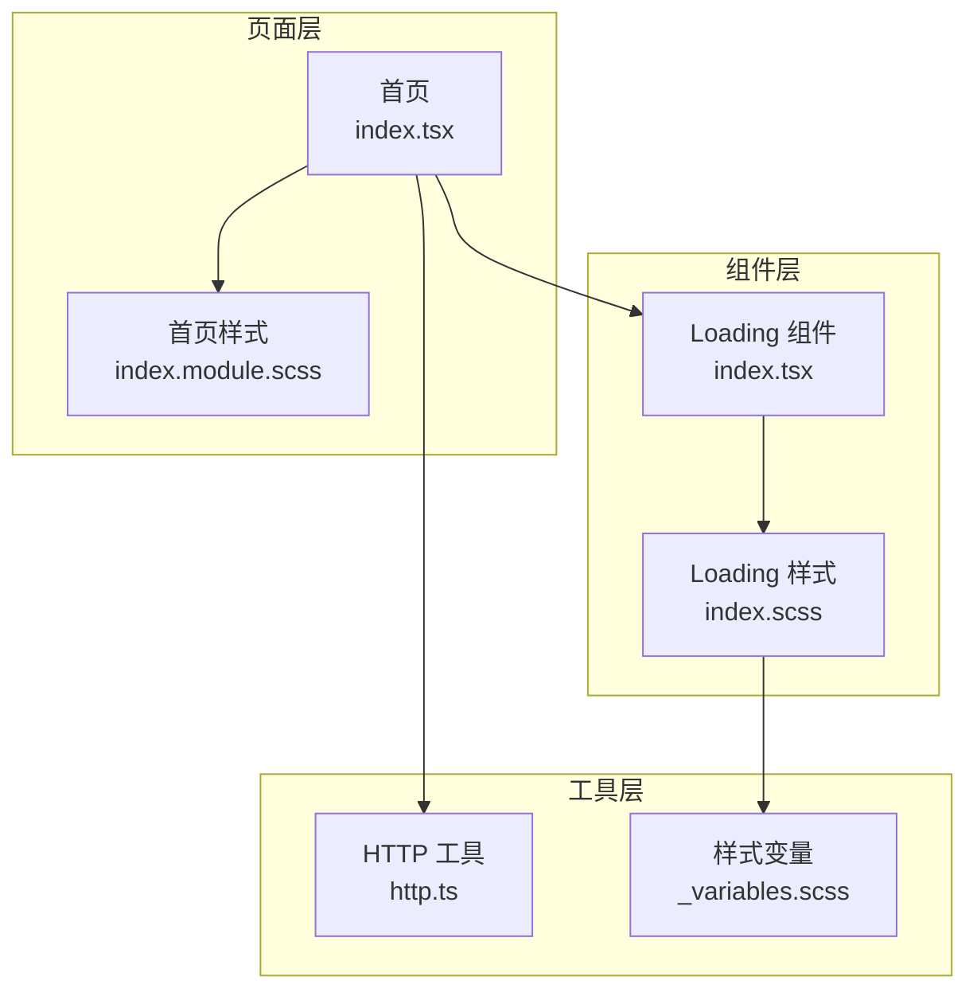
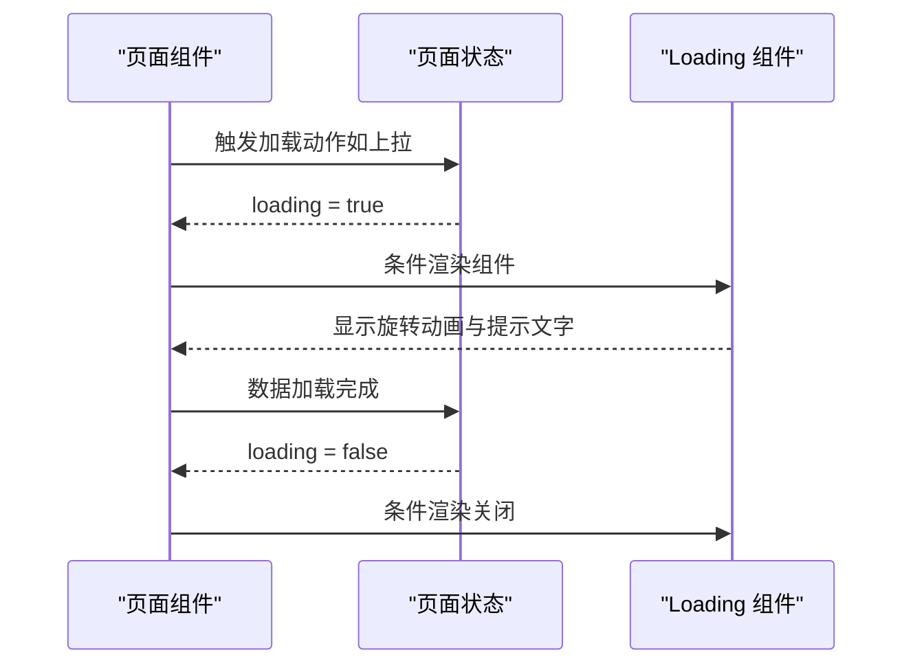
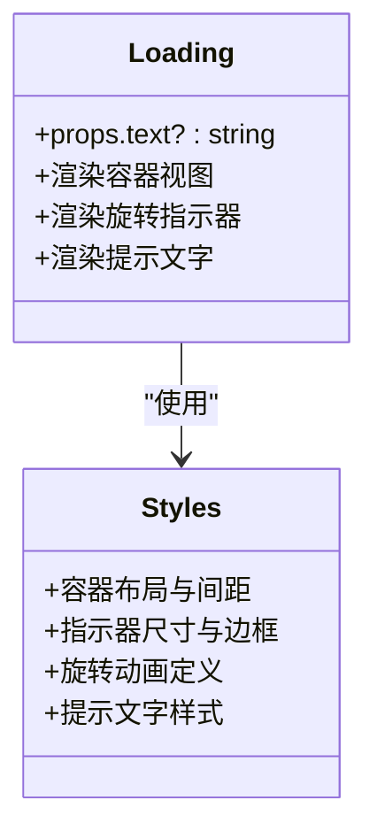
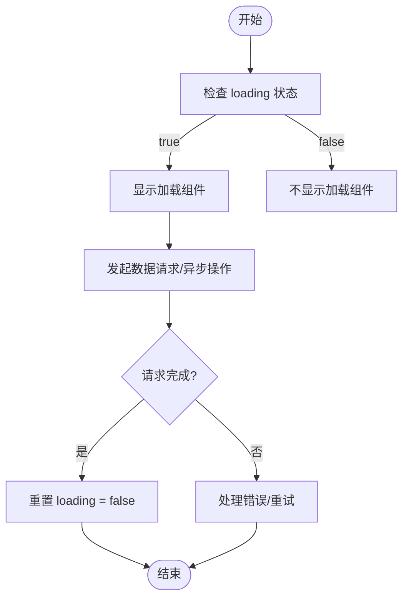
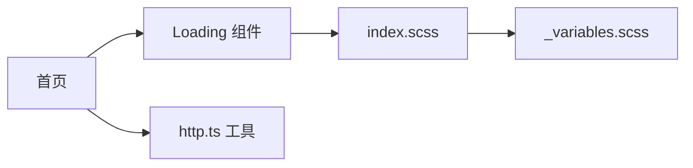

# 加载组件

<cite>
**本文引用的文件**
- [src/components/Loading/index.tsx](file://src/components/Loading/index.tsx)
- [src/components/Loading/index.scss](file://src/components/Loading/index.scss)
- [src/pages/home/index.tsx](file://src/pages/home/index.tsx)
- [src/pages/home/index.module.scss](file://src/pages/home/index.module.scss)
- [src/utils/http.ts](file://src/utils/http.ts)
- [src/styles/_variables.scss](file://src/styles/_variables.scss)
</cite>

## 目录
1. [简介](#简介)
2. [项目结构](#项目结构)
3. [核心组件](#核心组件)
4. [架构总览](#架构总览)
5. [详细组件分析](#详细组件分析)
6. [依赖分析](#依赖分析)
7. [性能考虑](#性能考虑)
8. [故障排查指南](#故障排查指南)
9. [结论](#结论)
10. [附录](#附录)

## 简介
本文件围绕仓库中的 Loading 组件进行系统化文档整理，重点覆盖以下方面：
- 加载状态显示功能与动画实现
- 不同加载场景下的使用方式（页面加载、数据请求、异步操作）
- 可见性控制逻辑与显示时机
- 动画效果与视觉反馈设计
- 配置选项（如加载图标大小、颜色主题、文字提示）
- 性能优化与用户体验最佳实践

需要特别说明的是：当前仓库中存在一个独立的 Loading 组件文件，但其在页面中并未直接被导入使用；页面中实际使用的加载提示多为 Taro 内置的全局加载提示或自定义文本提示。本文仍以现有源码为基础，给出 Loading 组件的功能说明、使用建议与最佳实践。

## 项目结构
Loading 组件位于 components 目录下，采用 Taro + React 的小程序开发框架，样式通过 SCSS 编写。页面中与加载相关的使用主要集中在首页的“上拉加载更多”场景。

图表来源
- [src/components/Loading/index.tsx:1-16](file://src/components/Loading/index.tsx#L1-L16)
- [src/components/Loading/index.scss:1-29](file://src/components/Loading/index.scss#L1-L29)
- [src/pages/home/index.tsx:1-151](file://src/pages/home/index.tsx#L1-L151)
- [src/pages/home/index.module.scss:1-167](file://src/pages/home/index.module.scss#L1-L167)
- [src/utils/http.ts:1-165](file://src/utils/http.ts#L1-L165)
- [src/styles/_variables.scss:1-9](file://src/styles/_variables.scss#L1-L9)

章节来源
- [src/components/Loading/index.tsx:1-16](file://src/components/Loading/index.tsx#L1-L16)
- [src/components/Loading/index.scss:1-29](file://src/components/Loading/index.scss#L1-L29)
- [src/pages/home/index.tsx:1-151](file://src/pages/home/index.tsx#L1-L151)
- [src/pages/home/index.module.scss:1-167](file://src/pages/home/index.module.scss#L1-L167)
- [src/utils/http.ts:1-165](file://src/utils/http.ts#L1-L165)
- [src/styles/_variables.scss:1-9](file://src/styles/_variables.scss#L1-L9)

## 核心组件
Loading 组件提供基础的加载指示器，包含旋转动画与提示文字，默认文案为“加载中...”。该组件通过 props 接收自定义提示文本，便于在不同场景下灵活展示。

- 组件职责
  - 渲染圆形旋转指示器
  - 展示提示文字（默认“加载中...”，可通过 props 覆盖）
  - 提供基础样式与动画

- 关键属性
  - text?: string（可选）：提示文字，默认值为“加载中...”

- 使用方式
  - 在页面中通过条件渲染控制显示/隐藏
  - 常见于“上拉加载更多”等异步数据追加场景

章节来源
- [src/components/Loading/index.tsx:4-15](file://src/components/Loading/index.tsx#L4-L15)

## 架构总览
下图展示了 Loading 组件在页面中的典型使用路径：页面状态驱动组件显示，组件负责渲染视觉反馈。

图表来源
- [src/pages/home/index.tsx:70-102](file://src/pages/home/index.tsx#L70-L102)
- [src/pages/home/index.tsx:141-145](file://src/pages/home/index.tsx#L141-L145)
- [src/components/Loading/index.tsx:8-14](file://src/components/Loading/index.tsx#L8-L14)

## 详细组件分析

### 组件结构与样式
- 结构组成
  - 容器视图：用于居中布局与内边距
  - 旋转指示器：通过边框与圆角实现环形，并配合关键帧动画实现旋转
  - 文本提示：展示加载文案

- 样式要点
  - 指示器尺寸：宽高均为 40px
  - 边框宽度：3px
  - 边框颜色：未填充区域浅灰，顶部填充为品牌绿色
  - 文字样式：字号 24px，颜色为浅灰
  - 动画：线性循环旋转，周期 0.8 秒

图表来源
- [src/components/Loading/index.tsx:8-14](file://src/components/Loading/index.tsx#L8-L14)
- [src/components/Loading/index.scss:1-29](file://src/components/Loading/index.scss#L1-L29)

章节来源
- [src/components/Loading/index.tsx:1-16](file://src/components/Loading/index.tsx#L1-L16)
- [src/components/Loading/index.scss:1-29](file://src/components/Loading/index.scss#L1-L29)

### 动画实现与视觉反馈
- 动画实现
  - 使用 CSS 关键帧 @keyframes 实现 360° 旋转
  - 指示器采用 border 方式绘制，通过改变顶部边框颜色形成“填充”效果
  - 动画参数：线性运动、无限循环、周期 0.8 秒

- 视觉反馈
  - 圆形环形进度感，符合移动端加载习惯
  - 文字提示与图标联动，增强可读性

章节来源
- [src/components/Loading/index.scss:9-28](file://src/components/Loading/index.scss#L9-L28)

### 可见性控制与显示时机
- 控制逻辑
  - 页面通过状态变量（如 loading）控制组件的显示/隐藏
  - 常见于“上拉加载更多”场景：当 loading 为 true 时显示组件，数据加载完成后置为 false

- 页面示例
  - 首页在滚动到底部时触发加载更多，期间显示加载提示
  - 通过防重复加载（loading 状态判断）避免并发请求

图表来源
- [src/pages/home/index.tsx:83-91](file://src/pages/home/index.tsx#L83-L91)
- [src/pages/home/index.tsx:141-145](file://src/pages/home/index.tsx#L141-L145)

章节来源
- [src/pages/home/index.tsx:70-102](file://src/pages/home/index.tsx#L70-L102)
- [src/pages/home/index.tsx:141-145](file://src/pages/home/index.tsx#L141-L145)

### 配置选项与扩展建议
- 当前支持的配置
  - text：提示文字（默认“加载中...”）

- 扩展建议（基于现有样式与结构）
  - 图标尺寸：通过修改指示器宽高即可调整
  - 主题色：通过修改顶部边框颜色实现品牌化
  - 文案：通过 props text 自定义提示语

- 与主题变量的关系
  - 样式变量集中定义于 _variables.scss，可在样式中按需引用，实现统一的主题管理

章节来源
- [src/components/Loading/index.tsx:4-6](file://src/components/Loading/index.tsx#L4-L6)
- [src/components/Loading/index.scss:9-22](file://src/components/Loading/index.scss#L9-L22)
- [src/styles/_variables.scss:1-9](file://src/styles/_variables.scss#L1-L9)

### 应用场景与集成方式
- 页面加载场景
  - 在页面初次渲染或切换路由时，可结合全局加载提示或局部 Loading 组件进行过渡

- 数据请求场景
  - 在调用 HTTP 工具发起请求时，可结合 Loading 组件与状态管理，实现细粒度的加载反馈

- 异步操作场景
  - 对于非网络请求的异步任务（如本地计算、文件选择），也可使用 Loading 组件提供即时反馈

- 页面集成示例
  - 首页通过 loading 状态控制加载提示的显示，演示了“上拉加载更多”的典型流程

章节来源
- [src/pages/home/index.tsx:83-91](file://src/pages/home/index.tsx#L83-L91)
- [src/pages/home/index.tsx:141-145](file://src/pages/home/index.tsx#L141-L145)
- [src/utils/http.ts:46-110](file://src/utils/http.ts#L46-L110)

## 依赖分析
- 组件依赖
  - Taro 组件：View、Text
  - 样式：index.scss
  - 主题变量：_variables.scss

- 页面依赖
  - 首页：通过状态变量控制 Loading 组件的显示
  - HTTP 工具：封装请求与错误提示，与 Loading 组件形成“请求-反馈”的协作关系

图表来源
- [src/components/Loading/index.tsx:1-2](file://src/components/Loading/index.tsx#L1-L2)
- [src/components/Loading/index.scss:1-29](file://src/components/Loading/index.scss#L1-L29)
- [src/styles/_variables.scss:1-9](file://src/styles/_variables.scss#L1-L9)
- [src/pages/home/index.tsx:1-151](file://src/pages/home/index.tsx#L1-L151)
- [src/utils/http.ts:1-165](file://src/utils/http.ts#L1-L165)

章节来源
- [src/components/Loading/index.tsx:1-2](file://src/components/Loading/index.tsx#L1-L2)
- [src/components/Loading/index.scss:1-29](file://src/components/Loading/index.scss#L1-L29)
- [src/styles/_variables.scss:1-9](file://src/styles/_variables.scss#L1-L9)
- [src/pages/home/index.tsx:1-151](file://src/pages/home/index.tsx#L1-L151)
- [src/utils/http.ts:1-165](file://src/utils/http.ts#L1-L165)

## 性能考虑
- 动画性能
  - 使用 transform 旋转与边框绘制，避免重排与重绘开销
  - 动画参数设置合理，确保流畅度与资源占用平衡

- 渲染优化
  - 通过状态变量精确控制组件渲染，避免不必要的重复渲染
  - 在长列表场景中，优先使用虚拟滚动与分页加载，减少一次性渲染压力

- 用户体验
  - 合理设置加载时长阈值，避免短时间闪烁
  - 在弱网环境下提供明确的重试与错误提示

## 故障排查指南
- 常见问题
  - 组件不显示：检查页面状态变量是否正确更新
  - 文案不生效：确认 props 是否传入 text
  - 动画异常：检查样式文件是否正确引入与编译

- 与 HTTP 工具的协作
  - 在请求失败或超时时，结合 Toast 或错误提示，避免用户困惑
  - 对于业务错误码，统一处理并提示，保持一致的反馈策略

章节来源
- [src/utils/http.ts:60-110](file://src/utils/http.ts#L60-L110)

## 结论
Loading 组件以简洁的结构与稳定的动画实现了基础的加载反馈能力。结合页面状态管理与 HTTP 工具，可在多种异步场景中提供一致且友好的用户体验。建议在实际项目中根据主题规范扩展尺寸与配色，并在复杂场景中结合骨架屏或分页策略进一步优化性能与感知速度。

## 附录
- 组件属性一览
  - text?: string（提示文字，默认“加载中...”）

- 样式变量参考
  - 主题色：品牌绿色
  - 文本色：浅灰
  - 尺寸：指示器 40×40 px，边框 3 px

章节来源
- [src/components/Loading/index.tsx:4-6](file://src/components/Loading/index.tsx#L4-L6)
- [src/components/Loading/index.scss:9-22](file://src/components/Loading/index.scss#L9-L22)
- [src/styles/_variables.scss:1-9](file://src/styles/_variables.scss#L1-L9)