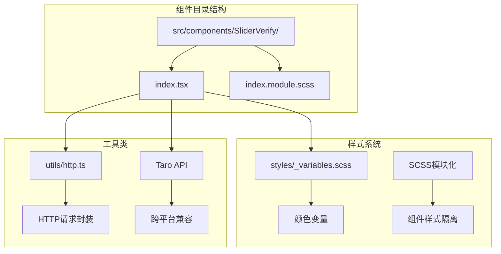
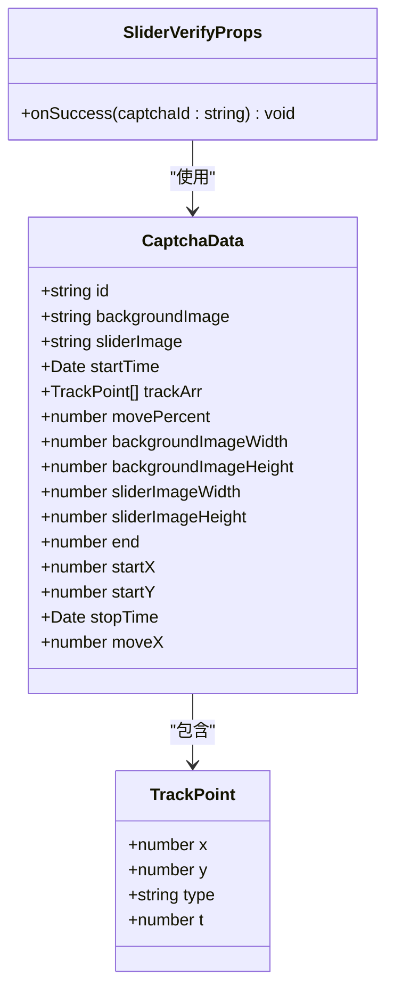
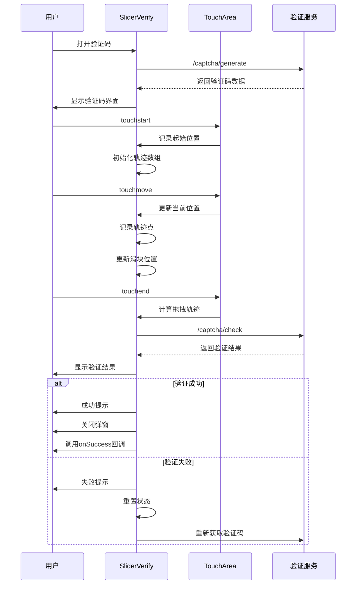
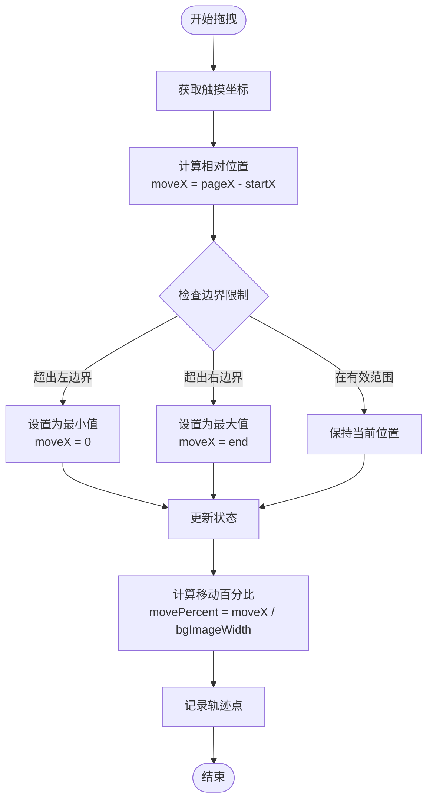
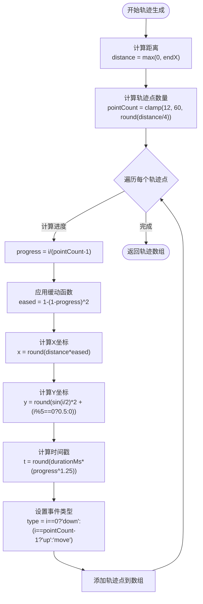
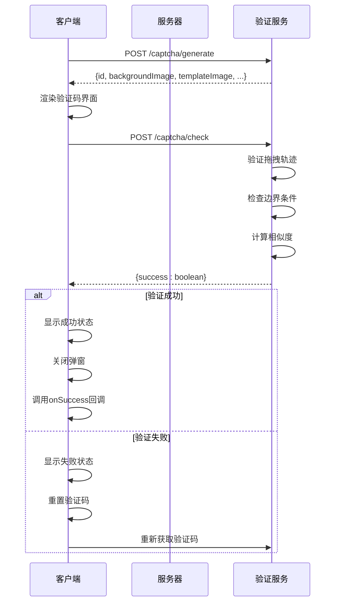
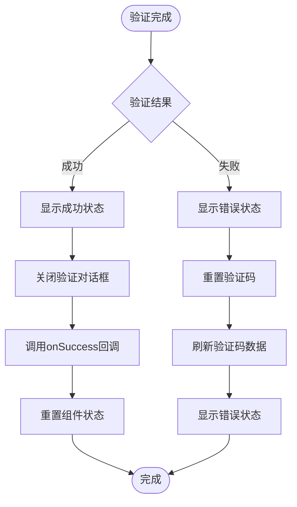
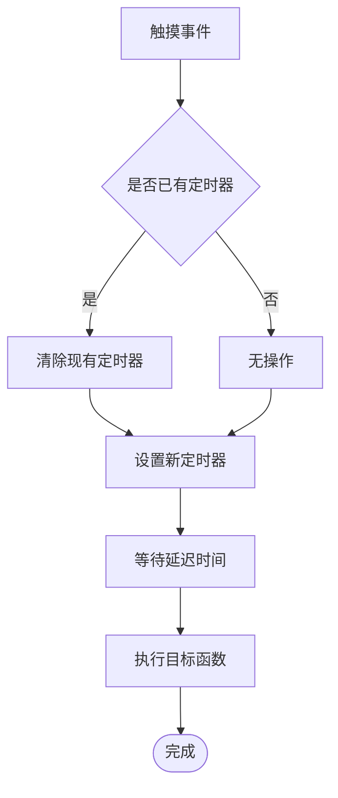

# 滑动验证码组件

<cite>
**本文档引用的文件**
- [SliderVerify/index.tsx](file://src/components/SliderVerify/index.tsx)
- [SliderVerify/index.module.scss](file://src/components/SliderVerify/index.module.scss)
- [http.ts](file://src/utils/http.ts)
- [login/index.tsx](file://src/pages/login/index.tsx)
- [_variables.scss](file://src/styles/_variables.scss)
</cite>

## 目录
1. [简介](#简介)
2. [项目结构](#项目结构)
3. [核心组件](#核心组件)
4. [架构概览](#架构概览)
5. [详细组件分析](#详细组件分析)
6. [依赖关系分析](#依赖关系分析)
7. [性能考量](#性能考量)
8. [故障排除指南](#故障排除指南)
9. [结论](#结论)
10. [附录](#附录)

## 简介
SliderVerify 是一个基于 Taro 的滑动验证码组件，用于在用户进行敏感操作（如登录、注册、发布内容等）时提供人机验证。该组件实现了完整的拖拽验证流程，包括验证码生成、轨迹记录、验证结果反馈等功能，并提供了良好的用户体验和可访问性支持。

## 项目结构
SliderVerify 组件位于 `src/components/SliderVerify/` 目录下，采用标准的 React 组件结构：



**图表来源**
- [SliderVerify/index.tsx:1-463](file://src/components/SliderVerify/index.tsx#L1-L463)
- [SliderVerify/index.module.scss:1-190](file://src/components/SliderVerify/index.module.scss#L1-L190)

**章节来源**
- [SliderVerify/index.tsx:1-50](file://src/components/SliderVerify/index.tsx#L1-L50)
- [SliderVerify/index.module.scss:1-25](file://src/components/SliderVerify/index.module.scss#L1-L25)

## 核心组件
SliderVerify 组件是一个高阶组件，提供了完整的滑动验证功能：

### 主要特性
- **拖拽验证**：支持手势拖拽和触摸事件处理
- **轨迹记录**：精确记录用户的拖拽轨迹和时间戳
- **实时反馈**：提供视觉反馈和状态提示
- **防刷机制**：集成防抖和重置机制
- **跨平台支持**：基于 Taro 实现多端兼容

### 核心数据结构
组件使用以下关键数据结构来管理验证码状态：



**图表来源**
- [SliderVerify/index.tsx:8-32](file://src/components/SliderVerify/index.tsx#L8-L32)
- [SliderVerify/index.tsx:53-66](file://src/components/SliderVerify/index.tsx#L53-L66)

**章节来源**
- [SliderVerify/index.tsx:79-113](file://src/components/SliderVerify/index.tsx#L79-L113)

## 架构概览
SliderVerify 采用模块化的架构设计，将功能分解为独立的模块：

```mermaid
graph TB
subgraph "用户界面层"
A[SliderVerify组件] --> B[拖拽区域]
A --> C[验证码背景]
A --> D[滑块元素]
end
subgraph "状态管理层"
E[captchaDataRef] --> F[验证码数据]
E --> G[轨迹数组]
E --> H[位置信息]
end
subgraph "交互处理层"
I[touchstart] --> J[开始拖拽]
K[touchmove] --> L[拖拽中]
M[touchend] --> N[结束拖拽]
end
subgraph "验证服务层"
O[httpPost] --> P[/captcha/generate]
O --> Q[/captcha/check]
end
subgraph "样式层"
R[SCSS模块] --> S[响应式布局]
R --> T[动画效果]
end
A --> E
A --> I
A --> O
A --> R
```

**图表来源**
- [SliderVerify/index.tsx:127-181](file://src/components/SliderVerify/index.tsx#L127-L181)
- [SliderVerify/index.tsx:319-362](file://src/components/SliderVerify/index.tsx#L319-L362)

## 详细组件分析

### 拖拽验证逻辑
组件实现了完整的拖拽验证流程，包括轨迹记录和位置检测：



**图表来源**
- [SliderVerify/index.tsx:249-374](file://src/components/SliderVerify/index.tsx#L249-L374)
- [SliderVerify/index.tsx:319-362](file://src/components/SliderVerify/index.tsx#L319-L362)

### 位置检测算法
组件实现了精确的位置检测算法，确保滑块只能在有效范围内移动：



**图表来源**
- [SliderVerify/index.tsx:271-298](file://src/components/SliderVerify/index.tsx#L271-L298)

### 轨迹生成算法
组件使用复杂的轨迹生成算法来模拟真实的拖拽行为：



**图表来源**
- [SliderVerify/index.tsx:34-50](file://src/components/SliderVerify/index.tsx#L34-L50)

**章节来源**
- [SliderVerify/index.tsx:34-50](file://src/components/SliderVerify/index.tsx#L34-L50)

### 验证流程
组件实现了完整的验证流程，包括前后端交互和状态管理：



**图表来源**
- [SliderVerify/index.tsx:127-181](file://src/components/SliderVerify/index.tsx#L127-L181)
- [SliderVerify/index.tsx:319-362](file://src/components/SliderVerify/index.tsx#L319-L362)

**章节来源**
- [SliderVerify/index.tsx:127-181](file://src/components/SliderVerify/index.tsx#L127-L181)
- [SliderVerify/index.tsx:319-362](file://src/components/SliderVerify/index.tsx#L319-L362)

### 成功回调处理机制
组件提供了灵活的成功回调处理机制：



**图表来源**
- [SliderVerify/index.tsx:339-361](file://src/components/SliderVerify/index.tsx#L339-L361)

**章节来源**
- [SliderVerify/index.tsx:339-361](file://src/components/SliderVerify/index.tsx#L339-L361)

### 安全性考虑与防刷机制
组件实现了多层次的安全防护机制：

#### 防抖机制


#### 状态重置机制
组件在每次验证完成后都会重置内部状态，防止重复验证：

**章节来源**
- [SliderVerify/index.tsx:115-124](file://src/components/SliderVerify/index.tsx#L115-L124)
- [SliderVerify/index.tsx:205-241](file://src/components/SliderVerify/index.tsx#L205-L241)

### 配置选项
SliderVerify 组件支持以下配置选项：

| 属性名 | 类型 | 必需 | 默认值 | 描述 |
|--------|------|------|--------|------|
| onSuccess | `(captchaId: string) => void` | 是 | - | 验证成功后的回调函数 |
| className | string | 否 | - | 自定义CSS类名 |
| style | React.CSSProperties | 否 | - | 内联样式 |

组件还支持以下内部配置参数：

| 参数名 | 类型 | 默认值 | 描述 |
|--------|------|--------|------|
| baseWidth | number | 80rpx转换后的像素值 | 滑块基础宽度 |
| animationDuration | number | 350ms | 最小动画持续时间 |
| maxRetries | number | 3 | 最大重试次数 |
| timeout | number | 30000 | 请求超时时间 |

**章节来源**
- [SliderVerify/index.tsx:53-55](file://src/components/SliderVerify/index.tsx#L53-L55)
- [SliderVerify/index.tsx:68-77](file://src/components/SliderVerify/index.tsx#L68-L77)

### 动画效果
组件提供了丰富的动画效果来提升用户体验：

#### 拖拽动画
- 滑块移动时的平滑过渡
- 背景遮罩的渐变效果
- 拖拽阴影的动态变化

#### 状态反馈动画
- 成功状态的绿色提示条
- 失败状态的红色提示条
- 验证完成后的淡出效果

**章节来源**
- [SliderVerify/index.module.scss:98-114](file://src/components/SliderVerify/index.module.scss#L98-L114)
- [SliderVerify/index.module.scss:144-163](file://src/components/SliderVerify/index.module.scss#L144-L163)

### 错误提示
组件提供了完善的错误处理机制：

| 错误类型 | 提示文本 | 处理方式 |
|----------|----------|----------|
| 验证失败 | "验证失败，请重新尝试！" | 重置验证码并重新加载 |
| 网络异常 | "网络错误，请检查网络连接" | 显示错误提示并允许重试 |
| 图片加载失败 | "验证码图片加载失败" | 重新获取验证码数据 |
| 超时错误 | "请求超时，请稍后重试" | 显示超时提示并自动重试 |

**章节来源**
- [SliderVerify/index.tsx:87](file://src/components/SliderVerify/index.tsx#L87)
- [SliderVerify/index.tsx:354-361](file://src/components/SliderVerify/index.tsx#L354-L361)

## 依赖关系分析
SliderVerify 组件的依赖关系如下：

```mermaid
graph TB
subgraph "外部依赖"
A[Taro框架] --> B[跨平台API]
C[React] --> D[组件生命周期]
E[SCSS] --> F[样式编译]
end
subgraph "内部依赖"
G[http.ts] --> H[HTTP请求封装]
I[_variables.scss] --> J[颜色变量]
K[SliderVerify/index.tsx] --> L[组件实现]
K --> M[样式文件]
end
subgraph "第三方库"
N[@tarojs/components] --> O[MovableArea/MovableView]
P[@tarojs/taro] --> Q[系统信息获取]
end
L --> G
L --> N
L --> P
M --> I
```

**图表来源**
- [SliderVerify/index.tsx:1-5](file://src/components/SliderVerify/index.tsx#L1-L5)
- [http.ts:1-165](file://src/utils/http.ts#L1-L165)

**章节来源**
- [SliderVerify/index.tsx:1-5](file://src/components/SliderVerify/index.tsx#L1-L5)
- [http.ts:1-165](file://src/utils/http.ts#L1-L165)

## 性能考量
SliderVerify 组件在设计时充分考虑了性能优化：

### 渲染优化
- 使用 `useRef` 缓存频繁访问的数据
- 通过 `useCallback` 优化事件处理器
- 条件渲染减少不必要的DOM更新

### 内存管理
- 及时清理定时器和事件监听器
- 在组件卸载时重置所有状态
- 避免内存泄漏的陷阱

### 网络优化
- 防抖机制避免频繁请求
- 合理的超时控制
- 错误重试机制

## 故障排除指南
常见问题及解决方案：

### 验证码无法显示
1. **检查网络连接**：确认能够访问 `/captcha/generate` 接口
2. **验证图片URL**：确保验证码图片URL有效
3. **检查权限**：确认有访问图片资源的权限

### 拖拽无效
1. **检查触摸事件**：确认 `onTouchStart/onTouchMove/onTouchEnd` 事件正常绑定
2. **验证边界限制**：检查滑块的最大移动范围
3. **调试轨迹记录**：确认轨迹数组正确更新

### 验证失败
1. **检查轨迹数据**：确认轨迹点数据格式正确
2. **验证时间戳**：确保时间戳计算准确
3. **检查服务器响应**：确认验证接口返回正确的结果

**章节来源**
- [SliderVerify/index.tsx:174-181](file://src/components/SliderVerify/index.tsx#L174-L181)
- [SliderVerify/index.tsx:354-361](file://src/components/SliderVerify/index.tsx#L354-L361)

## 结论
SliderVerify 组件是一个功能完整、设计合理的滑动验证码解决方案。它不仅实现了基本的拖拽验证功能，还提供了良好的用户体验、安全防护和可维护性。组件的模块化设计使得它易于集成到不同的应用场景中，同时保持了高度的可定制性。

通过合理的状态管理和事件处理机制，组件能够在保证安全性的同时提供流畅的用户体验。建议在实际使用中根据具体需求调整配置参数，并结合业务场景进行适当的扩展。

## 附录

### 应用场景
SliderVerify 组件适用于以下场景：

#### 用户注册
- 防止机器人注册
- 验证用户真实性
- 减少恶意注册

#### 用户登录
- 防止暴力破解
- 验证用户身份
- 提升账户安全

#### 敏感操作
- 发布内容
- 修改重要信息
- 执行付费操作

#### 安全审计
- 记录用户行为轨迹
- 分析异常操作模式
- 提供安全证据链

### 用户体验优化
- **视觉反馈**：提供清晰的状态指示
- **动画效果**：增强交互的流畅性
- **无障碍支持**：考虑不同用户的需求
- **响应速度**：优化加载和验证速度

### 可访问性设计
- **键盘导航**：支持键盘操作
- **屏幕阅读器**：提供语义化标签
- **颜色对比**：确保足够的对比度
- **触控目标**：提供合适的点击区域