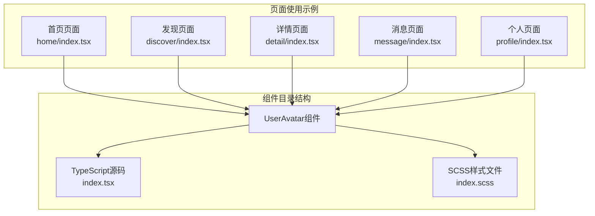
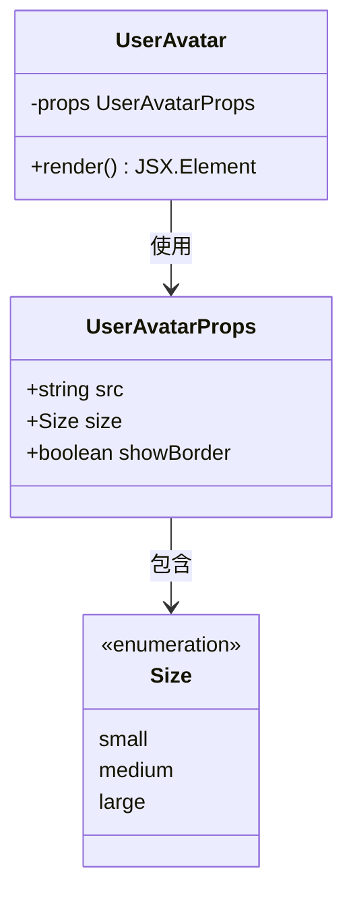
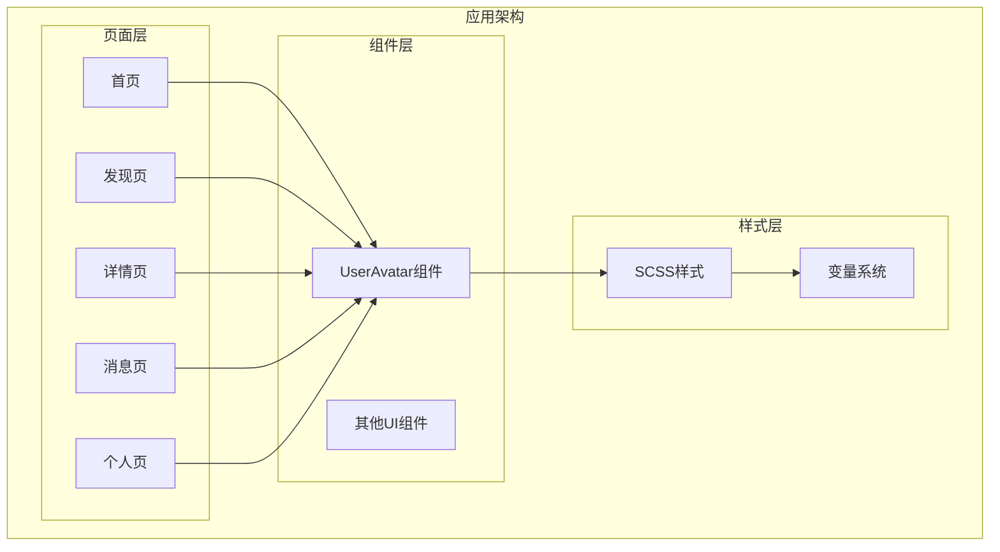
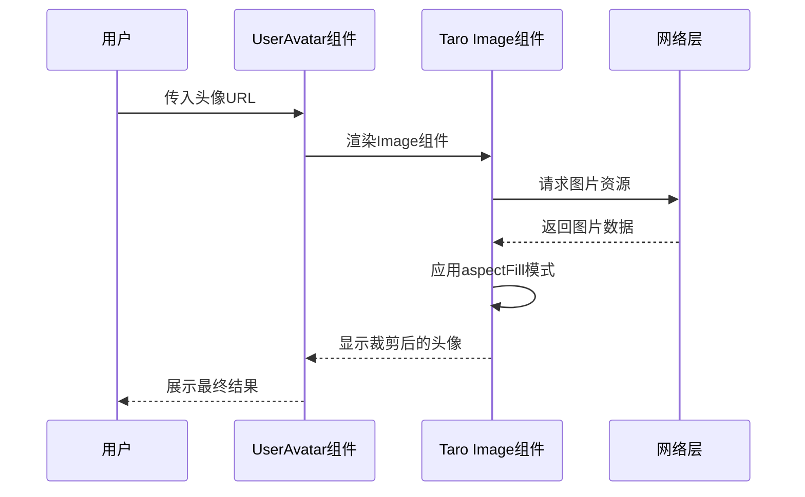
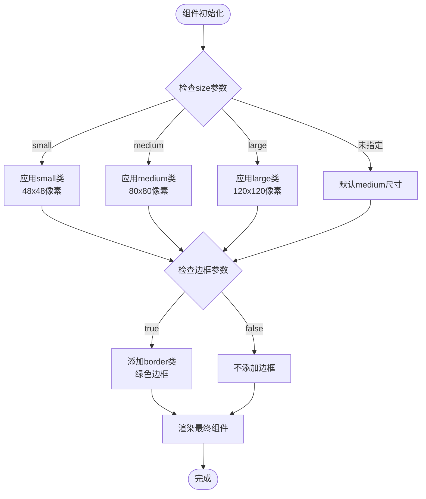
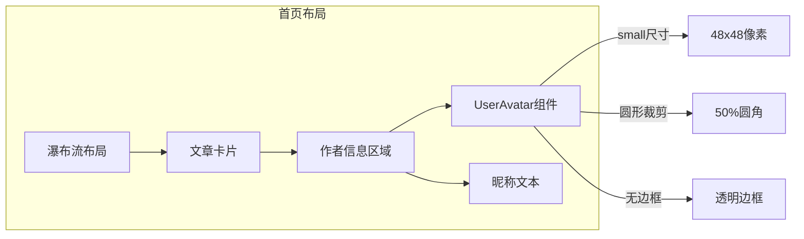
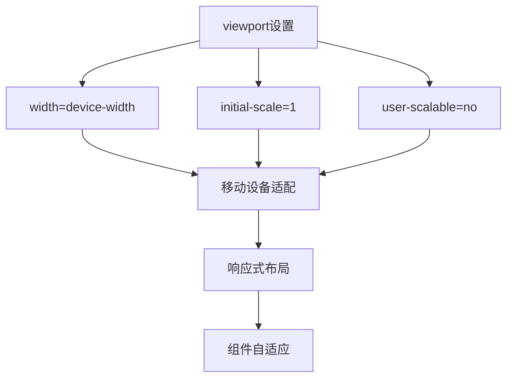
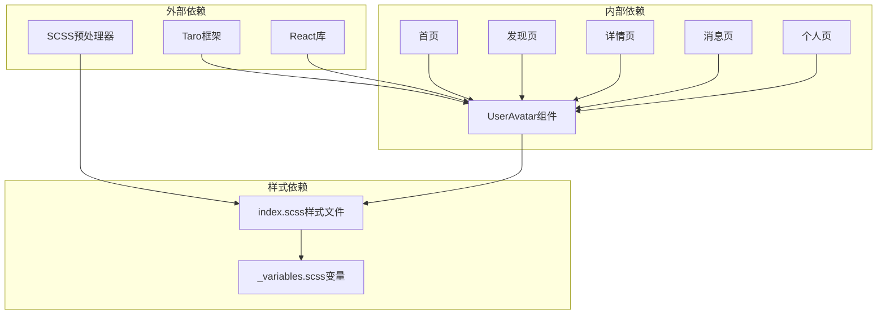

# 用户头像组件

<cite>
**本文档引用的文件**
- [src/components/UserAvatar/index.tsx](file://src/components/UserAvatar/index.tsx)
- [src/components/UserAvatar/index.scss](file://src/components/UserAvatar/index.scss)
- [src/pages/home/index.tsx](file://src/pages/home/index.tsx)
- [src/pages/home/index.module.scss](file://src/pages/home/index.module.scss)
- [src/pages/discover/index.tsx](file://src/pages/discover/index.tsx)
- [src/pages/discover/index.module.scss](file://src/pages/discover/index.module.scss)
- [src/pages/detail/index.tsx](file://src/pages/detail/index.tsx)
- [src/pages/message/index.tsx](file://src/pages/message/index.tsx)
- [src/pages/profile/index.tsx](file://src/pages/profile/index.tsx)
- [src/styles/_variables.scss](file://src/styles/_variables.scss)
- [src/utils/index.ts](file://src/utils/index.ts)
- [src/index.html](file://src/index.html)
</cite>

## 目录
1. [简介](#简介)
2. [项目结构](#项目结构)
3. [核心组件](#核心组件)
4. [架构概览](#架构概览)
5. [详细组件分析](#详细组件分析)
6. [依赖关系分析](#依赖关系分析)
7. [性能考虑](#性能考虑)
8. [故障排除指南](#故障排除指南)
9. [结论](#结论)
10. [附录](#附录)

## 简介

用户头像组件（UserAvatar）是红书应用中的一个基础UI组件，用于统一展示用户头像图片。该组件提供了简洁的API接口，支持多种尺寸配置和边框样式设置，能够适应不同的页面布局需求。

组件基于Taro框架开发，使用React语法编写，兼容多端运行环境。通过简单的属性配置，开发者可以轻松控制头像的显示效果，包括尺寸大小、边框样式等视觉属性。

## 项目结构

用户头像组件位于项目的组件目录中，采用标准的组件化组织方式：



**图表来源**
- [src/components/UserAvatar/index.tsx:1-17](file://src/components/UserAvatar/index.tsx#L1-L17)
- [src/components/UserAvatar/index.scss:1-29](file://src/components/UserAvatar/index.scss#L1-L29)

**章节来源**
- [src/components/UserAvatar/index.tsx:1-17](file://src/components/UserAvatar/index.tsx#L1-L17)
- [src/components/UserAvatar/index.scss:1-29](file://src/components/UserAvatar/index.scss#L1-L29)

## 核心组件

### 组件定义与接口

UserAvatar组件采用函数式组件设计，提供简洁的API接口：



**图表来源**
- [src/components/UserAvatar/index.tsx:4-8](file://src/components/UserAvatar/index.tsx#L4-L8)

组件的核心功能包括：
- 头像图片加载和显示
- 尺寸自适应配置
- 边框样式控制
- 圆形裁剪效果

**章节来源**
- [src/components/UserAvatar/index.tsx:1-17](file://src/components/UserAvatar/index.tsx#L1-L17)

### 样式系统

组件采用SCSS预处理器，提供完整的样式体系：

| 尺寸规格 | 宽度 | 高度 | 适用场景 |
|---------|------|------|----------|
| small | 48px | 48px | 列表项中的用户头像 |
| medium | 80px | 80px | 中等规模的头像展示 |
| large | 120px | 120px | 大型头像或个人资料页 |

**章节来源**
- [src/components/UserAvatar/index.scss:5-22](file://src/components/UserAvatar/index.scss#L5-L22)

## 架构概览

用户头像组件在整个应用架构中的位置如下：



**图表来源**
- [src/pages/home/index.tsx:58-58](file://src/pages/home/index.tsx#L58-L58)
- [src/pages/discover/index.tsx:103-103](file://src/pages/discover/index.tsx#L103-L103)
- [src/pages/detail/index.tsx:78-78](file://src/pages/detail/index.tsx#L78-L78)

## 详细组件分析

### 组件实现细节

#### 图片加载与裁剪逻辑

组件使用Taro的Image组件进行图片处理，采用`aspectFill`模式确保图片填充容器且保持比例：



**图表来源**
- [src/components/UserAvatar/index.tsx:13-13](file://src/components/UserAvatar/index.tsx#L13-L13)

#### 尺寸配置系统

组件支持三种预设尺寸，每种尺寸都有对应的CSS类名：



**图表来源**
- [src/components/UserAvatar/index.tsx:10-15](file://src/components/UserAvatar/index.tsx#L10-L15)
- [src/components/UserAvatar/index.scss:5-22](file://src/components/UserAvatar/index.scss#L5-L22)

#### 边框样式设置

边框样式采用CSS实现，使用品牌主色调作为边框颜色：

**章节来源**
- [src/components/UserAvatar/index.scss:20-22](file://src/components/UserAvatar/index.scss#L20-L22)

### 在不同页面中的应用

#### 首页瀑布流布局

在首页中，UserAvatar组件主要用于文章列表的作者信息展示：



**图表来源**
- [src/pages/home/index.tsx:118-124](file://src/pages/home/index.tsx#L118-L124)
- [src/pages/home/index.module.scss:118-124](file://src/pages/home/index.module.scss#L118-L124)

#### 发现页推荐用户

在发现页面中，UserAvatar组件用于展示推荐用户的头像：

**章节来源**
- [src/pages/discover/index.tsx:103-103](file://src/pages/discover/index.tsx#L103-L103)
- [src/pages/discover/index.module.scss:142-147](file://src/pages/discover/index.module.scss#L142-L147)

#### 详情页作者信息

在详情页面中，UserAvatar组件用于展示内容作者的头像信息：

**章节来源**
- [src/pages/detail/index.tsx:78-78](file://src/pages/detail/index.tsx#L78-L78)

### 响应式设计实现

组件的响应式特性主要体现在以下方面：

#### 移动端适配

通过HTML meta标签设置viewport，确保组件在移动设备上的正确显示：



**图表来源**
- [src/index.html:5-5](file://src/index.html#L5-L5)

#### 尺寸自适应

组件的尺寸配置支持不同屏幕密度下的显示效果：

**章节来源**
- [src/components/UserAvatar/index.scss:5-18](file://src/components/UserAvatar/index.scss#L5-L18)

## 依赖关系分析

### 组件间依赖关系



**图表来源**
- [src/components/UserAvatar/index.tsx:1-2](file://src/components/UserAvatar/index.tsx#L1-L2)
- [src/components/UserAvatar/index.scss:1-1](file://src/components/UserAvatar/index.scss#L1-L1)

### 样式依赖链

组件的样式系统采用模块化设计，依赖全局变量系统：

**章节来源**
- [src/components/UserAvatar/index.scss:1-29](file://src/components/UserAvatar/index.scss#L1-L29)
- [src/styles/_variables.scss:1-9](file://src/styles/_variables.scss#L1-L9)

## 性能考虑

### 图片加载优化

组件使用Taro的Image组件进行图片处理，具有以下性能特点：

1. **智能裁剪**：使用`aspectFill`模式确保图片填充容器
2. **内存管理**：自动处理图片缓存和释放
3. **懒加载支持**：可配合页面滚动实现懒加载

### 渲染性能

组件采用轻量级设计，避免不必要的重渲染：

- 纯函数组件，无状态管理开销
- 最小化的DOM结构
- CSS类名切换而非内联样式

## 故障排除指南

### 常见问题及解决方案

#### 图片加载失败

当头像URL无效时，组件会显示为空白区域。建议在业务层添加错误处理逻辑。

#### 尺寸显示异常

如果出现头像变形问题，检查父容器的宽高设置是否正确。

#### 边框样式不生效

确认CSS类名拼接逻辑是否正确，以及样式文件是否正确引入。

**章节来源**
- [src/components/UserAvatar/index.tsx:10-15](file://src/components/UserAvatar/index.tsx#L10-L15)

## 结论

用户头像组件是一个设计简洁、功能明确的基础UI组件。它通过标准化的API接口和灵活的配置选项，为整个应用提供了统一的头像展示解决方案。

组件的主要优势包括：
- **简单易用**：仅需传入头像URL即可使用
- **配置灵活**：支持多种尺寸和边框样式
- **性能友好**：采用轻量级设计，渲染效率高
- **样式统一**：与整体设计系统保持一致

在实际使用中，建议根据具体的页面布局和设计规范选择合适的尺寸配置，并结合业务需求添加适当的错误处理和加载状态。

## 附录

### 组件API参考

| 属性名 | 类型 | 默认值 | 必填 | 描述 |
|--------|------|--------|------|------|
| src | string | - | 是 | 头像图片的URL地址 |
| size | 'small' \| 'medium' \| 'large' | 'medium' | 否 | 头像尺寸规格 |
| showBorder | boolean | false | 否 | 是否显示边框 |

### 使用示例

```typescript
// 基础用法
<UserAvatar src="https://example.com/avatar.jpg" />

// 指定尺寸
<UserAvatar src="https://example.com/avatar.jpg" size="large" />

// 添加边框
<UserAvatar 
  src="https://example.com/avatar.jpg" 
  size="medium" 
  showBorder={true} 
/>
```

### 样式定制

组件支持通过修改SCSS变量来自定义样式：

- `$primary-color`: 主色调（边框颜色）
- 可通过覆盖CSS变量实现主题定制

**章节来源**
- [src/components/UserAvatar/index.tsx:4-8](file://src/components/UserAvatar/index.tsx#L4-L8)
- [src/components/UserAvatar/index.scss:20-22](file://src/components/UserAvatar/index.scss#L20-L22)
- [src/styles/_variables.scss:1-1](file://src/styles/_variables.scss#L1-L1)