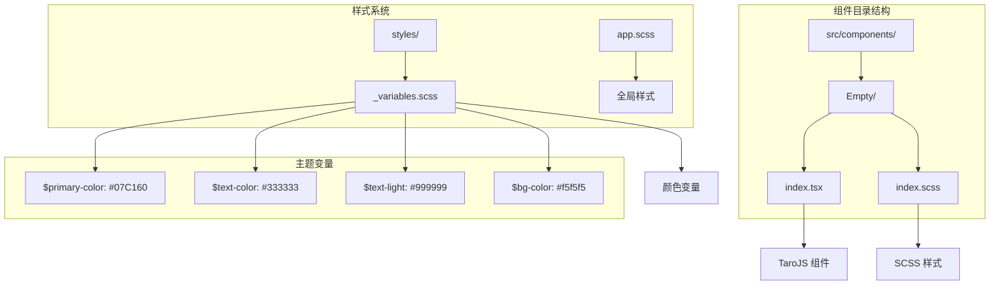
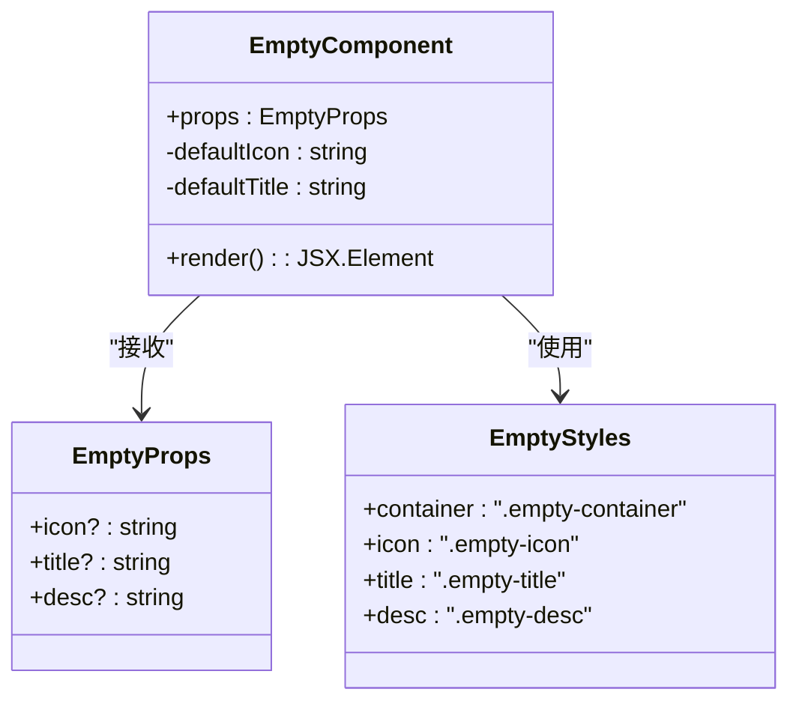
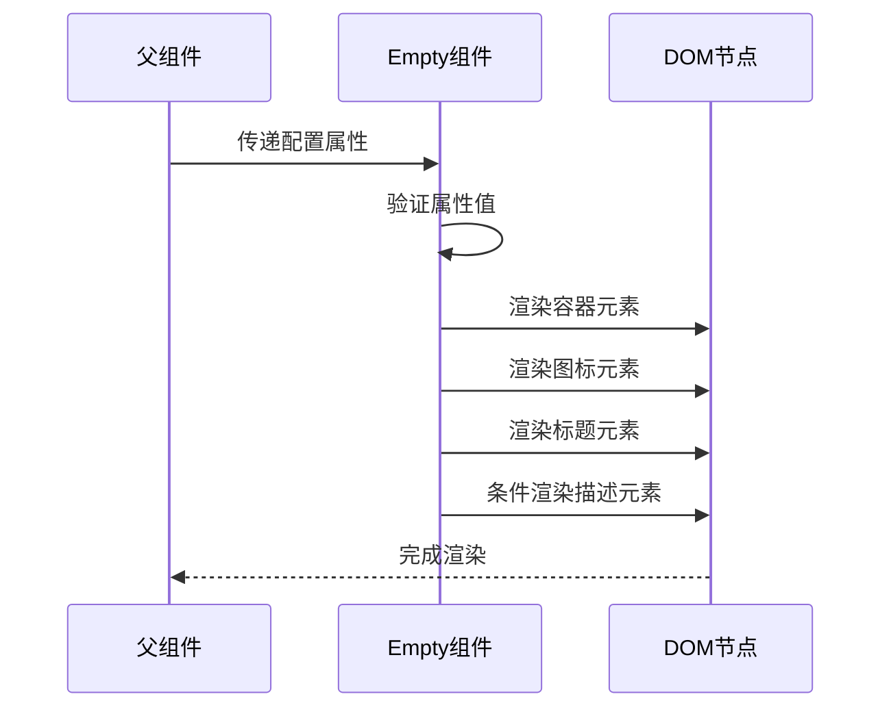
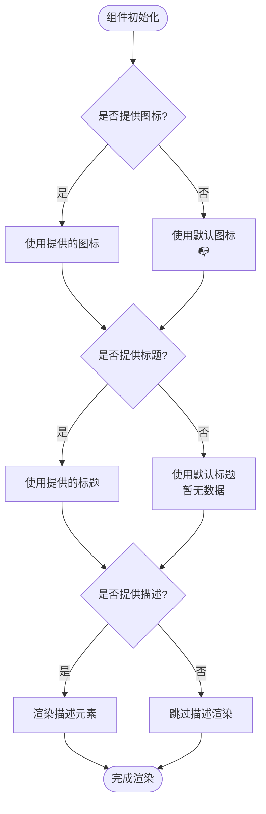
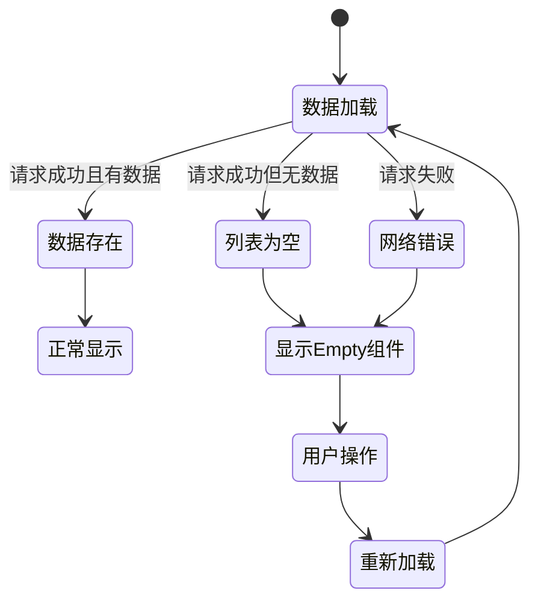
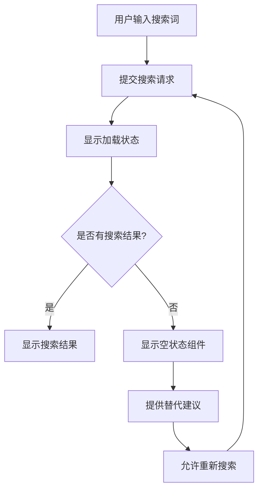
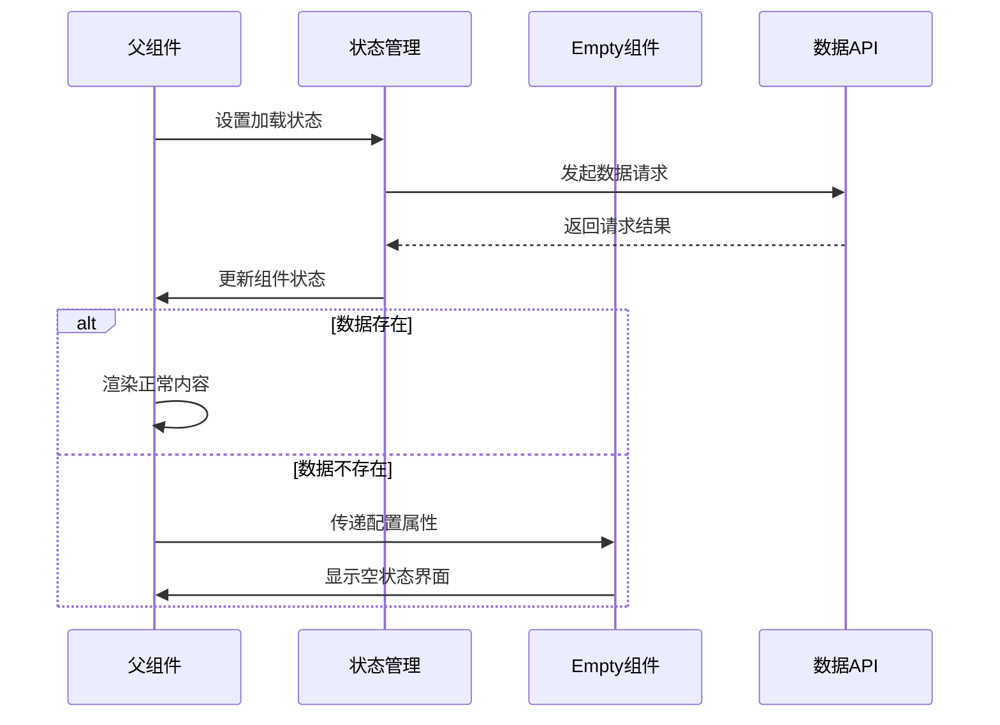

# 空状态组件

<cite>
**本文档引用的文件**
- [Empty/index.tsx](file://src/components/Empty/index.tsx)
- [Empty/index.scss](file://src/components/Empty/index.scss)
- [变量定义](file://src/styles/_variables.scss)
- [应用样式](file://src/app.scss)
</cite>

## 目录
1. [简介](#简介)
2. [项目结构](#项目结构)
3. [核心组件](#核心组件)
4. [架构概览](#架构概览)
5. [详细组件分析](#详细组件分析)
6. [依赖关系分析](#依赖关系分析)
7. [性能考虑](#性能考虑)
8. [故障排除指南](#故障排除指南)
9. [结论](#结论)
10. [附录](#附录)

## 简介

空状态组件是一个轻量级的UI组件，专门用于处理应用程序中的空数据场景。当用户界面没有可显示的数据时（如列表为空、搜索无结果、网络错误等），该组件能够优雅地展示友好的提示信息，避免出现空白或混乱的界面状态。

该组件采用简洁的设计理念，通过图标、标题和描述信息来传达当前的状态，并为用户提供清晰的视觉反馈。组件支持完全的自定义配置，包括图标、标题文本和描述内容，确保能够适应不同的业务场景和设计需求。

## 项目结构

空状态组件位于项目的组件目录中，采用标准的React组件结构：



**图表来源**
- [Empty/index.tsx:1-19](file://src/components/Empty/index.tsx#L1-L19)
- [Empty/index.scss:1-24](file://src/components/Empty/index.scss#L1-L24)
- [变量定义:1-9](file://src/styles/_variables.scss#L1-L9)

**章节来源**
- [Empty/index.tsx:1-19](file://src/components/Empty/index.tsx#L1-L19)
- [Empty/index.scss:1-24](file://src/components/Empty/index.scss#L1-L24)

## 核心组件

### 组件接口定义

Empty组件采用TypeScript接口定义，提供了灵活的配置选项：

```typescript
interface EmptyProps {
  icon?: string
  title?: string
  desc?: string
}
```

组件支持以下属性：
- **icon**: 图标字符串，默认值为快递盒表情符号
- **title**: 标题文本，默认值为"暂无数据"
- **desc**: 描述文本，可选参数

### 默认行为

组件具有以下默认行为：
- 自动居中显示所有内容
- 支持响应式布局
- 提供语义化的HTML结构
- 兼容TaroJS框架

**章节来源**
- [Empty/index.tsx:4-10](file://src/components/Empty/index.tsx#L4-L10)

## 架构概览

### 组件架构图



**图表来源**
- [Empty/index.tsx:4-18](file://src/components/Empty/index.tsx#L4-L18)
- [Empty/index.scss:1-24](file://src/components/Empty/index.scss#L1-L24)

### 数据流图



**图表来源**
- [Empty/index.tsx:10-18](file://src/components/Empty/index.tsx#L10-L18)

## 详细组件分析

### 组件实现细节

#### 属性处理机制

组件采用默认参数的方式处理属性，确保即使传入不完整的配置也能正常工作：



**图表来源**
- [Empty/index.tsx:10-18](file://src/components/Empty/index.tsx#L10-L18)

#### 样式系统

组件采用SCSS模块化样式，提供了完整的视觉层次：

| 样式类 | 用途 | 默认样式 |
|--------|------|----------|
| `.empty-container` | 主容器 | 居中布局，内边距80px 40px |
| `.empty-icon` | 图标元素 | 字体大小80px，底部间距20px |
| `.empty-title` | 标题文本 | 字体大小28px，灰色(#999999)，底部间距10px |
| `.empty-desc` | 描述文本 | 字体大小24px，浅灰色(#cccccc) |

**章节来源**
- [Empty/index.scss:1-24](file://src/components/Empty/index.scss#L1-L24)

### 使用场景分析

#### 列表为空场景



#### 搜索无结果场景



**图表来源**
- [Empty/index.tsx:10-18](file://src/components/Empty/index.tsx#L10-L18)

### 与父组件的交互

#### 父组件集成模式

父组件可以通过以下方式集成Empty组件：

1. **直接渲染**: 在条件渲染中根据数据状态决定是否显示Empty组件
2. **状态管理**: 通过状态变量控制Empty组件的显示和隐藏
3. **事件处理**: 结合重新加载功能，提供用户交互能力

#### 数据交互流程



**图表来源**
- [Empty/index.tsx:10-18](file://src/components/Empty/index.tsx#L10-L18)

## 依赖关系分析

### 外部依赖

组件的外部依赖关系相对简单：

```mermaid
graph LR
A[Empty组件] --> B[@tarojs/components]
B --> C[View组件]
C --> D[Text组件]
A --> E[SCSS样式]
E --> F[CSS变量]
F --> G[主题变量]
```

**图表来源**
- [Empty/index.tsx:1-2](file://src/components/Empty/index.tsx#L1-L2)
- [变量定义:1-9](file://src/styles/_variables.scss#L1-L9)

### 内部依赖

组件内部的依赖关系主要体现在样式和类型定义上：

| 依赖项 | 类型 | 作用 |
|--------|------|------|
| @tarojs/components | 外部库 | 提供TaroJS组件基础 |
| index.scss | 样式文件 | 定义组件视觉样式 |
| EmptyProps接口 | TypeScript | 定义组件属性类型 |

**章节来源**
- [Empty/index.tsx:1-2](file://src/components/Empty/index.tsx#L1-L2)
- [Empty/index.scss:1-24](file://src/components/Empty/index.scss#L1-L24)

## 性能考虑

### 渲染优化

Empty组件具有以下性能特点：
- **轻量级渲染**: 仅包含少量DOM元素，渲染开销极小
- **条件渲染**: 描述文本的条件渲染避免不必要的DOM节点创建
- **静态样式**: 使用预定义的SCSS样式，减少运行时计算

### 内存管理

组件的内存占用非常低，适合在大量列表项中重复使用。由于组件本身不维护复杂的状态，垃圾回收友好。

### 响应式设计

组件采用flex布局，天然支持响应式设计，在不同屏幕尺寸下都能保持良好的显示效果。

## 故障排除指南

### 常见问题及解决方案

#### 图标显示异常

**问题**: 图标无法正确显示
**可能原因**: 
- 图标字符串格式不正确
- 字体文件未正确加载

**解决方案**:
- 确保图标字符串为有效的Unicode字符
- 检查字体文件的加载状态

#### 文本溢出问题

**问题**: 标题或描述文本超出容器宽度
**解决方案**:
- 调整文本长度或使用CSS省略号
- 修改容器的宽度设置

#### 样式冲突

**问题**: 组件样式与其他样式发生冲突
**解决方案**:
- 使用更具体的选择器
- 检查CSS优先级设置

### 调试技巧

1. **检查属性传递**: 确认父组件正确传递了所有必需的属性
2. **验证样式加载**: 确保SCSS文件正确编译和加载
3. **测试响应式**: 在不同设备上测试组件的显示效果

**章节来源**
- [Empty/index.tsx:10-18](file://src/components/Empty/index.tsx#L10-L18)
- [Empty/index.scss:1-24](file://src/components/Empty/index.scss#L1-L24)

## 结论

空状态组件是一个设计精良的UI组件，它有效地解决了应用程序中空数据场景的用户体验问题。组件具有以下优势：

1. **简洁性**: 实现代码简洁，易于理解和维护
2. **灵活性**: 支持完全的自定义配置
3. **性能**: 轻量级设计，适合大规模使用
4. **可扩展性**: 易于添加新的功能和样式

该组件特别适用于以下场景：
- 列表数据为空时的提示
- 搜索功能无结果时的引导
- 网络请求失败时的错误提示
- 加载状态的占位显示

通过合理的使用和适当的样式定制，空状态组件能够显著提升应用程序的整体用户体验。

## 附录

### 最佳实践建议

#### 设计建议
1. **一致性**: 在整个应用程序中保持统一的空状态设计风格
2. **可读性**: 确保标题和描述文本简洁明了
3. **可操作性**: 提供明确的用户操作指引
4. **无障碍性**: 考虑屏幕阅读器的兼容性

#### 性能优化
1. **懒加载**: 对于大量空状态的场景，考虑使用虚拟滚动
2. **缓存**: 缓存常用的空状态配置
3. **CDN**: 将图标资源托管到CDN以提高加载速度

#### 主题适配
1. **颜色系统**: 使用应用的主题变量确保视觉一致性
2. **字体系统**: 遵循应用的字体规范
3. **间距系统**: 使用统一的间距规范