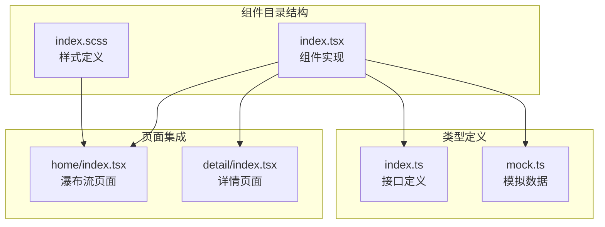
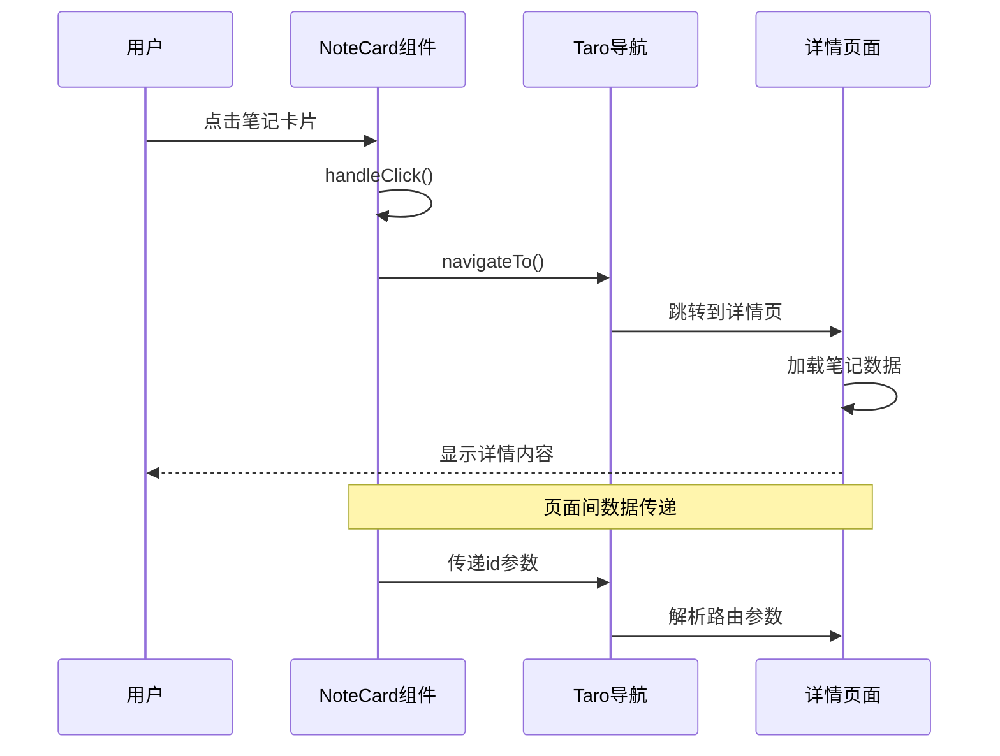
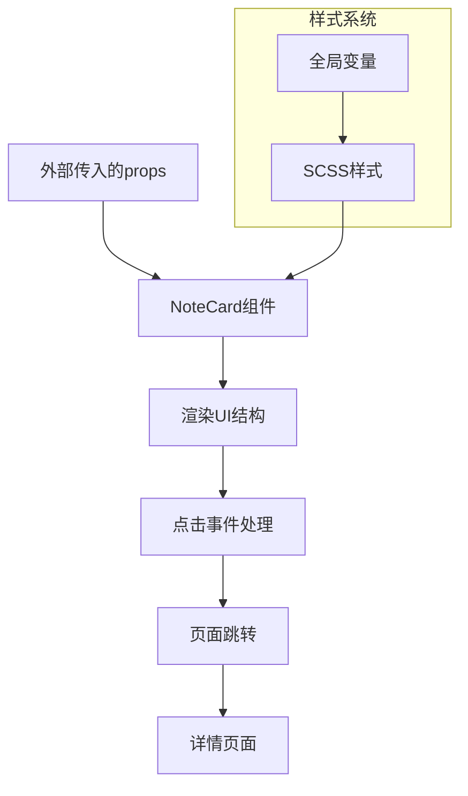
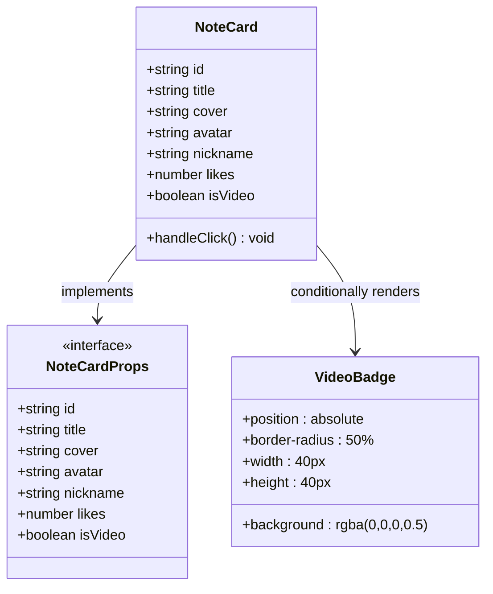
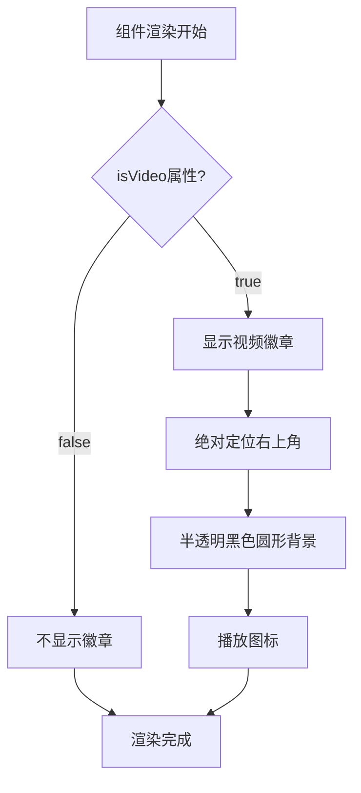
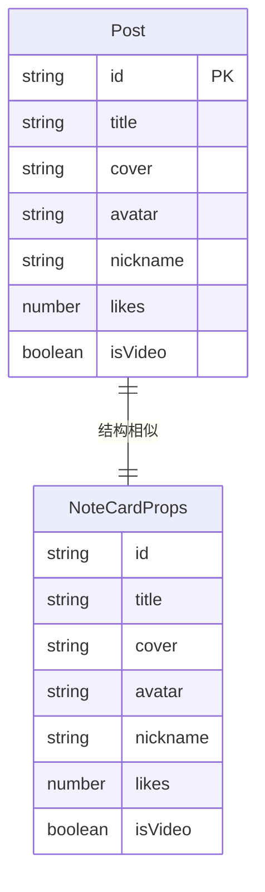
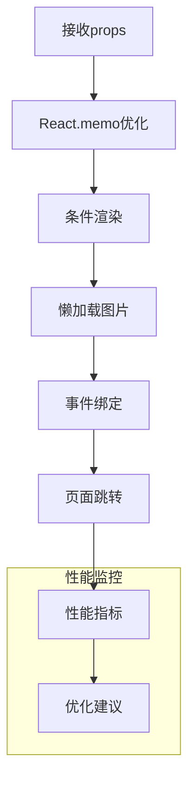
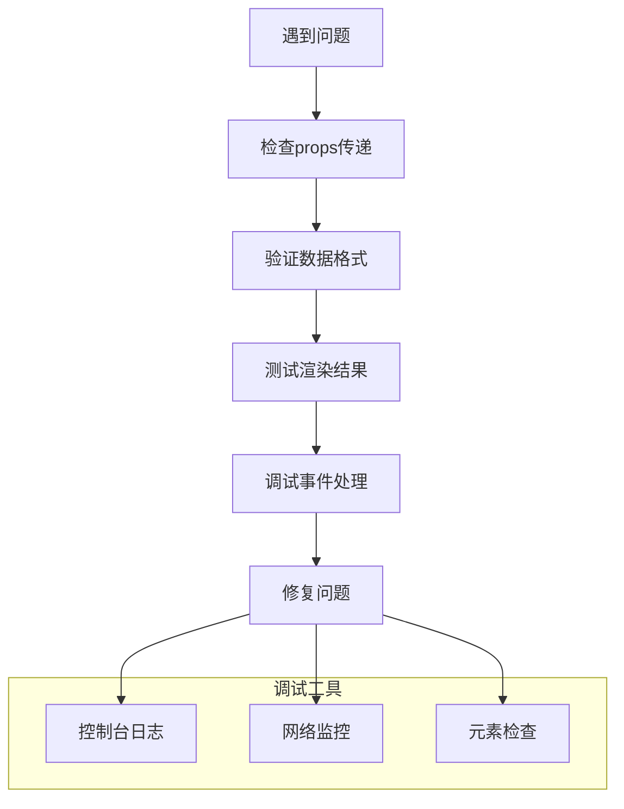

# 笔记卡片组件

<cite>
**本文档引用的文件**
- [src/components/NoteCard/index.tsx](file://src/components/NoteCard/index.tsx)
- [src/components/NoteCard/index.scss](file://src/components/NoteCard/index.scss)
- [src/pages/detail/index.tsx](file://src/pages/detail/index.tsx)
- [src/pages/home/index.tsx](file://src/pages/home/index.tsx)
- [src/types/index.ts](file://src/types/index.ts)
- [src/api/mock.ts](file://src/api/mock.ts)
- [src/styles/_variables.scss](file://src/styles/_variables.scss)
- [src/pages/home/index.module.scss](file://src/pages/home/index.module.scss)
</cite>

## 目录
1. [简介](#简介)
2. [项目结构](#项目结构)
3. [核心组件](#核心组件)
4. [架构概览](#架构概览)
5. [详细组件分析](#详细组件分析)
6. [依赖关系分析](#依赖关系分析)
7. [性能考虑](#性能考虑)
8. [故障排除指南](#故障排除指南)
9. [结论](#结论)
10. [附录](#附录)

## 简介

笔记卡片组件（NoteCard）是红书应用中的核心展示组件，用于呈现用户的笔记内容。该组件采用Taro框架开发，支持多端运行，提供了完整的笔记展示功能，包括封面图片、标题、作者信息、点赞数以及视频标识等功能特性。

组件设计遵循响应式布局原则，支持移动端和小程序端的自适应显示。通过TypeScript接口定义确保了类型安全，配合SCSS样式系统实现了良好的视觉效果和用户体验。

## 项目结构

笔记卡片组件位于组件目录下，采用标准的Taro组件结构：



**图表来源**
- [src/components/NoteCard/index.tsx:1-53](file://src/components/NoteCard/index.tsx#L1-L53)
- [src/components/NoteCard/index.scss:1-105](file://src/components/NoteCard/index.scss#L1-L105)

**章节来源**
- [src/components/NoteCard/index.tsx:1-53](file://src/components/NoteCard/index.tsx#L1-L53)
- [src/components/NoteCard/index.scss:1-105](file://src/components/NoteCard/index.scss#L1-L105)

## 核心组件

### 组件接口定义

NoteCard组件通过TypeScript接口定义了完整的props接口，确保了类型安全和开发体验：

| 属性名 | 类型 | 必需 | 默认值 | 描述 |
|--------|------|------|--------|------|
| id | string | 是 | - | 笔记唯一标识符 |
| title | string | 是 | - | 笔记标题内容 |
| cover | string | 是 | - | 封面图片URL地址 |
| avatar | string | 是 | - | 作者头像URL地址 |
| nickname | string | 是 | - | 作者昵称 |
| likes | number | 是 | - | 点赞数量 |
| isVideo | boolean | 否 | undefined | 是否为视频笔记标识 |

### 核心功能特性

组件实现了以下核心功能：
- **点击交互**：通过Taro.navigateTo实现页面跳转
- **条件渲染**：根据isVideo属性动态显示视频标识
- **懒加载优化**：图片懒加载提升性能
- **文本省略**：标题支持两行省略显示

**章节来源**
- [src/components/NoteCard/index.tsx:5-13](file://src/components/NoteCard/index.tsx#L5-L13)
- [src/types/index.ts:1-18](file://src/types/index.ts#L1-L18)

## 架构概览

笔记卡片组件在整个应用架构中扮演着重要的角色，连接了数据层、UI层和导航层：



**图表来源**
- [src/components/NoteCard/index.tsx:16-20](file://src/components/NoteCard/index.tsx#L16-L20)
- [src/pages/detail/index.tsx:23-40](file://src/pages/detail/index.tsx#L23-L40)

### 数据流向

组件的数据流向清晰明确，从props接收数据到UI渲染再到用户交互：



**图表来源**
- [src/components/NoteCard/index.tsx:15-52](file://src/components/NoteCard/index.tsx#L15-L52)
- [src/components/NoteCard/index.scss:1-105](file://src/components/NoteCard/index.scss#L1-L105)

## 详细组件分析

### 组件结构分析

NoteCard组件采用了简洁而高效的结构设计：



**图表来源**
- [src/components/NoteCard/index.tsx:5-13](file://src/components/NoteCard/index.tsx#L5-L13)
- [src/components/NoteCard/index.tsx:31-35](file://src/components/NoteCard/index.tsx#L31-L35)

### 布局结构详解

组件的布局结构清晰分层，每个部分都有明确的功能定位：

#### 封面区域
- **容器**：`.cover-wrapper` 提供相对定位上下文
- **图片**：`.cover` 使用widthFix模式保持宽高比
- **懒加载**：lazyLoad属性优化性能
- **视频标识**：绝对定位的圆形徽章

#### 内容区域  
- **标题**：`.title` 支持两行省略显示
- **底部栏**：`.footer` 包含作者信息和点赞区
- **作者信息**：头像+昵称组合
- **点赞区**：爱心图标+数字显示

### 视频标识条件渲染

视频标识的条件渲染逻辑简洁高效：



**图表来源**
- [src/components/NoteCard/index.tsx:31-35](file://src/components/NoteCard/index.tsx#L31-L35)

### 样式系统分析

组件采用SCSS预处理器，结合全局变量实现统一的主题管理：

#### 主题变量系统
- `$primary-color`: 主色调 #07C160
- `$text-color`: 主要文字颜色 #333333  
- `$text-light`: 次要文字颜色 #999999
- `$white`: 白色背景 #ffffff

#### 响应式设计
- 移动端优先的断点设计
- 弹性布局适配不同屏幕尺寸
- 图片宽高比保持的模式选择

**章节来源**
- [src/components/NoteCard/index.scss:1-105](file://src/components/NoteCard/index.scss#L1-L105)
- [src/styles/_variables.scss:1-9](file://src/styles/_variables.scss#L1-L9)

## 依赖关系分析

### 组件依赖图

```mermaid
graph TB
subgraph "外部依赖"
Taro[Taro框架]
Components[@tarojs/components]
end
subgraph "内部模块"
Types[类型定义]
Mock[模拟数据]
Styles[样式系统]
end
subgraph "NoteCard组件"
Card[index.tsx]
Styles[index.scss]
end
subgraph "使用场景"
Home[首页瀑布流]
Detail[详情页面]
end
Taro --> Card
Components --> Card
Types --> Card
Mock --> Home
Styles --> Card
Card --> Home
Card --> Detail
```

**图表来源**
- [src/components/NoteCard/index.tsx:1-3](file://src/components/NoteCard/index.tsx#L1-L3)
- [src/pages/home/index.tsx:28-68](file://src/pages/home/index.tsx#L28-L68)

### 类型依赖关系

组件与类型系统的依赖关系确保了数据的一致性和完整性：



**图表来源**
- [src/types/index.ts:1-18](file://src/types/index.ts#L1-L18)
- [src/components/NoteCard/index.tsx:5-13](file://src/components/NoteCard/index.tsx#L5-L13)

**章节来源**
- [src/components/NoteCard/index.tsx:1-53](file://src/components/NoteCard/index.tsx#L1-L53)
- [src/types/index.ts:1-18](file://src/types/index.ts#L1-L18)

## 性能考虑

### 图片懒加载优化

组件实现了智能的图片加载策略：

- **懒加载机制**：使用lazyLoad属性延迟加载非首屏图片
- **宽高比保持**：widthFix模式确保图片按比例显示
- **内存优化**：避免一次性加载大量图片造成内存压力

### 渲染性能优化



### 内存管理

- **事件清理**：组件卸载时自动清理事件监听器
- **状态管理**：最小化不必要的状态更新
- **资源释放**：及时释放图片资源

## 故障排除指南

### 常见问题及解决方案

#### 图片加载失败
**问题描述**：封面或头像图片无法正常显示
**解决方案**：
- 检查图片URL的有效性
- 添加默认占位图处理
- 实现图片加载错误回调

#### 点击无响应
**问题描述**：点击卡片无任何反应
**解决方案**：
- 确认handleClick函数正确绑定
- 检查onClick事件是否被其他元素覆盖
- 验证Taro.navigateTo配置

#### 视频标识不显示
**问题描述**：isVideo为true时徽章仍不显示
**解决方案**：
- 确认isVideo属性正确传递
- 检查SCSS样式是否正确编译
- 验证z-index层级设置

### 调试技巧



**章节来源**
- [src/components/NoteCard/index.tsx:16-20](file://src/components/NoteCard/index.tsx#L16-L20)

## 结论

笔记卡片组件是一个设计精良、功能完备的UI组件，具有以下特点：

### 设计优势
- **类型安全**：完整的TypeScript接口定义
- **性能优化**：懒加载和条件渲染策略
- **响应式设计**：适配多种设备和屏幕尺寸
- **可维护性**：清晰的代码结构和模块化设计

### 技术亮点
- **组件复用**：可在多个页面中重复使用
- **主题适配**：支持全局样式变量定制
- **交互友好**：流畅的点击反馈和页面跳转
- **扩展性强**：易于添加新功能和样式变体

该组件为红书应用提供了稳定可靠的笔记展示基础，是整个应用UI系统的重要组成部分。

## 附录

### 使用示例

#### 基础使用
```typescript
// 在页面中使用NoteCard组件
<NoteCard 
  id="123"
  title="示例笔记标题"
  cover="https://example.com/image.jpg"
  avatar="https://example.com/avatar.jpg"
  nickname="用户名"
  likes={123}
  isVideo={true}
/>
```

#### 最佳实践
- **数据验证**：确保所有必需属性都正确传递
- **错误处理**：为图片加载失败提供降级方案
- **性能监控**：定期检查组件的渲染性能
- **样式定制**：通过CSS变量实现主题定制

### 样式定制指南

组件支持通过以下方式定制样式：
- 全局SCSS变量修改主题色彩
- 组件内联样式覆盖特定样式
- CSS类名扩展实现复杂布局