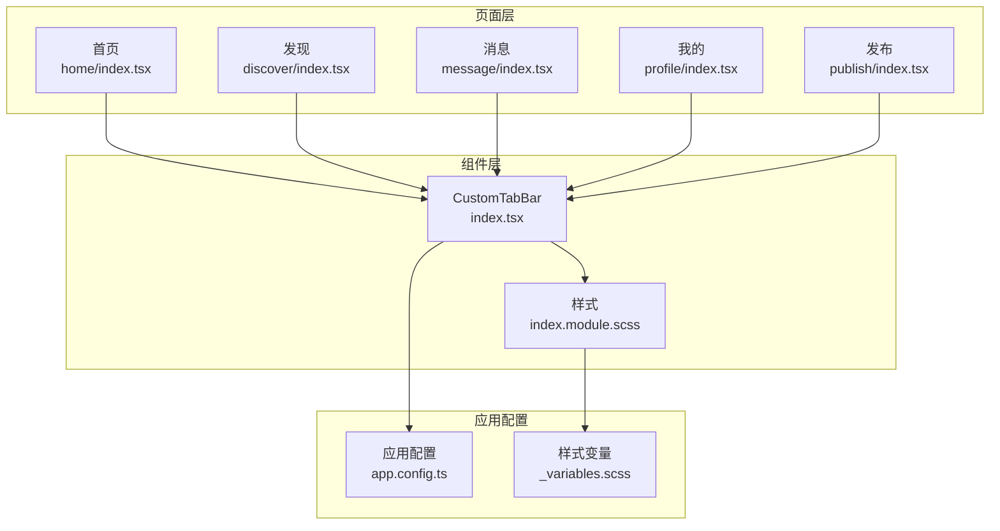
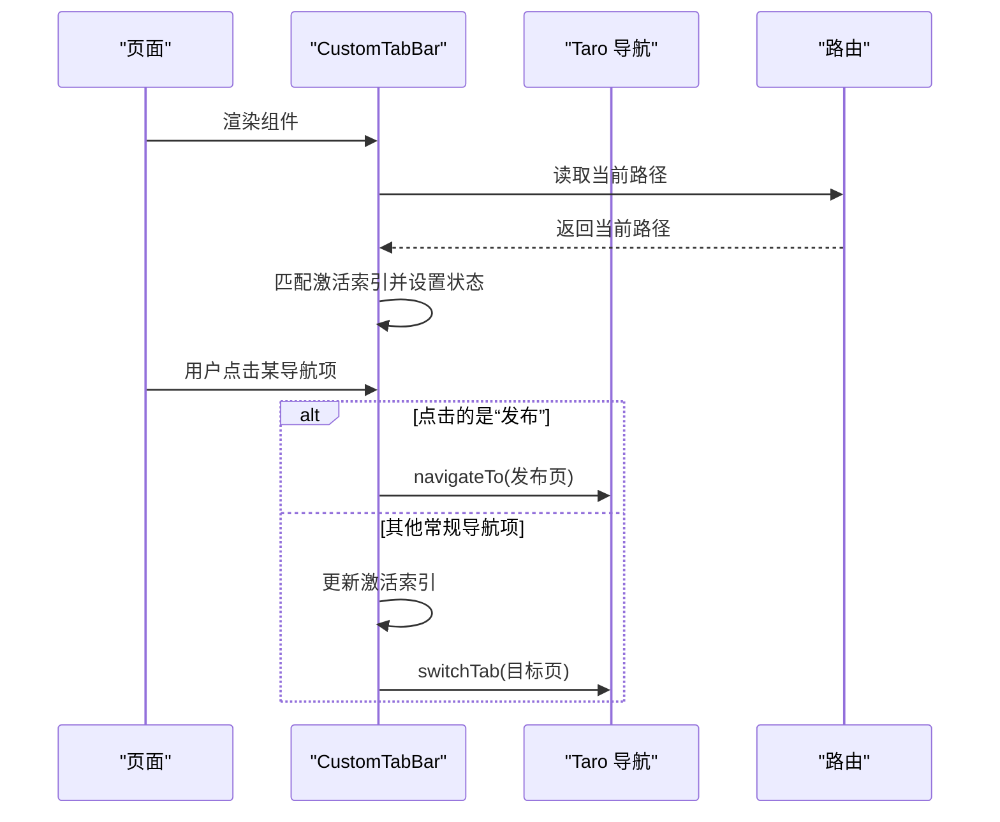
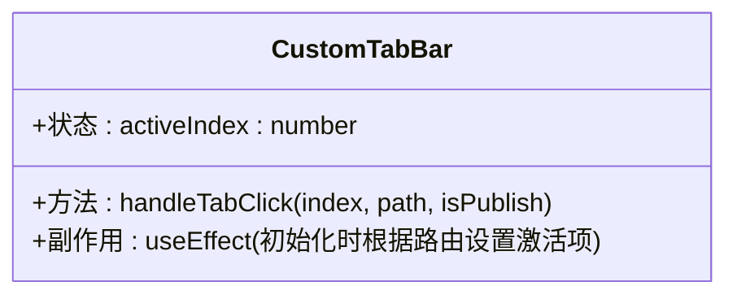
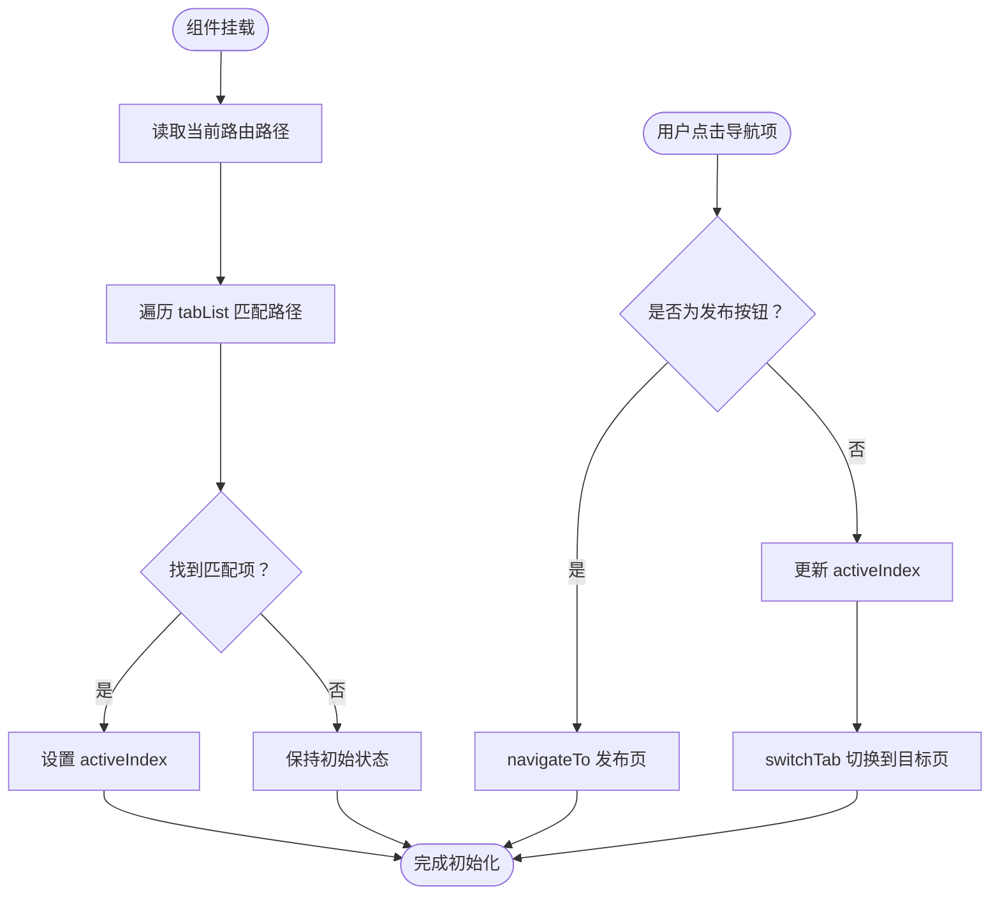
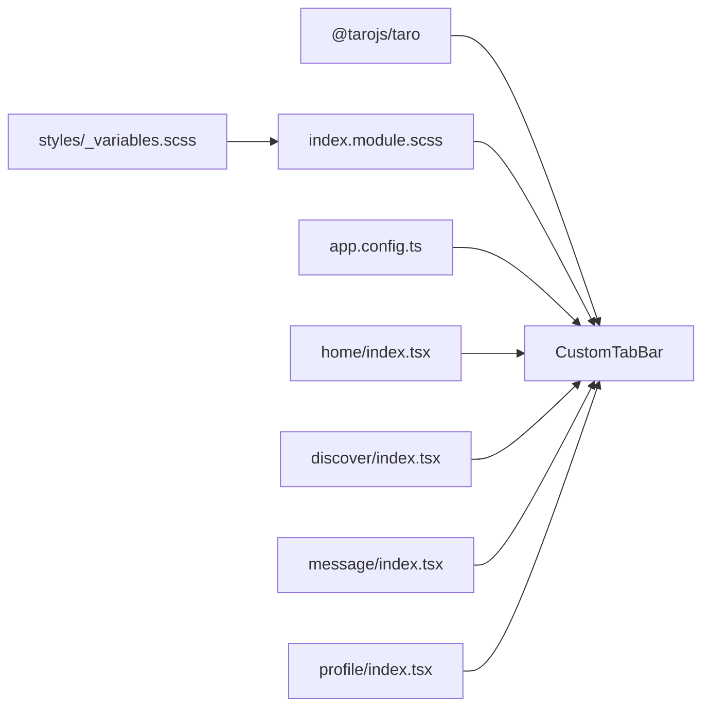

# 自定义标签栏组件

<cite>
**本文引用的文件**
- [src/components/CustomTabBar/index.tsx](file://src/components/CustomTabBar/index.tsx)
- [src/components/CustomTabBar/index.module.scss](file://src/components/CustomTabBar/index.module.scss)
- [src/app.config.ts](file://src/app.config.ts)
- [src/styles/_variables.scss](file://src/styles/_variables.scss)
- [src/pages/home/index.tsx](file://src/pages/home/index.tsx)
- [src/pages/discover/index.tsx](file://src/pages/discover/index.tsx)
- [src/pages/message/index.tsx](file://src/pages/message/index.tsx)
- [src/pages/profile/index.tsx](file://src/pages/profile/index.tsx)
- [src/pages/publish/index.tsx](file://src/pages/publish/index.tsx)
</cite>

## 目录
1. [简介](#简介)
2. [项目结构](#项目结构)
3. [核心组件](#核心组件)
4. [架构总览](#架构总览)
5. [详细组件分析](#详细组件分析)
6. [依赖关系分析](#依赖关系分析)
7. [性能考量](#性能考量)
8. [故障排查指南](#故障排查指南)
9. [结论](#结论)
10. [附录](#附录)

## 简介
本文件为自定义标签栏组件（CustomTabBar）的完整技术文档。该组件用于小程序端的底部导航，提供常规导航项与“发布”按钮的特殊处理，支持根据当前路由自动高亮对应导航项，并通过样式系统实现激活态颜色与图标的视觉反馈。文档将从架构、实现原理、样式系统、配置与扩展、使用场景与集成方式、移动端适配等方面进行深入说明。

## 项目结构
CustomTabBar 组件位于 components/CustomTabBar 目录下，采用 TypeScript + SCSS 的组合实现；页面侧通过在各页面底部渲染该组件完成导航集成。应用级页面清单在 app.config.ts 中统一声明，确保导航路径与页面注册一致。

图表来源
- [src/components/CustomTabBar/index.tsx:1-67](file://src/components/CustomTabBar/index.tsx#L1-L67)
- [src/components/CustomTabBar/index.module.scss:1-64](file://src/components/CustomTabBar/index.module.scss#L1-L64)
- [src/app.config.ts:1-18](file://src/app.config.ts#L1-L18)
- [src/styles/_variables.scss:1-9](file://src/styles/_variables.scss#L1-L9)
- [src/pages/home/index.tsx:147-147](file://src/pages/home/index.tsx#L147-L147)
- [src/pages/discover/index.tsx:115-115](file://src/pages/discover/index.tsx#L115-L115)
- [src/pages/message/index.tsx:113-113](file://src/pages/message/index.tsx#L113-L113)
- [src/pages/profile/index.tsx:173-173](file://src/pages/profile/index.tsx#L173-L173)
- [src/pages/publish/index.tsx:1-142](file://src/pages/publish/index.tsx#L1-L142)

章节来源
- [src/components/CustomTabBar/index.tsx:1-67](file://src/components/CustomTabBar/index.tsx#L1-L67)
- [src/components/CustomTabBar/index.module.scss:1-64](file://src/components/CustomTabBar/index.module.scss#L1-L64)
- [src/app.config.ts:1-18](file://src/app.config.ts#L1-L18)
- [src/styles/_variables.scss:1-9](file://src/styles/_variables.scss#L1-L9)
- [src/pages/home/index.tsx:147-147](file://src/pages/home/index.tsx#L147-L147)
- [src/pages/discover/index.tsx:115-115](file://src/pages/discover/index.tsx#L115-L115)
- [src/pages/message/index.tsx:113-113](file://src/pages/message/index.tsx#L113-L113)
- [src/pages/profile/index.tsx:173-173](file://src/pages/profile/index.tsx#L173-L173)
- [src/pages/publish/index.tsx:1-142](file://src/pages/publish/index.tsx#L1-L142)

## 核心组件
- 组件职责
  - 定义导航列表（含“发布”按钮），根据当前路由自动定位激活项。
  - 处理导航点击事件：常规项使用 switchTab 切换 Tab 页面；“发布”项使用 navigateTo 跳转到发布页。
  - 提供样式系统：激活态文本颜色、图标尺寸与间距、居中布局与安全区适配。
- 关键实现点
  - 导航列表常量定义与 isPublish 标记区分“发布”按钮。
  - 使用 Taro.getCurrentInstance().router.path 获取当前路由，匹配 tabList 并设置激活索引。
  - handleTabClick 根据 isPublish 决定跳转策略。
  - SCSS 使用变量与固定高度、安全区内边距、渐变按钮等样式。

章节来源
- [src/components/CustomTabBar/index.tsx:6-12](file://src/components/CustomTabBar/index.tsx#L6-L12)
- [src/components/CustomTabBar/index.tsx:17-23](file://src/components/CustomTabBar/index.tsx#L17-L23)
- [src/components/CustomTabBar/index.tsx:25-32](file://src/components/CustomTabBar/index.tsx#L25-L32)
- [src/components/CustomTabBar/index.module.scss:3-16](file://src/components/CustomTabBar/index.module.scss#L3-L16)
- [src/components/CustomTabBar/index.module.scss:47-62](file://src/components/CustomTabBar/index.module.scss#L47-L62)

## 架构总览
CustomTabBar 作为通用 UI 组件被多个页面复用，页面通过在自身 JSX 中渲染该组件完成底部导航集成。应用配置 app.config.ts 声明了所有页面路径，保证导航路径与页面注册一致。

图表来源
- [src/components/CustomTabBar/index.tsx:17-23](file://src/components/CustomTabBar/index.tsx#L17-L23)
- [src/components/CustomTabBar/index.tsx:25-32](file://src/components/CustomTabBar/index.tsx#L25-L32)
- [src/app.config.ts:2-10](file://src/app.config.ts#L2-L10)

章节来源
- [src/components/CustomTabBar/index.tsx:14-66](file://src/components/CustomTabBar/index.tsx#L14-L66)
- [src/app.config.ts:1-18](file://src/app.config.ts#L1-L18)

## 详细组件分析

### 组件类图

图表来源
- [src/components/CustomTabBar/index.tsx:14-32](file://src/components/CustomTabBar/index.tsx#L14-L32)

章节来源
- [src/components/CustomTabBar/index.tsx:14-32](file://src/components/CustomTabBar/index.tsx#L14-L32)

### 导航流程与激活状态管理
- 初始化阶段
  - 组件挂载后读取当前路由路径，遍历 tabList 查找匹配项，设置 activeIndex。
- 点击处理
  - 若 isPublish 为真：直接 navigateTo 发布页。
  - 否则：更新 activeIndex，并调用 switchTab 切换到目标 Tab 页。
- 激活态样式
  - 当前激活项的文本颜色由样式变量 primary-color 控制，图标与文字垂直居中、间距合理。

图表来源
- [src/components/CustomTabBar/index.tsx:17-23](file://src/components/CustomTabBar/index.tsx#L17-L23)
- [src/components/CustomTabBar/index.tsx:25-32](file://src/components/CustomTabBar/index.tsx#L25-L32)

章节来源
- [src/components/CustomTabBar/index.tsx:17-32](file://src/components/CustomTabBar/index.tsx#L17-L32)

### 样式系统与视觉反馈
- 布局与定位
  - 固定定位于底部，占满宽度，高度固定，顶部带分隔线，底部留出安全区内边距。
- 导航项样式
  - 垂直布局，图标字号较大，文字字号较小，激活态仅改变文字颜色。
- 发布按钮样式
  - 居中悬浮按钮，使用渐变背景与圆角，图标白色、加粗、字号与图标一致，视觉突出。

章节来源
- [src/components/CustomTabBar/index.module.scss:3-16](file://src/components/CustomTabBar/index.module.scss#L3-L16)
- [src/components/CustomTabBar/index.module.scss:32-41](file://src/components/CustomTabBar/index.module.scss#L32-L41)
- [src/components/CustomTabBar/index.module.scss:47-62](file://src/components/CustomTabBar/index.module.scss#L47-L62)
- [src/styles/_variables.scss:1-9](file://src/styles/_variables.scss#L1-L9)

### 配置选项与自定义方法
- 导航项配置
  - 在 tabList 中添加/移除对象，每个对象包含 pagePath（页面路径）、text（文字）、icon（图标）、isPublish（是否为发布按钮）。
- 样式定制
  - 可通过修改 SCSS 变量与类名覆盖实现主题色、字号、间距、按钮形状等。
- 路由与页面注册
  - 所有导航路径需在 app.config.ts 的 pages 数组中声明，确保 switchTab 与 navigateTo 正常工作。

章节来源
- [src/components/CustomTabBar/index.tsx:6-12](file://src/components/CustomTabBar/index.tsx#L6-L12)
- [src/components/CustomTabBar/index.module.scss:1-64](file://src/components/CustomTabBar/index.module.scss#L1-L64)
- [src/app.config.ts:2-10](file://src/app.config.ts#L2-L10)

### 使用场景与集成方式
- 集成方式
  - 在各页面底部 JSX 中直接渲染 <CustomTabBar /> 即可。
- 使用页面
  - 首页、发现、消息、我的页面均在页面末尾渲染该组件。
  - 发布页为独立页面，不参与底部导航，但“发布”按钮在标签栏中触发跳转。

章节来源
- [src/pages/home/index.tsx:147-147](file://src/pages/home/index.tsx#L147-L147)
- [src/pages/discover/index.tsx:115-115](file://src/pages/discover/index.tsx#L115-L115)
- [src/pages/message/index.tsx:113-113](file://src/pages/message/index.tsx#L113-L113)
- [src/pages/profile/index.tsx:173-173](file://src/pages/profile/index.tsx#L173-L173)
- [src/pages/publish/index.tsx:1-142](file://src/pages/publish/index.tsx#L1-L142)

### 移动端适配最佳实践
- 安全区适配
  - 底部内边距使用 env(safe-area-inset-bottom)，避免刘海屏遮挡。
- 触摸体验
  - 导航项横向等分布局，点击区域充足；发布按钮置于中央偏上，便于单手操作。
- 字体与图标
  - 图标字号较大，文字字号较小，保证在小屏设备上清晰可读。
- 主题一致性
  - 激活态使用统一主色调变量，确保品牌一致性与可访问性。

章节来源
- [src/components/CustomTabBar/index.module.scss:14-16](file://src/components/CustomTabBar/index.module.scss#L14-L16)
- [src/components/CustomTabBar/index.module.scss:32-41](file://src/components/CustomTabBar/index.module.scss#L32-L41)
- [src/styles/_variables.scss:1-9](file://src/styles/_variables.scss#L1-L9)

## 依赖关系分析
- 组件依赖
  - 依赖 Taro 导航 API（switchTab、navigateTo、getCurrentInstance）。
  - 依赖 SCSS 样式模块化与全局变量。
- 页面依赖
  - 各页面在末尾渲染 CustomTabBar，形成统一导航入口。
- 应用配置依赖
  - app.config.ts 的 pages 列表决定可切换的 Tab 页面与可跳转的页面路径。

图表来源
- [src/components/CustomTabBar/index.tsx:1-4](file://src/components/CustomTabBar/index.tsx#L1-L4)
- [src/components/CustomTabBar/index.module.scss:1-1](file://src/components/CustomTabBar/index.module.scss#L1-L1)
- [src/styles/_variables.scss:1-9](file://src/styles/_variables.scss#L1-L9)
- [src/app.config.ts:1-18](file://src/app.config.ts#L1-L18)
- [src/pages/home/index.tsx:147-147](file://src/pages/home/index.tsx#L147-L147)
- [src/pages/discover/index.tsx:115-115](file://src/pages/discover/index.tsx#L115-L115)
- [src/pages/message/index.tsx:113-113](file://src/pages/message/index.tsx#L113-L113)
- [src/pages/profile/index.tsx:173-173](file://src/pages/profile/index.tsx#L173-L173)

章节来源
- [src/components/CustomTabBar/index.tsx:1-4](file://src/components/CustomTabBar/index.tsx#L1-L4)
- [src/app.config.ts:1-18](file://src/app.config.ts#L1-L18)

## 性能考量
- 渲染优化
  - 导航列表为静态数组，渲染开销极低；激活态仅通过类名切换，无复杂计算。
- 路由匹配
  - 初始化时一次性匹配当前路径，后续点击事件仅更新状态或发起跳转，避免重复计算。
- 样式优化
  - 使用固定高度与绝对定位减少布局抖动；SCSS 变量集中管理，便于缓存与复用。

## 故障排查指南
- 激活态不生效
  - 检查当前路由路径是否与 tabList 中的 pagePath 完全一致；确认 app.config.ts 的页面注册。
- 点击无响应
  - 确认 isPublish 标记与跳转逻辑；检查 Taro 版本与 API 支持情况。
- 发布按钮样式异常
  - 检查 SCSS 变量与类名拼接；确认渐变与圆角属性未被覆盖。
- 安全区遮挡
  - 确认底部内边距使用了 env(safe-area-inset-bottom)；在不同机型上验证。

章节来源
- [src/components/CustomTabBar/index.tsx:17-23](file://src/components/CustomTabBar/index.tsx#L17-L23)
- [src/components/CustomTabBar/index.tsx:25-32](file://src/components/CustomTabBar/index.tsx#L25-L32)
- [src/components/CustomTabBar/index.module.scss:14-16](file://src/components/CustomTabBar/index.module.scss#L14-L16)
- [src/app.config.ts:2-10](file://src/app.config.ts#L2-L10)

## 结论
CustomTabBar 通过简洁的数据驱动与明确的交互策略，实现了稳定可靠的底部导航体验。其激活态管理、发布按钮的特殊处理、以及移动端安全区适配均体现了良好的工程实践。通过统一的配置与样式体系，开发者可以快速扩展新的导航项或调整视觉风格，满足多页面的一致性需求。

## 附录
- 配置清单
  - 导航项：pagePath、text、icon、isPublish
  - 样式变量：primary-color、text-light、white、tabbar-height
  - 页面注册：app.config.ts 的 pages 列表
- 扩展建议
  - 动态路由参数：在匹配时考虑查询参数或动态段。
  - 多语言支持：将 text 字段替换为国际化键值。
  - 图标库：引入图标字体或 SVG 组件，统一图标风格。

章节来源
- [src/components/CustomTabBar/index.tsx:6-12](file://src/components/CustomTabBar/index.tsx#L6-L12)
- [src/components/CustomTabBar/index.module.scss:1-9](file://src/components/CustomTabBar/index.module.scss#L1-L9)
- [src/app.config.ts:2-10](file://src/app.config.ts#L2-L10)