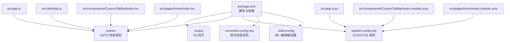
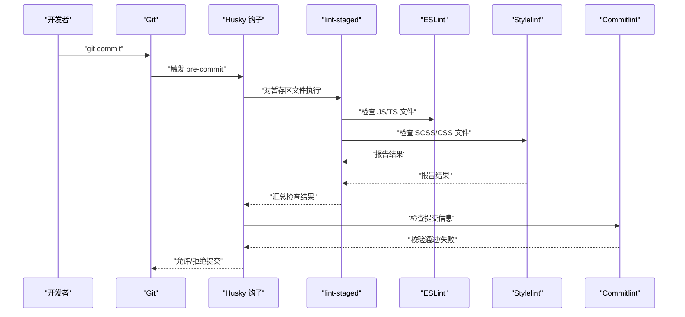
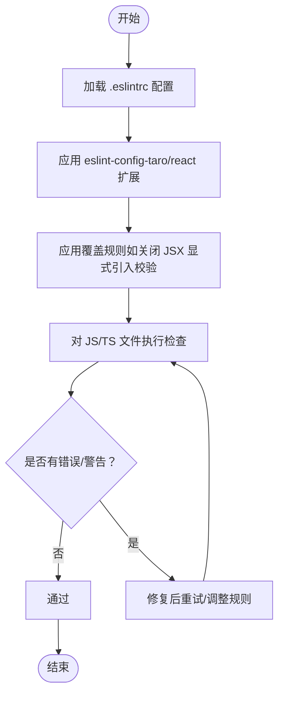
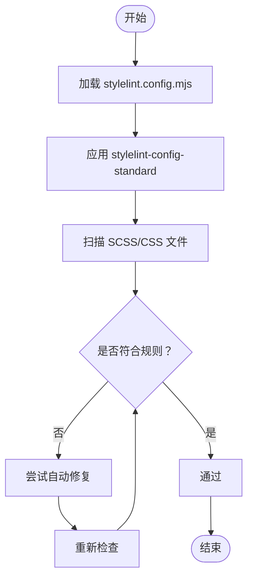
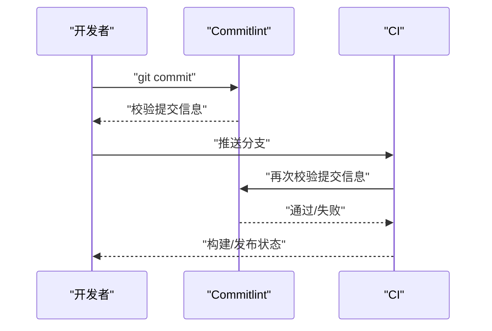
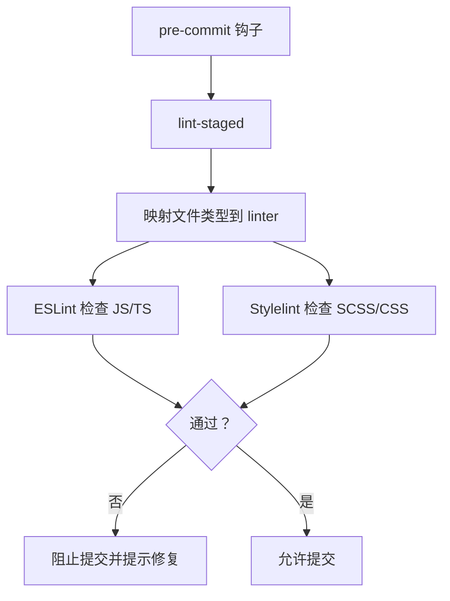
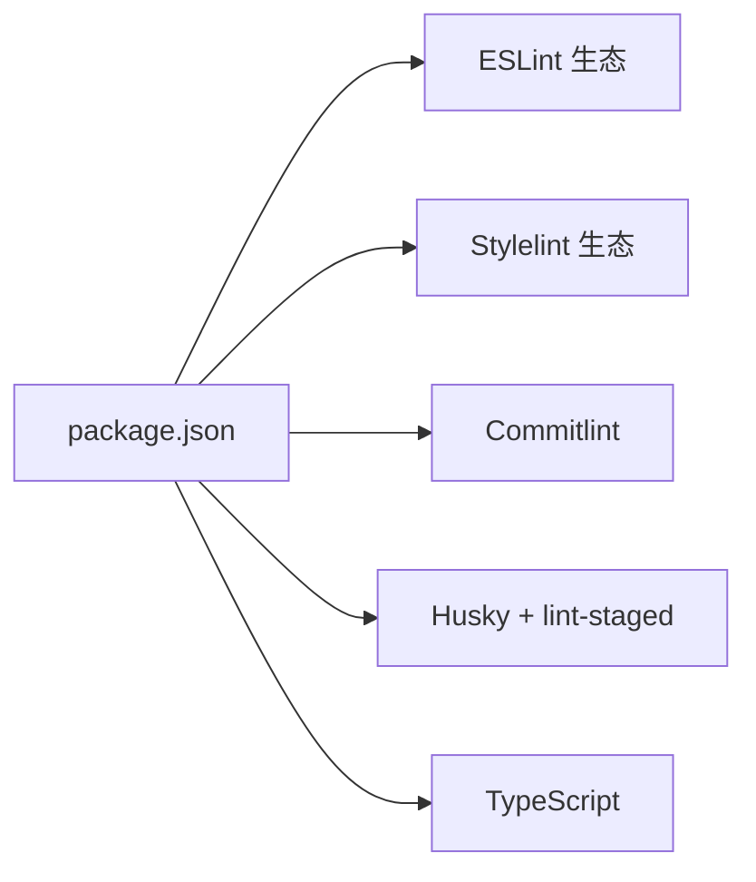

# 代码质量规范

<cite>
**本文引用的文件**
- [.eslintrc](file://.eslintrc)
- [stylelint.config.mjs](file://stylelint.config.mjs)
- [commitlint.config.mjs](file://commitlint.config.mjs)
- [.editorconfig](file://.editorconfig)
- [package.json](file://package.json)
- [tsconfig.json](file://tsconfig.json)
- [src/app.ts](file://src/app.ts)
- [src/utils/http.ts](file://src/utils/http.ts)
- [src/components/CustomTabBar/index.tsx](file://src/components/CustomTabBar/index.tsx)
- [src/pages/home/index.tsx](file://src/pages/home/index.tsx)
- [src/types/index.ts](file://src/types/index.ts)
- [src/app.scss](file://src/app.scss)
- [src/components/CustomTabBar/index.module.scss](file://src/components/CustomTabBar/index.module.scss)
- [src/pages/home/index.module.scss](file://src/pages/home/index.module.scss)
</cite>

## 目录
1. 引言
2. 项目结构
3. 核心组件
4. 架构总览
5. 详细组件分析
6. 依赖分析
7. 性能考虑
8. 故障排查指南
9. 结论
10. 附录

## 引言
本文件为红书项目的代码质量规范文档，聚焦于以下方面：
- ESLint JavaScript/TypeScript 代码规范配置与使用
- Stylelint SCSS/CSS 规范配置与使用
- Commitlint 提交信息规范与自动化检查流程
- Husky Git 钩子（含 pre-commit、pre-push）配置与使用
- EditorConfig 统一开发环境配置
- 代码审查标准与最佳实践

目标是帮助团队在不同 IDE 和 CI 场景下保持一致的代码风格与质量。

## 项目结构
红书项目采用 Taro 多端框架，前端以 React + TypeScript 为主，样式采用 Sass（SCSS），并辅以模块化样式（CSS Modules）。质量工具通过 npm scripts 与 Husky 集成，配合 lint-staged 实现提交前增量检查。

图示来源
- [package.json:12-33](file://package.json#L12-L33)
- [.eslintrc:1-8](file://.eslintrc#L1-L8)
- [stylelint.config.mjs:1-5](file://stylelint.config.mjs#L1-L5)
- [commitlint.config.mjs:1-2](file://commitlint.config.mjs#L1-L2)
- [.editorconfig:1-13](file://.editorconfig#L1-L13)

章节来源
- [package.json:12-33](file://package.json#L12-L33)
- [.eslintrc:1-8](file://.eslintrc#L1-L8)
- [stylelint.config.mjs:1-5](file://stylelint.config.mjs#L1-L5)
- [commitlint.config.mjs:1-2](file://commitlint.config.mjs#L1-L2)
- [.editorconfig:1-13](file://.editorconfig#L1-L13)

## 核心组件
- ESLint：基于 eslint-config-taro/react 的扩展，关闭 React 在 JSX 中显式引入的校验，避免与 Taro JSX 运行时冲突；可按需新增规则或覆盖默认规则。
- Stylelint：基于 stylelint-config-standard，适用于 SCSS/CSS；可结合项目命名约定进行扩展。
- Commitlint：基于 @commitlint/config-conventional，遵循 Conventional Commits 规范，便于自动生成变更日志与版本发布。
- Husky：通过 npm prepare 安装钩子，结合 lint-staged 对暂存区文件执行增量检查。
- EditorConfig：统一缩进、字符集、换行等基础编辑器行为，保证跨 IDE 一致性。

章节来源
- [.eslintrc:1-8](file://.eslintrc#L1-L8)
- [stylelint.config.mjs:1-5](file://stylelint.config.mjs#L1-L5)
- [commitlint.config.mjs:1-2](file://commitlint.config.mjs#L1-L2)
- [package.json:12-13](file://package.json#L12-L13)
- [.editorconfig:1-13](file://.editorconfig#L1-L13)

## 架构总览
下图展示从开发者本地提交到 CI 的质量控制链路，强调 Husky + lint-staged + 各类 linter 的协作关系。

图示来源
- [package.json:12-13](file://package.json#L12-L13)
- [.eslintrc:1-8](file://.eslintrc#L1-L8)
- [stylelint.config.mjs:1-5](file://stylelint.config.mjs#L1-L5)
- [commitlint.config.mjs:1-2](file://commitlint.config.mjs#L1-L2)

## 详细组件分析

### ESLint：JavaScript/TypeScript 代码规范
- 扩展来源：eslint-config-taro/react，适配 Taro + React 工程。
- 关键规则：
  - 关闭 React 在 JSX 中显式引入的校验，避免与 Taro JSX 运行时产生冲突。
  - 可根据团队需要新增规则，例如禁用 console.warn/console.error、强制使用类型断言的明确性等。
- 推荐实践：
  - 在本地 IDE 安装 ESLint 插件，启用保存时自动修复。
  - 在 CI 中执行全量检查，确保线上分支无 ESLint 问题。
  - 使用 TypeScript 严格模式（已在 tsconfig 中开启），减少潜在运行时错误。

图示来源
- [.eslintrc:1-8](file://.eslintrc#L1-L8)

章节来源
- [.eslintrc:1-8](file://.eslintrc#L1-L8)
- [tsconfig.json:1-31](file://tsconfig.json#L1-L31)

### Stylelint：SCSS/CSS 规范
- 扩展来源：stylelint-config-standard，提供基础 CSS/SCSS 规则。
- 建议补充：
  - 命名约定：建议统一为 BEM 或项目内约定的命名体系，并在 CI 中通过规则强制。
  - 禁止规则：禁止使用不安全选择器（如 universal selector）、禁止未知规则等。
  - 自动修复：优先启用可自动修复的规则，减少人工干预。
- 与模块化样式（CSS Modules）协同：
  - 组件级样式使用 .module.scss，类名作用域隔离；全局样式放入 app.scss。
  - 建议在 CI 中对所有 .scss/.css 文件执行检查。

图示来源
- [stylelint.config.mjs:1-5](file://stylelint.config.mjs#L1-L5)

章节来源
- [stylelint.config.mjs:1-5](file://stylelint.config.mjs#L1-L5)
- [src/app.scss:1-59](file://src/app.scss#L1-L59)
- [src/components/CustomTabBar/index.module.scss:1-64](file://src/components/CustomTabBar/index.module.scss#L1-L64)
- [src/pages/home/index.module.scss:1-167](file://src/pages/home/index.module.scss#L1-L167)

### Commitlint：提交信息规范
- 扩展来源：@commitlint/config-conventional，遵循 Conventional Commits。
- 建议：
  - 在 CI 中对 PR/MR 的提交信息进行校验，确保可读性与自动化能力。
  - 团队可在本地安装 commitlint CLI 并在 pre-commit 阶段执行，降低错误提交概率。
  - 若项目需要更严格的语义化版本控制，可在 CI 中生成 CHANGELOG。

图示来源
- [commitlint.config.mjs:1-2](file://commitlint.config.mjs#L1-L2)

章节来源
- [commitlint.config.mjs:1-2](file://commitlint.config.mjs#L1-L2)

### Husky：Git 钩子与 lint-staged
- 安装方式：通过 npm prepare 脚本安装钩子。
- 建议配置：
  - pre-commit：执行 lint-staged，对暂存区文件分别调用 ESLint 与 Stylelint。
  - pre-push：可选执行全量检查或快速检查，确保推送前质量。
  - 钩子脚本放置于 .husky/ 目录下，注意权限与可执行位。
- 注意事项：
  - lint-staged 需要正确映射文件类型到对应 linter。
  - 如需在 CI 中复用相同规则，建议将规则集中管理并在 CI 中执行。

图示来源
- [package.json:12-13](file://package.json#L12-L13)

章节来源
- [package.json:12-13](file://package.json#L12-L13)

### EditorConfig：统一开发环境
- 统一项：
  - 缩进：空格，大小 2
  - 字符集：UTF-8
  - 末尾空白：移除
  - 文件末尾：插入换行
- 特殊规则：对 .md 文件关闭末尾空白自动移除，避免影响 Markdown 渲染。

章节来源
- [.editorconfig:1-13](file://.editorconfig#L1-L13)

### 代码审查标准与最佳实践
- 代码风格
  - 遵循 ESLint 与 Stylelint 规则，必要时在 PR 中补充规则说明。
  - 类型安全：优先使用 TypeScript，开启严格模式与未使用变量/参数检查。
- 命名与组织
  - 组件命名采用帕斯卡命名法；模块化样式类名采用语义化且作用域隔离。
  - 全局样式与组件样式分离，避免全局污染。
- 提交流程
  - 提交信息遵循 Conventional Commits，确保可追溯与自动化。
  - 在本地执行预检，减少 CI 失败率。
- 可维护性
  - 将重复逻辑抽象为工具函数或自定义 Hooks，保持组件简洁。
  - 对外部依赖（如 Taro API）进行封装，便于替换与测试。

章节来源
- [tsconfig.json:1-31](file://tsconfig.json#L1-L31)
- [src/app.ts:1-14](file://src/app.ts#L1-L14)
- [src/utils/http.ts:1-165](file://src/utils/http.ts#L1-L165)
- [src/components/CustomTabBar/index.tsx:1-67](file://src/components/CustomTabBar/index.tsx#L1-L67)
- [src/pages/home/index.tsx:1-151](file://src/pages/home/index.tsx#L1-L151)
- [src/types/index.ts:1-147](file://src/types/index.ts#L1-L147)

## 依赖分析
- 开发依赖概览（节选）
  - ESLint 生态：eslint、eslint-config-taro、eslint-plugin-react、eslint-plugin-react-hooks
  - Stylelint 生态：stylelint、stylelint-config-standard
  - 提交规范：@commitlint/cli、@commitlint/config-conventional
  - Git 钩子：husky、lint-staged
  - TypeScript：typescript
- 与工程的关系
  - ESLint 与 Stylelint 作为 npm scripts 的前置条件，由 Husky 在 pre-commit 阶段触发。
  - Commitlint 与 Husky 协作，保障提交信息质量。

图示来源
- [package.json:51-91](file://package.json#L51-L91)

章节来源
- [package.json:51-91](file://package.json#L51-L91)

## 性能考虑
- 增量检查：通过 lint-staged 仅对暂存区文件执行检查，缩短本地与 CI 时间。
- 规则粒度：避免过于宽泛的规则导致大量误报，优先启用可自动修复的规则。
- 缓存与并行：在 CI 中合理利用缓存与并行任务，减少重复工作。

## 故障排查指南
- ESLint 报错
  - 确认 .eslintrc 是否正确加载扩展与覆盖规则。
  - 在 IDE 中同步 ESLint 配置，避免本地与 CI 差异。
- Stylelint 报错
  - 检查 stylelint.config.mjs 是否正确应用标准规则。
  - 对于 CSS Modules 类名冲突，确认作用域写法与命名约定。
- Commitlint 失败
  - 检查提交信息是否符合 Conventional Commits 规范。
  - 在本地安装 CLI 并执行校验，定位具体问题。
- Husky 钩子无效
  - 确认 npm prepare 是否成功安装钩子。
  - 检查 .husky 目录权限与可执行位，确保 shell 脚本可执行。

章节来源
- [.eslintrc:1-8](file://.eslintrc#L1-L8)
- [stylelint.config.mjs:1-5](file://stylelint.config.mjs#L1-L5)
- [commitlint.config.mjs:1-2](file://commitlint.config.mjs#L1-L2)
- [package.json:12-13](file://package.json#L12-L13)

## 结论
通过 ESLint、Stylelint、Commitlint、Husky 与 EditorConfig 的组合，红书项目实现了从本地到 CI 的全流程质量保障。建议团队在现有基础上进一步完善规则与文档，持续优化开发体验与代码可维护性。

## 附录
- 示例文件路径（用于对照规则与最佳实践）
  - 应用入口与全局样式：[src/app.ts:1-14](file://src/app.ts#L1-L14)，[src/app.scss:1-59](file://src/app.scss#L1-L59)
  - 工具函数与类型定义：[src/utils/http.ts:1-165](file://src/utils/http.ts#L1-L165)，[src/types/index.ts:1-147](file://src/types/index.ts#L1-L147)
  - 组件与模块化样式：[src/components/CustomTabBar/index.tsx:1-67](file://src/components/CustomTabBar/index.tsx#L1-L67)，[src/components/CustomTabBar/index.module.scss:1-64](file://src/components/CustomTabBar/index.module.scss#L1-L64)
  - 页面与模块化样式：[src/pages/home/index.tsx:1-151](file://src/pages/home/index.tsx#L1-L151)，[src/pages/home/index.module.scss:1-167](file://src/pages/home/index.module.scss#L1-L167)