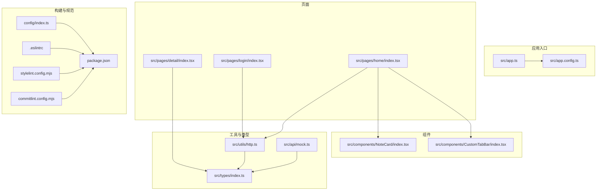
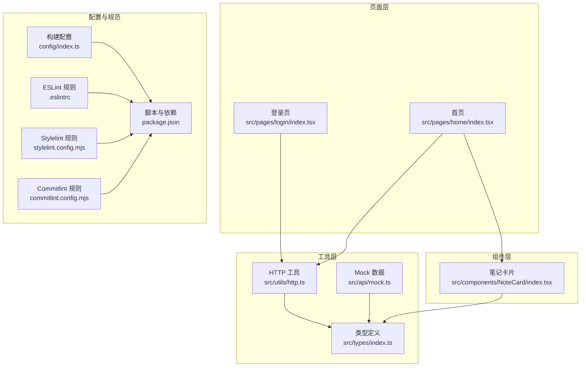
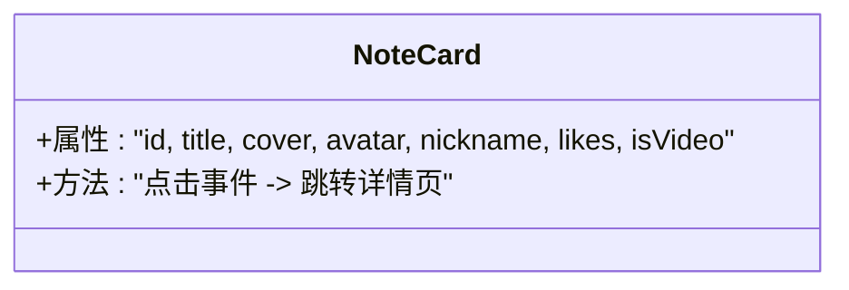
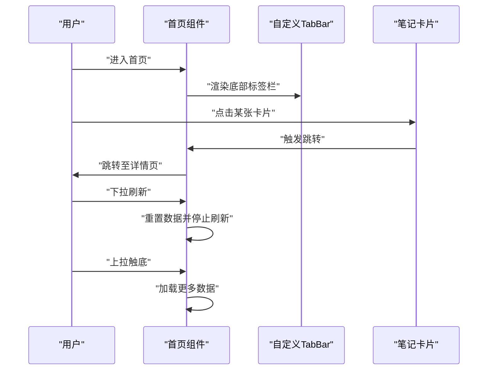
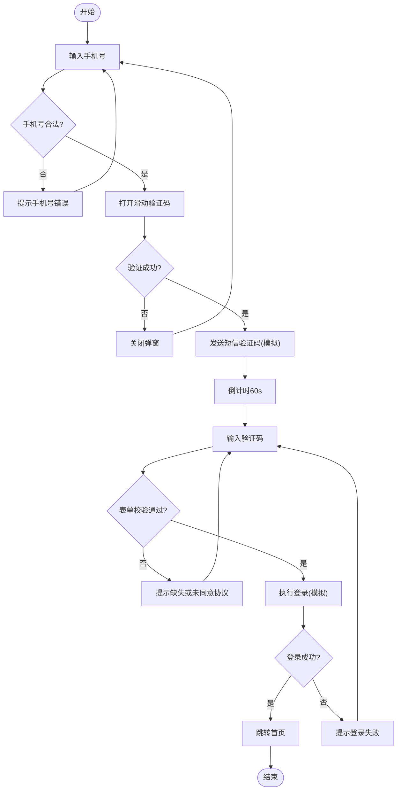
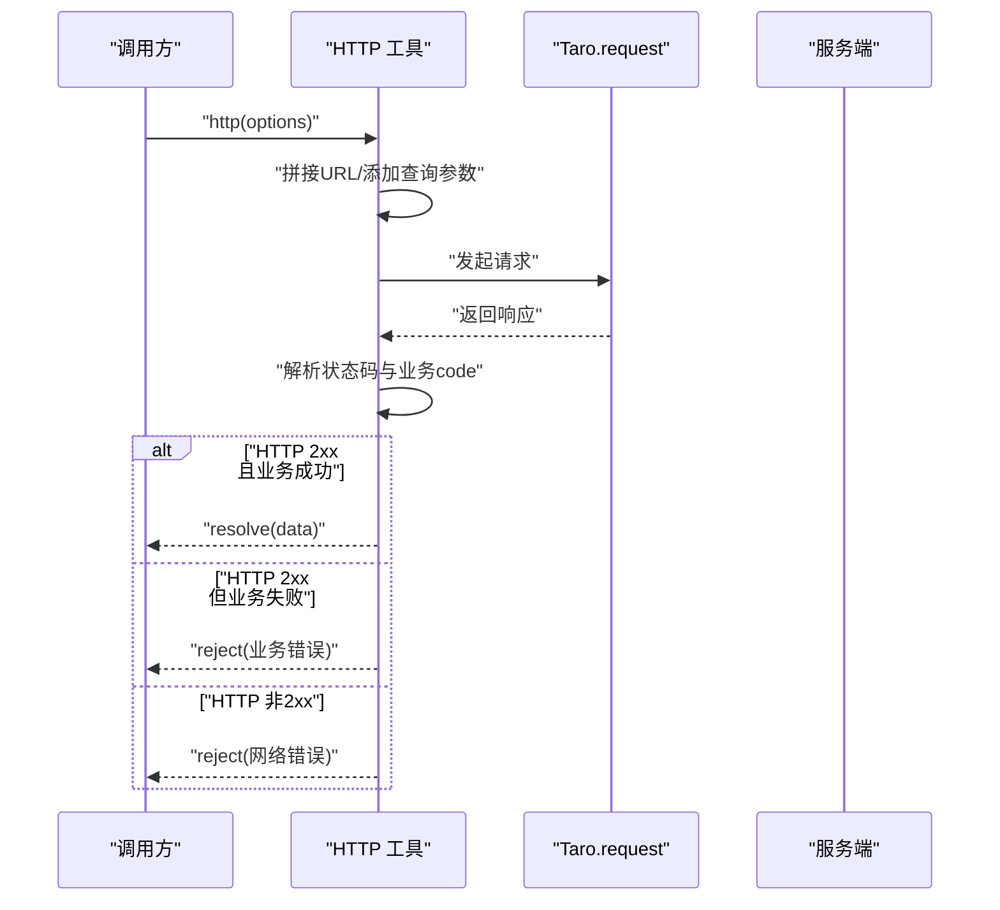
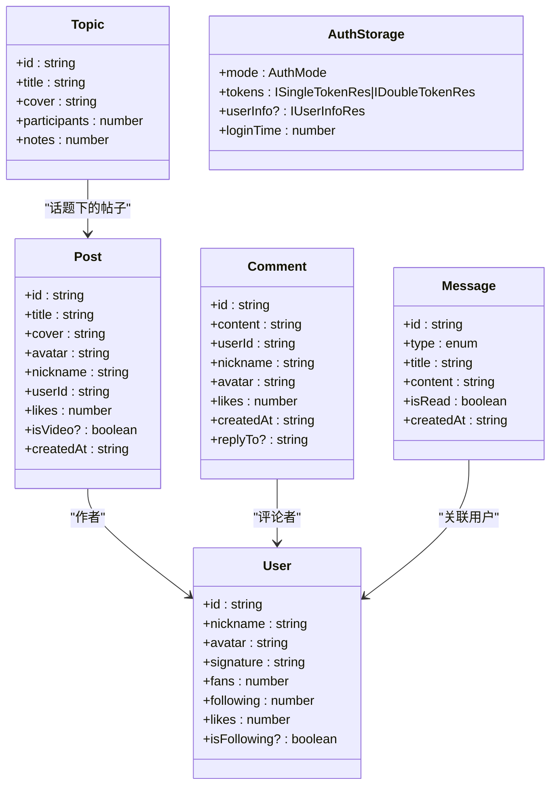
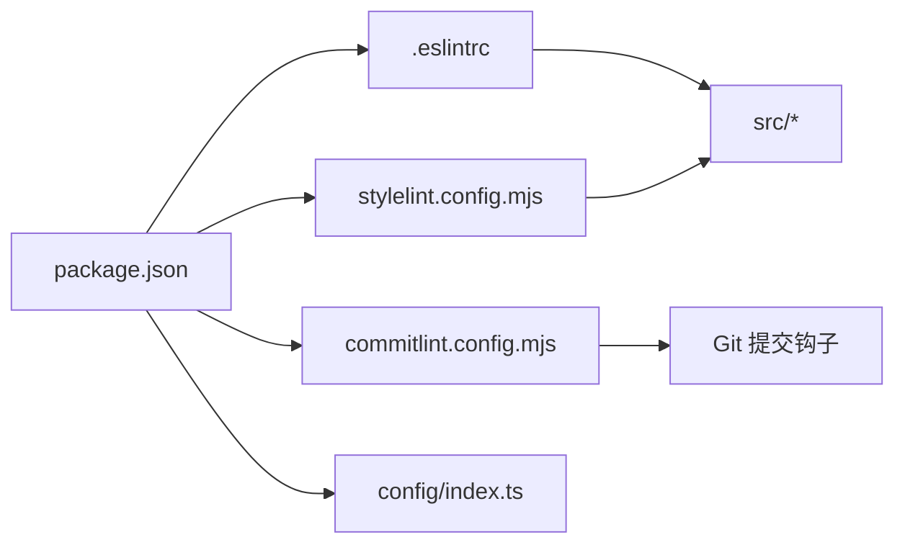

# 开发指南

<cite>
**本文引用的文件**
- [package.json](file://package.json)
- [commitlint.config.mjs](file://commitlint.config.mjs)
- [.eslintrc](file://.eslintrc)
- [stylelint.config.mjs](file://stylelint.config.mjs)
- [tsconfig.json](file://tsconfig.json)
- [config/index.ts](file://config/index.ts)
- [src/app.config.ts](file://src/app.config.ts)
- [src/pages/home/index.config.ts](file://src/pages/home/index.config.ts)
- [src/utils/http.ts](file://src/utils/http.ts)
- [src/components/NoteCard/index.tsx](file://src/components/NoteCard/index.tsx)
- [src/pages/login/index.tsx](file://src/pages/login/index.tsx)
- [src/pages/home/index.tsx](file://src/pages/home/index.tsx)
- [src/types/index.ts](file://src/types/index.ts)
- [src/api/mock.ts](file://src/api/mock.ts)
- [src/app.ts](file://src/app.ts)
</cite>

## 目录
1. [简介](#简介)
2. [项目结构](#项目结构)
3. [核心组件](#核心组件)
4. [架构总览](#架构总览)
5. [详细组件分析](#详细组件分析)
6. [依赖关系分析](#依赖关系分析)
7. [性能考虑](#性能考虑)
8. [故障排查指南](#故障排查指南)
9. [结论](#结论)
10. [附录](#附录)

## 简介
本指南面向红书项目（基于 Taro 4 + React 的多端应用）的开发者，提供从新功能开发到代码质量与性能优化的全流程规范。内容覆盖组件开发规范、页面路由配置、API 接口对接最佳实践、Git 分支与提交规范、代码质量工具链（ESLint、Stylelint、Commitlint）、以及常见问题与调试技巧，帮助团队高效协作与长期维护。

## 项目结构
红书项目采用 Taro 多端统一框架，页面与组件分层清晰，配置集中在 config 目录，类型定义在 types 目录，通用工具在 utils 目录，页面在 pages 目录，公共组件在 components 目录，全局样式与入口在根目录。

图表来源
- [src/app.ts:1-14](file://src/app.ts#L1-L14)
- [src/app.config.ts:1-18](file://src/app.config.ts#L1-L18)
- [src/pages/home/index.tsx:1-151](file://src/pages/home/index.tsx#L1-L151)
- [src/pages/login/index.tsx:1-243](file://src/pages/login/index.tsx#L1-L243)
- [src/components/NoteCard/index.tsx:1-53](file://src/components/NoteCard/index.tsx#L1-L53)
- [src/utils/http.ts:1-172](file://src/utils/http.ts#L1-L172)
- [src/types/index.ts:1-147](file://src/types/index.ts#L1-L147)
- [src/api/mock.ts:1-98](file://src/api/mock.ts#L1-L98)
- [config/index.ts:1-82](file://config/index.ts#L1-L82)
- [.eslintrc:1-8](file://.eslintrc#L1-L8)
- [stylelint.config.mjs:1-5](file://stylelint.config.mjs#L1-L5)
- [commitlint.config.mjs:1-2](file://commitlint.config.mjs#L1-L2)
- [package.json:1-93](file://package.json#L1-L93)

章节来源
- [package.json:12-32](file://package.json#L12-L32)
- [config/index.ts:6-81](file://config/index.ts#L6-L81)
- [src/app.config.ts:1-18](file://src/app.config.ts#L1-L18)

## 核心组件
- 页面与路由
  - 应用页面在应用配置中集中声明，确保多端一致的页面清单与导航栏配置。
  - 页面级配置通过 definePageConfig 控制标题、分享能力等。
- 工具与类型
  - HTTP 工具封装统一的请求与响应处理，支持多端环境变量切换、查询参数拼接、错误提示等。
  - 类型定义集中于 types/index.ts，覆盖用户、帖子、评论、消息、话题及认证相关类型。
  - mock 数据用于前端联调与演示，避免后端未就绪时的阻塞。
- 组件
  - NoteCard 提供瀑布流卡片展示，内置懒加载与视频标识，便于复用。
  - 自定义 TabBar 在首页使用，提升用户体验。

章节来源
- [src/app.config.ts:1-18](file://src/app.config.ts#L1-L18)
- [src/pages/home/index.config.ts:1-6](file://src/pages/home/index.config.ts#L1-L6)
- [src/utils/http.ts:1-172](file://src/utils/http.ts#L1-L172)
- [src/types/index.ts:1-147](file://src/types/index.ts#L1-L147)
- [src/api/mock.ts:1-98](file://src/api/mock.ts#L1-L98)
- [src/components/NoteCard/index.tsx:1-53](file://src/components/NoteCard/index.tsx#L1-L53)

## 架构总览
下图展示了页面、组件、工具与配置之间的交互关系，以及多端构建与规范工具的集成点。

图表来源
- [src/pages/login/index.tsx:1-243](file://src/pages/login/index.tsx#L1-L243)
- [src/pages/home/index.tsx:1-151](file://src/pages/home/index.tsx#L1-L151)
- [src/components/NoteCard/index.tsx:1-53](file://src/components/NoteCard/index.tsx#L1-L53)
- [src/utils/http.ts:1-172](file://src/utils/http.ts#L1-L172)
- [src/types/index.ts:1-147](file://src/types/index.ts#L1-L147)
- [src/api/mock.ts:1-98](file://src/api/mock.ts#L1-L98)
- [config/index.ts:1-82](file://config/index.ts#L1-L82)
- [.eslintrc:1-8](file://.eslintrc#L1-L8)
- [stylelint.config.mjs:1-5](file://stylelint.config.mjs#L1-L5)
- [commitlint.config.mjs:1-2](file://commitlint.config.mjs#L1-L2)
- [package.json:12-32](file://package.json#L12-L32)

## 详细组件分析

### 组件：NoteCard
- 职责与行为
  - 展示封面图、作者头像与昵称、点赞数、标题等信息。
  - 支持视频标识与懒加载，点击跳转详情页。
- 设计要点
  - 使用 scoped 样式模块化命名，避免样式冲突。
  - 图片懒加载减少首屏资源压力。
- 适用场景
  - 首页瀑布流、搜索结果、推荐列表等。

图表来源
- [src/components/NoteCard/index.tsx:1-53](file://src/components/NoteCard/index.tsx#L1-L53)

章节来源
- [src/components/NoteCard/index.tsx:1-53](file://src/components/NoteCard/index.tsx#L1-L53)

### 页面：Home（首页）
- 职责与行为
  - 提供标签页导航、瀑布流布局、下拉刷新与上拉加载。
  - 使用自定义 TabBar 提升交互体验。
- 关键流程
  - 下拉刷新：重置数据并停止刷新动画。
  - 上拉触底：模拟加载更多，追加数据。
  - 点击卡片：跳转详情页。

图表来源
- [src/pages/home/index.tsx:1-151](file://src/pages/home/index.tsx#L1-L151)
- [src/components/NoteCard/index.tsx:1-53](file://src/components/NoteCard/index.tsx#L1-L53)

章节来源
- [src/pages/home/index.tsx:1-151](file://src/pages/home/index.tsx#L1-L151)

### 页面：Login（登录页）
- 职责与行为
  - 手机号输入、验证码输入、倒计时发送、滑动验证码校验、登录流程。
  - 使用 Toast 进行状态提示与错误反馈。
- 关键流程
  - 发送验证码前进行手机号格式校验，打开滑动验证码弹窗。
  - 验证成功后模拟发送短信，并开启倒计时。
  - 登录时进行表单校验与加载态控制，成功后跳转首页。

图表来源
- [src/pages/login/index.tsx:1-243](file://src/pages/login/index.tsx#L1-L243)

章节来源
- [src/pages/login/index.tsx:1-243](file://src/pages/login/index.tsx#L1-L243)

### 工具：HTTP 工具
- 功能特性
  - 自动根据运行环境选择基础 URL（H5 代理前缀、小程序测试/生产地址等）。
  - 统一处理查询参数拼接、JSON Header、响应状态码与业务 code。
  - 成功与失败的 Toast 提示可按需隐藏。
  - 提供 GET/POST/PUT/DELETE 快捷方法。
- 使用建议
  - 对外暴露统一的 http 函数与快捷方法，避免重复逻辑。
  - 在调用方通过 hideErrorToast 控制错误提示，减少干扰。

图表来源
- [src/utils/http.ts:1-172](file://src/utils/http.ts#L1-L172)

章节来源
- [src/utils/http.ts:1-172](file://src/utils/http.ts#L1-L172)

### 类型系统
- 覆盖范围
  - 帖子、用户、评论、消息、话题等核心模型。
  - 登录认证相关类型（单 Token、双 Token、登录表单、用户信息、验证码等）。
- 设计要点
  - 使用联合类型与守卫函数区分单/双 Token 响应。
  - 保持字段可扩展性，便于后续迭代。

图表来源
- [src/types/index.ts:1-147](file://src/types/index.ts#L1-L147)

章节来源
- [src/types/index.ts:1-147](file://src/types/index.ts#L1-L147)

## 依赖关系分析
- 构建与多端
  - config/index.ts 定义设计稿宽度、设备比、CSS Modules、autoprefixer、px 转换等，确保样式在各端一致性。
  - package.json 中提供多端构建脚本，便于一键编译不同平台产物。
- 规范工具
  - ESLint、Stylelint、Commitlint 通过 devDependencies 引入，结合 husky 在提交阶段强制执行。
- 类型系统
  - tsconfig.json 启用严格空值检查、路径别名、React JSX 编译等，保障类型安全与开发体验。

图表来源
- [package.json:51-91](file://package.json#L51-L91)
- [config/index.ts:6-81](file://config/index.ts#L6-L81)
- [.eslintrc:1-8](file://.eslintrc#L1-L8)
- [stylelint.config.mjs:1-5](file://stylelint.config.mjs#L1-L5)
- [commitlint.config.mjs:1-2](file://commitlint.config.mjs#L1-L2)

章节来源
- [package.json:51-91](file://package.json#L51-L91)
- [config/index.ts:6-81](file://config/index.ts#L6-L81)
- [tsconfig.json:1-31](file://tsconfig.json#L1-L31)

## 性能考虑
- 懒加载
  - 图片懒加载：在图片组件上启用懒加载，减少首屏渲染压力，提升滚动性能。
  - 页面级懒加载：对非首屏组件与重型模块采用动态导入，按需加载。
- 图片优化
  - 使用合适的尺寸与格式；在 H5 端注意 CDN 与缓存策略。
  - 小程序端优先使用本地或压缩后的静态资源。
- 内存管理
  - 避免在组件内创建大对象或长数组；及时清理定时器与订阅。
  - 使用 React Hooks 的依赖与清理函数，防止泄漏。
- 网络与缓存
  - 合理设置请求超时与重试；对热点数据做本地缓存。
  - 使用 HTTP 工具统一封装错误提示与降级策略。
- 渲染优化
  - 列表虚拟化：对长列表采用虚拟滚动。
  - 避免不必要的重渲染：合理拆分组件、使用 memo、useMemo、useCallback。

## 故障排查指南
- 提交被拒绝
  - 确认提交信息符合 Conventional Commits 规范（由 Commitlint 校验）。
  - 若 husky 未生效，执行准备脚本初始化。
- ESLint/Stylelint 报错
  - 按规则修复或在临时场景下使用注释禁用，但需尽快回归规范。
- 网络请求异常
  - 检查环境变量与基础 URL 配置，确认代理与跨域设置。
  - 查看 HTTP 工具中的错误提示逻辑，定位业务错误或网络错误。
- 页面跳转失效
  - 确认页面已在应用配置中注册，路径与参数正确。
- 样式冲突
  - 使用 CSS Modules 或 BEM 命名，避免全局污染。

章节来源
- [commitlint.config.mjs:1-2](file://commitlint.config.mjs#L1-L2)
- [.eslintrc:1-8](file://.eslintrc#L1-L8)
- [stylelint.config.mjs:1-5](file://stylelint.config.mjs#L1-L5)
- [package.json:12-13](file://package.json#L12-L13)
- [src/utils/http.ts:1-172](file://src/utils/http.ts#L1-L172)
- [src/app.config.ts:1-18](file://src/app.config.ts#L1-L18)

## 结论
本指南围绕红书项目的多端架构与 React 生态，给出了从页面与组件开发、路由与配置、API 对接到代码质量与性能优化的系统化规范。建议团队在日常开发中严格遵循本文档的流程与规范，持续完善工具链与文档，保障产品快速迭代与长期可维护性。

## 附录

### 新功能开发标准流程
- 需求评审与设计
  - 明确页面/组件职责、交互与数据流。
- 路由与页面配置
  - 在应用配置中注册页面，必要时在页面级配置中设置标题与分享能力。
- 组件开发
  - 遵循 CSS Modules 命名规范，使用 TypeScript 定义 props 与事件。
  - 对外暴露稳定接口，内部使用受控状态与副作用管理。
- API 对接
  - 使用 HTTP 工具封装请求，统一处理查询参数、Header、错误提示。
  - 在调用方按需隐藏错误提示，避免干扰用户。
- 联调与 Mock
  - 使用 mock 数据先行联调，逐步替换为真实接口。
- 提交与审查
  - 遵循提交信息规范，通过 ESLint/Stylelint/Commitlint 校验。
  - 代码审查关注可读性、健壮性与性能影响。

章节来源
- [src/app.config.ts:1-18](file://src/app.config.ts#L1-L18)
- [src/pages/home/index.config.ts:1-6](file://src/pages/home/index.config.ts#L1-L6)
- [src/utils/http.ts:1-172](file://src/utils/http.ts#L1-L172)
- [src/api/mock.ts:1-98](file://src/api/mock.ts#L1-L98)
- [package.json:12-13](file://package.json#L12-L13)
- [.eslintrc:1-8](file://.eslintrc#L1-L8)
- [stylelint.config.mjs:1-5](file://stylelint.config.mjs#L1-L5)
- [commitlint.config.mjs:1-2](file://commitlint.config.mjs#L1-L2)

### Git 分支管理与提交规范
- 分支策略
  - 主干：master/main（发布稳定版本）
  - 开发：develop（集成日常开发）
  - 功能：feature/xxx（功能开发）
  - 修复：fix/xxx（缺陷修复）
  - 热修复：hotfix/xxx（紧急线上修复）
- 提交信息规范
  - 使用 Conventional Commits，包含 type、scope、subject，必要时附带 issue 编号。
- 代码审查
  - 至少一名同事审查，关注安全性、性能、可维护性与测试覆盖。

章节来源
- [commitlint.config.mjs:1-2](file://commitlint.config.mjs#L1-L2)
- [package.json:12-13](file://package.json#L12-L13)

### 代码质量工具链配置与使用
- ESLint
  - 使用 Taro React 预设，关闭 React/JSX 相关自动检测，配合 React Refresh 插件。
- Stylelint
  - 基于 Standard 配置，统一 CSS/SCSS 规范。
- Commitlint
  - 基于 conventional 规范，确保提交信息一致性。
- Husky + lint-staged
  - 在提交前自动运行 ESLint、Stylelint、Commitlint，拦截不合规变更。

章节来源
- [.eslintrc:1-8](file://.eslintrc#L1-L8)
- [stylelint.config.mjs:1-5](file://stylelint.config.mjs#L1-L5)
- [commitlint.config.mjs:1-2](file://commitlint.config.mjs#L1-L2)
- [package.json:51-91](file://package.json#L51-L91)

### 页面路由配置最佳实践
- 应用级页面清单
  - 在应用配置中集中声明页面，确保多端一致。
- 页面级配置
  - 使用 definePageConfig 设置标题、分享能力、导航样式等。
- 路由跳转
  - 使用 Taro 提供的导航 API，传递必要参数，避免硬编码路径。

章节来源
- [src/app.config.ts:1-18](file://src/app.config.ts#L1-L18)
- [src/pages/home/index.config.ts:1-6](file://src/pages/home/index.config.ts#L1-L6)
- [src/pages/home/index.tsx:29-33](file://src/pages/home/index.tsx#L29-L33)
- [src/components/NoteCard/index.tsx:17-19](file://src/components/NoteCard/index.tsx#L17-L19)

### API 接口对接最佳实践
- 统一入口
  - 使用 HTTP 工具封装所有请求，集中处理 URL、Header、查询参数与错误提示。
- 错误处理
  - 区分 HTTP 状态与业务 code，按需显示 Toast，必要时回退到本地缓存或默认数据。
- 参数与类型
  - 使用类型定义约束请求与响应，避免运行期错误。
- Mock 与联调
  - 先用 mock 数据验证交互与渲染，再接入真实接口。

章节来源
- [src/utils/http.ts:1-172](file://src/utils/http.ts#L1-L172)
- [src/types/index.ts:1-147](file://src/types/index.ts#L1-L147)
- [src/api/mock.ts:1-98](file://src/api/mock.ts#L1-L98)