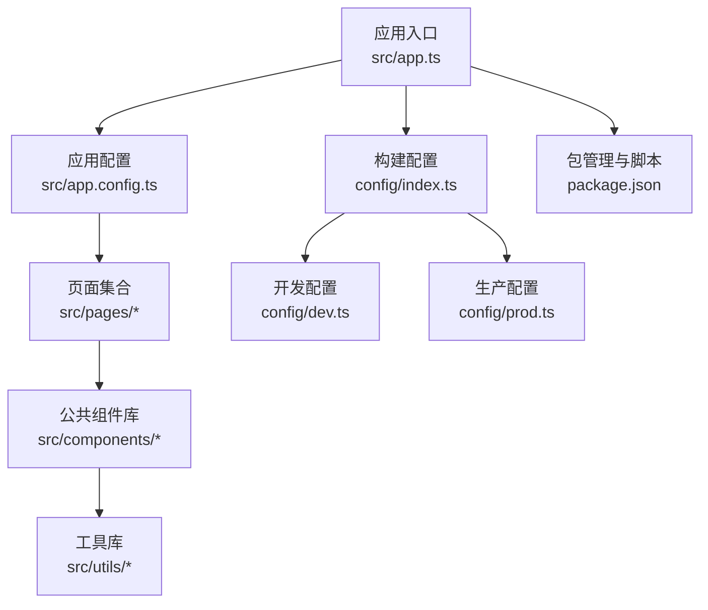
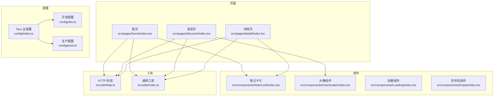
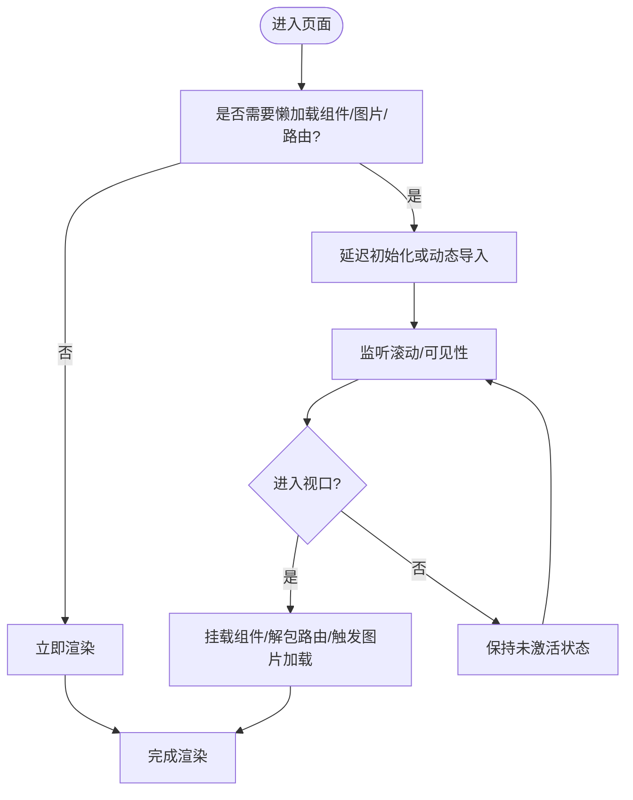
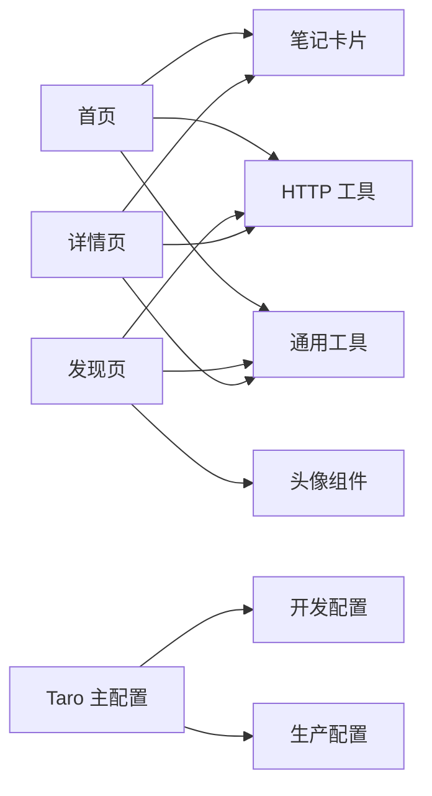

# 性能优化策略

<cite>
**本文引用的文件**
- [package.json](file://package.json)
- [config/index.ts](file://config/index.ts)
- [config/dev.ts](file://config/dev.ts)
- [config/prod.ts](file://config/prod.ts)
- [src/app.config.ts](file://src/app.config.ts)
- [src/app.ts](file://src/app.ts)
- [src/utils/http.ts](file://src/utils/http.ts)
- [src/utils/index.ts](file://src/utils/index.ts)
- [src/pages/home/index.tsx](file://src/pages/home/index.tsx)
- [src/pages/discover/index.tsx](file://src/pages/discover/index.tsx)
- [src/pages/detail/index.tsx](file://src/pages/detail/index.tsx)
- [src/components/NoteCard/index.tsx](file://src/components/NoteCard/index.tsx)
- [src/components/UserAvatar/index.tsx](file://src/components/UserAvatar/index.tsx)
- [src/components/Loading/index.tsx](file://src/components/Loading/index.tsx)
- [src/components/Empty/index.tsx](file://src/components/Empty/index.tsx)
</cite>

## 目录
1. [引言](#引言)
2. [项目结构](#项目结构)
3. [核心组件](#核心组件)
4. [架构总览](#架构总览)
5. [详细组件分析](#详细组件分析)
6. [依赖分析](#依赖分析)
7. [性能考虑](#性能考虑)
8. [故障排查指南](#故障排查指南)
9. [结论](#结论)
10. [附录](#附录)

## 引言
本指南面向红书项目（基于 Taro + React 的多端应用），围绕性能优化提供系统化策略与实操建议，重点覆盖以下方面：
- 懒加载：组件懒加载、图片懒加载、路由懒加载
- 图片优化：压缩、格式选择、响应式图片、CDN 加速
- 内存管理：组件卸载清理、事件监听器移除、大对象处理
- Taro 多端优化：编译优化、包体积控制、运行时性能提升
- 数据缓存：本地存储使用、缓存失效机制、数据同步
- 性能监控与分析：工具链集成与问题定位
- 优化案例与落地路径：结合现有代码结构给出可执行的改进建议

## 项目结构
红书项目采用 Taro 4.x + React 技术栈，支持多端构建（微信小程序、H5、RN 等）。项目目录组织清晰，按功能模块划分页面与组件，并通过统一的 Taro 配置集中管理各端差异化能力。

图表来源
- [src/app.ts:1-14](file://src/app.ts#L1-L14)
- [src/app.config.ts:1-18](file://src/app.config.ts#L1-L18)
- [config/index.ts:1-82](file://config/index.ts#L1-L82)
- [config/dev.ts:1-23](file://config/dev.ts#L1-L23)
- [config/prod.ts:1-34](file://config/prod.ts#L1-L34)
- [package.json:1-93](file://package.json#L1-L93)

章节来源
- [src/app.ts:1-14](file://src/app.ts#L1-L14)
- [src/app.config.ts:1-18](file://src/app.config.ts#L1-L18)
- [config/index.ts:1-82](file://config/index.ts#L1-L82)
- [config/dev.ts:1-23](file://config/dev.ts#L1-L23)
- [config/prod.ts:1-34](file://config/prod.ts#L1-L34)
- [package.json:1-93](file://package.json#L1-L93)

## 核心组件
- 页面层：首页、发现页、详情页等，承担内容渲染与交互逻辑
- 组件层：NoteCard、UserAvatar、Loading、Empty 等，承担复用性与职责单一
- 工具层：HTTP 请求封装、防抖节流、数值格式化等，承担横切能力
- 配置层：Taro 构建配置、开发代理、生产插件扩展位

章节来源
- [src/pages/home/index.tsx:1-151](file://src/pages/home/index.tsx#L1-L151)
- [src/pages/discover/index.tsx:1-119](file://src/pages/discover/index.tsx#L1-L119)
- [src/pages/detail/index.tsx:1-180](file://src/pages/detail/index.tsx#L1-L180)
- [src/components/NoteCard/index.tsx:1-53](file://src/components/NoteCard/index.tsx#L1-L53)
- [src/components/UserAvatar/index.tsx:1-17](file://src/components/UserAvatar/index.tsx#L1-L17)
- [src/components/Loading/index.tsx:1-16](file://src/components/Loading/index.tsx#L1-L16)
- [src/components/Empty/index.tsx:1-19](file://src/components/Empty/index.tsx#L1-L19)
- [src/utils/http.ts:1-165](file://src/utils/http.ts#L1-L165)
- [src/utils/index.ts:1-49](file://src/utils/index.ts#L1-L49)

## 架构总览
下图展示从页面到组件、再到工具与配置的整体调用关系，以及跨端构建的关键节点。

图表来源
- [src/pages/home/index.tsx:1-151](file://src/pages/home/index.tsx#L1-L151)
- [src/pages/discover/index.tsx:1-119](file://src/pages/discover/index.tsx#L1-L119)
- [src/pages/detail/index.tsx:1-180](file://src/pages/detail/index.tsx#L1-L180)
- [src/components/NoteCard/index.tsx:1-53](file://src/components/NoteCard/index.tsx#L1-L53)
- [src/components/UserAvatar/index.tsx:1-17](file://src/components/UserAvatar/index.tsx#L1-L17)
- [src/components/Loading/index.tsx:1-16](file://src/components/Loading/index.tsx#L1-L16)
- [src/components/Empty/index.tsx:1-19](file://src/components/Empty/index.tsx#L1-L19)
- [src/utils/http.ts:1-165](file://src/utils/http.ts#L1-L165)
- [src/utils/index.ts:1-49](file://src/utils/index.ts#L1-L49)
- [config/index.ts:1-82](file://config/index.ts#L1-L82)
- [config/dev.ts:1-23](file://config/dev.ts#L1-L23)
- [config/prod.ts:1-34](file://config/prod.ts#L1-L34)

## 详细组件分析

### 懒加载实现方案
- 组件懒加载
  - 建议：将非首屏关键区域组件（如“热门分类”、“推荐关注”）延迟挂载，或在滚动进入可视区后再渲染，减少初始渲染压力。
  - 参考路径：[src/pages/discover/index.tsx:1-119](file://src/pages/discover/index.tsx#L1-L119)
- 图片懒加载
  - 已有实践：首页瀑布流与笔记卡片均使用平台提供的懒加载属性，降低首屏资源占用。
  - 参考路径：[src/pages/home/index.tsx:43-48](file://src/pages/home/index.tsx#L43-L48)、[src/components/NoteCard/index.tsx:24-30](file://src/components/NoteCard/index.tsx#L24-L30)
- 路由懒加载
  - 建议：利用 Taro 的动态导入能力，对非首屏页面（如详情页）采用按需加载；结合分包策略进一步拆分页面 bundle，缩短首屏白屏时间。
  - 参考路径：[src/app.config.ts:1-18](file://src/app.config.ts#L1-L18)

章节来源
- [src/pages/discover/index.tsx:1-119](file://src/pages/discover/index.tsx#L1-L119)
- [src/pages/home/index.tsx:43-48](file://src/pages/home/index.tsx#L43-L48)
- [src/components/NoteCard/index.tsx:24-30](file://src/components/NoteCard/index.tsx#L24-L30)
- [src/app.config.ts:1-18](file://src/app.config.ts#L1-L18)

### 图片优化策略
- 压缩与格式选择
  - 建议：优先使用现代格式（WebP/JPEG XL）以获得更佳体积与画质平衡；对不支持的平台回退至 JPEG/PNG。
  - 建议：服务端开启自动压缩与尺寸裁剪，前端按需请求合适分辨率。
- 响应式图片
  - 建议：使用多密度资源与 srcset 语义，结合设备像素比与容器宽度选择最优图片。
- CDN 加速
  - 建议：将静态资源托管于 CDN，启用缓存头与压缩；结合边缘计算做图片转码与自适应裁剪。
- 现状参考
  - 图片懒加载已在首页与卡片组件中启用，有助于降低初始带宽与内存峰值。
  - 参考路径：[src/pages/home/index.tsx:43-48](file://src/pages/home/index.tsx#L43-L48)、[src/components/NoteCard/index.tsx:24-30](file://src/components/NoteCard/index.tsx#L24-L30)

章节来源
- [src/pages/home/index.tsx:43-48](file://src/pages/home/index.tsx#L43-L48)
- [src/components/NoteCard/index.tsx:24-30](file://src/components/NoteCard/index.tsx#L24-L30)

### 内存管理最佳实践
- 组件卸载清理
  - 建议：在页面/组件卸载钩子中主动清理定时器、订阅与副作用，避免内存泄漏。
  - 参考路径：[src/pages/detail/index.tsx:23-40](file://src/pages/detail/index.tsx#L23-L40)
- 事件监听器移除
  - 建议：为滚动、触摸等高频事件绑定时，确保在卸载阶段解除监听；对全局事件（如系统回调）亦需清理。
- 大对象处理
  - 建议：避免在组件状态中存放超大数组/对象；必要时采用分页/分块加载与弱引用策略。

章节来源
- [src/pages/detail/index.tsx:23-40](file://src/pages/detail/index.tsx#L23-L40)

### Taro 多端性能优化技巧
- 编译优化
  - 启用 Tree Shaking 与按需引入，减少冗余代码；合理配置 Mini/H5/RN 的差异化编译参数。
  - 参考路径：[config/index.ts:1-82](file://config/index.ts#L1-L82)
- 包体积控制
  - 使用 Bundle 分析工具定位大体积依赖；拆分页面为分包，降低首屏依赖。
  - 参考路径：[config/prod.ts:10-31](file://config/prod.ts#L10-L31)
- 运行时性能提升
  - 减少不必要的重渲染：使用 memo、useMemo、useCallback；避免在渲染期间创建新对象。
  - 参考路径：[src/utils/index.ts:25-49](file://src/utils/index.ts#L25-L49)

章节来源
- [config/index.ts:1-82](file://config/index.ts#L1-L82)
- [config/prod.ts:10-31](file://config/prod.ts#L10-L31)
- [src/utils/index.ts:25-49](file://src/utils/index.ts#L25-L49)

### 数据缓存策略
- 本地存储使用
  - 建议：对列表类数据采用分页缓存，设置 TTL；对用户态数据采用轻量缓存，避免污染持久化存储。
- 缓存失效机制
  - 建议：基于时间戳与版本号双维度控制；对热点数据采用 LRU 或 LFU 策略。
- 数据同步
  - 建议：采用“先本地后网络”的策略，网络成功后再写入缓存；失败时提示用户并允许重试。
- 现状参考
  - HTTP 工具已封装统一的请求与错误处理，便于在上层接入缓存与重试逻辑。
  - 参考路径：[src/utils/http.ts:1-165](file://src/utils/http.ts#L1-L165)

章节来源
- [src/utils/http.ts:1-165](file://src/utils/http.ts#L1-L165)

### 性能监控与分析方法
- 工具链集成
  - H5 端可启用打包体积分析与预渲染插件，辅助定位首屏瓶颈。
  - 参考路径：[config/prod.ts:10-31](file://config/prod.ts#L10-L31)
- 运行时观测
  - 建议：埋点关键指标（FP、FCP、LCP、CLS、INP）；对慢接口与大组件进行采样统计。
- 日志与告警
  - 建议：对网络错误、图片加载失败、组件卡顿等场景进行分级上报。

章节来源
- [config/prod.ts:10-31](file://config/prod.ts#L10-L31)

## 依赖分析
- 页面依赖组件与工具
  - 首页依赖瀑布流与卡片组件，使用 HTTP 工具进行数据拉取；依赖通用工具进行格式化与节流。
  - 发现页依赖头像与卡片组件，使用 HTTP 工具进行搜索与推荐数据拉取。
  - 详情页依赖卡片组件与通用工具，使用 HTTP 工具进行详情与评论数据拉取。
- 配置依赖
  - Taro 主配置统一管理设计稿、输出目录、CSS Modules、H5 静态目录等；开发配置提供代理；生产配置预留分析与预渲染扩展位。

图表来源
- [src/pages/home/index.tsx:1-151](file://src/pages/home/index.tsx#L1-L151)
- [src/pages/discover/index.tsx:1-119](file://src/pages/discover/index.tsx#L1-L119)
- [src/pages/detail/index.tsx:1-180](file://src/pages/detail/index.tsx#L1-L180)
- [src/components/NoteCard/index.tsx:1-53](file://src/components/NoteCard/index.tsx#L1-L53)
- [src/components/UserAvatar/index.tsx:1-17](file://src/components/UserAvatar/index.tsx#L1-L17)
- [src/utils/http.ts:1-165](file://src/utils/http.ts#L1-L165)
- [src/utils/index.ts:1-49](file://src/utils/index.ts#L1-L49)
- [config/index.ts:1-82](file://config/index.ts#L1-L82)
- [config/dev.ts:1-23](file://config/dev.ts#L1-L23)
- [config/prod.ts:1-34](file://config/prod.ts#L1-L34)

章节来源
- [src/pages/home/index.tsx:1-151](file://src/pages/home/index.tsx#L1-L151)
- [src/pages/discover/index.tsx:1-119](file://src/pages/discover/index.tsx#L1-L119)
- [src/pages/detail/index.tsx:1-180](file://src/pages/detail/index.tsx#L1-L180)
- [src/utils/http.ts:1-165](file://src/utils/http.ts#L1-L165)
- [src/utils/index.ts:1-49](file://src/utils/index.ts#L1-L49)
- [config/index.ts:1-82](file://config/index.ts#L1-L82)
- [config/dev.ts:1-23](file://config/dev.ts#L1-L23)
- [config/prod.ts:1-34](file://config/prod.ts#L1-L34)

## 性能考虑
- 渲染性能
  - 控制层级深度与节点数量，避免深层嵌套与重复渲染；对长列表使用虚拟滚动或分页。
  - 使用防抖节流处理高频事件（滚动、输入、触摸）。
  - 参考路径：[src/utils/index.ts:25-49](file://src/utils/index.ts#L25-L49)
- 网络性能
  - 合并请求、批量加载；对图片与静态资源启用 CDN 与缓存；对 H5 端使用代理与跨域优化。
  - 参考路径：[config/dev.ts:8-21](file://config/dev.ts#L8-L21)、[src/utils/http.ts:1-165](file://src/utils/http.ts#L1-L165)
- 内存与 GC
  - 避免闭包持有大对象；及时释放定时器与事件监听；对图片与视频资源在不可见时释放。
- 首屏与交互
  - 非关键资源延后加载；骨架屏与占位图提升感知速度；对关键路径进行预加载与缓存。

## 故障排查指南
- 图片加载失败
  - 现象：图片空白或闪烁
  - 排查：检查懒加载条件、CDN 可达性、尺寸与格式兼容性
  - 参考路径：[src/pages/home/index.tsx:43-48](file://src/pages/home/index.tsx#L43-L48)、[src/components/NoteCard/index.tsx:24-30](file://src/components/NoteCard/index.tsx#L24-L30)
- 接口异常与错误提示
  - 现象：网络错误弹窗频繁
  - 排查：查看 HTTP 工具的错误分支与 Toast 提示逻辑，确认隐藏错误开关与业务状态码
  - 参考路径：[src/utils/http.ts:88-107](file://src/utils/http.ts#L88-L107)
- 卡顿与掉帧
  - 现象：滚动或切换页面卡顿
  - 排查：检查是否存在大对象渲染、未清理的定时器与事件监听、未使用的副作用
  - 参考路径：[src/pages/detail/index.tsx:23-40](file://src/pages/detail/index.tsx#L23-L40)

章节来源
- [src/pages/home/index.tsx:43-48](file://src/pages/home/index.tsx#L43-L48)
- [src/components/NoteCard/index.tsx:24-30](file://src/components/NoteCard/index.tsx#L24-L30)
- [src/utils/http.ts:88-107](file://src/utils/http.ts#L88-L107)
- [src/pages/detail/index.tsx:23-40](file://src/pages/detail/index.tsx#L23-L40)

## 结论
本指南基于红书项目的现有实现，提出了系统化的性能优化策略与落地路径。通过组件与图片懒加载、图片格式与 CDN 优化、内存与事件清理、Taro 多端编译与包体积控制、数据缓存与监控分析，可在保证体验的同时显著提升首屏速度与运行稳定性。建议优先实施高收益项（懒加载、CDN、缓存与监控），再逐步完善细节（分包、虚拟滚动、骨架屏）。

## 附录
- 优化案例与落地清单
  - 首屏优化：启用路由懒加载与分包、图片懒加载、骨架屏占位
  - 网络优化：CDN 与缓存头、代理跨域、批量请求与去重
  - 内存优化：组件卸载清理、事件监听移除、大对象分页/弱引用
  - 构建优化：Tree Shaking、按需引入、分包与代码分割
  - 监控优化：关键指标埋点、错误上报、性能采样