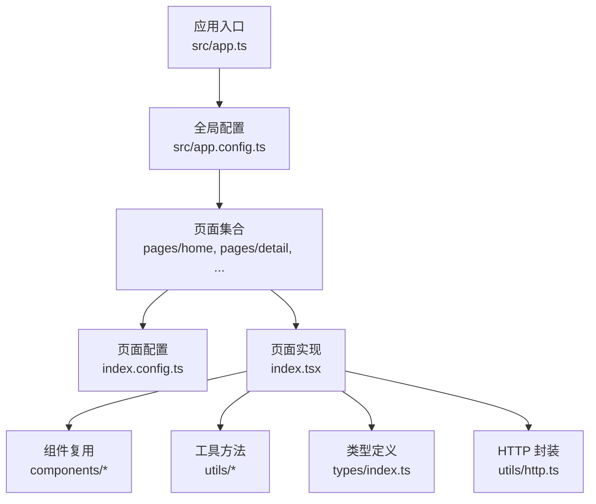
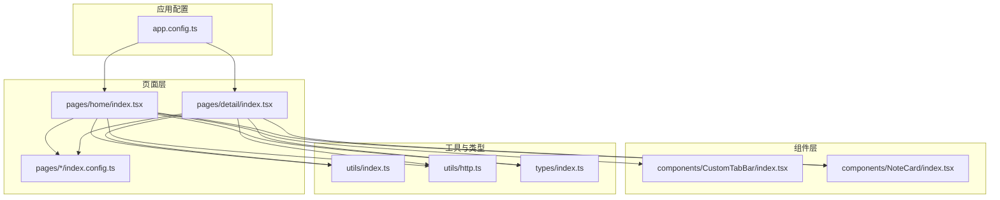
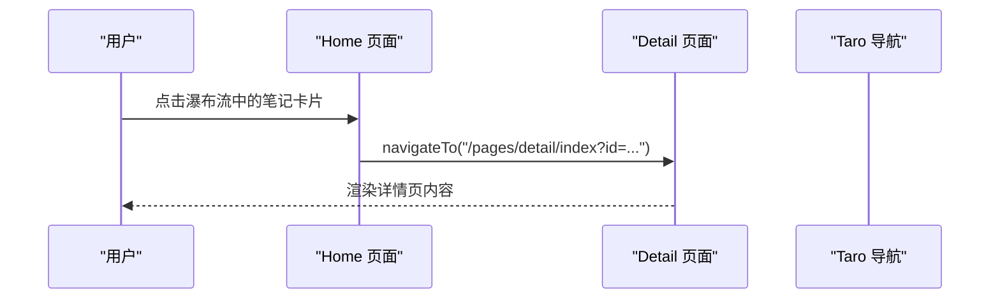
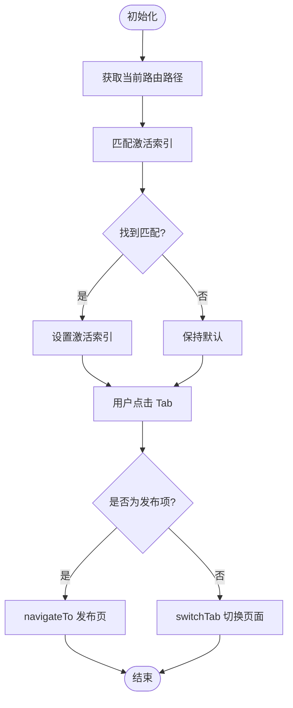
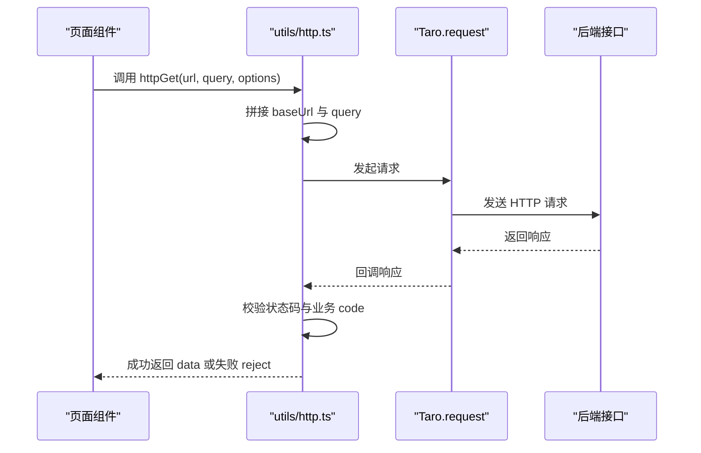
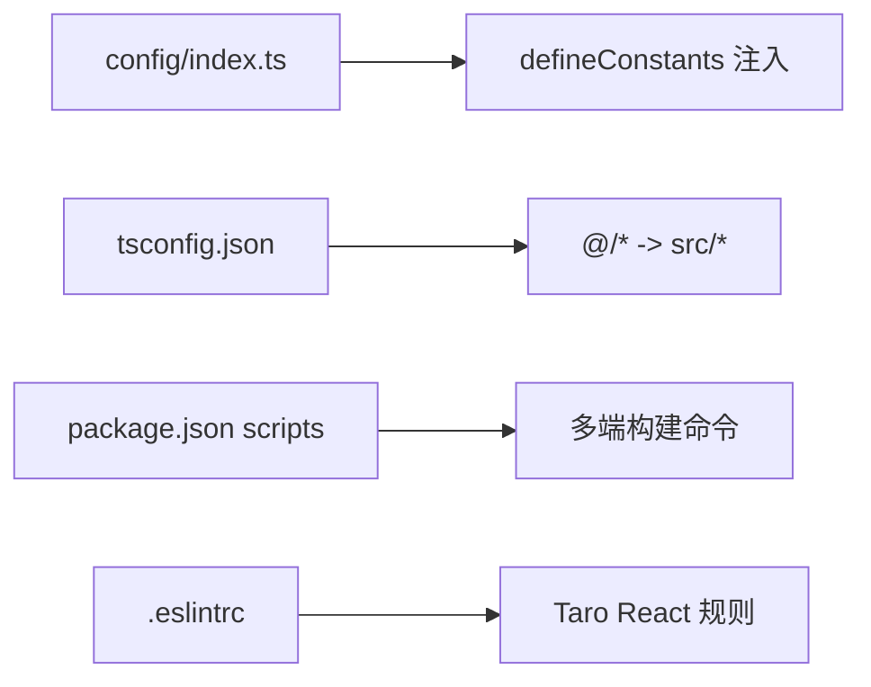

# 新功能开发流程

<cite>
**本文引用的文件**
- [package.json](file://package.json)
- [tsconfig.json](file://tsconfig.json)
- [.eslintrc](file://.eslintrc)
- [config/index.ts](file://config/index.ts)
- [src/app.config.ts](file://src/app.config.ts)
- [src/app.ts](file://src/app.ts)
- [src/utils/http.ts](file://src/utils/http.ts)
- [src/utils/index.ts](file://src/utils/index.ts)
- [src/types/index.ts](file://src/types/index.ts)
- [src/components/CustomTabBar/index.tsx](file://src/components/CustomTabBar/index.tsx)
- [src/components/NoteCard/index.tsx](file://src/components/NoteCard/index.tsx)
- [src/pages/home/index.config.ts](file://src/pages/home/index.config.ts)
- [src/pages/home/index.tsx](file://src/pages/home/index.tsx)
- [src/pages/detail/index.config.ts](file://src/pages/detail/index.config.ts)
- [src/pages/detail/index.tsx](file://src/pages/detail/index.tsx)
</cite>

## 目录
1. [引言](#引言)
2. [项目结构](#项目结构)
3. [核心组件](#核心组件)
4. [架构总览](#架构总览)
5. [详细组件分析](#详细组件分析)
6. [依赖关系分析](#依赖关系分析)
7. [性能考虑](#性能考虑)
8. [故障排查指南](#故障排查指南)
9. [结论](#结论)
10. [附录：功能开发模板与最佳实践](#附录功能开发模板与最佳实践)

## 引言
本指南面向在红书项目中进行新功能开发的工程师，提供从需求分析到功能上线的完整流程与规范。内容涵盖页面组件开发规范、路由配置标准、API 接口对接流程、数据模型设计原则，以及组件开发的最佳实践（命名、props 设计、事件处理、状态管理）。同时给出页面路由配置步骤与注意事项、API 调用规范（请求封装、错误处理、缓存策略）、以及可直接套用的功能开发模板与参考路径，帮助开发者快速、高质量地完成新功能。

## 项目结构
红书项目基于 Taro 4 + React 的多端统一框架，采用目录分层清晰的组织方式：
- 应用入口与全局配置：src/app.ts、src/app.config.ts
- 页面与页面配置：src/pages/{page}/index.tsx 与对应 index.config.ts
- 组件：src/components/{Component}
- 工具与类型：src/utils、src/types
- 构建与环境：config/index.ts、tsconfig.json、package.json、.eslintrc

图表来源
- [src/app.ts:1-14](file://src/app.ts#L1-L14)
- [src/app.config.ts:1-18](file://src/app.config.ts#L1-L18)
- [src/pages/home/index.tsx:1-151](file://src/pages/home/index.tsx#L1-L151)
- [src/pages/detail/index.tsx:1-180](file://src/pages/detail/index.tsx#L1-L180)
- [src/utils/http.ts:1-169](file://src/utils/http.ts#L1-L169)
- [src/types/index.ts:1-147](file://src/types/index.ts#L1-L147)

章节来源
- [src/app.config.ts:1-18](file://src/app.config.ts#L1-L18)
- [src/app.ts:1-14](file://src/app.ts#L1-L14)
- [config/index.ts:1-89](file://config/index.ts#L1-L89)
- [tsconfig.json:1-31](file://tsconfig.json#L1-L31)
- [package.json:1-93](file://package.json#L1-L93)

## 核心组件
- 全局应用：负责应用启动日志与根节点挂载
- 页面与页面配置：每个页面包含 index.tsx 实现与 index.config.ts 配置（标题、导航栏样式、分享能力等）
- 自定义 TabBar：统一底部导航交互与高亮状态
- 通用组件：如 NoteCard、Empty、Loading、SliderVerify、UserAvatar 等
- 工具与类型：格式化、防抖节流、HTTP 封装、业务类型定义
- 构建与环境：多端构建配置、TypeScript 路径别名、ESLint 规则

章节来源
- [src/app.ts:1-14](file://src/app.ts#L1-L14)
- [src/components/CustomTabBar/index.tsx:1-67](file://src/components/CustomTabBar/index.tsx#L1-L67)
- [src/components/NoteCard/index.tsx:1-53](file://src/components/NoteCard/index.tsx#L1-L53)
- [src/utils/index.ts:1-49](file://src/utils/index.ts#L1-L49)
- [src/utils/http.ts:1-169](file://src/utils/http.ts#L1-L169)
- [src/types/index.ts:1-147](file://src/types/index.ts#L1-L147)

## 架构总览
下图展示从页面到组件、工具与 HTTP 层的整体交互关系，以及页面配置对导航栏与分享能力的影响。

图表来源
- [src/pages/home/index.tsx:1-151](file://src/pages/home/index.tsx#L1-L151)
- [src/pages/detail/index.tsx:1-180](file://src/pages/detail/index.tsx#L1-L180)
- [src/pages/home/index.config.ts:1-6](file://src/pages/home/index.config.ts#L1-L6)
- [src/pages/detail/index.config.ts:1-6](file://src/pages/detail/index.config.ts#L1-L6)
- [src/components/CustomTabBar/index.tsx:1-67](file://src/components/CustomTabBar/index.tsx#L1-L67)
- [src/components/NoteCard/index.tsx:1-53](file://src/components/NoteCard/index.tsx#L1-L53)
- [src/utils/index.ts:1-49](file://src/utils/index.ts#L1-L49)
- [src/utils/http.ts:1-169](file://src/utils/http.ts#L1-L169)
- [src/types/index.ts:1-147](file://src/types/index.ts#L1-L147)
- [src/app.config.ts:1-18](file://src/app.config.ts#L1-L18)

## 详细组件分析

### 页面与页面配置
- 页面注册：在全局配置中声明页面路径，确保页面可被正确编译与运行
- 页面配置：通过 index.config.ts 设置导航栏标题、背景色、文字颜色、分享能力等
- 生命周期：页面内使用 Taro 提供的生命周期钩子（如下拉刷新、触底加载）实现交互
- 导航：页面间跳转使用 Taro 提供的导航 API，支持 switchTab、navigateTo 等

图表来源
- [src/pages/home/index.tsx:28-68](file://src/pages/home/index.tsx#L28-L68)
- [src/pages/detail/index.tsx:23-40](file://src/pages/detail/index.tsx#L23-L40)

章节来源
- [src/app.config.ts:1-18](file://src/app.config.ts#L1-L18)
- [src/pages/home/index.config.ts:1-6](file://src/pages/home/index.config.ts#L1-L6)
- [src/pages/detail/index.config.ts:1-6](file://src/pages/detail/index.config.ts#L1-L6)
- [src/pages/home/index.tsx:70-151](file://src/pages/home/index.tsx#L70-L151)
- [src/pages/detail/index.tsx:23-180](file://src/pages/detail/index.tsx#L23-L180)

### 自定义 TabBar 组件
- 功能：统一底部导航，支持“发布”按钮的特殊处理与当前页高亮
- 交互：点击非发布项时 switchTab，点击发布项时 navigateTo
- 状态：根据当前路由动态设置激活项

图表来源
- [src/components/CustomTabBar/index.tsx:14-67](file://src/components/CustomTabBar/index.tsx#L14-L67)

章节来源
- [src/components/CustomTabBar/index.tsx:1-67](file://src/components/CustomTabBar/index.tsx#L1-L67)

### 组件开发规范与最佳实践
- 组件命名：采用 PascalCase，语义明确；如 NoteCard、CustomTabBar
- props 设计：以接口约束输入，区分必需与可选字段；尽量保持单一职责
- 事件处理：在组件内部封装事件回调，避免在父组件中重复编写逻辑
- 状态管理：优先使用受控组件与外部状态；必要时在组件内使用 useState 管理本地状态
- 样式：建议使用模块化样式（CSS Modules），避免全局污染
- 可访问性：为图片设置懒加载、为交互元素提供 hoverClass 或点击反馈

章节来源
- [src/components/NoteCard/index.tsx:5-53](file://src/components/NoteCard/index.tsx#L5-L53)
- [src/components/CustomTabBar/index.tsx:1-67](file://src/components/CustomTabBar/index.tsx#L1-L67)

### 数据模型设计原则
- 类型集中管理：所有业务实体类型集中在 types/index.ts 中，便于复用与维护
- 字段完整性：覆盖常用字段（如 id、title、avatar、nickname、likes、createdAt 等），按需扩展
- 可选字段：对可能为空或未来扩展的字段标记为可选
- 工具函数：提供格式化函数（时间、数字）统一前端展示风格

章节来源
- [src/types/index.ts:1-147](file://src/types/index.ts#L1-L147)
- [src/utils/index.ts:1-49](file://src/utils/index.ts#L1-L49)

### API 接口调用规范
- 请求封装：统一使用 utils/http.ts 中的 http 函数与派生方法（httpGet、httpPost 等）
- 环境适配：根据 TARO_ENV 自动选择基础 URL（H5 使用代理前缀，小程序开发环境可注入测试地址，生产环境使用正式地址）
- 响应处理：统一解析 code 与 data，业务错误与 HTTP 错误分别处理，并可选择是否显示 toast
- 错误处理：在网络失败或业务错误时统一提示，reject 返回标准化响应对象
- 缓存策略：当前实现未内置缓存；如需缓存，可在页面或服务层增加内存缓存或持久化缓存（建议结合业务场景）

图表来源
- [src/utils/http.ts:50-114](file://src/utils/http.ts#L50-L114)

章节来源
- [src/utils/http.ts:1-169](file://src/utils/http.ts#L1-L169)
- [config/index.ts:25-32](file://config/index.ts#L25-L32)

## 依赖关系分析
- 构建与多端：通过 config/index.ts 定义各端的 CSS Modules、px 转换、公共常量注入等
- TypeScript 路径别名：通过 tsconfig.json 的 paths 映射 @/* 到 src/*，简化导入路径
- ESLint 规则：继承 Taro React 规则，关闭 React 引用相关规则以适配 JSX 运行时
- 依赖管理：package.json 中包含 Taro 多端插件与 React 生态依赖

图表来源
- [config/index.ts:6-32](file://config/index.ts#L6-L32)
- [tsconfig.json:23-26](file://tsconfig.json#L23-L26)
- [package.json:12-32](file://package.json#L12-L32)
- [.eslintrc:1-8](file://.eslintrc#L1-L8)

章节来源
- [config/index.ts:1-89](file://config/index.ts#L1-L89)
- [tsconfig.json:1-31](file://tsconfig.json#L1-L31)
- [package.json:1-93](file://package.json#L1-L93)
- [.eslintrc:1-8](file://.eslintrc#L1-L8)

## 性能考虑
- 图片懒加载：组件中使用懒加载属性，减少首屏渲染压力
- 无限滚动：在页面中使用触底加载与下拉刷新，注意控制并发与去重
- 防抖节流：对高频事件（如搜索、滚动）使用防抖节流，降低计算开销
- 样式隔离：启用 CSS Modules，避免全局样式冲突导致的重绘
- 网络优化：合理使用 query 参数与分页，避免一次性请求过多数据

章节来源
- [src/pages/home/index.tsx:83-102](file://src/pages/home/index.tsx#L83-L102)
- [src/utils/index.ts:25-49](file://src/utils/index.ts#L25-L49)
- [config/index.ts:43-49](file://config/index.ts#L43-L49)

## 故障排查指南
- 页面无法显示或路由异常
  - 检查全局配置中的页面列表是否包含目标页面
  - 检查页面 index.config.ts 是否正确导出 definePageConfig
- 导航栏与分享能力不生效
  - 确认 index.config.ts 中的导航栏配置与分享开关已开启
- 网络请求失败或业务错误
  - 查看 utils/http.ts 的错误分支与 toast 提示
  - 检查 defineConstants 注入的基础 URL 是否正确
- 样式冲突或类名无效
  - 确认 CSS Modules 启用与类名拼写
- TypeScript 路径解析失败
  - 检查 tsconfig.json 的 paths 配置与 @/* 别名

章节来源
- [src/app.config.ts:1-18](file://src/app.config.ts#L1-L18)
- [src/pages/home/index.config.ts:1-6](file://src/pages/home/index.config.ts#L1-L6)
- [src/utils/http.ts:84-110](file://src/utils/http.ts#L84-L110)
- [config/index.ts:25-32](file://config/index.ts#L25-L32)
- [tsconfig.json:23-26](file://tsconfig.json#L23-L26)

## 结论
通过遵循本文提供的开发流程与规范，开发者可以在红书项目中高效、一致地完成新功能的页面开发、组件封装、路由配置与 API 对接。建议在每次迭代中严格遵守组件命名与 props 设计、页面配置与生命周期管理、HTTP 请求封装与错误处理、以及类型与样式的统一约定，从而保证代码质量与可维护性。

## 附录：功能开发模板与最佳实践

### 页面开发模板
- 创建页面目录与文件
  - 在 src/pages/{your_page} 下创建 index.tsx、index.config.ts、index.module.scss
- 页面配置
  - 在 index.config.ts 中设置导航栏标题、背景色、文字色、分享能力等
- 页面实现
  - 在 index.tsx 中组织结构、绑定事件、调用工具与组件
  - 如需全局状态，结合 hooks 与上下文管理
- 注册页面
  - 在全局配置中添加页面路径，确保可编译与运行

参考路径
- [src/pages/home/index.config.ts:1-6](file://src/pages/home/index.config.ts#L1-L6)
- [src/pages/home/index.tsx:70-151](file://src/pages/home/index.tsx#L70-L151)
- [src/pages/detail/index.config.ts:1-6](file://src/pages/detail/index.config.ts#L1-L6)
- [src/pages/detail/index.tsx:23-180](file://src/pages/detail/index.tsx#L23-L180)
- [src/app.config.ts:1-18](file://src/app.config.ts#L1-L18)

### 组件开发模板
- 组件命名与结构
  - 使用语义化名称，采用模块化样式
- Props 设计
  - 使用接口约束输入，区分必需与可选字段
- 事件与状态
  - 在组件内部封装事件回调，必要时使用 useState 管理本地状态
- 样式与可访问性
  - 启用 CSS Modules，为图片设置懒加载与 hoverClass

参考路径
- [src/components/NoteCard/index.tsx:5-53](file://src/components/NoteCard/index.tsx#L5-L53)
- [src/components/CustomTabBar/index.tsx:14-67](file://src/components/CustomTabBar/index.tsx#L14-L67)

### 路由配置步骤与注意事项
- 步骤
  - 在全局配置中注册页面路径
  - 在页面目录下创建 index.config.ts 并导出 definePageConfig
  - 在页面中使用 Taro 导航 API 进行跳转
- 注意事项
  - 非 Tab 页使用 navigateTo，Tab 页使用 switchTab
  - 发布按钮等特殊入口使用 navigateTo
  - 导航栏配置与分享能力需在 index.config.ts 中开启

参考路径
- [src/app.config.ts:1-18](file://src/app.config.ts#L1-L18)
- [src/pages/home/index.config.ts:1-6](file://src/pages/home/index.config.ts#L1-L6)
- [src/pages/detail/index.config.ts:1-6](file://src/pages/detail/index.config.ts#L1-L6)
- [src/components/CustomTabBar/index.tsx:25-32](file://src/components/CustomTabBar/index.tsx#L25-L32)

### API 接口对接流程
- 请求封装
  - 使用 utils/http.ts 的 httpGet/httpPost/httpPut/httpDelete
- 环境适配
  - 通过 defineConstants 注入不同环境的基础 URL
- 错误处理
  - 业务错误与 HTTP 错误分别处理，必要时显示 toast
- 缓存策略
  - 当前未内置缓存，如需可自行在页面或服务层实现

参考路径
- [src/utils/http.ts:50-169](file://src/utils/http.ts#L50-L169)
- [config/index.ts:25-32](file://config/index.ts#L25-L32)

### 数据模型设计原则
- 类型集中管理：在 types/index.ts 中定义实体接口
- 字段完整性：覆盖常用字段，按需扩展
- 可选字段：对可能为空或未来扩展的字段标记为可选
- 工具函数：提供格式化函数统一展示风格

参考路径
- [src/types/index.ts:1-147](file://src/types/index.ts#L1-L147)
- [src/utils/index.ts:1-49](file://src/utils/index.ts#L1-L49)