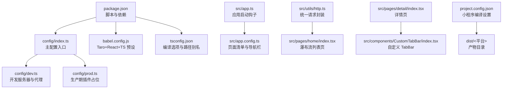
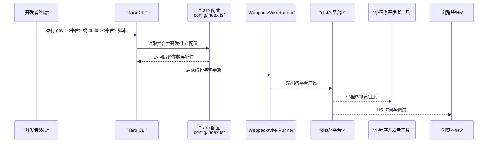
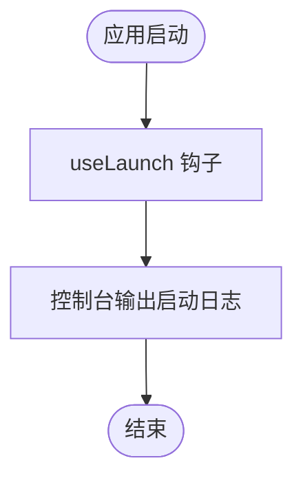
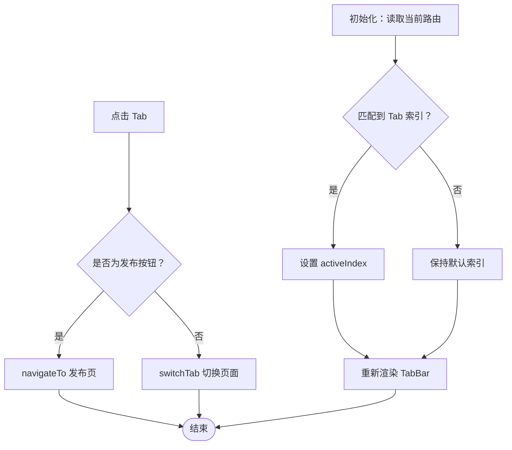
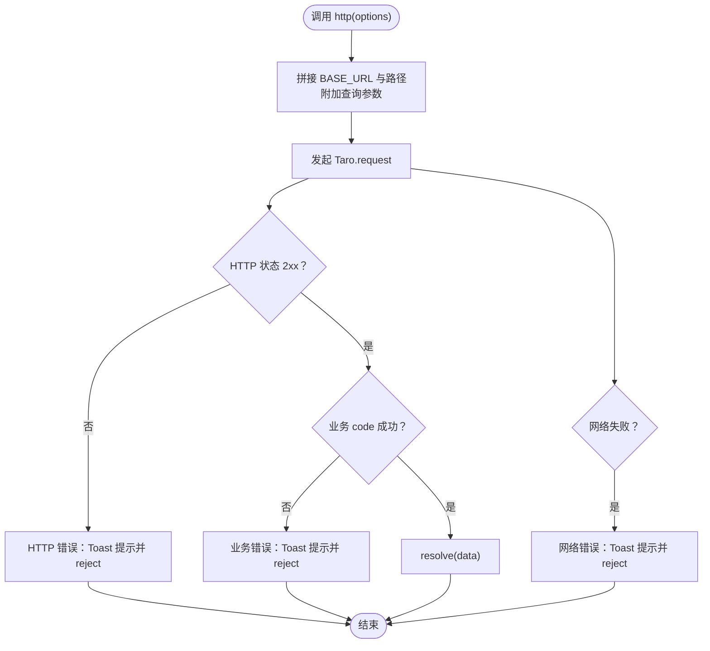
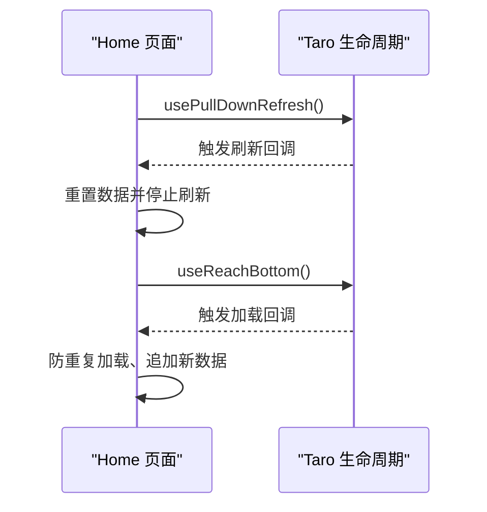
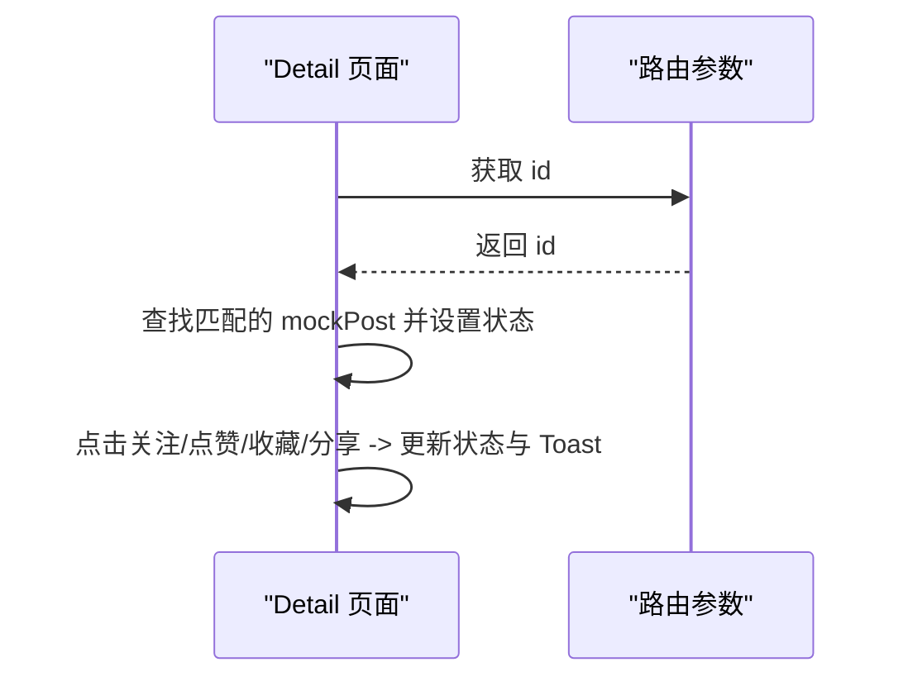
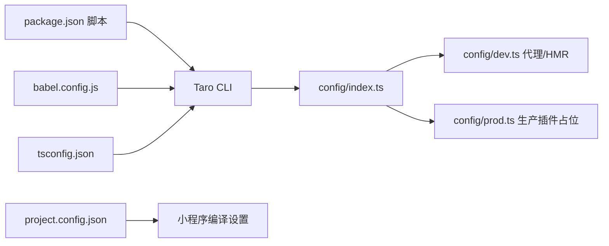
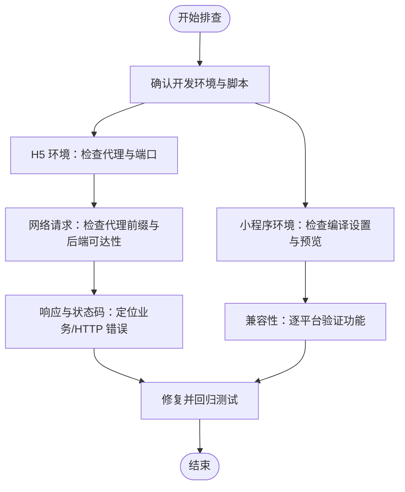

# 调试与故障排除

<cite>
**本文引用的文件**
- [package.json](file://package.json)
- [config/index.ts](file://config/index.ts)
- [config/dev.ts](file://config/dev.ts)
- [config/prod.ts](file://config/prod.ts)
- [babel.config.js](file://babel.config.js)
- [tsconfig.json](file://tsconfig.json)
- [src/app.ts](file://src/app.ts)
- [src/app.config.ts](file://src/app.config.ts)
- [src/utils/http.ts](file://src/utils/http.ts)
- [src/pages/home/index.tsx](file://src/pages/home/index.tsx)
- [src/pages/detail/index.tsx](file://src/pages/detail/index.tsx)
- [src/components/CustomTabBar/index.tsx](file://src/components/CustomTabBar/index.tsx)
- [project.config.json](file://project.config.json)
- [.eslintrc](file://.eslintrc)
</cite>

## 目录
1. [简介](#简介)
2. [项目结构](#项目结构)
3. [核心组件](#核心组件)
4. [架构总览](#架构总览)
5. [详细组件分析](#详细组件分析)
6. [依赖分析](#依赖分析)
7. [性能考虑](#性能考虑)
8. [故障排除指南](#故障排除指南)
9. [结论](#结论)
10. [附录](#附录)

## 简介
本指南面向红书（Taro React）项目开发者，围绕多端调试、热更新、断点调试、浏览器与移动端调试、常见问题排查、日志与错误监控、性能诊断以及完整故障排除流程展开，帮助快速定位与解决问题，提升开发效率。

## 项目结构
红书项目基于 Taro 4 + React + TypeScript，采用多端统一开发，支持 H5、微信小程序等平台。项目通过 Taro CLI 的配置体系组织开发与构建，配合 Babel、TypeScript、Webpack/Vite Runner 等工具链完成编译与打包。

图表来源
- [package.json:12-33](file://package.json#L12-L33)
- [config/index.ts:6-81](file://config/index.ts#L6-L81)
- [config/dev.ts:6-22](file://config/dev.ts#L6-L22)
- [babel.config.js:3-11](file://babel.config.js#L3-L11)
- [tsconfig.json:23-26](file://tsconfig.json#L23-L26)
- [src/app.ts:5-11](file://src/app.ts#L5-L11)
- [src/app.config.ts:1-18](file://src/app.config.ts#L1-L18)
- [src/utils/http.ts:46-110](file://src/utils/http.ts#L46-L110)
- [src/pages/home/index.tsx:70-150](file://src/pages/home/index.tsx#L70-L150)
- [src/pages/detail/index.tsx:23-179](file://src/pages/detail/index.tsx#L23-L179)
- [src/components/CustomTabBar/index.tsx:14-66](file://src/components/CustomTabBar/index.tsx#L14-L66)
- [project.config.json:1-39](file://project.config.json#L1-L39)

章节来源
- [package.json:12-33](file://package.json#L12-L33)
- [config/index.ts:6-81](file://config/index.ts#L6-L81)
- [babel.config.js:3-11](file://babel.config.js#L3-L11)
- [tsconfig.json:23-26](file://tsconfig.json#L23-L26)
- [src/app.ts:5-11](file://src/app.ts#L5-L11)
- [src/app.config.ts:1-18](file://src/app.config.ts#L1-L18)
- [project.config.json:1-39](file://project.config.json#L1-L39)

## 核心组件
- 应用启动与生命周期：在应用入口注册启动日志，便于确认应用初始化是否成功。
- 页面与路由：通过页面配置声明页面清单与导航栏样式；页面内使用 Taro 提供的生命周期与事件钩子。
- 组件化：自定义 TabBar 组件负责底部导航切换与当前页高亮。
- 网络层：统一的 HTTP 封装，自动处理业务状态码、HTTP 状态码、错误提示与环境相关的基础地址与代理策略。

章节来源
- [src/app.ts:5-11](file://src/app.ts#L5-L11)
- [src/app.config.ts:1-18](file://src/app.config.ts#L1-L18)
- [src/components/CustomTabBar/index.tsx:14-66](file://src/components/CustomTabBar/index.tsx#L14-L66)
- [src/utils/http.ts:46-110](file://src/utils/http.ts#L46-L110)

## 架构总览
下图展示从开发到多端运行的关键路径：CLI 脚本触发构建，Taro 配置决定编译器与平台插件，Webpack/Vite Runner 执行打包，最终输出各平台产物；H5 开发模式启用代理以对接后端服务。

图表来源
- [package.json:24-32](file://package.json#L24-L32)
- [config/index.ts:6-81](file://config/index.ts#L6-L81)
- [config/dev.ts:8-21](file://config/dev.ts#L8-L21)

## 详细组件分析

### 组件一：应用入口与启动日志
- 作用：在应用启动时打印启动日志，便于确认应用初始化是否成功。
- 调试要点：若启动日志未出现，优先检查应用入口文件与页面配置是否正确注册。

图表来源
- [src/app.ts:5-11](file://src/app.ts#L5-L11)

章节来源
- [src/app.ts:5-11](file://src/app.ts#L5-L11)

### 组件二：自定义 TabBar
- 作用：提供底部导航，支持“发布”按钮与 Tab 切换；根据当前路由高亮对应 Tab。
- 调试要点：切换 Tab 后高亮不生效时，检查路由路径与当前页面匹配逻辑。

图表来源
- [src/components/CustomTabBar/index.tsx:17-32](file://src/components/CustomTabBar/index.tsx#L17-L32)

章节来源
- [src/components/CustomTabBar/index.tsx:14-66](file://src/components/CustomTabBar/index.tsx#L14-L66)

### 组件三：HTTP 请求封装
- 作用：统一封装请求与响应处理，自动拼接基础地址、处理查询参数、区分业务错误与 HTTP 错误，并可选择性显示 Toast 提示。
- 调试要点：H5 环境使用代理前缀；小程序环境使用环境变量或默认空串；如遇跨域或 404，优先检查代理与基础地址配置。

图表来源
- [src/utils/http.ts:46-110](file://src/utils/http.ts#L46-L110)

章节来源
- [src/utils/http.ts:46-110](file://src/utils/http.ts#L46-L110)

### 组件四：首页瀑布流与交互
- 作用：展示瀑布流内容，支持下拉刷新与上拉加载更多；点击卡片跳转详情页。
- 调试要点：下拉刷新与上拉加载需确保 Taro 生命周期钩子绑定正确；图片懒加载与滚动容器需注意性能。

图表来源
- [src/pages/home/index.tsx:93-102](file://src/pages/home/index.tsx#L93-L102)
- [src/pages/home/index.tsx:83-91](file://src/pages/home/index.tsx#L83-L91)

章节来源
- [src/pages/home/index.tsx:70-150](file://src/pages/home/index.tsx#L70-L150)

### 组件五：详情页与交互
- 作用：展示文章详情、作者信息、图片轮播、评论区与底部操作栏；支持关注、点赞、收藏、分享等交互。
- 调试要点：路由参数解析与 mock 数据匹配；分享菜单与 Toast 提示。

图表来源
- [src/pages/detail/index.tsx:23-40](file://src/pages/detail/index.tsx#L23-L40)
- [src/pages/detail/index.tsx:42-70](file://src/pages/detail/index.tsx#L42-L70)

章节来源
- [src/pages/detail/index.tsx:23-179](file://src/pages/detail/index.tsx#L23-L179)

## 依赖分析
- 脚本与多端：通过 npm scripts 定义各平台的开发与构建命令，结合 Taro CLI 与平台插件实现多端统一开发。
- 编译与框架：Babel 使用 taro 预设，TypeScript 配置启用 JSX、路径别名与严格空检查。
- 开发服务器：H5 开发服务器启用代理，将特定前缀请求转发至后端 API 地址。
- 小程序编译：project.config.json 控制小程序编译行为，如热编译开关、压缩与混淆等。

图表来源
- [package.json:24-32](file://package.json#L24-L32)
- [config/index.ts:6-81](file://config/index.ts#L6-L81)
- [config/dev.ts:8-21](file://config/dev.ts#L8-L21)
- [babel.config.js:3-11](file://babel.config.js#L3-L11)
- [tsconfig.json:23-26](file://tsconfig.json#L23-L26)
- [project.config.json:6-25](file://project.config.json#L6-L25)

章节来源
- [package.json:24-32](file://package.json#L24-L32)
- [config/index.ts:6-81](file://config/index.ts#L6-L81)
- [config/dev.ts:8-21](file://config/dev.ts#L8-L21)
- [babel.config.js:3-11](file://babel.config.js#L3-L11)
- [tsconfig.json:23-26](file://tsconfig.json#L23-L26)
- [project.config.json:6-25](file://project.config.json#L6-L25)

## 性能考虑
- 懒加载与分页：瀑布流中图片启用懒加载，避免一次性渲染过多资源；上拉加载采用防抖与去重，减少重复请求。
- 滚动容器：合理使用滚动容器与虚拟化思路，降低 DOM 数量。
- 网络优化：H5 环境使用代理避免跨域；生产构建可通过分析工具定位体积瓶颈。
- 缓存与本地化：按需缓存静态资源与接口数据，减少重复请求。
- 构建优化：生产阶段可引入打包分析与预渲染插件（已在配置中预留位置），以优化首屏与包体大小。

章节来源
- [src/pages/home/index.tsx:47-48](file://src/pages/home/index.tsx#L47-L48)
- [src/pages/home/index.tsx:83-91](file://src/pages/home/index.tsx#L83-L91)
- [config/prod.ts:10-31](file://config/prod.ts#L10-L31)

## 故障排除指南

### 一、Taro 开发工具与多端调试
- 多端启动
  - H5：执行开发脚本后访问本地开发服务器，启用热更新与代理。
  - 小程序：执行对应平台开发脚本，使用微信开发者工具预览与调试。
- 热更新与断点调试
  - H5：开启开发服务器热更新，浏览器中可直接打断点调试。
  - 小程序：在微信开发者工具中启用“不校验合法域名”“不检验安全域名”等必要设置，便于联调。
- 断点调试建议
  - 在页面生命周期、事件回调、网络请求处设置断点，观察状态变化与数据流向。

章节来源
- [package.json:24-32](file://package.json#L24-L32)
- [config/dev.ts:8-21](file://config/dev.ts#L8-L21)
- [project.config.json:6-25](file://project.config.json#L6-L25)

### 二、浏览器调试技巧
- React DevTools
  - 安装 React DevTools 浏览器扩展，查看组件树、Props、State 与 Hooks 状态，定位渲染异常与状态更新问题。
- 网络请求监控
  - 使用浏览器 Network 面板监控请求路径、状态码、耗时与响应体；H5 环境通过代理前缀访问后端接口，确保代理规则正确。
- 性能分析
  - 使用 Performance 面板录制交互过程，识别长任务与重绘；结合 React Profiler 分析组件渲染开销。

章节来源
- [config/dev.ts:8-21](file://config/dev.ts#L8-L21)

### 三、移动端调试方法
- 微信开发者工具
  - 使用项目配置文件中的编译设置，预览小程序；启用“编译时是否启用编译热更新”等选项，便于联调。
- 真机调试
  - 通过“本地编译”或“上传预览”方式在真机验证交互与兼容性；注意网络与权限问题。
- 跨平台兼容性测试
  - 使用 Taro 多端脚本分别构建与预览，重点验证滚动、事件、导航与媒体资源在不同平台的行为差异。

章节来源
- [project.config.json:6-25](file://project.config.json#L6-L25)
- [package.json:15-23](file://package.json#L15-L23)

### 四、常见开发问题与排查
- 构建错误
  - 检查 Taro 主配置与平台插件版本一致性；确认 Babel 与 TypeScript 配置无冲突。
  - 若出现模块解析失败，核对路径别名与 tsconfig 中的 paths 设置。
- 运行时错误
  - 应用启动日志未出现：检查应用入口与页面配置是否正确注册。
  - 网络请求失败：确认 H5 代理前缀与后端地址；小程序环境变量是否正确注入。
- 跨平台兼容性问题
  - 不同平台对滚动、事件与导航的支持存在差异，优先使用 Taro 提供的跨平台 API，并在多端逐一验证。

章节来源
- [config/index.ts:6-81](file://config/index.ts#L6-L81)
- [babel.config.js:3-11](file://babel.config.js#L3-L11)
- [tsconfig.json:23-26](file://tsconfig.json#L23-L26)
- [src/app.ts:5-11](file://src/app.ts#L5-L11)
- [src/utils/http.ts:4-21](file://src/utils/http.ts#L4-L21)

### 五、日志记录与错误监控最佳实践
- 日志分级
  - 使用控制台输出关键路径日志，区分 info/warn/error；避免在高频回调中输出大量日志。
- 错误提示
  - 统一使用 Toast 展示业务错误与网络错误，保证用户体验一致。
- 错误上报
  - 可在请求失败与异常捕获处集成错误上报，记录环境、页面、错误堆栈与上下文参数。

章节来源
- [src/app.ts:5-11](file://src/app.ts#L5-L11)
- [src/utils/http.ts:80-106](file://src/utils/http.ts#L80-L106)

### 六、性能问题诊断
- 内存泄漏检测
  - 使用浏览器 Memory 面板快照对比，排查未释放的监听器、定时器与闭包引用。
- 渲染性能分析
  - 使用 React Profiler 与 Performance 面板，定位长任务与重渲染；优化列表项、拆分组件与减少不必要的状态提升。
- 网络请求优化
  - 合理使用代理与缓存；减少请求次数与体积，必要时启用预渲染与资源压缩。

章节来源
- [config/dev.ts:8-21](file://config/dev.ts#L8-L21)
- [config/prod.ts:10-31](file://config/prod.ts#L10-L31)

### 七、完整故障排除流程

图表来源
- [package.json:24-32](file://package.json#L24-L32)
- [config/dev.ts:8-21](file://config/dev.ts#L8-L21)
- [project.config.json:6-25](file://project.config.json#L6-L25)

## 结论
通过规范的多端调试流程、完善的日志与错误监控、系统化的性能诊断与跨平台兼容性验证，能够显著提升红书项目的开发效率与问题解决能力。建议在团队内沉淀常见问题清单与排查模板，持续优化开发与调试体验。

## 附录
- 快速参考
  - H5 开发：执行开发脚本，打开浏览器，启用代理与热更新。
  - 小程序：执行对应平台开发脚本，使用微信开发者工具预览。
  - 网络：H5 使用代理前缀访问后端；小程序使用环境变量配置基础地址。
  - 性能：结合 React Profiler 与浏览器性能面板定位瓶颈。