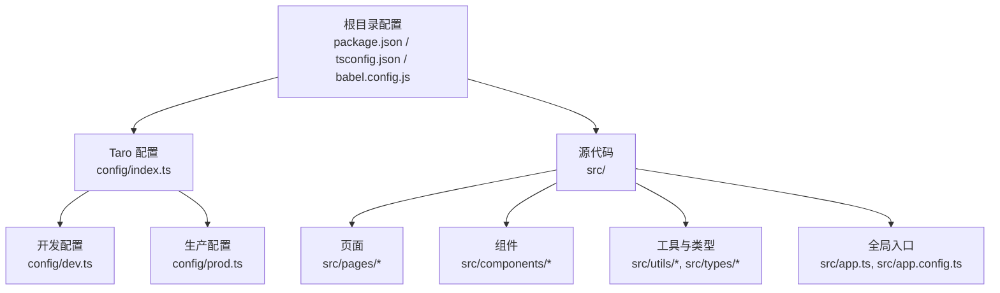
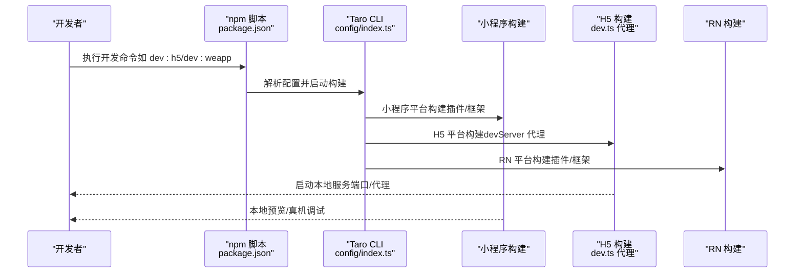
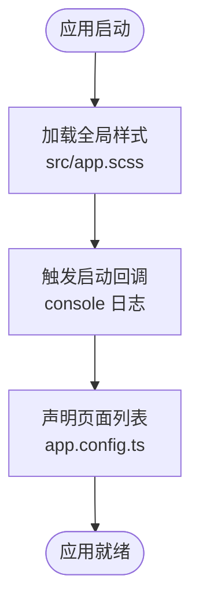
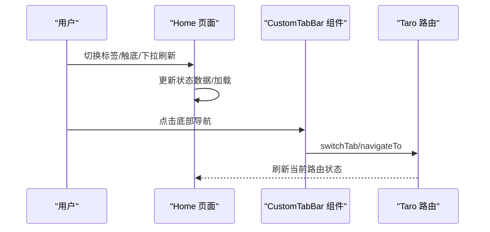
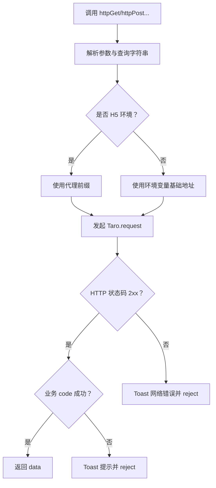
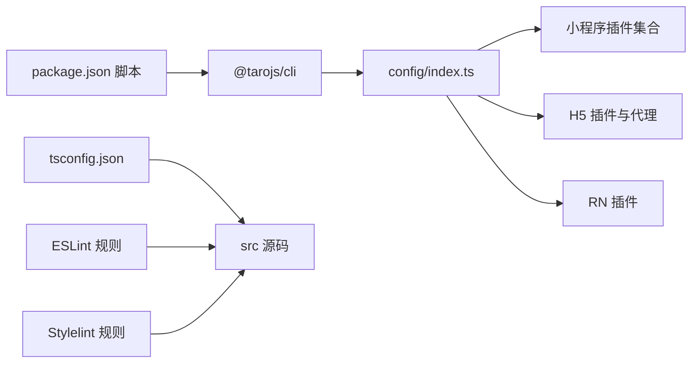

# 快速开始

<cite>
**本文引用的文件**
- [package.json](file://package.json)
- [tsconfig.json](file://tsconfig.json)
- [babel.config.js](file://babel.config.js)
- [config/index.ts](file://config/index.ts)
- [config/dev.ts](file://config/dev.ts)
- [config/prod.ts](file://config/prod.ts)
- [project.config.json](file://project.config.json)
- [.eslintrc](file://.eslintrc)
- [stylelint.config.mjs](file://stylelint.config.mjs)
- [src/app.ts](file://src/app.ts)
- [src/app.config.ts](file://src/app.config.ts)
- [src/pages/home/index.tsx](file://src/pages/home/index.tsx)
- [src/components/CustomTabBar/index.tsx](file://src/components/CustomTabBar/index.tsx)
- [src/utils/http.ts](file://src/utils/http.ts)
</cite>

## 目录
1. [简介](#简介)
2. [项目结构](#项目结构)
3. [核心组件](#核心组件)
4. [架构总览](#架构总览)
5. [详细组件分析](#详细组件分析)
6. [依赖关系分析](#依赖关系分析)
7. [性能考虑](#性能考虑)
8. [故障排查指南](#故障排查指南)
9. [结论](#结论)
10. [附录](#附录)

## 简介
本指南面向首次接触红书（Taro 多端）项目的开发者，帮助你在最短时间内完成开发环境准备、项目克隆与依赖安装，并成功运行项目。你将了解 Taro 多端构建的基本概念，掌握在不同平台（微信小程序、H5、RN 等）上进行开发与调试的方法；同时，文档还提供了常见环境配置问题的解决方案与开发工具推荐。

## 项目结构
该项目采用 Taro 4 + React 的多端工程化方案，使用 TypeScript 编写，通过 Taro CLI 进行配置与构建。核心目录与职责概览如下：
- config：Taro 全局配置与环境区分（开发/生产）
- src：源代码，包含页面、组件、样式、工具与全局入口
- types：全局类型声明
- 根目录配置：包管理脚本、ESLint、Stylelint、Babel、TS 配置等

图表来源
- [config/index.ts:1-82](file://config/index.ts#L1-L82)
- [config/dev.ts:1-23](file://config/dev.ts#L1-L23)
- [config/prod.ts:1-34](file://config/prod.ts#L1-L34)
- [package.json:1-93](file://package.json#L1-L93)
- [tsconfig.json:1-31](file://tsconfig.json#L1-L31)
- [babel.config.js:1-12](file://babel.config.js#L1-L12)

章节来源
- [package.json:1-93](file://package.json#L1-L93)
- [tsconfig.json:1-31](file://tsconfig.json#L1-L31)
- [babel.config.js:1-12](file://babel.config.js#L1-L12)
- [config/index.ts:1-82](file://config/index.ts#L1-L82)

## 核心组件
- 应用入口与生命周期：全局入口负责应用启动日志与样式初始化，页面路由由 app.config.ts 统一声明。
- 页面与组件：以 React 组件形式组织页面与可复用 UI，如首页瀑布流布局与自定义 TabBar。
- 网络层封装：统一的 http 工具，支持 GET/POST/PUT/DELETE，自动处理业务状态码与错误提示。
- 多端配置：Taro 配置集中于 config/index.ts，按开发/生产环境拆分 dev.ts 与 prod.ts，分别控制 H5 代理、CSS Modules、autoprefixer 等。

章节来源
- [src/app.ts:1-14](file://src/app.ts#L1-L14)
- [src/app.config.ts:1-18](file://src/app.config.ts#L1-L18)
- [src/pages/home/index.tsx:1-151](file://src/pages/home/index.tsx#L1-L151)
- [src/components/CustomTabBar/index.tsx:1-67](file://src/components/CustomTabBar/index.tsx#L1-L67)
- [src/utils/http.ts:1-157](file://src/utils/http.ts#L1-L157)
- [config/index.ts:1-82](file://config/index.ts#L1-L82)
- [config/dev.ts:1-23](file://config/dev.ts#L1-L23)
- [config/prod.ts:1-34](file://config/prod.ts#L1-L34)

## 架构总览
下图展示了从开发到多端构建的关键流程：开发者通过 npm scripts 调用 Taro CLI，根据目标平台生成对应产物；H5 开发时借助 devServer 代理后端接口；小程序端通过 project.config.json 指定编译与打包策略。

图表来源
- [package.json:12-33](file://package.json#L12-L33)
- [config/index.ts:6-81](file://config/index.ts#L6-L81)
- [config/dev.ts:8-21](file://config/dev.ts#L8-L21)

章节来源
- [package.json:12-33](file://package.json#L12-L33)
- [config/index.ts:6-81](file://config/index.ts#L6-L81)
- [config/dev.ts:1-23](file://config/dev.ts#L1-L23)

## 详细组件分析

### 应用入口与页面配置
- 应用入口：在全局入口中注册启动回调与样式，作为所有页面的根容器。
- 页面配置：通过 app.config.ts 声明页面路径与导航栏样式，保证多端一致的页面结构。

图表来源
- [src/app.ts:5-11](file://src/app.ts#L5-L11)
- [src/app.config.ts:1-18](file://src/app.config.ts#L1-L18)

章节来源
- [src/app.ts:1-14](file://src/app.ts#L1-L14)
- [src/app.config.ts:1-18](file://src/app.config.ts#L1-L18)

### 首页瀑布流与自定义 TabBar
- 首页实现：瀑布流布局、标签切换、触底加载与下拉刷新，结合自定义 TabBar 实现底部导航。
- 自定义 TabBar：监听当前路由，动态高亮选中项；发布按钮采用独立跳转逻辑。

图表来源
- [src/pages/home/index.tsx:70-150](file://src/pages/home/index.tsx#L70-L150)
- [src/components/CustomTabBar/index.tsx:14-66](file://src/components/CustomTabBar/index.tsx#L14-L66)

章节来源
- [src/pages/home/index.tsx:1-151](file://src/pages/home/index.tsx#L1-L151)
- [src/components/CustomTabBar/index.tsx:1-67](file://src/components/CustomTabBar/index.tsx#L1-L67)

### 网络层封装与跨端适配
- 统一请求：封装 http 工具，自动拼接基础 URL（H5 使用代理前缀，其他端使用环境变量），处理业务状态码与错误提示。
- 方法别名：提供 httpGet/httpPost/httpPut/httpDelete 等便捷方法。

图表来源
- [src/utils/http.ts:38-102](file://src/utils/http.ts#L38-L102)

章节来源
- [src/utils/http.ts:1-157](file://src/utils/http.ts#L1-L157)

### 多端构建与配置要点
- 平台选择：通过 npm scripts 中的 build/dev 命令选择目标平台（如 weapp、h5、rn 等）。
- 开发代理：H5 开发时通过 dev.ts 的 devServer.proxy 将 /cmp-api 代理至后端地址。
- CSS Modules：mini 与 h5 均启用 CSS Modules，命名规则一致，便于样式隔离。
- 编译器与框架：Taro 4 使用 webpack5 与 React 框架，Babel 预设由 taro 驱动。

章节来源
- [package.json:12-33](file://package.json#L12-L33)
- [config/index.ts:30-74](file://config/index.ts#L30-L74)
- [config/dev.ts:8-21](file://config/dev.ts#L8-L21)
- [babel.config.js:3-11](file://babel.config.js#L3-L11)

## 依赖关系分析
- 包管理与脚本：使用 npm scripts 统一入口，调用 Taro CLI 完成多端构建。
- 类型与语法：TypeScript 提供强类型支持，Babel 预设由 taro 驱动，确保 React JSX 与装饰器等特性在各端兼容。
- Lint 规则：ESLint 与 Stylelint 分别约束 JS/TS 与样式规范，配合 husky 在提交时校验。

图表来源
- [package.json:12-33](file://package.json#L12-L33)
- [config/index.ts:6-81](file://config/index.ts#L6-L81)
- [.eslintrc:1-8](file://.eslintrc#L1-L8)
- [stylelint.config.mjs:1-5](file://stylelint.config.mjs#L1-L5)

章节来源
- [package.json:1-93](file://package.json#L1-L93)
- [tsconfig.json:1-31](file://tsconfig.json#L1-L31)
- [.eslintrc:1-8](file://.eslintrc#L1-L8)
- [stylelint.config.mjs:1-5](file://stylelint.config.mjs#L1-L5)

## 性能考虑
- 构建缓存：当前配置关闭了缓存，若后续迭代频繁构建，可评估开启以缩短二次构建时间。
- CSS Modules：在多端启用 CSS Modules 可避免样式冲突，但需注意类名长度与打包体积。
- H5 体积优化：生产配置预留了分析与预渲染插件的扩展位置，可根据需要引入以优化首屏与体积。
- 代理与网络：H5 代理仅用于开发阶段，生产环境请确保后端 CORS 与域名白名单配置正确。

章节来源
- [config/index.ts:21-23](file://config/index.ts#L21-L23)
- [config/prod.ts:10-31](file://config/prod.ts#L10-L31)

## 故障排查指南
- 端口占用或代理异常（H5）
  - 现象：浏览器无法访问本地服务或接口 404。
  - 排查：确认 dev.ts 中 devServer.proxy 的 target 是否可达；检查本地端口占用情况。
  - 参考
    - [config/dev.ts:8-21](file://config/dev.ts#L8-L21)
- 环境变量未生效
  - 现象：H5 代理前缀不生效或小程序基础地址为空。
  - 排查：检查环境变量 TARO_APP_API_BASE_URL、TARO_APP_H5_PROXY_PREFIX 是否设置；确认运行命令携带环境变量。
  - 参考
    - [src/utils/http.ts:3-13](file://src/utils/http.ts#L3-L13)
- 小程序编译/预览异常
  - 现象：开发者工具报错或无法预览。
  - 排查：核对 project.config.json 的 miniprogramRoot、appid、编译设置；确保 dist 目录存在且为最新构建产物。
  - 参考
    - [project.config.json:1-39](file://project.config.json#L1-L39)
- Lint 报错导致提交失败
  - 现象：husky 提交钩子执行 lint 报错。
  - 排查：根据 .eslintrc 与 stylelint.config.mjs 的规则修复；必要时调整规则或忽略特定文件。
  - 参考
    - [.eslintrc:1-8](file://.eslintrc#L1-L8)
    - [stylelint.config.mjs:1-5](file://stylelint.config.mjs#L1-L5)
- 构建失败或内存不足
  - 现象：构建卡顿或 OOM。
  - 排查：降低并发、清理 node_modules 重新安装、升级 Node 版本至 LTS；检查系统可用内存。
  - 参考
    - [package.json:51-91](file://package.json#L51-L91)

## 结论
通过本指南，你已了解红书项目的多端架构与关键配置，掌握了在不同平台上的开发与调试方法。建议在本地先完成 H5 的开发联调，再逐步接入小程序与 RN 平台，确保接口代理、样式模块与路由配置的一致性。

## 附录

### 开发环境准备清单
- Node.js：建议使用长期支持版本（LTS），确保 npm 或 pnpm 可用。
- 包管理器：项目使用 pnpm 锁文件，建议优先使用 pnpm 以获得更稳定的依赖解析与更快的安装速度。
- IDE：推荐 VS Code，安装 TypeScript、ESLint、Stylelint、Prettier 等插件以获得更好的开发体验。
- 微信开发者工具：用于小程序预览与真机调试。
- Android/iOS 模拟器或真机：用于 RN 与小程序真机验证。

### 项目克隆与首次运行步骤
- 克隆仓库后，在项目根目录安装依赖（建议使用 pnpm）。
- 启动 H5 开发服务器，确认页面可访问且接口代理正常。
- 如需小程序预览，使用微信开发者工具打开 dist 目录。
- 如需 RN 调试，先完成 RN 环境准备，再运行相应 dev 脚本。

### Taro 多端构建基本概念
- 平台插件：每个目标平台均通过对应的 @tarojs/plugin-* 插件集成，确保编译与运行时行为一致。
- 配置入口：config/index.ts 作为全局配置入口，按 NODE_ENV 合并 dev.ts 或 prod.ts。
- 构建命令：通过 npm scripts 中的 build:* 与 dev:* 命令选择目标平台与模式。

章节来源
- [package.json:12-33](file://package.json#L12-L33)
- [config/index.ts:6-81](file://config/index.ts#L6-L81)
- [config/dev.ts:1-23](file://config/dev.ts#L1-L23)
- [config/prod.ts:1-34](file://config/prod.ts#L1-L34)