# Mock数据系统

<cite>
**本文档引用的文件**
- [src/api/mock.ts](file://src/api/mock.ts)
- [src/types/index.ts](file://src/types/index.ts)
- [src/utils/http.ts](file://src/utils/http.ts)
- [src/pages/home/index.tsx](file://src/pages/home/index.tsx)
- [src/pages/discover/index.tsx](file://src/pages/discover/index.tsx)
- [src/pages/login/index.tsx](file://src/pages/login/index.tsx)
- [src/components/SliderVerify/index.tsx](file://src/components/SliderVerify/index.tsx)
- [src/utils/index.ts](file://src/utils/index.ts)
- [config/index.ts](file://config/index.ts)
- [config/dev.ts](file://config/dev.ts)
- [config/prod.ts](file://config/prod.ts)
- [src/app.config.ts](file://src/app.config.ts)
- [package.json](file://package.json)
</cite>

## 目录
1. [简介](#简介)
2. [项目结构](#项目结构)
3. [核心组件](#核心组件)
4. [架构概览](#架构概览)
5. [详细组件分析](#详细组件分析)
6. [依赖分析](#依赖分析)
7. [性能考虑](#性能考虑)
8. [故障排除指南](#故障排除指南)
9. [结论](#结论)
10. [附录](#附录)

## 简介

红书项目的Mock数据系统是一个完整的开发环境模拟解决方案，旨在为前端开发提供接近真实的API数据和交互体验。该系统通过预定义的数据集合和模拟的API行为，支持用户登录状态、内容浏览、互动操作等完整的功能演示场景。

系统的核心特点包括：
- **完整的数据模型**：涵盖用户、帖子、话题、评论、消息等核心业务实体
- **多环境适配**：支持H5和微信小程序两种运行环境
- **开发友好**：提供便捷的Mock数据生成和管理机制
- **接口一致性**：确保Mock数据与真实API的接口格式保持一致

## 项目结构

红书项目的整体架构采用模块化设计，主要分为以下几个核心部分：

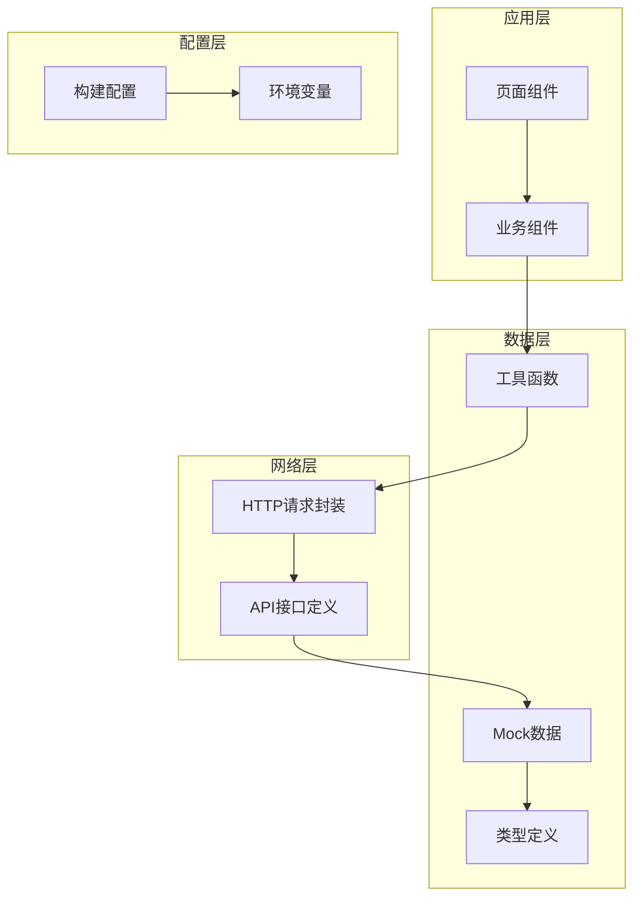

**图表来源**
- [src/pages/home/index.tsx:1-151](file://src/pages/home/index.tsx#L1-L151)
- [src/api/mock.ts:1-98](file://src/api/mock.ts#L1-L98)
- [src/utils/http.ts:1-165](file://src/utils/http.ts#L1-L165)

**章节来源**
- [src/app.config.ts:1-18](file://src/app.config.ts#L1-L18)
- [config/index.ts:1-82](file://config/index.ts#L1-L82)

## 核心组件

### 数据模型定义

系统采用TypeScript接口定义严格的数据结构，确保类型安全和开发体验：

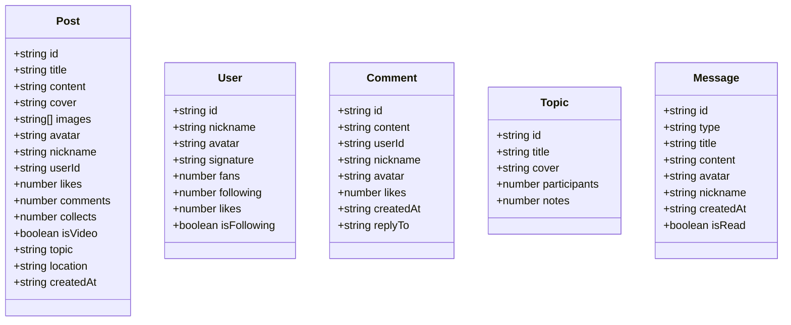

**图表来源**
- [src/types/index.ts:1-147](file://src/types/index.ts#L1-L147)

### Mock数据管理

系统提供了三种主要的Mock数据集合，每种都经过精心设计以模拟真实场景：

**用户数据模拟规则**：
- 基于真实用户画像的头像、昵称和签名
- 粉丝数、关注数、获赞数采用合理的数值范围
- 关注状态字段用于模拟用户关系

**帖子数据生成逻辑**：
- 支持图文和视频两种内容形式
- 包含完整的元数据（点赞、评论、收藏数量）
- 地理位置和时间戳确保内容的真实感

**话题数据关联关系**：
- 参与人数和笔记数量反映话题热度
- 封面图片提供视觉吸引力

**章节来源**
- [src/api/mock.ts:1-98](file://src/api/mock.ts#L1-L98)
- [src/types/index.ts:1-147](file://src/types/index.ts#L1-L147)

## 架构概览

红书项目的Mock数据系统采用分层架构设计，确保各层职责清晰且松耦合：

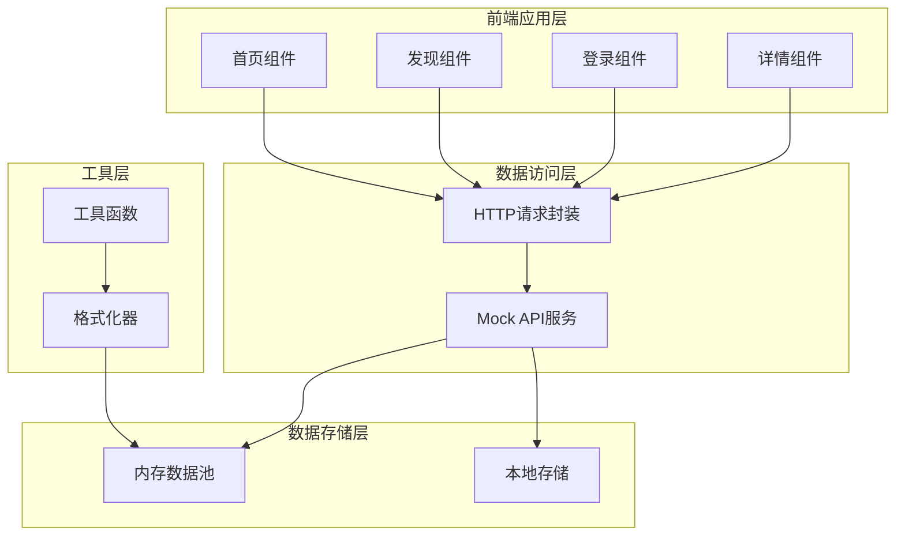

**图表来源**
- [src/utils/http.ts:1-165](file://src/utils/http.ts#L1-L165)
- [src/api/mock.ts:1-98](file://src/api/mock.ts#L1-L98)

### 环境适配机制

系统通过环境变量和构建配置实现多环境适配：

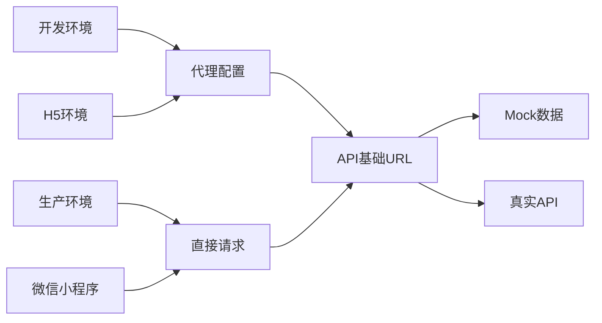

**图表来源**
- [config/dev.ts:1-23](file://config/dev.ts#L1-L23)
- [config/prod.ts:1-34](file://config/prod.ts#L1-L34)
- [src/utils/http.ts:1-21](file://src/utils/http.ts#L1-L21)

**章节来源**
- [config/index.ts:1-82](file://config/index.ts#L1-L82)
- [src/utils/http.ts:1-165](file://src/utils/http.ts#L1-L165)

## 详细组件分析

### HTTP请求封装系统

HTTP请求封装是Mock数据系统的核心基础设施，提供了统一的请求处理机制：

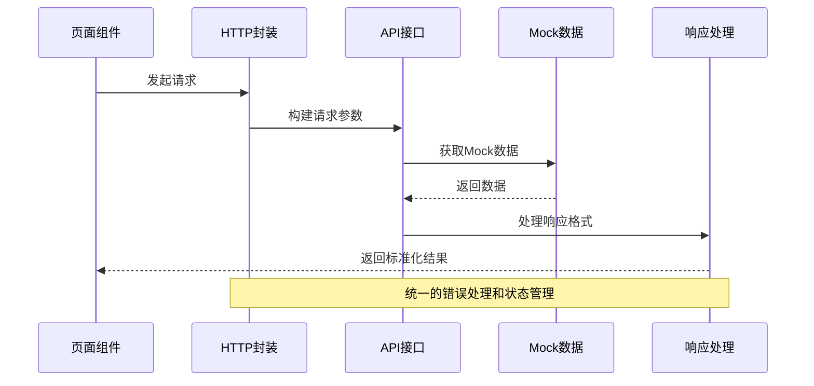

**图表来源**
- [src/utils/http.ts:46-110](file://src/utils/http.ts#L46-L110)

#### 请求流程控制

HTTP封装实现了完整的请求生命周期管理：

1. **URL构建**：根据环境变量动态确定API基础地址
2. **参数处理**：支持查询参数和请求体参数
3. **响应解析**：统一处理业务逻辑和HTTP状态码
4. **错误处理**：提供友好的错误提示和重试机制

**章节来源**
- [src/utils/http.ts:1-165](file://src/utils/http.ts#L1-L165)

### 首页Mock数据实现

首页组件使用本地Mock数据实现瀑布流布局，提供完整的用户体验：

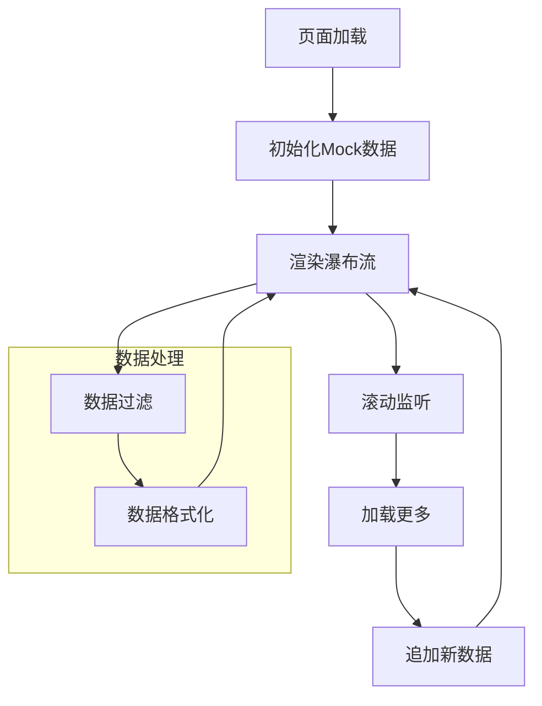

**图表来源**
- [src/pages/home/index.tsx:70-151](file://src/pages/home/index.tsx#L70-L151)

#### 数据处理策略

首页组件采用了高效的Mock数据处理策略：

- **分页加载**：通过`loadMore`函数实现无限滚动
- **数据去重**：使用时间戳确保新数据的唯一性
- **状态管理**：合理处理加载状态和错误状态

**章节来源**
- [src/pages/home/index.tsx:1-151](file://src/pages/home/index.tsx#L1-L151)

### 发现页面Mock数据

发现页面展示了Mock数据在不同场景下的应用：

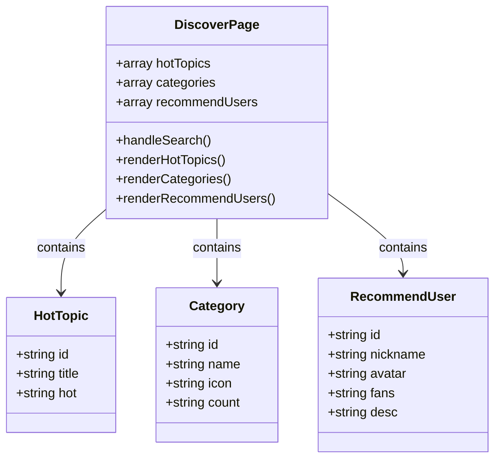

**图表来源**
- [src/pages/discover/index.tsx:1-119](file://src/pages/discover/index.tsx#L1-L119)

**章节来源**
- [src/pages/discover/index.tsx:1-119](file://src/pages/discover/index.tsx#L1-L119)

### 登录流程Mock实现

登录组件提供了完整的登录流程Mock实现：

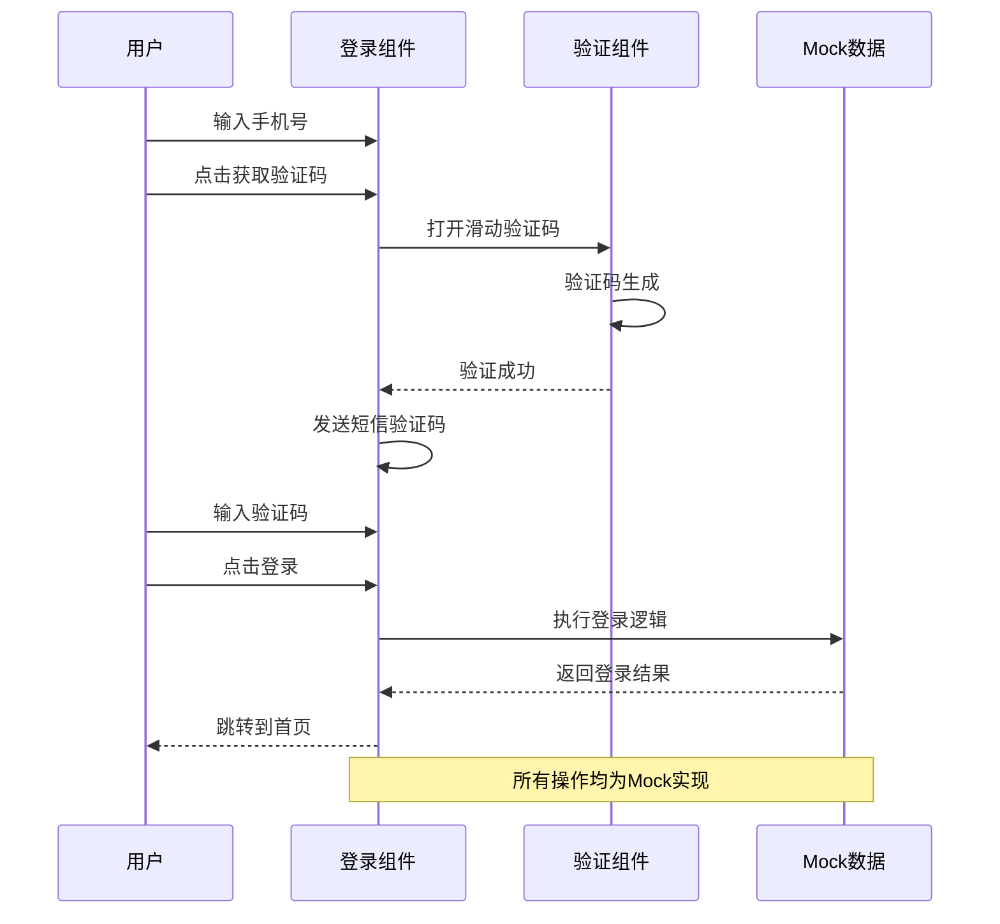

**图表来源**
- [src/pages/login/index.tsx:84-143](file://src/pages/login/index.tsx#L84-L143)
- [src/components/SliderVerify/index.tsx:127-181](file://src/components/SliderVerify/index.tsx#L127-L181)

#### 验证码系统集成

滑动验证码组件与Mock数据系统的深度集成：

- **验证码生成**：通过`/captcha/generate`接口获取验证数据
- **轨迹记录**：精确记录用户的滑动轨迹
- **验证逻辑**：通过`/captcha/check`接口验证结果

**章节来源**
- [src/pages/login/index.tsx:1-243](file://src/pages/login/index.tsx#L1-L243)
- [src/components/SliderVerify/index.tsx:1-463](file://src/components/SliderVerify/index.tsx#L1-L463)

## 依赖分析

### 核心依赖关系

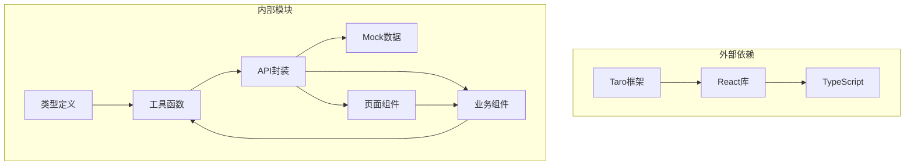

**图表来源**
- [package.json:39-92](file://package.json#L39-L92)
- [src/utils/http.ts:1-165](file://src/utils/http.ts#L1-L165)

### 数据流依赖

系统中的数据流向呈现清晰的层次结构：

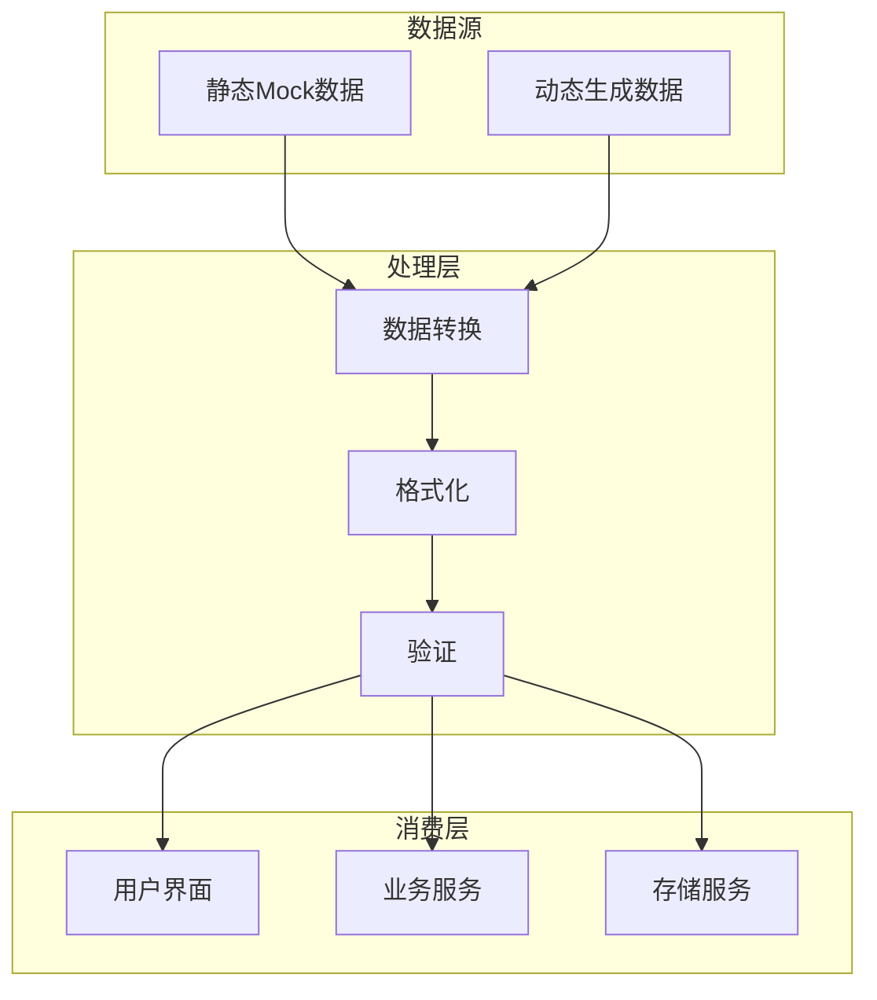

**图表来源**
- [src/api/mock.ts:1-98](file://src/api/mock.ts#L1-L98)
- [src/utils/index.ts:1-49](file://src/utils/index.ts#L1-L49)

**章节来源**
- [package.json:1-93](file://package.json#L1-L93)

## 性能考虑

### 内存优化策略

Mock数据系统在设计时充分考虑了性能优化：

- **按需加载**：只在需要时创建和使用数据
- **数据复用**：通过对象引用避免重复创建
- **垃圾回收**：及时清理不再使用的数据引用

### 缓存机制

系统实现了多层次的缓存策略：

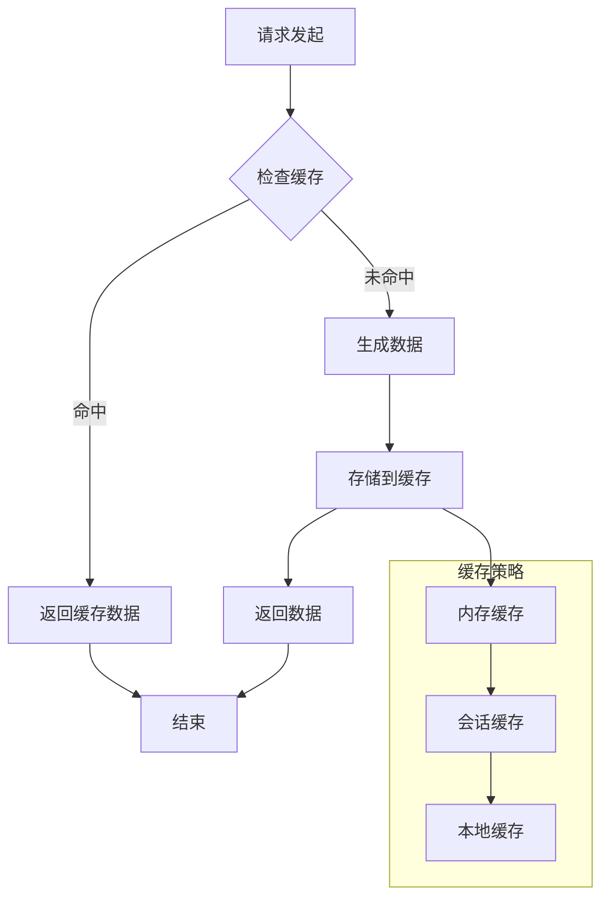

### 并发处理

系统支持并发请求处理：

- **异步操作**：所有数据操作都是异步的
- **防抖处理**：避免频繁的重复请求
- **超时控制**：设置合理的请求超时时间

## 故障排除指南

### 常见问题诊断

**网络请求失败**：
- 检查环境变量配置
- 验证代理设置是否正确
- 确认Mock数据是否可用

**数据格式错误**：
- 对比类型定义和实际数据
- 检查字段映射关系
- 验证数据转换逻辑

**组件渲染异常**：
- 检查数据结构完整性
- 验证组件props传递
- 确认状态更新时机

### 调试技巧

1. **日志输出**：在关键节点添加console.log
2. **断点调试**：使用浏览器开发者工具
3. **数据验证**：打印关键数据结构进行检查
4. **环境隔离**：分别测试不同环境的兼容性

**章节来源**
- [src/utils/http.ts:88-107](file://src/utils/http.ts#L88-L107)

## 结论

红书项目的Mock数据系统是一个设计精良、功能完整的开发辅助工具。通过精心设计的数据模型、完善的Mock实现和灵活的扩展机制，系统能够有效支持开发环境下的完整功能演示。

系统的主要优势包括：
- **类型安全**：完整的TypeScript类型定义确保开发体验
- **环境适配**：支持多种运行环境的无缝切换
- **扩展性强**：模块化的架构便于功能扩展
- **开发友好**：提供便捷的Mock数据管理和调试工具

未来可以在以下方面进一步改进：
- 增加更多的Mock数据生成规则
- 实现更复杂的业务场景模拟
- 提供可视化数据管理界面
- 加强与真实API的同步机制

## 附录

### API接口规范

系统遵循统一的API响应格式：

```typescript
interface IResponse<T> {
  code: number;
  data: T;
  msg?: string;
  message?: string;
}
```

### 数据持久化策略

虽然当前版本主要使用内存存储，但系统设计支持多种存储方案：

- **内存存储**：适用于临时数据和会话状态
- **本地存储**：使用localStorage或sessionStorage
- **IndexedDB**：支持大量数据的持久化存储

### 扩展指南

新增Mock数据类型的步骤：
1. 在类型定义文件中添加新的接口
2. 在Mock数据文件中添加相应的数据
3. 在组件中引入和使用新数据
4. 更新相关的类型定义和导入语句