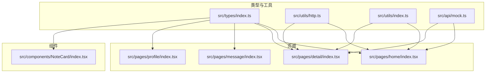
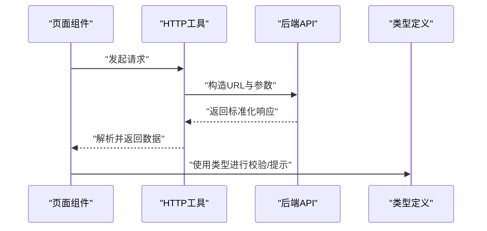
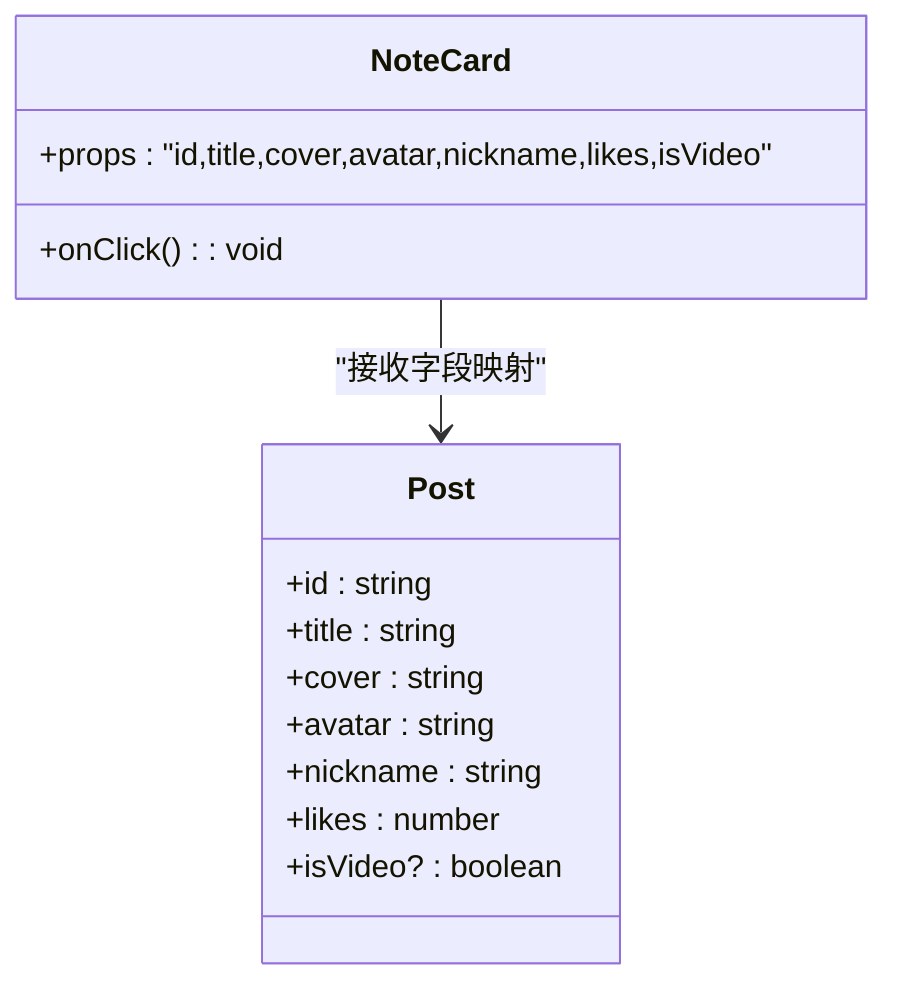
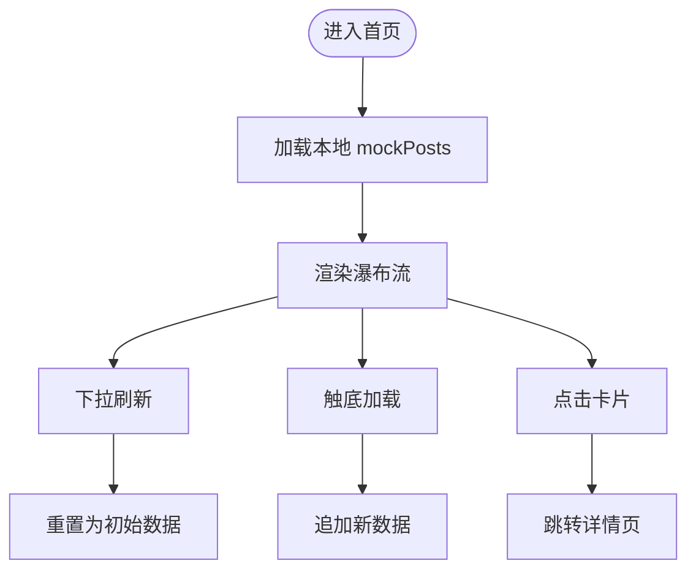
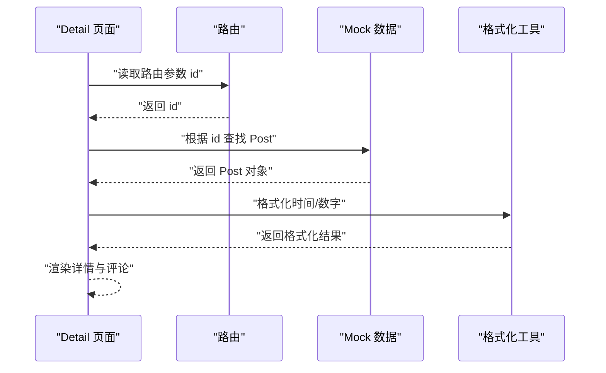
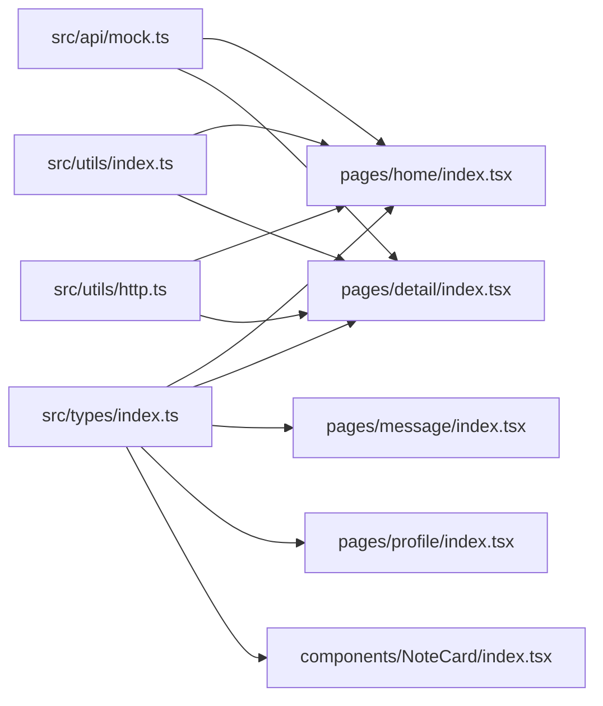

# 数据模型

<cite>
**本文引用的文件列表**
- [src/types/index.ts](file://src/types/index.ts)
- [src/api/mock.ts](file://src/api/mock.ts)
- [src/utils/http.ts](file://src/utils/http.ts)
- [src/utils/index.ts](file://src/utils/index.ts)
- [src/components/NoteCard/index.tsx](file://src/components/NoteCard/index.tsx)
- [src/pages/home/index.tsx](file://src/pages/home/index.tsx)
- [src/pages/detail/index.tsx](file://src/pages/detail/index.tsx)
- [src/pages/message/index.tsx](file://src/pages/message/index.tsx)
- [src/pages/profile/index.tsx](file://src/pages/profile/index.tsx)
- [src/app.config.ts](file://src/app.config.ts)
- [tsconfig.json](file://tsconfig.json)
- [package.json](file://package.json)
</cite>

## 目录
1. [简介](#简介)
2. [项目结构](#项目结构)
3. [核心数据模型](#核心数据模型)
4. [架构总览](#架构总览)
5. [详细组件分析](#详细组件分析)
6. [依赖关系分析](#依赖关系分析)
7. [性能考量](#性能考量)
8. [故障排查指南](#故障排查指南)
9. [结论](#结论)
10. [附录](#附录)

## 简介
本文件为红书项目的数据模型文档，聚焦于核心数据结构的定义与使用，包括：
- Post 帖子模型
- User 用户模型
- Comment 评论模型
- Message 消息模型
- Topic 话题模型

文档内容涵盖字段定义、数据类型、约束条件与业务规则；解释实体间关系映射（如用户与帖子的一对多、评论与帖子的关联）；提供 Mock 数据结构说明与生成规则；并给出数据验证、序列化/反序列化处理建议，以及后端集成与前端状态管理的接口约定。

## 项目结构
该项目基于 Taro 多端框架（React + TypeScript），采用模块化组织方式：
- 类型定义集中在 src/types/index.ts
- Mock 数据集中在 src/api/mock.ts
- HTTP 请求封装在 src/utils/http.ts
- 工具函数在 src/utils/index.ts
- 页面组件在 src/pages 下，按功能页面划分
- 组件在 src/components 下，如 NoteCard
- 应用配置在 src/app.config.ts

图表来源
- [src/types/index.ts:1-147](file://src/types/index.ts#L1-L147)
- [src/api/mock.ts:1-98](file://src/api/mock.ts#L1-L98)
- [src/utils/http.ts:1-157](file://src/utils/http.ts#L1-L157)
- [src/utils/index.ts:1-49](file://src/utils/index.ts#L1-L49)
- [src/pages/home/index.tsx:1-151](file://src/pages/home/index.tsx#L1-L151)
- [src/pages/detail/index.tsx:1-180](file://src/pages/detail/index.tsx#L1-L180)
- [src/pages/message/index.tsx:1-117](file://src/pages/message/index.tsx#L1-L117)
- [src/pages/profile/index.tsx:1-177](file://src/pages/profile/index.tsx#L1-L177)
- [src/components/NoteCard/index.tsx:1-53](file://src/components/NoteCard/index.tsx#L1-L53)

章节来源
- [src/app.config.ts:1-18](file://src/app.config.ts#L1-L18)
- [tsconfig.json:1-31](file://tsconfig.json#L1-L31)
- [package.json:1-93](file://package.json#L1-L93)

## 核心数据模型

### Post 帖子模型
- 字段定义与类型
  - id: string
  - title: string
  - content?: string
  - cover: string
  - images?: string[]
  - avatar: string
  - nickname: string
  - userId: string
  - likes: number
  - comments: number
  - collects: number
  - isVideo?: boolean
  - videoUrl?: string
  - topic?: string
  - location?: string
  - createdAt: string（ISO 8601 时间字符串）
- 约束与业务规则
  - 必填字段：id, title, cover, avatar, nickname, userId, likes, comments, collects, createdAt
  - 可选字段：content, images, isVideo, videoUrl, topic, location
  - images 为封面图数组，若为空则回退到 cover
  - isVideo 为真时，通常存在视频资源标识（videoUrl）
  - createdAt 用于排序与时间显示格式化
- 关系映射
  - 与 User：通过 userId 关联到发布者
  - 与 Comment：一对多（一个帖子可有多个评论）

章节来源
- [src/types/index.ts:1-18](file://src/types/index.ts#L1-L18)
- [src/api/mock.ts:36-88](file://src/api/mock.ts#L36-L88)
- [src/pages/detail/index.tsx:72](file://src/pages/detail/index.tsx#L72)

### User 用户模型
- 字段定义与类型
  - id: string
  - nickname: string
  - avatar: string
  - signature: string
  - fans: number
  - following: number
  - likes: number
  - isFollowing?: boolean
- 约束与业务规则
  - 必填字段：id, nickname, avatar, signature, fans, following, likes
  - 可选字段：isFollowing（仅在交互场景下使用）
  - 数值字段用于展示统计信息
- 关系映射
  - 与 Post：一对多（一个用户可发布多个帖子）
  - 与 Comment：一对多（一个用户可发表多个评论）

章节来源
- [src/types/index.ts:20-29](file://src/types/index.ts#L20-L29)
- [src/api/mock.ts:3-34](file://src/api/mock.ts#L3-L34)
- [src/pages/profile/index.tsx:24-32](file://src/pages/profile/index.tsx#L24-L32)

### Comment 评论模型
- 字段定义与类型
  - id: string
  - content: string
  - userId: string
  - nickname: string
  - avatar: string
  - likes: number
  - createdAt: string（ISO 8601 时间字符串）
  - replyTo?: string（回复目标评论 id）
- 约束与业务规则
  - 必填字段：id, content, userId, nickname, avatar, likes, createdAt
  - 可选字段：replyTo（支持二级评论或回复）
  - createdAt 用于排序与时间显示格式化
- 关系映射
  - 与 Post：多对一（多个评论属于一个帖子）
  - 与 User：多对一（多个评论由一个用户发表）

章节来源
- [src/types/index.ts:31-40](file://src/types/index.ts#L31-L40)
- [src/pages/detail/index.tsx:8-21](file://src/pages/detail/index.tsx#L8-L21)

### Message 消息模型
- 字段定义与类型
  - id: string
  - type: 'like' | 'comment' | 'follow' | 'system' | 'mention'
  - title: string
  - content: string
  - avatar?: string
  - nickname?: string
  - createdAt: string（ISO 8601 时间字符串）
  - isRead: boolean
- 约束与业务规则
  - 必填字段：id, type, title, content, createdAt, isRead
  - 可选字段：avatar, nickname
  - type 限定枚举值，用于分类消息类型
  - isRead 用于标记消息是否已读
- 关系映射
  - 与 User：多对一（消息通常指向某个用户或系统）
  - 与 Post：间接关联（如点赞、评论、@ 提及可能涉及帖子）

章节来源
- [src/types/index.ts:42-51](file://src/types/index.ts#L42-L51)
- [src/pages/message/index.tsx:6-12](file://src/pages/message/index.tsx#L6-L12)

### Topic 话题模型
- 字段定义与类型
  - id: string
  - title: string
  - cover: string
  - participants: number
  - notes: number
- 约束与业务规则
  - 必填字段：id, title, cover, participants, notes
  - 数值字段用于统计参与人数与帖子数量
- 关系映射
  - 与 Post：多对多（一个话题可关联多个帖子，一个帖子可关联多个话题）

章节来源
- [src/types/index.ts:53-59](file://src/types/index.ts#L53-L59)
- [src/api/mock.ts:90-97](file://src/api/mock.ts#L90-L97)

## 架构总览
数据流从 Mock 或后端 API 获取，经 HTTP 封装统一处理，再注入到页面组件与组件中进行渲染与交互。

图表来源
- [src/utils/http.ts:38-102](file://src/utils/http.ts#L38-L102)
- [src/types/index.ts:1-147](file://src/types/index.ts#L1-L147)

## 详细组件分析

### 组件：NoteCard（帖子卡片）
- 功能概述
  - 展示帖子封面、标题、作者头像与昵称、点赞数
  - 支持视频角标显示
  - 点击跳转至详情页
- 数据绑定
  - 接收 props：id, title, cover, avatar, nickname, likes, isVideo
  - 使用 Taro 导航跳转至详情页
- 与数据模型的关系
  - 与 Post 的字段映射：id, title, cover, avatar, nickname, likes, isVideo
  - 与 Detail 页面联动：通过 id 进入详情

图表来源
- [src/components/NoteCard/index.tsx:5-13](file://src/components/NoteCard/index.tsx#L5-L13)
- [src/types/index.ts:1-18](file://src/types/index.ts#L1-L18)

章节来源
- [src/components/NoteCard/index.tsx:1-53](file://src/components/NoteCard/index.tsx#L1-L53)
- [src/types/index.ts:1-18](file://src/types/index.ts#L1-L18)

### 页面：Home（首页瀑布流）
- 功能概述
  - 展示帖子瀑布流，支持下拉刷新与上拉加载更多
  - 分类标签切换（推荐、关注、附近、美食、穿搭）
- 数据来源
  - 使用本地 mockPosts（类型为 Post[]）
  - 加载更多时复制并追加新数据
- 与数据模型的关系
  - Post 字段映射：id, title, cover, avatar, nickname, likes, isVideo
  - 与 NoteCard 组件组合使用

图表来源
- [src/pages/home/index.tsx:17-26](file://src/pages/home/index.tsx#L17-L26)
- [src/pages/home/index.tsx:83-91](file://src/pages/home/index.tsx#L83-L91)
- [src/pages/home/index.tsx:104-105](file://src/pages/home/index.tsx#L104-L105)
- [src/pages/home/index.tsx:28-68](file://src/pages/home/index.tsx#L28-L68)

章节来源
- [src/pages/home/index.tsx:1-151](file://src/pages/home/index.tsx#L1-L151)
- [src/types/index.ts:1-18](file://src/types/index.ts#L1-L18)

### 页面：Detail（帖子详情）
- 功能概述
  - 展示作者信息、图片轮播、标题、正文、话题标签、位置、发布时间
  - 展示评论列表，支持点赞、收藏、分享、关注
- 数据来源
  - 使用 mockPosts 与 mockComments
  - 通过路由参数 id 查找对应帖子
- 与数据模型的关系
  - Post 字段映射：images、topic、location、createdAt
  - Comment 字段映射：avatar、nickname、content、likes、createdAt
  - 与 utils 中 formatTime/formatNumber 的格式化配合

图表来源
- [src/pages/detail/index.tsx:23-40](file://src/pages/detail/index.tsx#L23-L40)
- [src/pages/detail/index.tsx:72](file://src/pages/detail/index.tsx#L72)
- [src/utils/index.ts:8-23](file://src/utils/index.ts#L8-L23)

章节来源
- [src/pages/detail/index.tsx:1-180](file://src/pages/detail/index.tsx#L1-L180)
- [src/types/index.ts:1-18](file://src/types/index.ts#L1-L18)
- [src/types/index.ts:31-40](file://src/types/index.ts#L31-L40)
- [src/utils/index.ts:1-49](file://src/utils/index.ts#L1-L49)

### 页面：Message（消息中心）
- 功能概述
  - 展示消息类型分类与未读数
  - 展示最近会话列表（私信）
- 数据来源
  - messageTypes 与 conversations 为本地模拟数据
- 与数据模型的关系
  - Message 类型用于消息分类与展示
  - 私信会话与 User 的头像、昵称等字段映射

章节来源
- [src/pages/message/index.tsx:1-117](file://src/pages/message/index.tsx#L1-L117)
- [src/types/index.ts:42-51](file://src/types/index.ts#L42-L51)

### 页面：Profile（个人主页）
- 功能概述
  - 展示用户信息、统计数据、菜单项与笔记网格
  - 支持登录入口与编辑资料
- 数据来源
  - user 为本地模拟数据
  - notes 为本地模拟数据
- 与数据模型的关系
  - User 字段映射：avatar、nickname、id、signature、fans、following、likes
  - 与 NoteGrid 组件组合展示用户笔记

章节来源
- [src/pages/profile/index.tsx:1-177](file://src/pages/profile/index.tsx#L1-L177)
- [src/types/index.ts:20-29](file://src/types/index.ts#L20-L29)

## 依赖关系分析
- 类型依赖
  - 所有页面与组件均依赖 src/types/index.ts 中的接口定义
- 数据依赖
  - 页面与组件依赖 src/api/mock.ts 提供的本地 Mock 数据
- 工具依赖
  - 页面与组件依赖 src/utils/index.ts 的格式化工具
  - 页面与组件依赖 src/utils/http.ts 的 HTTP 请求封装

图表来源
- [src/types/index.ts:1-147](file://src/types/index.ts#L1-L147)
- [src/api/mock.ts:1-98](file://src/api/mock.ts#L1-L98)
- [src/utils/index.ts:1-49](file://src/utils/index.ts#L1-L49)
- [src/utils/http.ts:1-157](file://src/utils/http.ts#L1-L157)
- [src/pages/home/index.tsx:1-151](file://src/pages/home/index.tsx#L1-L151)
- [src/pages/detail/index.tsx:1-180](file://src/pages/detail/index.tsx#L1-L180)
- [src/pages/message/index.tsx:1-117](file://src/pages/message/index.tsx#L1-L117)
- [src/pages/profile/index.tsx:1-177](file://src/pages/profile/index.tsx#L1-L177)
- [src/components/NoteCard/index.tsx:1-53](file://src/components/NoteCard/index.tsx#L1-L53)

章节来源
- [src/types/index.ts:1-147](file://src/types/index.ts#L1-L147)
- [src/api/mock.ts:1-98](file://src/api/mock.ts#L1-L98)
- [src/utils/index.ts:1-49](file://src/utils/index.ts#L1-L49)
- [src/utils/http.ts:1-157](file://src/utils/http.ts#L1-L157)

## 性能考量
- 渲染优化
  - 首屏瀑布流分列渲染，减少长列表重排
  - 图片懒加载与宽度自适应，降低首屏阻塞
- 数据处理
  - 使用本地 Mock 数据时，避免不必要的深拷贝与重复计算
  - 触底加载采用延迟追加策略，避免频繁重绘
- 时间与数字格式化
  - 使用 formatTime 与 formatNumber 减少重复计算与字符串拼接

章节来源
- [src/pages/home/index.tsx:104-105](file://src/pages/home/index.tsx#L104-L105)
- [src/utils/index.ts:1-49](file://src/utils/index.ts#L1-L49)

## 故障排查指南
- HTTP 请求错误
  - 统一响应结构包含 code、data、msg/message，业务错误与 HTTP 错误分别处理
  - 网络错误时默认弹出提示，可在调用时隐藏错误提示
- 时间显示异常
  - createdAt 为 ISO 8601 字符串，确保前端解析一致
  - formatTime 逻辑基于当前时间差，注意跨时区与夏令时影响
- Mock 数据不一致
  - 确保路由参数 id 与 mockPosts 中 id 匹配
  - 加载更多时需保证 id 唯一性，避免重复渲染

章节来源
- [src/utils/http.ts:17-23](file://src/utils/http.ts#L17-L23)
- [src/utils/http.ts:38-102](file://src/utils/http.ts#L38-L102)
- [src/utils/index.ts:8-23](file://src/utils/index.ts#L8-L23)
- [src/pages/detail/index.tsx:23-40](file://src/pages/detail/index.tsx#L23-L40)

## 结论
本数据模型文档明确了红书项目中核心实体的字段、类型、约束与业务规则，并梳理了实体间关系与组件/页面的使用方式。通过 Mock 数据与 HTTP 工具的配合，实现了前后端解耦与可扩展的数据层设计。后续在接入真实后端时，可依据本文档的接口约定与类型定义进行对接与迁移。

## 附录

### Mock 数据结构说明与生成规则
- Mock 数据来源
  - 用户：包含 id、昵称、头像、签名、粉丝数、关注数、获赞数、是否关注
  - 帖子：包含 id、标题、封面、图片数组、作者头像与昵称、用户 id、点赞数、评论数、收藏数、是否视频、话题、位置、创建时间
  - 话题：包含 id、标题、封面、参与人数、帖子数
- 生成规则
  - 使用随机图片链接作为封面与头像
  - 帖子 images 为空时回退到 cover
  - 加载更多时复制现有帖子并变更 id，保持字段一致性

章节来源
- [src/api/mock.ts:3-34](file://src/api/mock.ts#L3-L34)
- [src/api/mock.ts:36-88](file://src/api/mock.ts#L36-L88)
- [src/api/mock.ts:90-97](file://src/api/mock.ts#L90-L97)

### 数据验证与序列化/反序列化建议
- 建议在运行时对关键字段进行基础校验（如 id 非空、数值字段非负、时间字符串格式）
- 对外暴露的接口建议采用统一响应结构（参考 HTTP 工具中的 IResponse）
- 前端可结合 TypeScript 类型系统实现编译期校验，运行时可增加轻量级校验器

章节来源
- [src/utils/http.ts:17-23](file://src/utils/http.ts#L17-L23)
- [src/types/index.ts:1-147](file://src/types/index.ts#L1-L147)