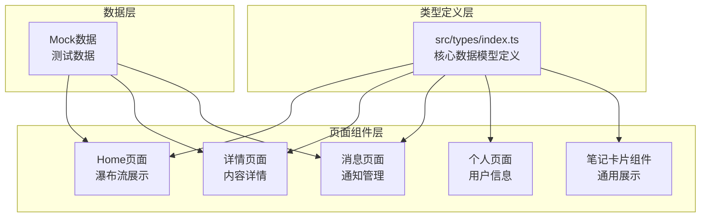
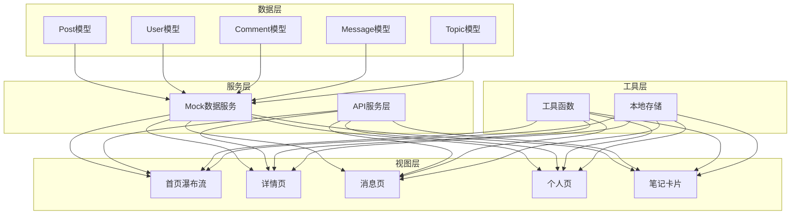
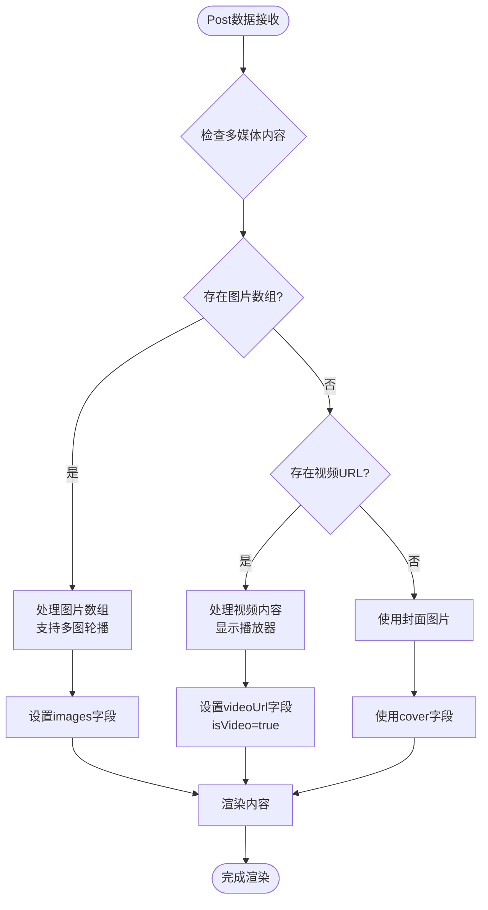
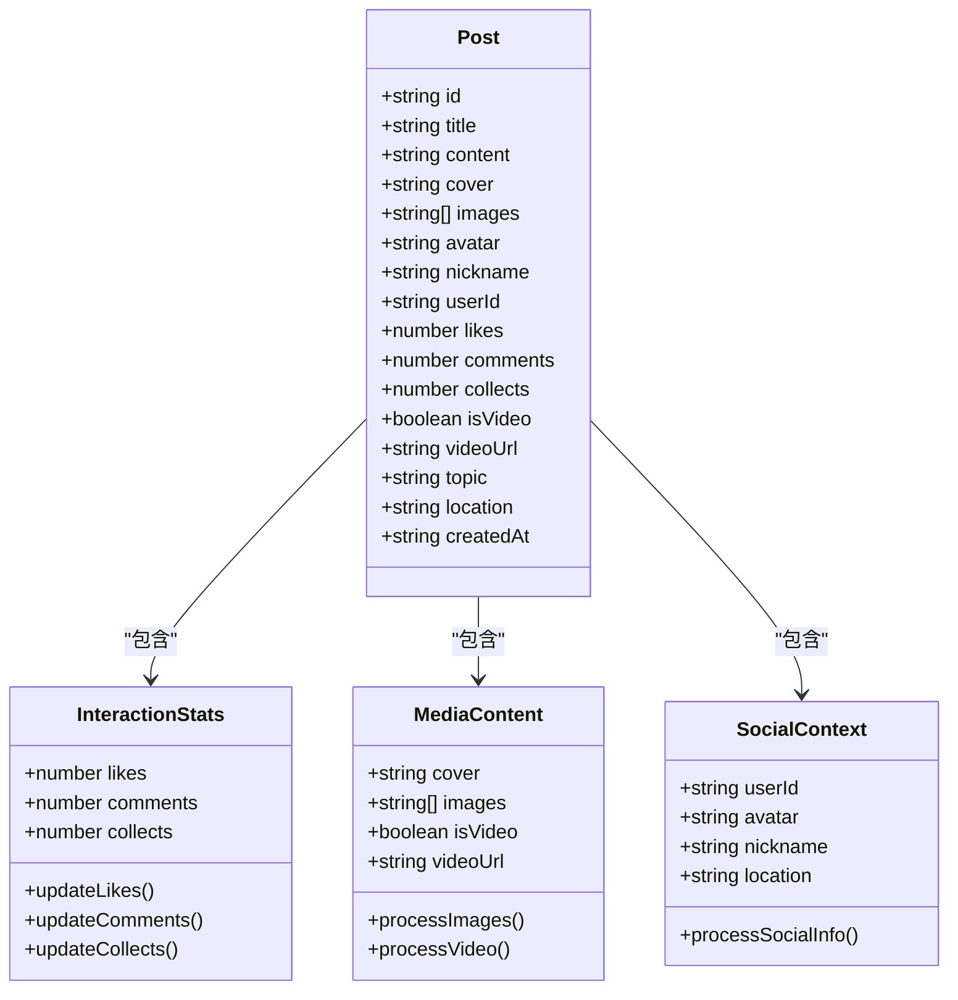
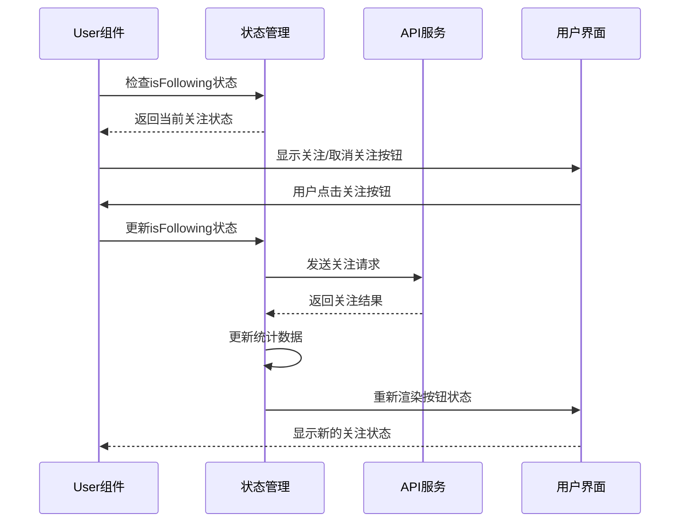
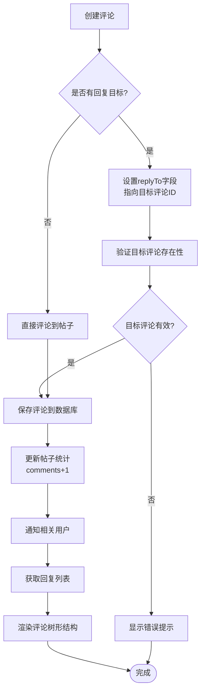
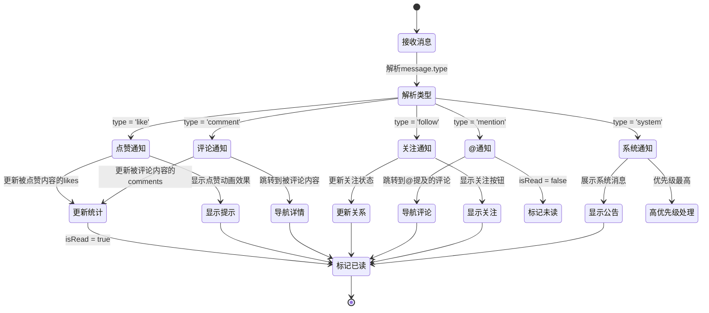
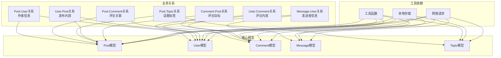

# 核心数据模型

<cite>
**本文档引用的文件**
- [src/types/index.ts](file://src/types/index.ts)
- [src/api/mock.ts](file://src/api/mock.ts)
- [src/pages/detail/index.tsx](file://src/pages/detail/index.tsx)
- [src/pages/home/index.tsx](file://src/pages/home/index.tsx)
- [src/components/NoteCard/index.tsx](file://src/components/NoteCard/index.tsx)
- [src/pages/message/index.tsx](file://src/pages/message/index.tsx)
- [src/pages/profile/index.tsx](file://src/pages/profile/index.tsx)
</cite>

## 目录
1. [简介](#简介)
2. [项目结构](#项目结构)
3. [核心数据模型](#核心数据模型)
4. [架构概览](#架构概览)
5. [详细组件分析](#详细组件分析)
6. [依赖关系分析](#依赖关系分析)
7. [性能考虑](#性能考虑)
8. [故障排除指南](#故障排除指南)
9. [结论](#结论)

## 简介

红书项目是一个基于Taro框架开发的多端应用，专注于内容分享和社交互动。本文档详细介绍了项目的核心数据模型，包括Post帖子模型、User用户模型、Comment评论模型、Message消息模型和Topic话题模型的完整定义。这些模型构成了应用的数据基础，支持内容展示、用户交互、消息通知等功能。

## 项目结构

项目采用模块化的组织方式，核心数据模型定义在统一的类型文件中，各页面组件通过导入这些类型来确保数据结构的一致性。

**图表来源**
- [src/types/index.ts:1-147](file://src/types/index.ts#L1-L147)
- [src/pages/home/index.tsx:1-151](file://src/pages/home/index.tsx#L1-L151)
- [src/pages/detail/index.tsx:1-180](file://src/pages/detail/index.tsx#L1-L180)

## 核心数据模型

### Post 帖子模型

Post模型代表用户发布的内容帖子，是整个应用的核心数据实体。

**字段定义：**

| 字段名 | 类型 | 必填 | 描述 | 示例值 |
|--------|------|------|------|--------|
| id | string | 是 | 帖子唯一标识符 | "1" |
| title | string | 是 | 帖子标题 | "今日穿搭分享" |
| content | string | 否 | 帖子正文内容 | "分享一些穿搭心得..." |
| cover | string | 是 | 帖子封面图片URL | "https://picsum.photos/300/400" |
| images | string[] | 否 | 帖子内图片列表 | ["img1.jpg", "img2.jpg"] |
| avatar | string | 是 | 发布者头像URL | "https://picsum.photos/100/100" |
| nickname | string | 是 | 发布者昵称 | "时尚达人" |
| userId | string | 是 | 发布者用户ID | "1" |
| likes | number | 是 | 点赞数 | 1234 |
| comments | number | 是 | 评论数 | 89 |
| collects | number | 是 | 收藏数 | 456 |
| isVideo | boolean | 否 | 是否为视频内容 | true |
| videoUrl | string | 否 | 视频播放URL | "https://example.com/video.mp4" |
| topic | string | 否 | 所属话题标签 | "穿搭" |
| location | string | 否 | 地理位置信息 | "上海" |
| createdAt | string | 是 | 创建时间（ISO格式） | "2024-01-15T10:30:00" |

**业务约束：**
- 所有数值字段必须为非负整数
- 图片URL必须为有效的HTTP/HTTPS地址
- 时间戳必须符合ISO 8601标准格式
- 多媒体内容字段互斥：当存在videoUrl时，通常不显示images数组

### User 用户模型

User模型描述应用中的用户信息和社交关系状态。

**字段定义：**

| 字段名 | 类型 | 必填 | 描述 | 示例值 |
|--------|------|------|------|--------|
| id | string | 是 | 用户唯一标识符 | "1" |
| nickname | string | 是 | 用户昵称 | "时尚达人" |
| avatar | string | 是 | 用户头像URL | "https://picsum.photos/200/200" |
| signature | string | 是 | 用户签名/简介 | "专注时尚穿搭分享" |
| fans | number | 是 | 粉丝数量 | 12300 |
| following | number | 是 | 关注数量 | 567 |
| likes | number | 是 | 获得的点赞总数 | 89000 |
| isFollowing | boolean | 否 | 当前登录用户是否关注该用户 | false |

**业务约束：**
- 数值字段必须为非负整数
- 头像URL必须为有效的图片地址
- 关注关系字段仅在用户登录状态下有意义
- 统计数据应实时更新以反映最新的社交行为

### Comment 评论模型

Comment模型表示用户对帖子的评论内容。

**字段定义：**

| 字段名 | 类型 | 必填 | 描述 | 示例值 |
|--------|------|------|------|--------|
| id | string | 是 | 评论唯一标识符 | "1" |
| content | string | 是 | 评论内容文本 | "太棒了！学到了很多" |
| userId | string | 是 | 评论者用户ID | "2" |
| nickname | string | 是 | 评论者昵称 | "用户A" |
| avatar | string | 是 | 评论者头像URL | "https://picsum.photos/100/100" |
| likes | number | 是 | 评论获得的点赞数 | 23 |
| createdAt | string | 是 | 评论创建时间 | "2024-01-15T12:00:00" |
| replyTo | string | 否 | 回复的目标评论ID（用于二级评论） | "1" |

**业务约束：**
- 回复机制支持无限层级嵌套
- 评论内容长度应有限制（建议不超过1000字符）
- 回复目标必须存在于同一帖子下
- 评论按时间倒序排列显示

### Message 消息模型

Message模型管理应用内的各种通知和消息类型。

**字段定义：**

| 字段名 | 类型 | 必填 | 描述 | 示例值 |
|--------|------|------|------|--------|
| id | string | 是 | 消息唯一标识符 | "1" |
| type | 'like' \| 'comment' \| 'follow' \| 'system' \| 'mention' | 是 | 消息类型枚举 | "like" |
| title | string | 是 | 消息标题 | "点赞通知" |
| content | string | 是 | 消息内容 | "有人赞了你的笔记" |
| avatar | string | 否 | 发送者头像URL | "https://picsum.photos/100/100" |
| nickname | string | 否 | 发送者昵称 | "用户A" |
| createdAt | string | 是 | 消息创建时间 | "2024-01-15T12:00:00" |
| isRead | boolean | 是 | 是否已读状态 | true |

**消息类型枚举：**
- `like`: 点赞通知，用户点赞了你的内容
- `comment`: 评论通知，有人评论了你的内容  
- `follow`: 关注通知，有人关注了你
- `system`: 系统通知，官方消息或公告
- `mention`: @通知，有人在评论中@了你

**业务约束：**
- 消息类型必须严格匹配枚举值
- 未读消息应有视觉提示（如红点标记）
- 消息按时间倒序排列
- 系统通知具有最高优先级

### Topic 话题模型

Topic模型表示内容分类和话题标签系统。

**字段定义：**

| 字段名 | 类型 | 必定 | 描述 | 示例值 |
|--------|------|------|------|--------|
| id | string | 是 | 话题唯一标识符 | "1" |
| title | string | 是 | 话题标题 | "秋冬穿搭" |
| cover | string | 是 | 话题封面图片URL | "https://picsum.photos/300/300" |
| participants | number | 是 | 参与人数 | 123400 |
| notes | number | 是 | 相关笔记数量 | 56700 |

**业务约束：**
- 话题名称应简洁明了，便于用户理解
- 参与人数和笔记数量应实时更新
- 话题封面应符合平台设计规范
- 话题热度可通过参与人数和笔记数量综合评估

## 架构概览

应用采用分层架构设计，核心数据模型作为数据层的基础，向上支撑各个业务页面和组件。

**图表来源**
- [src/types/index.ts:1-147](file://src/types/index.ts#L1-L147)
- [src/api/mock.ts:1-98](file://src/api/mock.ts#L1-L98)

## 详细组件分析

### Post模型的多媒体内容处理

Post模型支持多种内容形式，包括静态图片和视频内容。

**图表来源**
- [src/types/index.ts:1-18](file://src/types/index.ts#L1-L18)
- [src/pages/detail/index.tsx:72-110](file://src/pages/detail/index.tsx#L72-L110)

### 社交互动字段的实现

Post模型包含多个社交互动指标，用于统计用户参与度。

**图表来源**
- [src/types/index.ts:1-18](file://src/types/index.ts#L1-L18)
- [src/pages/detail/index.tsx:158-176](file://src/pages/detail/index.tsx#L158-L176)

### User模型的关注关系管理

User模型中的关注关系字段支持动态状态更新。

**图表来源**
- [src/types/index.ts:20-29](file://src/types/index.ts#L20-L29)
- [src/pages/detail/index.tsx:42-48](file://src/pages/detail/index.tsx#L42-L48)

### Comment模型的回复机制

Comment模型支持复杂的回复机制，实现多层级评论系统。

**图表来源**
- [src/types/index.ts:31-40](file://src/types/index.ts#L31-L40)
- [src/pages/detail/index.tsx:139-154](file://src/pages/detail/index.tsx#L139-L154)

### Message模型的消息类型处理

Message模型根据不同的消息类型执行相应的业务逻辑。

**图表来源**
- [src/types/index.ts:42-51](file://src/types/index.ts#L42-L51)
- [src/pages/message/index.tsx:49-60](file://src/pages/message/index.tsx#L49-L60)

## 依赖关系分析

核心数据模型之间的依赖关系体现了应用的业务逻辑结构。

**图表来源**
- [src/types/index.ts:1-59](file://src/types/index.ts#L1-L59)

**章节来源**
- [src/types/index.ts:1-147](file://src/types/index.ts#L1-L147)
- [src/api/mock.ts:1-98](file://src/api/mock.ts#L1-L98)

## 性能考虑

### 数据模型优化策略

1. **字段选择性加载**
   - 对于Post模型，可根据页面需求选择性加载多媒体字段
   - 首屏瀑布流仅需基本字段，详情页再加载完整内容

2. **缓存策略**
   - 用户信息和热门话题建立本地缓存
   - 评论列表采用分页加载，避免一次性加载大量数据

3. **内存管理**
   - 图片资源使用懒加载和预加载策略
   - 及时清理不再使用的组件实例和事件监听器

### 渲染性能优化

1. **虚拟滚动**
   - 大量Post列表使用虚拟滚动技术
   - 仅渲染可视区域内的元素

2. **组件复用**
   - 使用NoteCard组件复用相同的数据展示逻辑
   - 减少重复的DOM操作和样式计算

3. **状态更新优化**
   - 使用React.memo优化组件重渲染
   - 合理的状态分割，避免不必要的全局状态更新

## 故障排除指南

### 常见数据模型问题

1. **Post模型字段缺失**
   - 症状：帖子无法正常显示
   - 解决方案：检查必需字段完整性，确保id、title、cover等字段存在

2. **User模型关注状态异常**
   - 症状：关注按钮状态与实际不符
   - 解决方案：验证isFollowing字段的同步机制，检查API响应

3. **Comment模型回复循环**
   - 症状：评论树形结构出现循环引用
   - 解决方案：验证replyTo字段的递归查询逻辑，防止无限循环

4. **Message模型类型错误**
   - 症状：消息类型显示异常
   - 解决方案：检查消息类型的枚举值，确保与后端保持一致

### 数据一致性保证

1. **事务处理**
   - 对于涉及多个模型的操作（如点赞），使用事务确保数据一致性
   - 实现回滚机制处理异常情况

2. **数据验证**
   - 在数据进入模型前进行格式验证
   - 实施边界检查防止异常数据

3. **错误监控**
   - 建立数据模型的错误监控机制
   - 记录异常数据和处理日志

**章节来源**
- [src/pages/detail/index.tsx:42-63](file://src/pages/detail/index.tsx#L42-L63)
- [src/pages/home/index.tsx:83-91](file://src/pages/home/index.tsx#L83-L91)

## 结论

红书项目的核心数据模型设计充分考虑了移动端应用的特点，通过清晰的字段定义、合理的业务约束和完善的依赖关系，为整个应用提供了稳定的数据基础。Post、User、Comment、Message、Topic五个核心模型相互协作，形成了完整的社交内容生态。

模型设计的关键优势包括：
- **类型安全**：通过TypeScript确保编译时类型检查
- **扩展性**：预留可选字段支持未来功能扩展
- **性能优化**：合理的设计减少不必要的数据传输和渲染
- **用户体验**：直观的字段命名和业务逻辑提升使用体验

这些数据模型不仅满足了当前的功能需求，也为未来的功能迭代和业务发展奠定了坚实的基础。