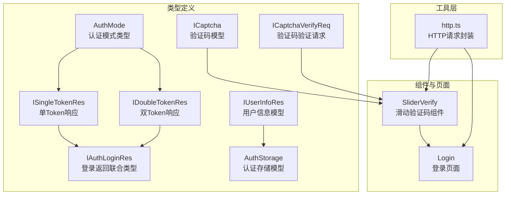
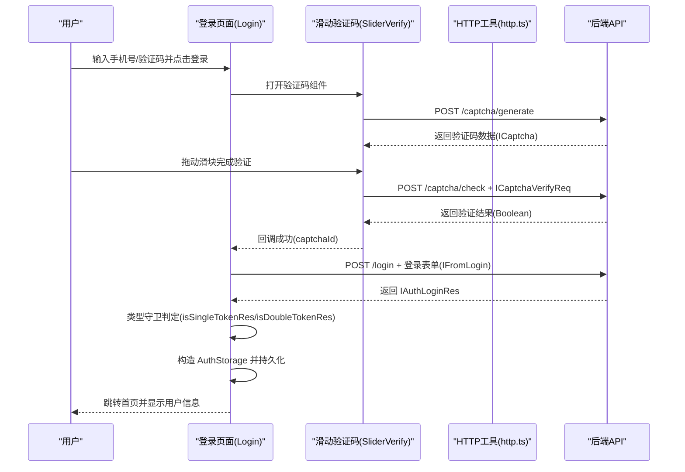
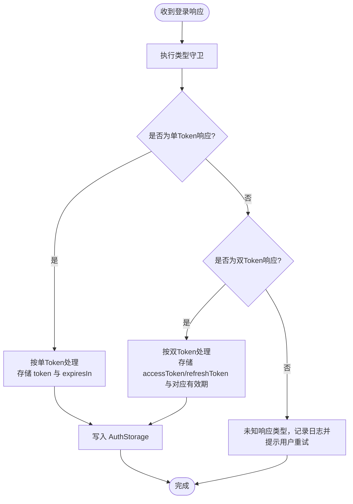
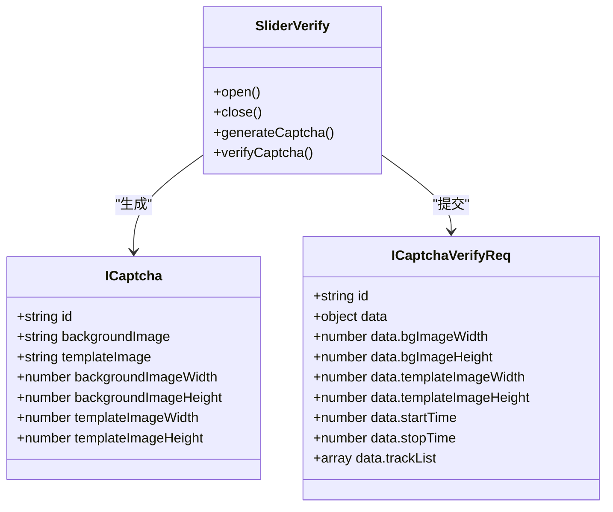
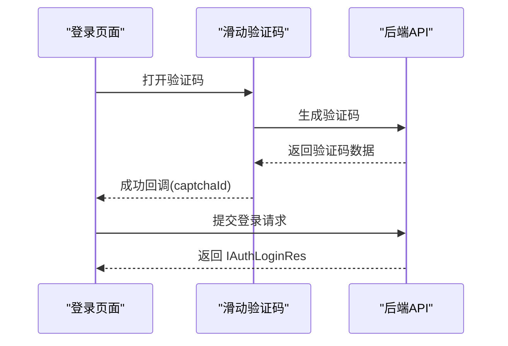
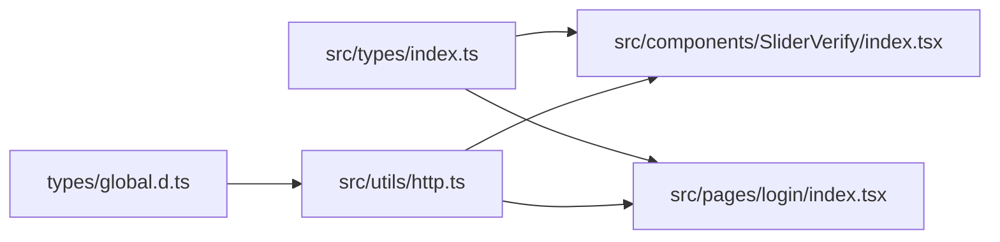

# 认证与权限模型

<cite>
**本文档引用的文件**
- [src/types/index.ts](file://src/types/index.ts)
- [src/components/SliderVerify/index.tsx](file://src/components/SliderVerify/index.tsx)
- [src/pages/login/index.tsx](file://src/pages/login/index.tsx)
- [src/utils/http.ts](file://src/utils/http.ts)
- [types/global.d.ts](file://types/global.d.ts)
</cite>

## 目录
1. [简介](#简介)
2. [项目结构](#项目结构)
3. [核心组件](#核心组件)
4. [架构总览](#架构总览)
5. [详细组件分析](#详细组件分析)
6. [依赖关系分析](#依赖关系分析)
7. [性能考量](#性能考量)
8. [故障排查指南](#故障排查指南)
9. [结论](#结论)

## 简介
本文件聚焦于红书项目的认证与权限系统数据模型，系统性阐述以下主题：
- 认证模式类型（AuthMode）及其在单Token与双Token场景下的差异与选择
- 单Token响应模型（ISingleTokenRes）与双Token响应模型（IDoubleTokenRes）的字段结构与使用场景
- 登录返回联合类型（IAuthLoginRes）的处理逻辑与类型守卫函数（isSingleTokenRes、isDoubleTokenRes）的应用
- 用户信息模型（IUserInfoRes）的字段结构与动态属性处理策略
- 认证存储模型（AuthStorage）的完整结构与登录时间、用户信息的存储策略
- 验证码模型（ICaptcha）与验证码验证请求（ICaptchaVerifyReq）的数据结构
- 认证流程中的数据流转示例与最佳实践

## 项目结构
认证与权限相关的核心类型集中在统一的类型定义文件中，配合滑动验证码组件与登录页面共同构成前端认证链路；HTTP工具负责统一的请求封装与响应处理。

图表来源
- [src/types/index.ts:63-146](file://src/types/index.ts#L63-L146)
- [src/components/SliderVerify/index.tsx:1-463](file://src/components/SliderVerify/index.tsx#L1-L463)
- [src/pages/login/index.tsx:1-243](file://src/pages/login/index.tsx#L1-L243)
- [src/utils/http.ts:1-169](file://src/utils/http.ts#L1-L169)

章节来源
- [src/types/index.ts:63-146](file://src/types/index.ts#L63-L146)
- [src/components/SliderVerify/index.tsx:1-463](file://src/components/SliderVerify/index.tsx#L1-L463)
- [src/pages/login/index.tsx:1-243](file://src/pages/login/index.tsx#L1-L243)
- [src/utils/http.ts:1-169](file://src/utils/http.ts#L1-L169)

## 核心组件
本节对认证与权限系统的关键数据模型进行逐项解析，并给出字段语义与典型用途。

- 认证模式类型（AuthMode）
  - 定义：单Token（single）或双Token（double）
  - 作用：标识当前认证采用的令牌策略，决定后续令牌存储与刷新逻辑
  - 典型场景：移动端轻量应用可采用单Token；高安全场景建议双Token

- 单Token响应模型（ISingleTokenRes）
  - 字段要点：token（访问令牌）、expiresIn（有效期，单位秒）
  - 使用场景：简化认证流程，适用于对安全性要求相对较低或移动端轻量方案

- 双Token响应模型（IDoubleTokenRes）
  - 字段要点：accessToken、refreshToken、accessExpiresIn、refreshExpiresIn
  - 使用场景：高安全需求，支持访问令牌过期后的无感刷新

- 登录返回联合类型（IAuthLoginRes）
  - 类型组成：ISingleTokenRes | IDoubleTokenRes
  - 处理策略：通过类型守卫函数区分具体类型，避免运行时错误

- 用户信息模型（IUserInfoRes）
  - 字段要点：userId、username、nickname、avatar、role、roles、动态扩展属性
  - 动态属性处理：通过索引签名允许扩展额外字段，便于兼容未来新增字段

- 认证存储模型（AuthStorage）
  - 结构要点：mode（认证模式）、tokens（单/双Token）、userInfo（用户信息）、loginTime（登录时间戳）
  - 存储策略：统一序列化持久化，登录时间用于过期判断与用户体验提示

- 验证码模型（ICaptcha）
  - 字段要点：id、背景图、模板图、宽高信息
  - 用途：滑动验证码生成与展示的基础数据

- 验证码验证请求（ICaptchaVerifyReq）
  - 字段要点：id、data.bgImageWidth/Height、templateImageWidth/Height、startTime、stopTime、trackList
  - 用途：向后端提交轨迹与尺寸信息以完成验证

章节来源
- [src/types/index.ts:63-146](file://src/types/index.ts#L63-L146)

## 架构总览
下图展示了从登录到认证存储的整体数据流，涵盖验证码生成与验证、登录请求、响应类型判定与存储等环节。

图表来源
- [src/pages/login/index.tsx:1-243](file://src/pages/login/index.tsx#L1-L243)
- [src/components/SliderVerify/index.tsx:1-463](file://src/components/SliderVerify/index.tsx#L1-L463)
- [src/utils/http.ts:1-169](file://src/utils/http.ts#L1-L169)
- [src/types/index.ts:63-146](file://src/types/index.ts#L63-L146)

## 详细组件分析

### 认证模式与响应模型对比
- 单Token vs 双Token
  - 单Token：仅一个访问令牌，简洁高效，适合低风险场景
  - 双Token：包含访问与刷新令牌，支持无感续期，适合高安全场景
- 选择建议
  - 优先评估业务安全等级与合规要求，再决定采用单Token还是双Token
  - 在双Token场景下，需配套实现刷新逻辑与令牌轮换策略

章节来源
- [src/types/index.ts:63-78](file://src/types/index.ts#L63-L78)

### 登录返回联合类型与类型守卫
- IAuthLoginRes 的组成
  - ISingleTokenRes | IDoubleTokenRes
- 类型守卫函数
  - isSingleTokenRes：基于是否存在 token 且不存在 refreshToken 进行判定
  - isDoubleTokenRes：基于是否存在 accessToken 且存在 refreshToken 进行判定
- 实践建议
  - 在收到登录响应后，务必先进行类型守卫判定，再按分支处理存储与刷新逻辑
  - 避免直接假设响应类型，防止运行时错误

图表来源
- [src/types/index.ts:139-146](file://src/types/index.ts#L139-L146)

章节来源
- [src/types/index.ts:80-87](file://src/types/index.ts#L80-L87)
- [src/types/index.ts:139-146](file://src/types/index.ts#L139-L146)

### 用户信息模型（IUserInfoRes）
- 字段说明
  - 基础字段：userId、username、nickname、avatar
  - 权限字段：role、roles
  - 动态扩展：索引签名允许任意键值对，便于兼容未来扩展
- 动态属性处理
  - 建议在消费方对未知字段进行白名单校验，避免注入风险
  - 对可选字段（如 avatar、role、roles）进行空值保护

章节来源
- [src/types/index.ts:89-98](file://src/types/index.ts#L89-L98)

### 认证存储模型（AuthStorage）
- 结构说明
  - mode：认证模式（single/double）
  - tokens：ISingleTokenRes 或 IDoubleTokenRes
  - userInfo：可选的用户信息
  - loginTime：登录时间戳，用于过期判断与体验优化
- 存储策略
  - 建议采用安全的本地存储方案（如加密存储），避免明文保存敏感令牌
  - 登录时间可用于计算会话有效期与提示用户续期

章节来源
- [src/types/index.ts:100-106](file://src/types/index.ts#L100-L106)

### 验证码模型与验证请求
- ICaptcha
  - 字段：id、背景图、模板图、宽高
  - 用途：生成滑动验证码的素材与尺寸信息
- ICaptchaVerifyReq
  - 字段：id、data.bgImageWidth/Height、templateImageWidth/Height、startTime、stopTime、trackList
  - 用途：提交轨迹与尺寸信息，后端据此校验滑块行为的真实性
- 组件交互
  - SliderVerify 组件负责采集轨迹与尺寸，组装 ICaptchaVerifyReq 并发起校验请求

图表来源
- [src/types/index.ts:109-136](file://src/types/index.ts#L109-L136)
- [src/components/SliderVerify/index.tsx:1-463](file://src/components/SliderVerify/index.tsx#L1-L463)

章节来源
- [src/types/index.ts:109-136](file://src/types/index.ts#L109-L136)
- [src/components/SliderVerify/index.tsx:1-463](file://src/components/SliderVerify/index.tsx#L1-L463)

### 登录页面与验证码组件的协作
- 登录页面负责收集手机号与验证码，触发验证码组件打开
- 验证码组件负责生成与校验滑块验证码，并回调 captchaId
- 登录页面随后发起登录请求，接收 IAuthLoginRes 并进行类型判定与存储

图表来源
- [src/pages/login/index.tsx:1-243](file://src/pages/login/index.tsx#L1-L243)
- [src/components/SliderVerify/index.tsx:1-463](file://src/components/SliderVerify/index.tsx#L1-L463)

章节来源
- [src/pages/login/index.tsx:1-243](file://src/pages/login/index.tsx#L1-L243)
- [src/components/SliderVerify/index.tsx:1-463](file://src/components/SliderVerify/index.tsx#L1-L463)

## 依赖关系分析
- 类型定义集中于 src/types/index.ts，作为全站认证与权限模型的权威来源
- SliderVerify 组件依赖 HTTP 工具进行验证码生成与校验
- 登录页面依赖 SliderVerify 与 HTTP 工具完成登录流程
- 全局环境变量在 types/global.d.ts 中声明，为构建期注入提供类型支持

图表来源
- [src/types/index.ts:63-146](file://src/types/index.ts#L63-L146)
- [src/components/SliderVerify/index.tsx:1-463](file://src/components/SliderVerify/index.tsx#L1-L463)
- [src/pages/login/index.tsx:1-243](file://src/pages/login/index.tsx#L1-L243)
- [src/utils/http.ts:1-169](file://src/utils/http.ts#L1-L169)
- [types/global.d.ts:1-35](file://types/global.d.ts#L1-L35)

章节来源
- [src/types/index.ts:63-146](file://src/types/index.ts#L63-L146)
- [src/utils/http.ts:1-169](file://src/utils/http.ts#L1-L169)
- [types/global.d.ts:1-35](file://types/global.d.ts#L1-L35)

## 性能考量
- 验证码生成与校验
  - 合理设置验证码尺寸与轨迹点数量，平衡安全与性能
  - 对轨迹列表进行采样与压缩，减少传输体积
- 令牌存储
  - 将 AuthStorage 按需序列化，避免频繁大对象写入
  - 登录时间戳用于快速判断会话有效性，减少无效请求
- 网络请求
  - 统一使用 HTTP 工具封装，复用拦截器与错误处理逻辑
  - 对高频接口启用缓存与节流策略

## 故障排查指南
- 登录响应类型异常
  - 现象：无法识别响应类型，导致分支逻辑错误
  - 排查：确认 isSingleTokenRes 与 isDoubleTokenRes 的判定条件是否满足
  - 处理：在守卫失败时记录日志并提示用户重试
- 验证码校验失败
  - 现象：滑块验证通过但后端返回失败
  - 排查：核对 ICaptchaVerifyReq 的尺寸与轨迹数据是否与生成一致
  - 处理：刷新验证码并重新采集轨迹
- 令牌过期
  - 现象：访问接口返回未授权
  - 排查：检查 AuthStorage 中的登录时间与令牌有效期
  - 处理：在双Token场景下触发刷新流程，单Token场景引导重新登录

章节来源
- [src/types/index.ts:139-146](file://src/types/index.ts#L139-L146)
- [src/components/SliderVerify/index.tsx:319-362](file://src/components/SliderVerify/index.tsx#L319-L362)
- [src/utils/http.ts:78-113](file://src/utils/http.ts#L78-L113)

## 结论
本文件系统梳理了红书项目认证与权限系统的数据模型与关键流程，明确了单/双Token响应的差异、登录返回联合类型的处理策略、用户信息与认证存储的结构设计，以及验证码生成与验证的数据结构。建议在实际落地时：
- 明确业务安全等级，选择合适的认证模式
- 严格使用类型守卫函数处理登录响应
- 对动态属性进行白名单校验与空值保护
- 在双Token场景下完善刷新与轮换机制
- 优化验证码与网络请求的性能与稳定性