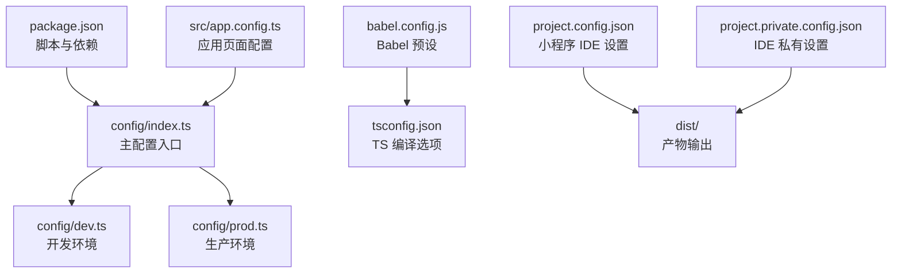
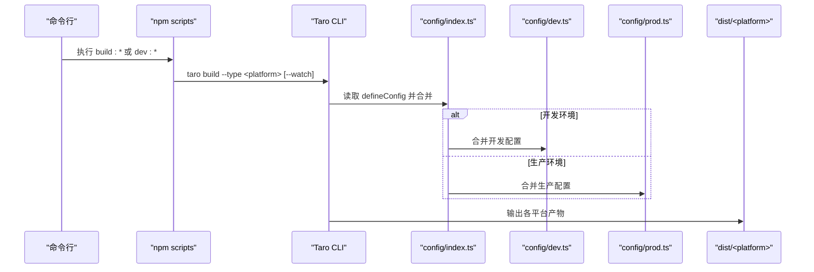
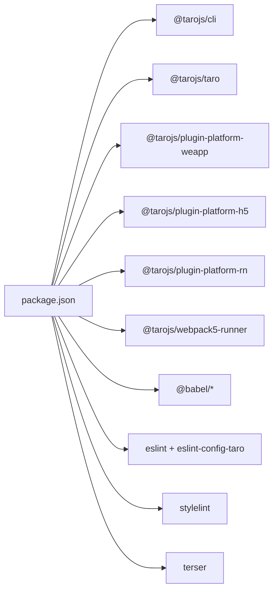

# 构建与部署

<cite>
**本文引用的文件**
- [package.json](file://package.json)
- [config/index.ts](file://config/index.ts)
- [config/dev.ts](file://config/dev.ts)
- [config/prod.ts](file://config/prod.ts)
- [babel.config.js](file://babel.config.js)
- [tsconfig.json](file://tsconfig.json)
- [project.config.json](file://project.config.json)
- [project.private.config.json](file://project.private.config.json)
- [src/app.config.ts](file://src/app.config.ts)
- [.eslintrc](file://.eslintrc)
- [stylelint.config.mjs](file://stylelint.config.mjs)
- [commitlint.config.mjs](file://commitlint.config.mjs)
</cite>

## 目录
1. [简介](#简介)
2. [项目结构](#项目结构)
3. [核心组件](#核心组件)
4. [架构总览](#架构总览)
5. [详细组件分析](#详细组件分析)
6. [依赖分析](#依赖分析)
7. [性能考虑](#性能考虑)
8. [故障排查指南](#故障排查指南)
9. [结论](#结论)
10. [附录](#附录)

## 简介
本文件面向 DevOps 工程师与项目经理，系统化梳理红书项目在 Taro 4.1.11 下的多端构建与部署实践。内容覆盖开发/生产环境差异、各平台（微信小程序、H5、React Native、Harmony Hybrid、京东/快应用/QQ 等）的构建参数与优化策略；解释构建流程自动化（代码压缩、资源优化、版本管理）、持续集成与自动化部署方案，并给出构建性能优化、包体积分析与部署最佳实践。

## 项目结构
红书项目采用 Taro 多端统一工程，核心目录与关键配置如下：
- 根级脚本与依赖：通过 npm scripts 调用 taro build 指令，覆盖 weapp、h5、rn、swan、alipay、tt、qq、jd、harmony-hybrid 等平台。
- 配置层：config/index.ts 作为主入口，按 NODE_ENV 合并 dev.ts 或 prod.ts；分别定义 mini、h5、rn 等平台的样式与构建策略。
- 编译层：babel.config.js 使用 taro 预设，结合 TypeScript 与 React JSX 编译。
- 小程序 IDE 配置：project.config.json 与 project.private.config.json 控制编译器行为与上传设置。
- 页面与应用配置：src/app.config.ts 定义应用页面与导航栏基础配置。

图示来源
- [package.json:12-33](file://package.json#L12-L33)
- [config/index.ts:6-81](file://config/index.ts#L6-L81)
- [babel.config.js:1-12](file://babel.config.js#L1-L12)
- [tsconfig.json:1-31](file://tsconfig.json#L1-L31)
- [src/app.config.ts:1-18](file://src/app.config.ts#L1-L18)
- [project.config.json:1-39](file://project.config.json#L1-L39)
- [project.private.config.json:1-21](file://project.private.config.json#L1-L21)

章节来源
- [package.json:12-33](file://package.json#L12-L33)
- [config/index.ts:6-81](file://config/index.ts#L6-L81)
- [babel.config.js:1-12](file://babel.config.js#L1-L12)
- [tsconfig.json:1-31](file://tsconfig.json#L1-L31)
- [src/app.config.ts:1-18](file://src/app.config.ts#L1-L18)
- [project.config.json:1-39](file://project.config.json#L1-L39)
- [project.private.config.json:1-21](file://project.private.config.json#L1-L21)

## 核心组件
- 多端构建脚本：通过 npm scripts 统一调用 taro build --type <platform>，支持 watch 开发模式与多平台并行构建。
- 主配置合并：根据 NODE_ENV 合并 dev 或 prod，统一注入 mini/h5/rn 平台的样式与资源处理策略。
- Babel 预设：使用 taro 预设，启用 React/TypeScript/webpack5 编译链路。
- 小程序 IDE 配置：控制编译开关、压缩、打包策略与上传行为。
- 页面与应用配置：集中声明页面路由与基础窗口样式，确保多端一致的导航体验。

章节来源
- [package.json:12-33](file://package.json#L12-L33)
- [config/index.ts:6-81](file://config/index.ts#L6-L81)
- [babel.config.js:1-12](file://babel.config.js#L1-L12)
- [project.config.json:1-39](file://project.config.json#L1-L39)
- [src/app.config.ts:1-18](file://src/app.config.ts#L1-L18)

## 架构总览
下图展示从命令行到产物输出的关键路径，以及开发/生产环境的差异化注入点。

图示来源
- [package.json:12-33](file://package.json#L12-L33)
- [config/index.ts:6-81](file://config/index.ts#L6-L81)
- [config/dev.ts:1-23](file://config/dev.ts#L1-L23)
- [config/prod.ts:1-34](file://config/prod.ts#L1-L34)

## 详细组件分析

### 开发环境与生产环境配置
- 入口合并：根据 NODE_ENV 将 dev.ts 或 prod.ts 与基础配置合并，实现开发/生产的差异化注入。
- 开发代理：H5 端通过 devServer.proxy 将 /cmp-api 请求代理至 API 基础地址，便于本地联调。
- 生产扩展：prod.ts 提供 webpackChain 插件占位，可按需接入体积分析、预渲染等优化插件。

章节来源
- [config/index.ts:6-81](file://config/index.ts#L6-L81)
- [config/dev.ts:1-23](file://config/dev.ts#L1-L23)
- [config/prod.ts:1-34](file://config/prod.ts#L1-L34)

### 平台构建参数与优化要点
- 微信小程序（weapp）
  - IDE 设置：开启 minified、minifyWXSS、minifyWXML，关闭 swc 与 babel 插件以保证兼容性。
  - 上传设置：uploadWithSourceMap 可用于问题定位与回溯。
  - 体积控制：packNpmRelationList 与 packOptions 可配合分包策略减少主包体积。
- H5
  - 资源命名：CSS 文件名含 hash 与 chunkhash，利于缓存与增量更新。
  - Autoprefixer：自动补全前缀，提升兼容性。
  - CSS Modules：启用模块化命名，避免全局污染。
- React Native（rn）
  - 关闭 RN 端 CSS Modules，适配原生样式体系。
- Harmony Hybrid / 其他平台（swan/alipay/tt/qq/jd）
  - 通过对应平台插件启用，遵循 Taro 平台约定与最小权限原则。

章节来源
- [config/index.ts:30-74](file://config/index.ts#L30-L74)
- [project.config.json:6-31](file://project.config.json#L6-L31)
- [project.private.config.json:4-20](file://project.private.config.json#L4-L20)

### 构建流程自动化
- 脚本驱动：npm scripts 统一暴露 build:weapp、build:h5、build:rn 等命令，支持 watch 开发模式。
- 编译链路：Babel 预设 + TypeScript + React JSX，确保跨端一致性。
- 版本管理：dist 目录作为统一输出根，结合文件名哈希实现版本化缓存。
- 代码质量：ESLint、Stylelint、Commitlint 保障提交质量与风格统一。

章节来源
- [package.json:12-33](file://package.json#L12-L33)
- [babel.config.js:1-12](file://babel.config.js#L1-L12)
- [tsconfig.json:1-31](file://tsconfig.json#L1-L31)
- [.eslintrc:1-8](file://.eslintrc#L1-L8)
- [stylelint.config.mjs:1-5](file://stylelint.config.mjs#L1-L5)
- [commitlint.config.mjs:1-2](file://commitlint.config.mjs#L1-L2)

### 持续集成与自动化部署
- 触发条件：建议在 CI 中监听分支变更或标签推送，触发多平台构建。
- 步骤建议：
  - 安装依赖（pnpm/cnpm/yarn 二选一，保持与团队一致）
  - 运行多平台构建脚本（可并行）
  - 产物归档与缓存（dist/*）
  - 平台侧上传（小程序 IDE/开发者工具、H5 静态托管、RN 包分发）
- 安全与审计：启用 uploadWithSourceMap 以便线上问题回溯；对敏感信息使用 CI 变量注入。

章节来源
- [package.json:12-33](file://package.json#L12-L33)
- [project.config.json:15-16](file://project.config.json#L15-L16)

### 包体积分析与性能优化
- 分析手段：
  - 在 prod.ts 的 webpackChain 占位处接入体积分析插件，定位大体积依赖与重复模块。
  - 对 H5 首屏加载慢的问题，可考虑预渲染插件对关键页面进行预渲染。
- 优化策略：
  - 按需引入第三方库，避免整包引入。
  - 合理拆分页面与公共依赖，利用分包策略降低主包体积。
  - 启用压缩与 Tree-Shaking，确保生产环境产物最小化。

章节来源
- [config/prod.ts:10-31](file://config/prod.ts#L10-L31)

### 页面与应用配置
- 应用配置：集中声明页面列表与导航栏样式，确保多端一致的基础体验。
- 页面配置：各页面独立的 index.config.ts 可按页面维度定制窗口样式与导航栏行为。

章节来源
- [src/app.config.ts:1-18](file://src/app.config.ts#L1-L18)

## 依赖分析
- 核心依赖：@tarojs/cli、@tarojs/taro、@tarojs/plugin-* 系列插件，支撑多端编译与运行。
- 开发依赖：@babel/*、@types/*、eslint、stylelint、vite、terser 等，保障开发体验与产物质量。
- 平台插件：按需启用 weapp/swan/alipay/tt/qq/jd/harmony-hybrid 等插件，避免冗余依赖。

图示来源
- [package.json:39-91](file://package.json#L39-L91)

章节来源
- [package.json:39-91](file://package.json#L39-L91)

## 性能考虑
- 构建性能
  - 合理设置缓存与并行度，避免重复编译。
  - 在 CI 中复用依赖缓存，缩短安装与构建时间。
- 产物体积
  - 使用体积分析工具定位大模块，结合分包与懒加载策略。
  - 启用压缩与 Tree-Shaking，移除未使用代码。
- 运行性能
  - H5 端启用 autoprefixer 与 CSS Modules，减少全局样式冲突。
  - 小程序端合理拆分包体，避免超限与冷启动过慢。

## 故障排查指南
- 开发代理无效
  - 检查 devServer.proxy 配置是否正确指向 API 基础地址。
  - 确认环境变量 TARO_APP_API_BASE_URL 是否注入。
- 产物体积异常
  - 在 prod.ts 中临时启用体积分析插件，定位大模块与重复依赖。
  - 检查是否误引入完整库或未按需引入。
- 小程序上传失败
  - 检查 project.config.json 的 appid、setting 与上传配置。
  - 确认 dist 目录结构与 IDE 版本兼容。
- Lint 报错
  - 按 ESLint/Stylelint 规则修正代码风格与潜在问题。
  - Commitlint 规则确保提交信息符合规范。

章节来源
- [config/dev.ts:3-22](file://config/dev.ts#L3-L22)
- [config/prod.ts:10-31](file://config/prod.ts#L10-L31)
- [project.config.json:5-31](file://project.config.json#L5-L31)
- [.eslintrc:1-8](file://.eslintrc#L1-L8)
- [stylelint.config.mjs:1-5](file://stylelint.config.mjs#L1-L5)
- [commitlint.config.mjs:1-2](file://commitlint.config.mjs#L1-L2)

## 结论
红书项目基于 Taro 4.1.11 实现了统一的多端构建与部署体系。通过主配置合并、平台化插件与 IDE 设置，实现了开发/生产环境的清晰分离与可扩展优化。建议在 CI 中标准化构建流程，结合体积分析与分包策略持续优化包体与首屏性能，并完善上传与回溯机制以提升运维效率。

## 附录
- 常用命令
  - 开发：npm run dev:h5、npm run dev:weapp 等
  - 生产：npm run build:h5、npm run build:weapp 等
- 关键配置参考
  - 主配置：config/index.ts
  - 开发配置：config/dev.ts
  - 生产配置：config/prod.ts
  - Babel 预设：babel.config.js
  - TypeScript：tsconfig.json
  - 小程序 IDE：project.config.json、project.private.config.json
  - 应用页面：src/app.config.ts