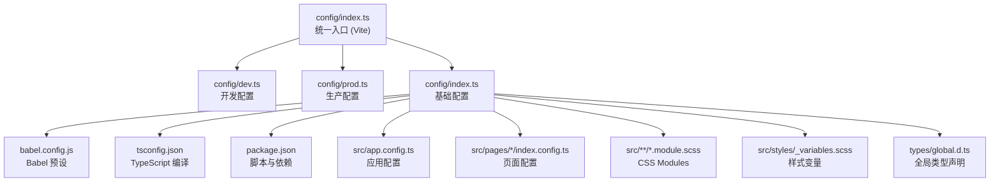
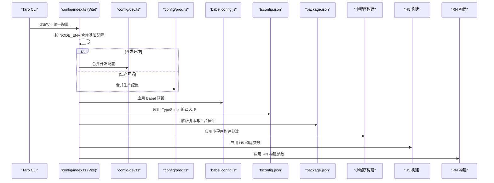
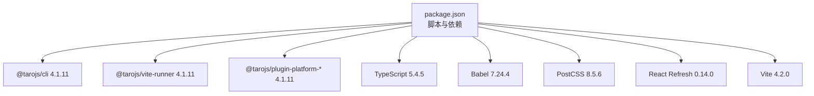

# 构建配置

<cite>
**本文引用的文件**
- [config/index.ts](file://config/index.ts)
- [config/dev.ts](file://config/dev.ts)
- [config/prod.ts](file://config/prod.ts)
- [babel.config.js](file://babel.config.js)
- [tsconfig.json](file://tsconfig.json)
- [package.json](file://package.json)
- [src/app.config.ts](file://src/app.config.ts)
- [src/pages/home/index.config.ts](file://src/pages/home/index.config.ts)
- [src/components/CustomTabBar/index.module.scss](file://src/components/CustomTabBar/index.module.scss)
- [src/pages/home/index.module.scss](file://src/pages/home/index.module.scss)
- [src/styles/_variables.scss](file://src/styles/_variables.scss)
- [types/global.d.ts](file://types/global.d.ts)
</cite>

## 更新摘要
**变更内容**
- 更新了Vite配置语法，从传统的webpack配置迁移到现代Vite配置
- 修改了API代理配置的rewrite函数语法，替代了pathRewrite对象
- 升级了构建依赖，包括Taro 4.1.11和Vite 4.2.0
- 优化了开发服务器配置和代理机制

## 目录
1. [简介](#简介)
2. [项目结构](#项目结构)
3. [核心组件](#核心组件)
4. [架构总览](#架构总览)
5. [详细组件分析](#详细组件分析)
6. [依赖分析](#依赖分析)
7. [性能考虑](#性能考虑)
8. [故障排查指南](#故障排查指南)
9. [结论](#结论)
10. [附录](#附录)

## 简介
本文件面向前端工程师，系统化梳理基于 Taro 4.1.11 的多端构建配置体系，覆盖基础配置、开发与生产环境配置、平台特定配置（微信小程序、H5、React Native）、设计稿适配、CSS Modules、PostCSS、TypeScript 编译与 Babel 转译、缓存与插件、资源复制等关键主题，并提供最佳实践建议与排障指引，帮助团队高效、稳定地完成多端构建。

**更新** 本版本重点介绍了Vite配置语法的现代化升级和API代理配置的rewrite函数语法改进。

## 项目结构
本项目采用 Taro 多端统一工程化方案，核心配置集中在 config 目录，源代码位于 src，类型声明与样式变量位于 types 与 styles。关键文件职责如下：
- config/index.ts：统一入口，按 NODE_ENV 合并基础配置与环境配置，使用Vite编译器
- config/dev.ts：开发环境特有配置（如 H5 代理）
- config/prod.ts：生产环境特有配置（预留 webpackChain 扩展点）
- babel.config.js：Babel 预设与框架/TS/编译器选择
- tsconfig.json：TypeScript 编译选项与路径映射
- package.json：脚本命令、依赖与平台插件清单
- src/app.config.ts 与页面级 index.config.ts：应用与页面配置
- SCSS 与 CSS Modules：样式组织与作用域隔离
- types/global.d.ts：全局模块声明与环境变量类型

**图表来源**
- [config/index.ts:1-89](file://config/index.ts#L1-L89)
- [config/dev.ts:1-21](file://config/dev.ts#L1-L21)
- [config/prod.ts:1-34](file://config/prod.ts#L1-L34)
- [babel.config.js:1-12](file://babel.config.js#L1-L12)
- [tsconfig.json:1-31](file://tsconfig.json#L1-L31)
- [package.json:1-97](file://package.json#L1-L97)
- [src/app.config.ts:1-18](file://src/app.config.ts#L1-L18)

**章节来源**
- [config/index.ts:1-89](file://config/index.ts#L1-L89)
- [package.json:12-33](file://package.json#L12-L33)

## 核心组件
本节聚焦构建配置的核心组成与职责边界，便于快速定位与扩展。

**更新** 本版本强调了Vite编译器的使用和现代化配置语法。

- 统一入口与合并策略
  - 通过 defineConfig<'vite'> 与 merge 合并基础配置与环境配置，按 NODE_ENV 分支返回不同配置对象
  - 基础配置包含项目元信息、设计稿适配、设备比值、源码与输出目录、框架与编译器、缓存、插件、常量、资源复制等
- 平台特定配置
  - 小程序（mini）：pxtransform 开启，CSS Modules 默认开启
  - H5：devServer.port、publicPath、静态目录、MiniCssExtractPlugin 输出规则、autoprefixer、CSS Modules
  - React Native（rn）：CSS Modules 默认关闭
- 开发与生产差异化
  - 开发：H5 devServer 代理到 API 基础地址，使用rewrite函数语法
  - 生产：预留 webpackChain 扩展点（如打包分析、预渲染）

**章节来源**
- [config/index.ts:7-88](file://config/index.ts#L7-L88)
- [config/dev.ts:6-20](file://config/dev.ts#L6-L20)
- [config/prod.ts:3-33](file://config/prod.ts#L3-L33)

## 架构总览
下图展示从配置入口到各平台构建的关键流程与配置交互关系。

**图表来源**
- [config/index.ts:7-88](file://config/index.ts#L7-L88)
- [config/dev.ts:6-20](file://config/dev.ts#L6-L20)
- [config/prod.ts:3-33](file://config/prod.ts#L3-L33)
- [babel.config.js:3-11](file://babel.config.js#L3-L11)
- [tsconfig.json:2-27](file://tsconfig.json#L2-L27)
- [package.json:12-33](file://package.json#L12-L33)

## 详细组件分析

### 基础配置（config/index.ts）
**更新** 本版本展示了Vite编译器的现代化配置语法。

- 项目元信息与目录
  - 项目名、日期、设计稿宽度与设备比值、源码根目录、输出根目录
- 框架与编译器
  - 使用 React 框架与 Vite 编译器，替代传统的webpack5
- 缓存与插件
  - 缓存开关关闭；内置 generator 插件
- 常量与资源复制
  - defineConstants 留空；copy patterns/options 留空
- 平台配置
  - 小程序：pxtransform 开启；CSS Modules 开启，命名模式与作用域名格式
  - H5：devServer.port、publicPath、静态目录、MiniCssExtractPlugin 输出规则；autoprefixer 开启；CSS Modules 开启
  - RN：appName、CSS Modules 关闭

**章节来源**
- [config/index.ts:8-81](file://config/index.ts#L8-L81)

### 开发环境配置（config/dev.ts）
**更新** 本版本重点介绍了rewrite函数语法的使用。

- H5 开发服务器代理
  - 通过 /cmp-api 代理到 API 基础地址，支持跨域与路径重写
  - 使用 rewrite 函数语法替代传统的 pathRewrite 对象，提供更灵活的路径处理
  - API 基础地址可由环境变量注入

**章节来源**
- [config/dev.ts:6-20](file://config/dev.ts#L6-L20)

### 生产环境配置（config/prod.ts）
- 预留 webpackChain 扩展点
  - 注释展示了打包分析与预渲染插件的接入方式，便于按需启用

**章节来源**
- [config/prod.ts:10-31](file://config/prod.ts#L10-L31)

### TypeScript 编译配置（tsconfig.json）
- 编译目标与模块
  - 目标 ES2017，模块 CommonJS，保留 const 枚举
- 路径解析与别名
  - 使用 node 解析器，路径别名 @/* 指向 src
- JSX 与 JSON
  - JSX 使用 react-jsx，允许 JSON 模块
- 类型与严格性
  - 启用严格空检查，保留未使用局部变量与参数的校验
- 源码映射与输出
  - 启用 sourceMap，输出目录 lib，包含 src、types、config

**章节来源**
- [tsconfig.json:2-29](file://tsconfig.json#L2-L29)

### Babel 转译配置（babel.config.js）
**更新** 本版本展示了Babel配置的现代化设置。

- 预设
  - 使用 taro 预设，指定框架为 React、启用 TS 支持、编译器为 webpack5
- 作用
  - 为多端构建提供统一的语法转换与 polyfill 策略

**章节来源**
- [babel.config.js:3-11](file://babel.config.js#L3-L11)

### 平台特定配置与最佳实践

#### 微信小程序（mini）
- 设计稿适配
  - 通过 designWidth 与 deviceRatio 实现 px 到 rpx 的转换，适配多设备密度
- CSS Modules
  - 默认开启，命名模式与作用域名格式已配置，避免类名冲突
- 建议
  - 如需更细粒度控制 pxtransform，可在 mini.postcss.pxtransform.config 中补充

**章节来源**
- [config/index.ts:39-52](file://config/index.ts#L39-L52)
- [config/index.ts:45-52](file://config/index.ts#L45-L52)

#### H5（h5）
**更新** 本版本强调了Vite开发服务器的配置。

- 资源与输出
  - devServer.port、publicPath 与静态目录设置，MiniCssExtractPlugin 输出规则保证样式分包与哈希命名
- 自动前缀与 CSS Modules
  - autoprefixer 开启，CSS Modules 开启，命名与作用域同小程序保持一致
- 开发代理
  - 通过 devServer.proxy 将 /cmp-api 代理至 API 基础地址，便于本地联调
  - 使用 rewrite 函数语法进行路径重写，提供更灵活的代理配置

**章节来源**
- [config/index.ts:54-72](file://config/index.ts#L54-L72)
- [config/dev.ts:8-19](file://config/dev.ts#L8-L19)

#### React Native（rn）
- CSS Modules
  - 默认关闭，避免 RN 环境下的样式模块不兼容问题
- 建议
  - 如需 RN 样式隔离，可按需开启并调整命名策略

**章节来源**
- [config/index.ts:74-81](file://config/index.ts#L74-L81)

### 样式与设计稿适配（SCSS/CSS Modules/变量）
- CSS Modules
  - 在小程序与 H5 均开启，命名模式与作用域名格式一致，确保组件级样式隔离
- 设计稿适配
  - 通过 pxtransform 将 px 转换为 rpx（小程序）或 rem（H5），结合 designWidth 与 deviceRatio
- 样式变量
  - 使用 SCSS 变量集中管理主题色、文本色、背景色、间距等，提升一致性与可维护性

**章节来源**
- [config/index.ts:45-52](file://config/index.ts#L45-L52)
- [config/index.ts:65-72](file://config/index.ts#L65-L72)
- [src/components/CustomTabBar/index.module.scss:1-64](file://src/components/CustomTabBar/index.module.scss#L1-L64)
- [src/pages/home/index.module.scss:1-167](file://src/pages/home/index.module.scss#L1-L167)
- [src/styles/_variables.scss:1-9](file://src/styles/_variables.scss#L1-L9)

### 页面与应用配置（app.config.ts 与页面 index.config.ts）
- 应用配置
  - 定义页面路由列表与窗口样式（标题、背景、文字样式等）
- 页面配置
  - 定义页面导航栏标题、分享能力等页面级行为

**章节来源**
- [src/app.config.ts:1-18](file://src/app.config.ts#L1-L18)
- [src/pages/home/index.config.ts:1-6](file://src/pages/home/index.config.ts#L1-L6)

### 全局类型与模块声明（types/global.d.ts）
- 模块声明
  - 声明图片、CSS、SASS、LESS、STYL 等资源模块，便于在 TS 中直接导入
- 环境变量
  - 声明 NODE_ENV 与 TARO_ENV 等环境变量类型，辅助条件编译与平台判断

**章节来源**
- [types/global.d.ts:3-12](file://types/global.d.ts#L3-L12)
- [types/global.d.ts:14-32](file://types/global.d.ts#L14-L32)

## 依赖分析
**更新** 本版本展示了现代化的构建依赖配置。

- 脚本命令
  - 提供多端构建脚本，包括 weapp、swan、alipay、tt、h5、rn、qq、jd、harmony-hybrid 等
- 平台插件
  - 通过 @tarojs/plugin-platform-* 系列插件实现多端编译
- 工具链
  - CLI、Vite Runner、React Refresh、PostCSS、TypeScript、Vite 等

**图表来源**
- [package.json:12-33](file://package.json#L12-L33)
- [package.json:39-97](file://package.json#L39-L97)

**章节来源**
- [package.json:12-33](file://package.json#L12-L33)
- [package.json:39-97](file://package.json#L39-L97)

## 性能考虑
**更新** 本版本强调了Vite编译器的性能优势。

- 打包体积优化
  - 生产环境预留 webpackChain 扩展点，可接入打包分析与按需拆包策略
- 样式与资源
  - H5 使用 MiniCssExtractPlugin 输出独立样式文件，配合哈希命名提升缓存命中
- 编译与缓存
  - 当前缓存开关关闭，Vite编译器提供更快的热重载和构建速度
- 代理与网络
  - 开发环境代理 API，避免跨域与本地联调成本

**章节来源**
- [config/prod.ts:10-31](file://config/prod.ts#L10-L31)
- [config/index.ts:54-72](file://config/index.ts#L54-L72)
- [config/index.ts:25-27](file://config/index.ts#L25-L27)
- [config/dev.ts:8-19](file://config/dev.ts#L8-L19)

## 故障排查指南
**更新** 本版本增加了Vite配置相关的故障排查建议。

- 开发代理无效
  - 检查 API 基础地址是否正确注入，确认 /cmp-api 代理规则与 rewrite 函数语法
  - 验证Vite开发服务器端口配置（默认9000）
- 样式类名冲突
  - 确认 CSS Modules 是否开启，命名模式与作用域名格式是否一致
- 设计稿适配异常
  - 检查 designWidth 与 deviceRatio 设置，确保 pxtransform 配置生效
- TypeScript 类型错误
  - 校验 tsconfig.json 的路径别名与 include 配置，确保类型声明被识别
- 平台差异导致的样式问题
  - RN 环境默认关闭 CSS Modules，如需隔离样式请按需调整
- Vite配置问题
  - 检查defineConfig<'vite'>语法是否正确
  - 验证Vite编译器版本与Taro版本的兼容性

**章节来源**
- [config/dev.ts:8-19](file://config/dev.ts#L8-L19)
- [config/index.ts:45-52](file://config/index.ts#L45-L52)
- [config/index.ts:12-17](file://config/index.ts#L12-L17)
- [tsconfig.json:23-26](file://tsconfig.json#L23-L26)
- [config/index.ts:74-81](file://config/index.ts#L74-L81)

## 结论
**更新** 本版本强调了Vite配置的现代化优势。

本项目以 Taro 4.1.11 为核心，通过统一入口与环境分支配置，实现了小程序、H5、RN 等多端的一致化构建体验。基础配置覆盖设计稿适配、CSS Modules、PostCSS、TypeScript 与 Babel 等关键环节；开发与生产配置分别满足联调代理与性能优化需求。**最新版本采用了Vite编译器，提供了更快的开发体验和更好的性能表现。** 建议在生产环境按需启用 webpackChain 扩展点，并持续关注缓存与资源输出策略，以获得更优的构建性能与稳定性。

## 附录
- 快速命令
  - 开发构建：npm run dev:h5 或对应平台脚本
  - 生产构建：npm run build:h5 或对应平台脚本
- 常见扩展
  - 打包分析：在生产配置中启用 BundleAnalyzerPlugin
  - 预渲染：在生产配置中启用 prerender-spa-plugin
- Vite配置最佳实践
  - 使用rewrite函数语法替代pathRewrite对象
  - 配置适当的devServer端口和代理规则
  - 利用Vite的热重载功能提升开发效率

**章节来源**
- [package.json:12-33](file://package.json#L12-L33)
- [config/prod.ts:10-31](file://config/prod.ts#L10-L31)
- [config/dev.ts:8-19](file://config/dev.ts#L8-L19)