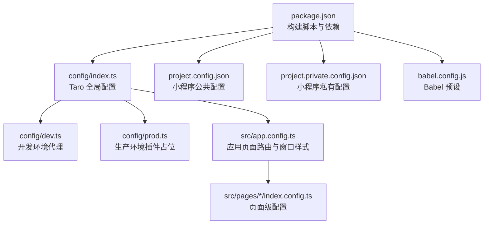
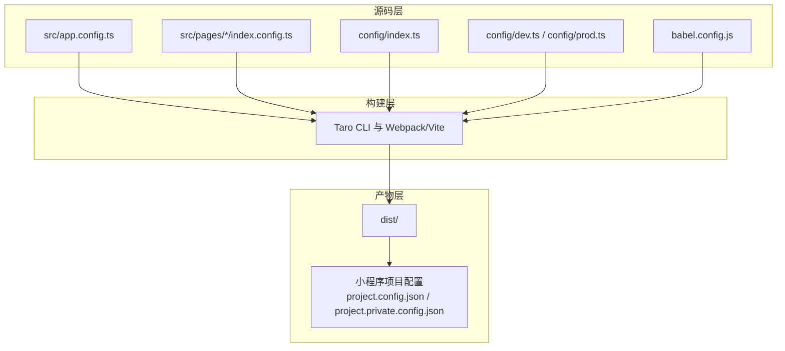
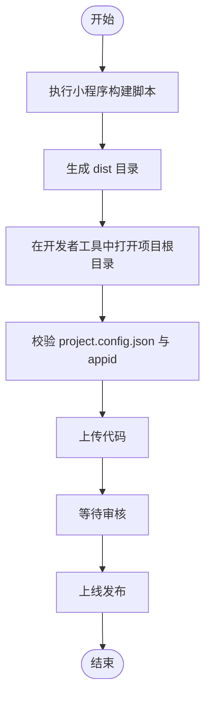
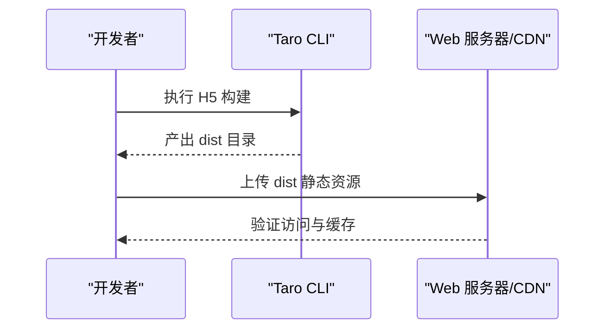
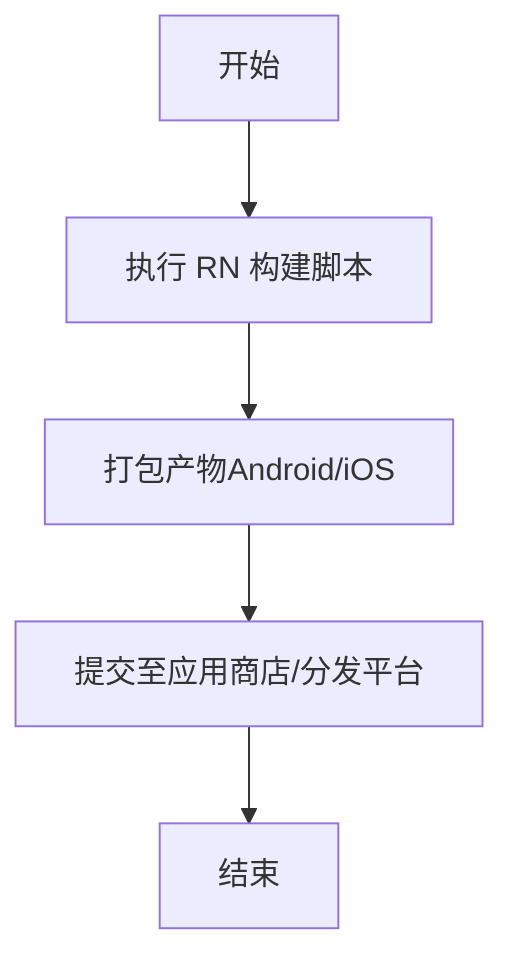
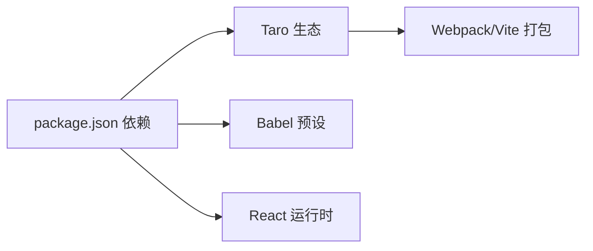

# 部署指南

<cite>
**本文引用的文件**
- [package.json](file://package.json)
- [project.config.json](file://project.config.json)
- [project.private.config.json](file://project.private.config.json)
- [config/index.ts](file://config/index.ts)
- [config/dev.ts](file://config/dev.ts)
- [config/prod.ts](file://config/prod.ts)
- [src/app.config.ts](file://src/app.config.ts)
- [src/pages/home/index.config.ts](file://src/pages/home/index.config.ts)
- [src/pages/login/index.config.ts](file://src/pages/login/index.config.ts)
- [babel.config.js](file://babel.config.js)
</cite>

## 目录
1. [简介](#简介)
2. [项目结构](#项目结构)
3. [核心组件](#核心组件)
4. [架构总览](#架构总览)
5. [详细组件分析](#详细组件分析)
6. [依赖分析](#依赖分析)
7. [性能考虑](#性能考虑)
8. [故障排除指南](#故障排除指南)
9. [结论](#结论)
10. [附录](#附录)

## 简介
本指南面向运维工程师与项目经理，系统化说明红书项目的多端部署流程，覆盖微信小程序、H5 页面与 React Native 应用的构建、发布与上线要点；同时涵盖项目配置文件（如小程序的 project.config.json、私有配置）的部署注意事项、域名与 HTTPS 设置、CDN 部署建议以及 CI/CD 自动化集成思路。文档以仓库现有配置为基础，结合 Taro 多端构建体系，给出可落地的操作步骤与排障建议。

## 项目结构
红书项目基于 Taro 4.x + React 技术栈，采用统一源码多端输出（小程序、H5、RN）。项目关键目录与文件如下：
- 构建脚本与依赖：通过 package.json 的 scripts 字段定义多端构建命令
- 小程序配置：project.config.json（公共配置）、project.private.config.json（私有配置）
- Taro 全局配置：config/index.ts（基础配置合并 dev/prod）
- 页面级配置：各页面的 index.config.ts（导航栏标题、分享等）
- 应用级配置：src/app.config.ts（页面路由表、全局窗口样式）

图表来源
- [package.json:12-33](file://package.json#L12-L33)
- [config/index.ts:6-81](file://config/index.ts#L6-L81)
- [config/dev.ts:3-22](file://config/dev.ts#L3-L22)
- [config/prod.ts:1-34](file://config/prod.ts#L1-L34)
- [project.config.json:1-39](file://project.config.json#L1-L39)
- [project.private.config.json:1-21](file://project.private.config.json#L1-L21)
- [src/app.config.ts:1-18](file://src/app.config.ts#L1-L18)
- [src/pages/home/index.config.ts:1-6](file://src/pages/home/index.config.ts#L1-L6)
- [src/pages/login/index.config.ts:1-5](file://src/pages/login/index.config.ts#L1-L5)
- [babel.config.js:1-12](file://babel.config.js#L1-L12)

章节来源
- [package.json:12-33](file://package.json#L12-L33)
- [config/index.ts:6-81](file://config/index.ts#L6-L81)
- [project.config.json:1-39](file://project.config.json#L1-L39)
- [project.private.config.json:1-21](file://project.private.config.json#L1-L21)
- [src/app.config.ts:1-18](file://src/app.config.ts#L1-L18)
- [src/pages/home/index.config.ts:1-6](file://src/pages/home/index.config.ts#L1-L6)
- [src/pages/login/index.config.ts:1-5](file://src/pages/login/index.config.ts#L1-L5)
- [babel.config.js:1-12](file://babel.config.js#L1-L12)

## 核心组件
- 多端构建脚本：通过 npm scripts 调用 taro build 指定目标平台（小程序、H5、RN），并提供 watch 开发模式
- 小程序配置：project.config.json 定义 dist 输出、编译设置、打包选项；project.private.config.json 提供调试与本地开发偏好
- Taro 配置：config/index.ts 统一基础配置，按 NODE_ENV 合并 dev 或 prod；分别在 h5 与 rn 下做差异化处理
- 页面与应用配置：src/app.config.ts 定义页面路由表；各页面 index.config.ts 控制导航栏与分享能力

章节来源
- [package.json:12-33](file://package.json#L12-L33)
- [project.config.json:1-39](file://project.config.json#L1-L39)
- [project.private.config.json:1-21](file://project.private.config.json#L1-L21)
- [config/index.ts:6-81](file://config/index.ts#L6-L81)
- [config/dev.ts:3-22](file://config/dev.ts#L3-L22)
- [config/prod.ts:1-34](file://config/prod.ts#L1-L34)
- [src/app.config.ts:1-18](file://src/app.config.ts#L1-L18)
- [src/pages/home/index.config.ts:1-6](file://src/pages/home/index.config.ts#L1-L6)
- [src/pages/login/index.config.ts:1-5](file://src/pages/login/index.config.ts#L1-L5)

## 架构总览
下图展示从源码到多端产物的关键路径与配置交互关系：

图表来源
- [config/index.ts:6-81](file://config/index.ts#L6-L81)
- [config/dev.ts:3-22](file://config/dev.ts#L3-L22)
- [config/prod.ts:1-34](file://config/prod.ts#L1-L34)
- [babel.config.js:1-12](file://babel.config.js#L1-L12)
- [src/app.config.ts:1-18](file://src/app.config.ts#L1-L18)
- [src/pages/home/index.config.ts:1-6](file://src/pages/home/index.config.ts#L1-L6)
- [src/pages/login/index.config.ts:1-5](file://src/pages/login/index.config.ts#L1-L5)
- [project.config.json:1-39](file://project.config.json#L1-L39)
- [project.private.config.json:1-21](file://project.private.config.json#L1-L21)

## 详细组件分析

### 微信小程序部署策略
- 构建与产物
  - 使用构建脚本生成 dist 目录下的小程序产物
  - 小程序项目配置由 project.config.json 与 project.private.config.json 决定
- 发布流程
  - 在开发者工具中打开项目根目录，确保 miniprogramRoot 指向 dist
  - 上传前检查 appid、编译设置与打包选项
- 审核要求与上线注意事项
  - 确保已配置合法 appid
  - 关闭不必要编译优化以减少审核风险（例如按需调整压缩与混淆设置）
  - 上传时注意版本号与灰度策略，遵循平台规范
- 私有配置说明
  - project.private.config.json 中的调试与热更新选项仅用于本地开发，线上应保持默认或关闭

图表来源
- [package.json:15-23](file://package.json#L15-L23)
- [project.config.json:1-39](file://project.config.json#L1-L39)
- [project.private.config.json:1-21](file://project.private.config.json#L1-L21)

章节来源
- [package.json:15-23](file://package.json#L15-L23)
- [project.config.json:1-39](file://project.config.json#L1-L39)
- [project.private.config.json:1-21](file://project.private.config.json#L1-L21)

### H5 页面部署策略
- 构建与产物
  - 使用 H5 构建脚本生成 dist 目录下的静态资源
  - Taro 配置中为 h5 设定了 publicPath、静态目录与 CSS Modules
- 发布流程
  - 将 dist 目录部署至 Web 服务器或 CDN
  - 确认路由模式（history/hash）与回退页面配置
- 审核要求与上线注意事项
  - H5 不涉及平台审核，但需关注跨域、HTTPS 与缓存策略
  - 生产环境建议开启强缓存与离线回退
- 开发代理与跨域
  - 开发环境通过 devServer.proxy 将 /cmp-api 代理到后端 API 地址

图表来源
- [package.json:19](file://package.json#L19)
- [config/index.ts:45-66](file://config/index.ts#L45-L66)
- [config/dev.ts:8-22](file://config/dev.ts#L8-L22)

章节来源
- [package.json:19](file://package.json#L19)
- [config/index.ts:45-66](file://config/index.ts#L45-L66)
- [config/dev.ts:8-22](file://config/dev.ts#L8-L22)

### React Native 应用部署策略
- 构建与产物
  - 使用 RN 构建脚本生成对应平台产物
  - Taro 配置中为 rn 设定了 appName，并关闭了 RN 的 CSS Modules
- 发布流程
  - Android：通过 Gradle 打包 APK/AAB，提交至应用商店或企业分发
  - iOS：通过 Xcode 打包 IPA，提交至 App Store Connect
- 审核要求与上线注意事项
  - 遵循各平台审核规范，注意权限声明与隐私政策
  - 生产包需签名与混淆，避免泄露源码信息

图表来源
- [package.json:20](file://package.json#L20)
- [config/index.ts:67-74](file://config/index.ts#L67-L74)

章节来源
- [package.json:20](file://package.json#L20)
- [config/index.ts:67-74](file://config/index.ts#L67-L74)

### 项目配置文件部署配置
- 小程序配置
  - project.config.json：定义 miniprogramRoot、appid、编译与打包选项
  - project.private.config.json：本地调试偏好（如热更新、API Hook 等）
- 应用与页面配置
  - src/app.config.ts：页面路由表与全局窗口样式
  - 各页面 index.config.ts：页面级导航栏标题、分享能力等
- Babel 配置
  - babel.config.js：统一的 taro 预设，确保多端一致的转译行为

章节来源
- [project.config.json:1-39](file://project.config.json#L1-L39)
- [project.private.config.json:1-21](file://project.private.config.json#L1-L21)
- [src/app.config.ts:1-18](file://src/app.config.ts#L1-L18)
- [src/pages/home/index.config.ts:1-6](file://src/pages/home/index.config.ts#L1-L6)
- [src/pages/login/index.config.ts:1-5](file://src/pages/login/index.config.ts#L1-L5)
- [babel.config.js:1-12](file://babel.config.js#L1-L12)

### CI/CD 集成与自动化部署
- 构建阶段
  - 使用构建脚本统一触发多端构建（小程序/H5/RN）
  - 在 CI 环境中设置 NODE_ENV 以选择 dev 或 prod 配置
- 发布阶段
  - 小程序：将 dist 目录上传至开发者工具或平台提供的上传接口
  - H5：将 dist 目录部署到 Web 服务器或 CDN
  - RN：按平台打包并上传至对应分发渠道
- 版本与灰度
  - 建议在 CI 中注入版本号与构建号，便于追踪与回滚
  - 可结合平台灰度策略进行分批发布

章节来源
- [package.json:12-33](file://package.json#L12-L33)
- [config/index.ts:77-81](file://config/index.ts#L77-L81)
- [config/dev.ts:3-4](file://config/dev.ts#L3-L4)

## 依赖分析
- 构建工具链
  - Taro CLI 与 Webpack/Vite Runner：负责多端编译与打包
  - Babel 预设：统一转译规则
- 运行时框架
  - React 与 React DOM：H5 与 RN 运行时
- 平台插件
  - 各平台的 taro plugin（weapp、h5、rn 等）由依赖项提供

图表来源
- [package.json:39-91](file://package.json#L39-L91)
- [babel.config.js:1-12](file://babel.config.js#L1-L12)

章节来源
- [package.json:39-91](file://package.json#L39-L91)
- [babel.config.js:1-12](file://babel.config.js#L1-L12)

## 性能考虑
- H5 侧
  - 生产环境可启用预渲染插件（示例在 prod 配置中注释）以优化首屏
  - 合理拆分代码块与懒加载，降低初始包体
- 小程序侧
  - 控制包体大小，避免不必要的依赖与资源
  - 合理使用分包策略（如需）
- 通用
  - 生产构建建议开启压缩与混淆，合理设置缓存策略

章节来源
- [config/prod.ts:10-31](file://config/prod.ts#L10-L31)

## 故障排除指南
- 构建失败
  - 检查 Taro CLI 与平台插件版本是否匹配
  - 确认 Babel 预设与框架配置一致
- H5 代理问题
  - 开发代理仅在 dev 环境生效，生产环境需后端支持 CORS
- 小程序上传失败
  - 确认 appid 正确且 project.config.json 指向 dist
  - 检查编译设置与打包选项
- 路由与页面配置
  - 确保 src/app.config.ts 的 pages 列表与实际页面路径一致
  - 页面级 index.config.ts 的导航栏标题与分享开关按需配置

章节来源
- [config/dev.ts:8-22](file://config/dev.ts#L8-L22)
- [src/app.config.ts:1-18](file://src/app.config.ts#L1-L18)
- [src/pages/home/index.config.ts:1-6](file://src/pages/home/index.config.ts#L1-L6)
- [src/pages/login/index.config.ts:1-5](file://src/pages/login/index.config.ts#L1-L5)

## 结论
本指南基于仓库现有配置，给出了红书项目在小程序、H5 与 RN 三端的部署与发布要点。建议在 CI/CD 中固化构建与发布流程，结合域名与 HTTPS、CDN 缓存策略，实现稳定高效的交付。上线前务必完成配置校验与联调测试，确保各端体验一致。

## 附录
- 域名与 HTTPS
  - H5 部署建议使用 HTTPS，确保安全与兼容性
  - CDN 分发时配置缓存头与回源策略
- 私有配置与安全
  - project.private.config.json 仅用于本地开发，严禁提交到版本控制
- 页面与应用配置
  - src/app.config.ts 与各页面 index.config.ts 是上线前最后校验点

章节来源
- [project.private.config.json:1-21](file://project.private.config.json#L1-L21)
- [src/app.config.ts:1-18](file://src/app.config.ts#L1-L18)
- [src/pages/home/index.config.ts:1-6](file://src/pages/home/index.config.ts#L1-L6)
- [src/pages/login/index.config.ts:1-5](file://src/pages/login/index.config.ts#L1-L5)