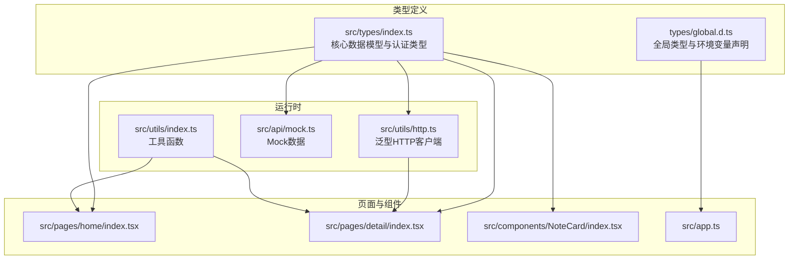
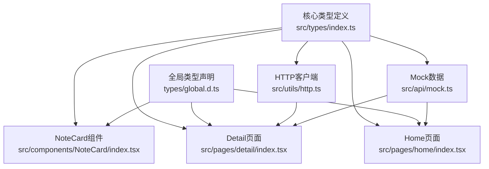
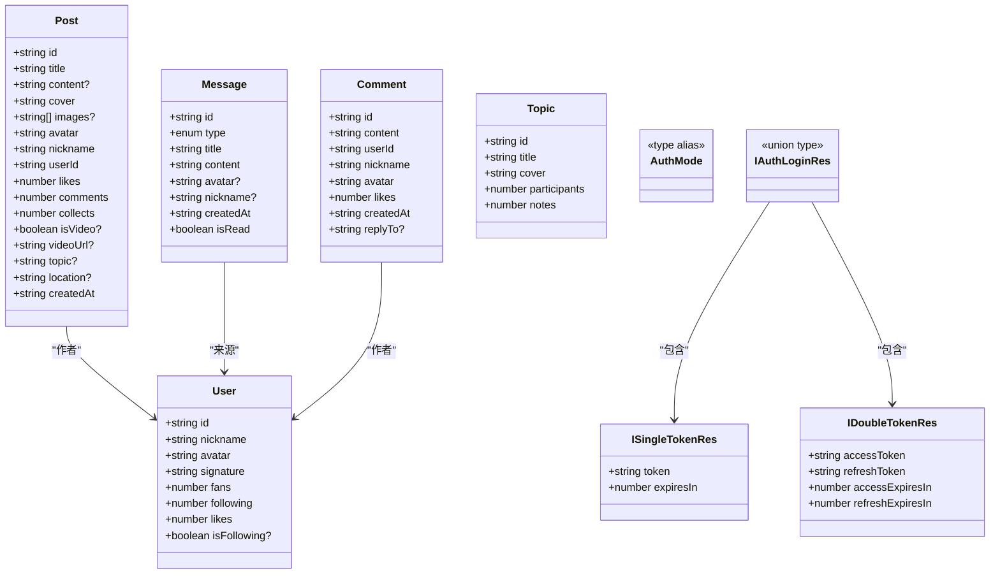
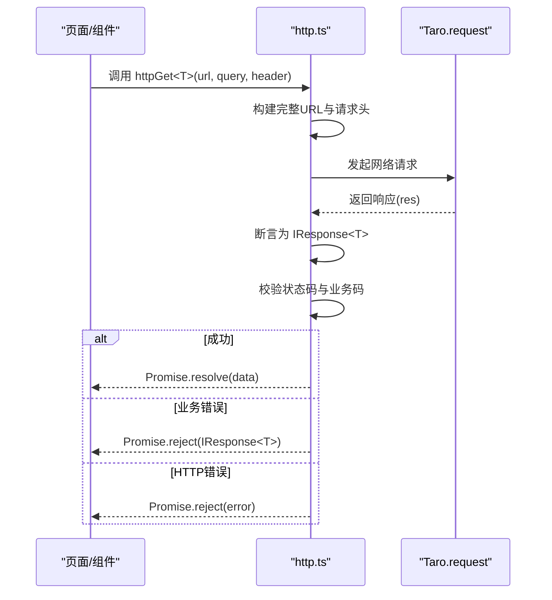
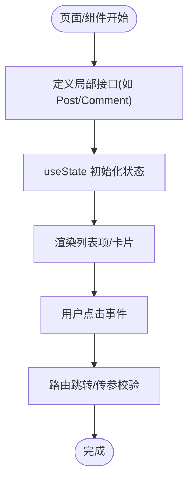
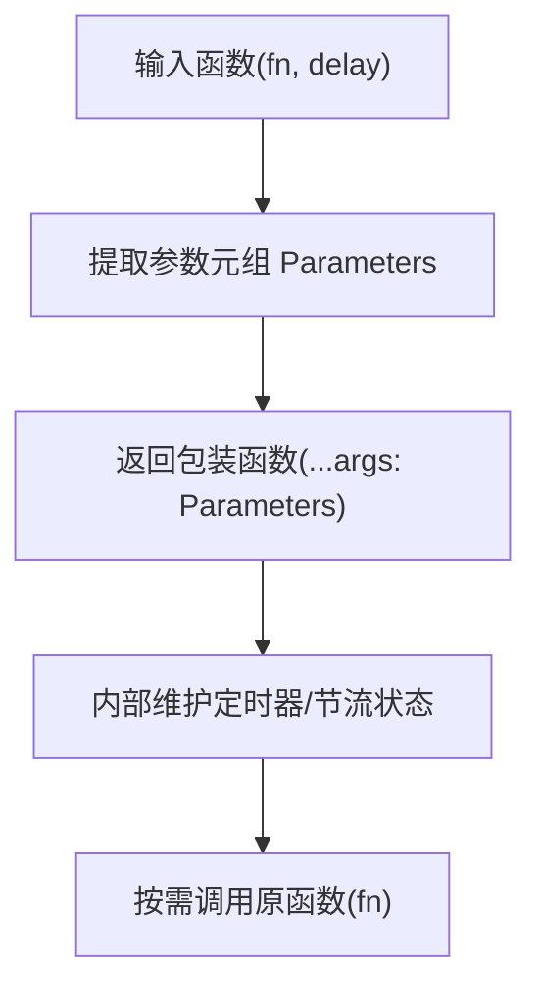
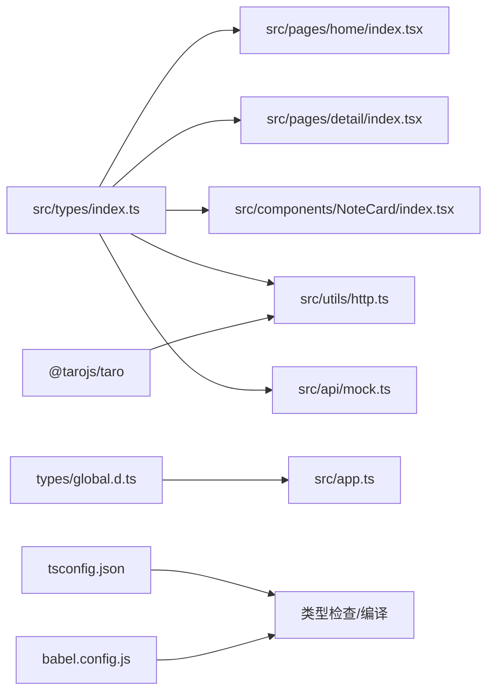

# TypeScript类型系统

<cite>
**本文引用的文件**
- [src/types/index.ts](file://src/types/index.ts)
- [types/global.d.ts](file://types/global.d.ts)
- [tsconfig.json](file://tsconfig.json)
- [src/utils/http.ts](file://src/utils/http.ts)
- [src/api/mock.ts](file://src/api/mock.ts)
- [src/components/NoteCard/index.tsx](file://src/components/NoteCard/index.tsx)
- [src/pages/home/index.tsx](file://src/pages/home/index.tsx)
- [src/pages/detail/index.tsx](file://src/pages/detail/index.tsx)
- [src/utils/index.ts](file://src/utils/index.ts)
- [src/app.ts](file://src/app.ts)
- [package.json](file://package.json)
- [config/index.ts](file://config/index.ts)
- [babel.config.js](file://babel.config.js)
</cite>

## 目录
1. [引言](#引言)
2. [项目结构](#项目结构)
3. [核心组件](#核心组件)
4. [架构总览](#架构总览)
5. [详细组件分析](#详细组件分析)
6. [依赖分析](#依赖分析)
7. [性能考虑](#性能考虑)
8. [故障排查指南](#故障排查指南)
9. [结论](#结论)
10. [附录](#附录)

## 引言
本文件面向红书（Taro + React）项目，系统化梳理其 TypeScript 类型系统设计与最佳实践，覆盖以下主题：
- 核心数据模型（Post、User、Comment、Message、Topic）的接口设计与可选字段策略
- 类型别名、联合类型、字面量类型的使用场景
- 泛型在 HTTP 客户端中的应用，以及类型守卫在认证响应中的使用
- 全局类型声明与环境变量的管理方式
- 编译配置对类型检查的影响（严格模式、模块解析、路径映射）
- 组件通信、API 调用、状态管理中的类型安全落地
- 为开发者提供的类型驱动开发指南

## 项目结构
项目采用“按功能域分层 + 模块化”的组织方式：
- 类型集中于 src/types/index.ts，统一导出核心数据模型与认证相关类型
- 全局类型声明位于 types/global.d.ts，补充资源模块声明与 NodeJS 环境变量
- HTTP 客户端位于 src/utils/http.ts，提供泛型化的请求封装与统一响应结构
- 页面与组件通过导入类型或使用内联接口进行类型约束
- 工程配置由 tsconfig.json、config/index.ts、babel.config.js 共同决定

**图表来源**
- [src/types/index.ts:1-147](file://src/types/index.ts#L1-L147)
- [types/global.d.ts:1-36](file://types/global.d.ts#L1-L36)
- [src/utils/http.ts:1-165](file://src/utils/http.ts#L1-L165)
- [src/api/mock.ts:1-98](file://src/api/mock.ts#L1-L98)
- [src/pages/home/index.tsx:1-151](file://src/pages/home/index.tsx#L1-L151)
- [src/pages/detail/index.tsx:1-180](file://src/pages/detail/index.tsx#L1-L180)
- [src/components/NoteCard/index.tsx:1-53](file://src/components/NoteCard/index.tsx#L1-L53)
- [src/app.ts:1-14](file://src/app.ts#L1-L14)

**章节来源**
- [src/types/index.ts:1-147](file://src/types/index.ts#L1-L147)
- [types/global.d.ts:1-36](file://types/global.d.ts#L1-L36)
- [tsconfig.json:1-31](file://tsconfig.json#L1-L31)
- [config/index.ts:1-82](file://config/index.ts#L1-L82)
- [babel.config.js:1-12](file://babel.config.js#L1-L12)

## 核心组件
本节聚焦核心数据模型与认证类型的设计思路与最佳实践。

- 数据模型接口
  - Post：包含标识、标题、封面、作者信息、互动计数、时间戳等；对视频、图片数组、话题、位置等字段采用可选以适配不同内容形态
  - User：包含用户标识、昵称、头像、签名、粉丝数、关注数、获赞数及可选的关注态
  - Comment：评论标识、内容、作者信息、点赞数、时间戳、可选回复目标
  - Message：消息标识、类型（字面量联合）、标题、内容、作者信息、时间戳、已读标记
  - Topic：话题标识、标题、封面、参与人数、笔记数量

- 类型别名与联合类型
  - AuthMode：枚举式字面量别名，用于区分单/双 Token 模式
  - Message.type：字面量联合类型，限定消息类型集合
  - IAuthLoginRes：单/双 Token 响应的联合类型，配合类型守卫进行分支处理

- 类型守卫与分支逻辑
  - isSingleTokenRes / isDoubleTokenRes：基于属性存在性判断的类型守卫，确保在分支中对 token 结构进行精确收窄

- 最佳实践
  - 使用可选字段表达“可能缺失”，避免用 any 或冗余的条件判断
  - 使用字面量联合约束枚举值，减少字符串拼写错误
  - 对复杂响应体使用泛型接口 IResponse<T>，统一业务错误处理
  - 将认证相关类型与业务类型解耦，便于复用与演进

**章节来源**
- [src/types/index.ts:1-147](file://src/types/index.ts#L1-L147)

## 架构总览
下图展示类型系统在项目中的角色与交互关系：类型定义作为契约，贯穿组件、页面、工具函数与 HTTP 客户端；全局类型声明提供资源模块与环境变量的类型支持。

**图表来源**
- [src/types/index.ts:1-147](file://src/types/index.ts#L1-L147)
- [types/global.d.ts:1-36](file://types/global.d.ts#L1-L36)
- [src/utils/http.ts:1-165](file://src/utils/http.ts#L1-L165)
- [src/api/mock.ts:1-98](file://src/api/mock.ts#L1-L98)
- [src/pages/home/index.tsx:1-151](file://src/pages/home/index.tsx#L1-L151)
- [src/pages/detail/index.tsx:1-180](file://src/pages/detail/index.tsx#L1-L180)
- [src/components/NoteCard/index.tsx:1-53](file://src/components/NoteCard/index.tsx#L1-L53)

## 详细组件分析

### 数据模型与类型别名
- 设计要点
  - 字段命名遵循后端返回风格，保持一致性
  - 可选字段用于表达“非必填”与“平台差异”，如 isVideo、images、topic、location
  - 字面量联合用于强约束消息类型与认证模式
- 类型守卫
  - 在登录流程中根据是否存在 refreshToken 判断响应类型，确保后续分支的类型安全

**图表来源**
- [src/types/index.ts:1-147](file://src/types/index.ts#L1-L147)

**章节来源**
- [src/types/index.ts:1-147](file://src/types/index.ts#L1-L147)

### HTTP 客户端与泛型
- 泛型接口 IResponse<T> 统一后端响应结构，使调用方在 Promise 中获得明确的数据类型
- http 函数接收 RequestOptions，内部自动拼接查询参数、设置 Content-Type、处理业务错误与 HTTP 错误
- 提供 httpGet/httpPost/httpPut/httpDelete 的便捷方法，均以泛型约束返回值类型

**图表来源**
- [src/utils/http.ts:46-165](file://src/utils/http.ts#L46-L165)

**章节来源**
- [src/utils/http.ts:1-165](file://src/utils/http.ts#L1-L165)

### 组件与页面中的类型使用
- 页面内联接口
  - Home 与 Detail 页面在文件内定义局部接口（如 Post、Comment），用于列表项渲染与本地状态管理
  - 这些接口与 src/types/index.ts 中的核心模型保持字段一致，便于未来迁移到共享类型
- 组件 Props
  - NoteCard 使用内联接口 NoteCardProps 约束传入属性，保证点击行为与导航参数类型安全

**图表来源**
- [src/pages/home/index.tsx:7-68](file://src/pages/home/index.tsx#L7-L68)
- [src/pages/detail/index.tsx:8-21](file://src/pages/detail/index.tsx#L8-L21)
- [src/components/NoteCard/index.tsx:5-13](file://src/components/NoteCard/index.tsx#L5-L13)

**章节来源**
- [src/pages/home/index.tsx:1-151](file://src/pages/home/index.tsx#L1-L151)
- [src/pages/detail/index.tsx:1-180](file://src/pages/detail/index.tsx#L1-L180)
- [src/components/NoteCard/index.tsx:1-53](file://src/components/NoteCard/index.tsx#L1-L53)

### 工具函数与泛型
- debounce/throttle 接受泛型函数，利用 Parameters<T> 获取参数元组，返回同样参数签名的函数，确保事件回调类型安全
- formatNumber/formatTime 为纯函数，输入输出类型明确，便于在组件中直接调用

**图表来源**
- [src/utils/index.ts:25-48](file://src/utils/index.ts#L25-L48)

**章节来源**
- [src/utils/index.ts:1-49](file://src/utils/index.ts#L1-L49)

### Mock 数据与类型一致性
- mock.ts 导入核心类型，使用强类型数组初始化 mockUsers、mockPosts、mockTopics
- 该做法能尽早暴露类型不匹配问题，保证开发期与接口契约一致

**章节来源**
- [src/api/mock.ts:1-98](file://src/api/mock.ts#L1-L98)

## 依赖分析
- 类型依赖
  - 页面与组件依赖 src/types/index.ts 中的接口定义
  - HTTP 客户端依赖 src/types/index.ts 中的认证类型与 IResponse<T>
  - 全局类型声明为资源模块与环境变量提供类型支持
- 工程配置影响
  - tsconfig.json 启用严格空值检查、未使用局部变量/参数检查、路径映射与 JSX 设置
  - config/index.ts 与 babel.config.js 配合，确保 TS/TSX 正确编译与框架集成

**图表来源**
- [src/types/index.ts:1-147](file://src/types/index.ts#L1-L147)
- [types/global.d.ts:1-36](file://types/global.d.ts#L1-L36)
- [tsconfig.json:1-31](file://tsconfig.json#L1-L31)
- [babel.config.js:1-12](file://babel.config.js#L1-L12)
- [src/utils/http.ts:1-165](file://src/utils/http.ts#L1-L165)
- [src/api/mock.ts:1-98](file://src/api/mock.ts#L1-L98)
- [src/pages/home/index.tsx:1-151](file://src/pages/home/index.tsx#L1-L151)
- [src/pages/detail/index.tsx:1-180](file://src/pages/detail/index.tsx#L1-L180)
- [src/components/NoteCard/index.tsx:1-53](file://src/components/NoteCard/index.tsx#L1-L53)
- [src/app.ts:1-14](file://src/app.ts#L1-L14)

**章节来源**
- [tsconfig.json:1-31](file://tsconfig.json#L1-L31)
- [config/index.ts:1-82](file://config/index.ts#L1-L82)
- [babel.config.js:1-12](file://babel.config.js#L1-L12)
- [package.json:1-93](file://package.json#L1-L93)

## 性能考虑
- 类型检查成本控制
  - 合理拆分类型文件，避免在一个文件中堆积过多类型导致编译缓慢
  - 使用字面量联合与类型守卫替代复杂的条件类型，提高编译器推断效率
- 运行时开销
  - 泛型仅在编译期生效，不会引入额外运行时成本
  - debounce/throttle 的实现简洁，注意避免在高频事件中传递过大的闭包

## 故障排查指南
- 常见类型错误
  - 属性不存在：确认可选字段的使用与判空处理
  - 联合类型分支错误：优先使用类型守卫（如 isSingleTokenRes/isDoubleTokenRes）进行收窄
  - 泛型推断失败：显式指定 http<T>() 的泛型参数，或确保 IResponse<T> 的 data 字段类型明确
- 环境变量与全局声明
  - 确认 types/global.d.ts 中的 NodeJS.ProcessEnv 字段与实际环境变量一致
  - 确保资源模块声明（*.png/*.css 等）与项目实际资源一致
- 编译配置问题
  - 严格空值检查导致的编译报错：为可选字段添加非空断言或条件判断
  - 未使用变量/参数：删除或启用 noUnusedLocals/noUnusedParameters 的宽松模式
  - 路径映射无效：检查 tsconfig.json 中的 paths 与 @/* 映射

**章节来源**
- [src/types/index.ts:139-146](file://src/types/index.ts#L139-L146)
- [src/utils/http.ts:25-31](file://src/utils/http.ts#L25-L31)
- [types/global.d.ts:14-33](file://types/global.d.ts#L14-L33)
- [tsconfig.json:9-26](file://tsconfig.json#L9-L26)

## 结论
本项目通过集中化的类型定义、清晰的接口与类型别名、以及泛型化的 HTTP 客户端，实现了良好的类型安全与可维护性。建议在后续迭代中：
- 将页面内的局部接口逐步迁移至 src/types/index.ts，统一复用
- 对认证与业务类型进一步细化，增加更丰富的类型守卫与工厂函数
- 在团队内推广类型驱动开发流程，从契约到实现的闭环

## 附录
- 类型驱动开发实践清单
  - 所有对外 API 响应先定义 IResponse<T>，再在具体业务中细化 T
  - 使用字面量联合约束枚举值，避免魔法字符串
  - 通过类型守卫进行分支收窄，减少类型断言滥用
  - 组件 Props 使用内联接口或共享接口，保持一致的字段约定
  - 工具函数尽量使用泛型，保留参数类型与返回值类型的一致性
  - 在 tsconfig.json 中启用严格模式，持续优化类型覆盖率