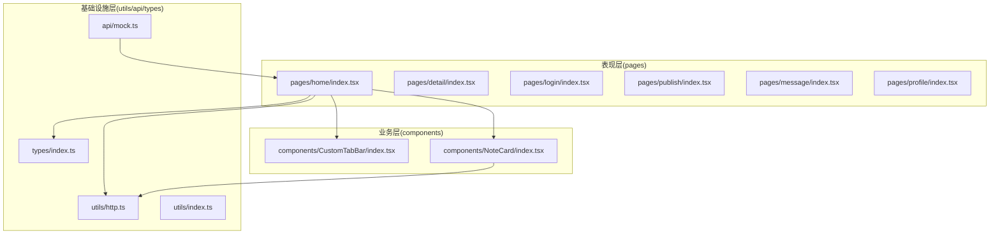
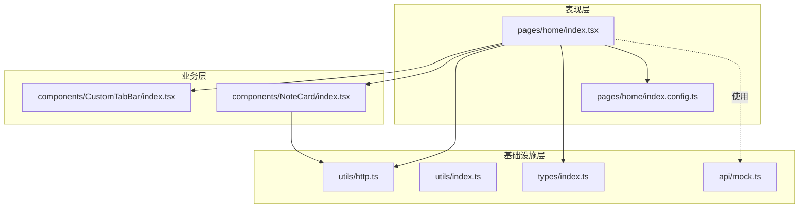
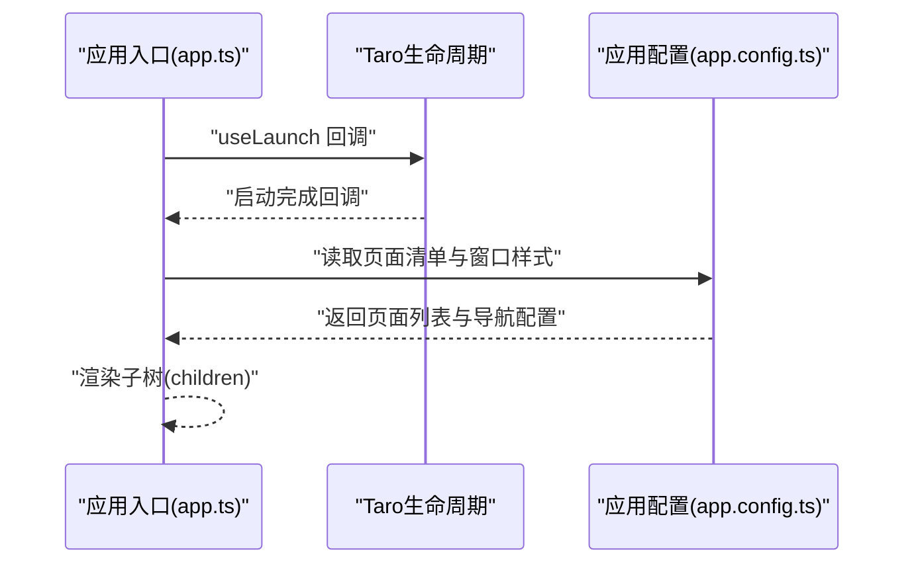
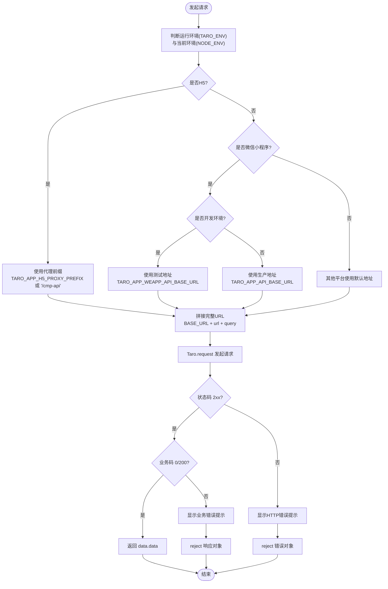
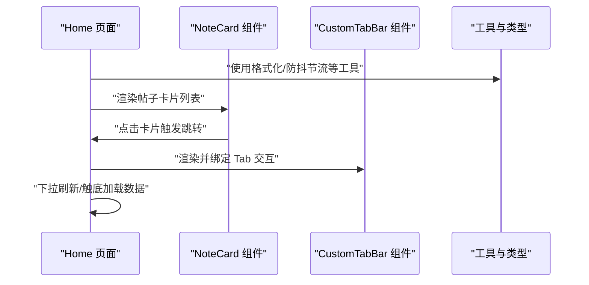
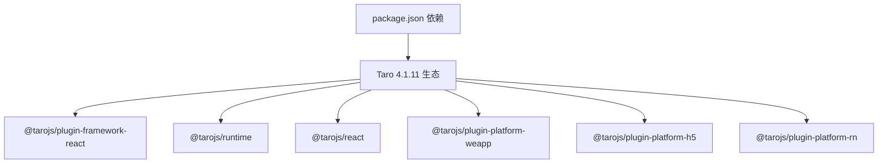

# 整体架构概览

<cite>
**本文引用的文件**
- [package.json](file://package.json)
- [tsconfig.json](file://tsconfig.json)
- [config/index.ts](file://config/index.ts)
- [config/dev.ts](file://config/dev.ts)
- [config/prod.ts](file://config/prod.ts)
- [src/app.ts](file://src/app.ts)
- [src/app.config.ts](file://src/app.config.ts)
- [src/utils/http.ts](file://src/utils/http.ts)
- [src/utils/index.ts](file://src/utils/index.ts)
- [src/types/index.ts](file://src/types/index.ts)
- [src/pages/home/index.tsx](file://src/pages/home/index.tsx)
- [src/pages/home/index.config.ts](file://src/pages/home/index.config.ts)
- [src/components/CustomTabBar/index.tsx](file://src/components/CustomTabBar/index.tsx)
- [src/components/NoteCard/index.tsx](file://src/components/NoteCard/index.tsx)
- [src/api/mock.ts](file://src/api/mock.ts)
</cite>

## 目录
1. [引言](#引言)
2. [项目结构](#项目结构)
3. [核心组件](#核心组件)
4. [架构总览](#架构总览)
5. [详细组件分析](#详细组件分析)
6. [依赖关系分析](#依赖关系分析)
7. [性能考虑](#性能考虑)
8. [故障排查指南](#故障排查指南)
9. [结论](#结论)
10. [附录](#附录)

## 引言
本文件面向红书项目，提供基于 Taro 4.1.11 的多端统一架构概览与实践说明。项目采用 React + TypeScript 技术栈，结合 Taro 的多端编译能力，实现一套代码在微信小程序、H5、React Native 等平台运行。文档从架构理念、分层设计、多端适配原理、启动与初始化流程、性能优化与可扩展性等方面进行系统化梳理，帮助开发者快速建立对系统的整体认知。

## 项目结构
项目采用“按层组织”的目录结构，围绕三层架构展开：
- 表现层（pages）：页面级组件，负责路由、交互与视图渲染
- 业务层（components）：可复用的 UI 组件与业务组件
- 基础设施层（utils、api、types）：通用工具、HTTP 封装、类型定义与模拟数据

图表来源
- [src/pages/home/index.tsx:1-151](file://src/pages/home/index.tsx#L1-L151)
- [src/components/CustomTabBar/index.tsx:1-67](file://src/components/CustomTabBar/index.tsx#L1-L67)
- [src/components/NoteCard/index.tsx:1-53](file://src/components/NoteCard/index.tsx#L1-L53)
- [src/utils/http.ts:1-172](file://src/utils/http.ts#L1-L172)
- [src/utils/index.ts:1-49](file://src/utils/index.ts#L1-L49)
- [src/types/index.ts:1-147](file://src/types/index.ts#L1-L147)
- [src/api/mock.ts:1-98](file://src/api/mock.ts#L1-L98)

章节来源
- [config/index.ts:1-82](file://config/index.ts#L1-L82)
- [src/app.config.ts:1-18](file://src/app.config.ts#L1-L18)

## 核心组件
- 应用入口与启动
  - 应用入口通过 Taro 生命周期钩子完成启动日志输出，作为全局初始化的挂载点
  - 页面清单由应用配置集中声明，统一管理导航栏与页面路由
- HTTP 通信层
  - 封装跨端请求，自动根据运行环境选择基础地址，内置统一响应处理与错误提示
  - 提供 GET/POST/PUT/DELETE 方法与参数化查询串拼接
- 工具与类型
  - 常用格式化、防抖节流等工具函数
  - 完整的领域模型类型定义，覆盖用户、帖子、评论、话题、认证等
- 模拟数据
  - 提供用户、帖子、话题的模拟数据，便于开发与联调

章节来源
- [src/app.ts:1-14](file://src/app.ts#L1-L14)
- [src/app.config.ts:1-18](file://src/app.config.ts#L1-L18)
- [src/utils/http.ts:1-172](file://src/utils/http.ts#L1-L172)
- [src/utils/index.ts:1-49](file://src/utils/index.ts#L1-L49)
- [src/types/index.ts:1-147](file://src/types/index.ts#L1-L147)
- [src/api/mock.ts:1-98](file://src/api/mock.ts#L1-L98)

## 架构总览
红书项目采用“表现层-业务层-基础设施层”的三层架构，配合 Taro 的多端编译与运行时，形成统一的开发体验与部署能力。下图展示了页面、组件、工具与类型之间的交互关系：

图表来源
- [src/pages/home/index.tsx:1-151](file://src/pages/home/index.tsx#L1-L151)
- [src/pages/home/index.config.ts:1-6](file://src/pages/home/index.config.ts#L1-L6)
- [src/components/CustomTabBar/index.tsx:1-67](file://src/components/CustomTabBar/index.tsx#L1-L67)
- [src/components/NoteCard/index.tsx:1-53](file://src/components/NoteCard/index.tsx#L1-L53)
- [src/utils/http.ts:1-172](file://src/utils/http.ts#L1-L172)
- [src/utils/index.ts:1-49](file://src/utils/index.ts#L1-L49)
- [src/types/index.ts:1-147](file://src/types/index.ts#L1-L147)
- [src/api/mock.ts:1-98](file://src/api/mock.ts#L1-L98)

## 详细组件分析

### 应用启动与初始化流程
应用启动流程围绕 Taro 生命周期与应用配置展开，确保在各端一致的初始化行为与页面注册。

图表来源
- [src/app.ts:1-14](file://src/app.ts#L1-L14)
- [src/app.config.ts:1-18](file://src/app.config.ts#L1-L18)

章节来源
- [src/app.ts:1-14](file://src/app.ts#L1-L14)
- [src/app.config.ts:1-18](file://src/app.config.ts#L1-L18)

### HTTP 请求封装与跨端适配
HTTP 层通过 Taro 的跨端请求能力，统一处理不同平台的基础地址、错误提示与响应校验，并提供便捷的请求方法。

图表来源
- [src/utils/http.ts:1-172](file://src/utils/http.ts#L1-L172)

章节来源
- [src/utils/http.ts:1-172](file://src/utils/http.ts#L1-L172)

### 页面与组件交互示例（Home）
Home 页面演示了瀑布流布局、下拉刷新、触底加载、自定义 TabBar 与卡片组件的组合使用。

图表来源
- [src/pages/home/index.tsx:1-151](file://src/pages/home/index.tsx#L1-L151)
- [src/components/NoteCard/index.tsx:1-53](file://src/components/NoteCard/index.tsx#L1-L53)
- [src/components/CustomTabBar/index.tsx:1-67](file://src/components/CustomTabBar/index.tsx#L1-L67)
- [src/utils/index.ts:1-49](file://src/utils/index.ts#L1-L49)
- [src/types/index.ts:1-147](file://src/types/index.ts#L1-L147)

章节来源
- [src/pages/home/index.tsx:1-151](file://src/pages/home/index.tsx#L1-L151)
- [src/pages/home/index.config.ts:1-6](file://src/pages/home/index.config.ts#L1-L6)
- [src/components/NoteCard/index.tsx:1-53](file://src/components/NoteCard/index.tsx#L1-L53)
- [src/components/CustomTabBar/index.tsx:1-67](file://src/components/CustomTabBar/index.tsx#L1-L67)
- [src/utils/index.ts:1-49](file://src/utils/index.ts#L1-L49)
- [src/types/index.ts:1-147](file://src/types/index.ts#L1-L147)

## 依赖关系分析
- 技术栈与构建配置
  - React 18 + TypeScript，使用 Taro CLI 与 Webpack/Vite Runner 进行多端编译
  - Taro 4.1.11 提供框架、运行时、组件库与平台插件生态
- 关键依赖
  - 跨端运行时与平台插件：@tarojs/runtime、@tarojs/plugin-platform-*
  - React 生态：@tarojs/plugin-framework-react、@tarojs/react
  - 类型与工具链：@types/react、typescript、@vitejs/plugin-react
- 配置体系
  - config/index.ts 定义通用配置与各端差异化设置
  - config/dev.ts 与 config/prod.ts 提供开发与生产环境的差异化能力（如 H5 代理）

图表来源
- [package.json:1-93](file://package.json#L1-L93)
- [config/index.ts:1-82](file://config/index.ts#L1-L82)

章节来源
- [package.json:1-93](file://package.json#L1-L93)
- [config/index.ts:1-82](file://config/index.ts#L1-L82)

## 性能考虑
- 打包与体积
  - H5 端支持按需分析与预渲染插件配置占位，便于后续接入体积分析与首屏优化
- 运行时优化
  - 页面滚动与触底加载采用防抖/节流策略，避免频繁重渲染
  - 图片懒加载与卡片点击导航减少不必要的开销
- 网络层优化
  - 统一错误提示与业务码校验，降低异常分支处理成本
  - H5 端通过代理转发，减少跨域与调试复杂度

章节来源
- [config/prod.ts:1-34](file://config/prod.ts#L1-L34)
- [src/utils/index.ts:1-49](file://src/utils/index.ts#L1-L49)
- [src/pages/home/index.tsx:1-151](file://src/pages/home/index.tsx#L1-L151)
- [src/utils/http.ts:1-172](file://src/utils/http.ts#L1-L172)

## 故障排查指南
- 启动与页面
  - 若页面未出现在启动页或导航异常，检查应用配置中的页面清单与窗口样式
- 网络请求
  - H5 端请求失败：确认代理配置与目标服务可达；检查基础地址与业务码约定
  - 小程序端请求失败：确认测试/生产地址配置与域名白名单
- 组件交互
  - 自定义 TabBar 未高亮：检查当前路由路径与 Tab 列表匹配逻辑
  - 点击卡片无跳转：确认页面路由与导航方法使用正确

章节来源
- [src/app.config.ts:1-18](file://src/app.config.ts#L1-L18)
- [src/utils/http.ts:1-172](file://src/utils/http.ts#L1-L172)
- [src/components/CustomTabBar/index.tsx:1-67](file://src/components/CustomTabBar/index.tsx#L1-L67)
- [src/pages/home/index.tsx:1-151](file://src/pages/home/index.tsx#L1-L151)

## 结论
红书项目以 Taro 4.1.11 为核心，结合 React + TypeScript，构建了清晰的三层架构与完善的多端适配方案。通过统一的 HTTP 封装、类型体系与页面/组件解耦，项目在保持开发效率的同时，具备良好的可维护性与扩展性。建议在后续迭代中逐步引入体积分析与首屏优化策略，并完善真实接口对接与鉴权体系。

## 附录
- 多端编译命令
  - 支持 weapp、h5、rn 等多端构建与监听命令，便于本地联调与预览
- TypeScript 配置要点
  - JSX 目标、模块解析、路径别名与严格空检查等配置，保障类型安全与开发体验

章节来源
- [package.json:12-32](file://package.json#L12-L32)
- [tsconfig.json:1-31](file://tsconfig.json#L1-L31)