# 构建配置系统

<cite>
**本文档引用的文件**
- [config/index.ts](file://config/index.ts)
- [config/dev.ts](file://config/dev.ts)
- [config/prod.ts](file://config/prod.ts)
- [babel.config.js](file://babel.config.js)
- [package.json](file://package.json)
- [tsconfig.json](file://tsconfig.json)
- [src/app.config.ts](file://src/app.config.ts)
- [src/pages/home/index.config.ts](file://src/pages/home/index.config.ts)
- [src/pages/detail/index.config.ts](file://src/pages/detail/index.config.ts)
- [src/app.scss](file://src/app.scss)
- [src/styles/_variables.scss](file://src/styles/_variables.scss)
</cite>

## 更新摘要
**变更内容**
- 新增Taroify UI框架依赖支持，包括@taroify/core、@taroify/hooks、@taroify/icons三个核心包
- 集成vite-plugin-style-import插件用于按需导入样式资源
- 更新Vite配置以支持Taroify组件的样式导入和优化
- 完善SCSS样式配置，针对Taroify组件进行样式定制和覆盖

## 目录
1. [简介](#简介)
2. [项目结构](#项目结构)
3. [核心组件](#核心组件)
4. [架构总览](#架构总览)
5. [详细组件分析](#详细组件分析)
6. [依赖关系分析](#依赖关系分析)
7. [性能考虑](#性能考虑)
8. [故障排查指南](#故障排查指南)
9. [结论](#结论)

## 简介
本文件系统性梳理红书项目的 Taro Vite 多端构建配置体系，覆盖开发与生产环境的差异化策略、Babel 转译对 TypeScript、JSX、装饰器等语法的支持、多平台（微信小程序、H5、React Native）构建参数差异、代码分割与 Tree Shaking 的可配置点、以及热重载、Source Map、压缩混淆等开发体验相关配置。本次重大升级实现了从Webpack 5到Vite的全面迁移，显著提升了构建性能和开发体验。

**更新** 本次更新新增了对Taroify UI框架的完整支持，包括依赖管理、样式导入优化和按需加载配置，为项目提供了现代化的UI组件解决方案。

## 项目结构
红书项目采用 Taro 4 + React + Vite 的多端统一工程化方案，核心配置集中在 config 目录下，按环境拆分基础配置与差异化配置；TypeScript 编译与 Babel 转译分别由 tsconfig.json 与 babel.config.js 驱动；页面级配置通过各页面的 index.config.ts 进行声明式控制。新增的Taroify UI框架通过vite-plugin-style-import插件实现按需样式导入优化。

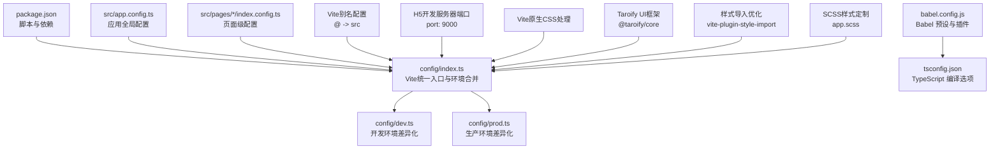

**图表来源**
- [config/index.ts:7-89](file://config/index.ts#L7-L89)
- [config/dev.ts:1-21](file://config/dev.ts#L1-L21)
- [config/prod.ts:1-34](file://config/prod.ts#L1-L34)
- [babel.config.js:1-12](file://babel.config.js#L1-L12)
- [tsconfig.json:1-31](file://tsconfig.json#L1-L31)
- [package.json:12-33](file://package.json#L12-L33)
- [src/app.config.ts:1-18](file://src/app.config.ts#L1-L18)
- [src/pages/home/index.config.ts:1-6](file://src/pages/home/index.config.ts#L1-L6)
- [src/app.scss:3-11](file://src/app.scss#L3-L11)

**章节来源**
- [config/index.ts:7-89](file://config/index.ts#L7-L89)
- [package.json:12-33](file://package.json#L12-L33)

## 核心组件
- **Vite统一配置入口**：在 config/index.ts 中使用 defineConfig<'vite'> 定义基础配置与环境合并逻辑，区分 development 与 production。
- **开发环境配置**：在 config/dev.ts 中启用 H5 开发服务器代理，使用 Vite 的 rewrite 函数进行路径重写。
- **生产环境配置**：在 config/prod.ts 中预留 webpackChain 扩展点，支持体积分析与预渲染等高级优化。
- **Babel 转译**：通过 babel.config.js 使用 taro 预设，开启 React 框架、TypeScript 支持与 webpack5 编译器适配。
- **TypeScript 编译**：通过 tsconfig.json 启用 experimentalDecorators、jsx react-jsx、sourceMap 等，确保装饰器与 JSX 转译一致。
- **页面与应用配置**：通过 src/app.config.ts 与各页面 index.config.ts 声明页面列表与页面级导航等行为。
- **Vite别名配置**：在 config/index.ts 中设置 @ 别名指向 src 目录，提升导入便捷性。
- **Vite原生CSS处理**：移除Webpack特定的CSS提取配置，采用Vite的原生CSS处理机制。
- **Taroify UI框架**：新增@taroify/core、@taroify/hooks、@taroify/icons依赖，提供完整的UI组件解决方案。
- **样式导入优化**：通过vite-plugin-style-import实现按需样式导入，提升构建性能和运行时效率。
- **SCSS样式定制**：在src/app.scss中针对Taroify组件进行样式覆盖和定制。

**章节来源**
- [config/index.ts:7-89](file://config/index.ts#L7-L89)
- [config/dev.ts:1-21](file://config/dev.ts#L1-L21)
- [config/prod.ts:1-34](file://config/prod.ts#L1-L34)
- [babel.config.js:1-12](file://babel.config.js#L1-L12)
- [tsconfig.json:1-31](file://tsconfig.json#L1-L31)
- [src/app.config.ts:1-18](file://src/app.config.ts#L1-L18)
- [src/pages/home/index.config.ts:1-6](file://src/pages/home/index.config.ts#L1-L6)

## 架构总览
下图展示 Taro Vite 构建配置在不同平台与环境下的交互关系，以及关键配置项如何影响最终产物。新增的Taroify UI框架通过vite-plugin-style-import插件实现按需样式导入优化。

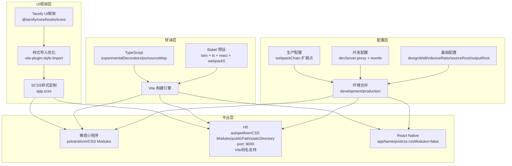

**图表来源**
- [config/index.ts:8-88](file://config/index.ts#L8-L88)
- [config/dev.ts:8-20](file://config/dev.ts#L8-L20)
- [config/prod.ts:3-33](file://config/prod.ts#L3-L33)
- [babel.config.js:4-10](file://babel.config.js#L4-L10)
- [tsconfig.json:8-17](file://tsconfig.json#L8-L17)
- [package.json:39-53](file://package.json#L39-L53)
- [src/app.scss:3-11](file://src/app.scss#L3-L11)

## 详细组件分析

### Taroify UI框架集成
**更新** 项目新增了完整的Taroify UI框架支持，提供现代化的移动端UI组件解决方案：

- **核心依赖**：@taroify/core提供基础UI组件，@taroify/hooks提供React Hooks工具集，@taroify/icons提供图标库
- **版本兼容**：统一使用0.9.2版本，确保组件功能和样式的一致性
- **按需导入**：通过vite-plugin-style-import实现组件样式的按需加载，减少bundle体积
- **样式定制**：在app.scss中针对Taroify组件进行样式覆盖，移除默认焦点样式

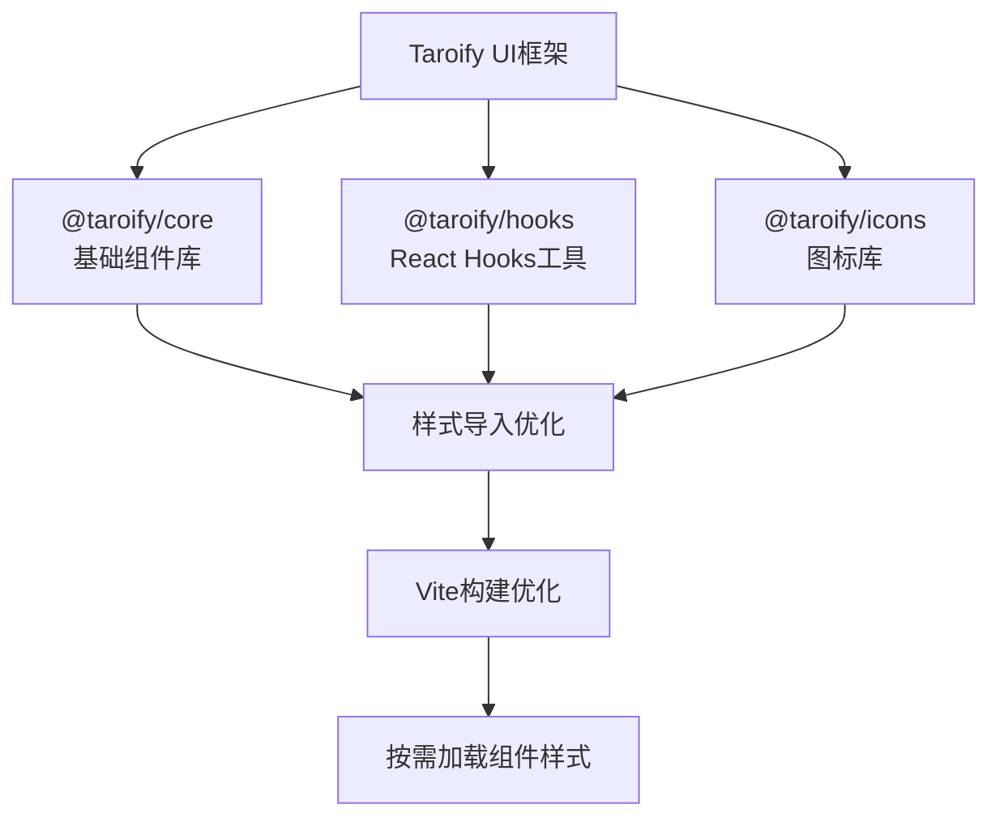

**图表来源**
- [package.json:41-43](file://package.json#L41-L43)
- [config/index.ts:3](file://config/index.ts#L3)
- [src/app.scss:3-11](file://src/app.scss#L3-L11)

**章节来源**
- [package.json:41-43](file://package.json#L41-L43)
- [config/index.ts:3](file://config/index.ts#L3)
- [src/app.scss:3-11](file://src/app.scss#L3-L11)

### vite-plugin-style-import插件配置
**新增** 通过vite-plugin-style-import插件实现Taroify组件样式的按需导入优化：

- **插件集成**：在config/index.ts中导入createStyleImportPlugin函数
- **按需加载**：自动识别组件导入，仅加载实际使用的组件样式
- **性能优化**：减少初始bundle大小，提升应用启动速度
- **构建时优化**：在构建阶段进行样式tree-shaking，移除未使用样式

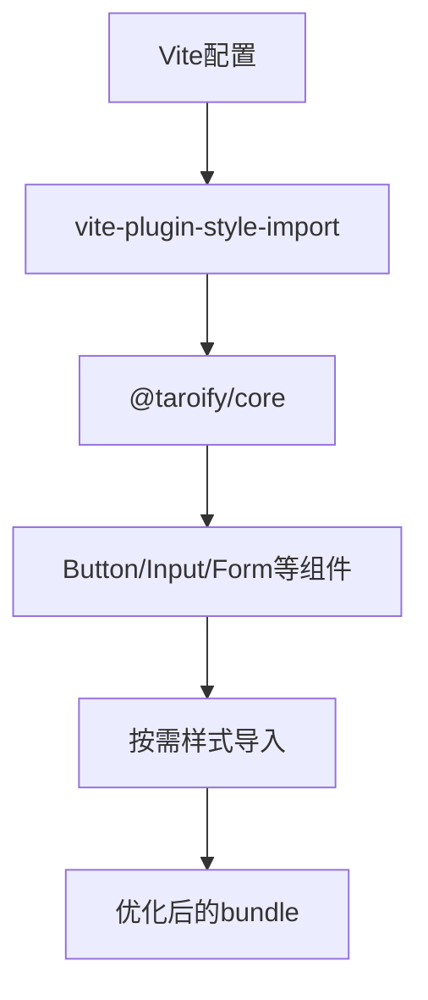

**图表来源**
- [config/index.ts:3](file://config/index.ts#L3)

**章节来源**
- [config/index.ts:3](file://config/index.ts#L3)

### SCSS样式定制与覆盖
**更新** 完善了Taroify组件的样式定制和覆盖配置：

- **组件样式导入**：在app.scss中按需导入实际使用的Taroify组件样式
- **焦点样式移除**：针对Input组件移除默认的蓝色边框焦点样式
- **通用样式覆盖**：统一处理Field、Cell等组件的边框样式
- **变量系统集成**：结合src/styles/_variables.scss中的设计变量

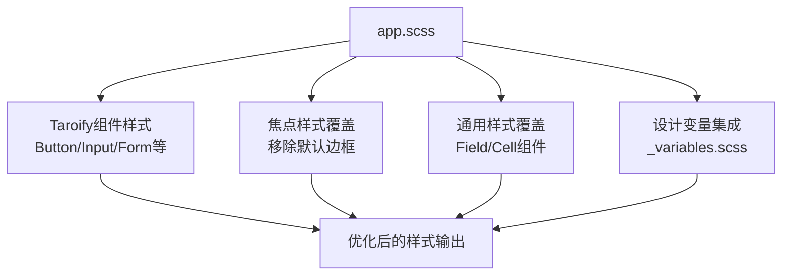

**图表来源**
- [src/app.scss:3-11](file://src/app.scss#L3-L11)
- [src/app.scss:21-27](file://src/app.scss#L21-L27)
- [src/app.scss:43-51](file://src/app.scss#L43-L51)
- [src/styles/_variables.scss:1-9](file://src/styles/_variables.scss#L1-L9)

**章节来源**
- [src/app.scss:3-11](file://src/app.scss#L3-L11)
- [src/app.scss:21-27](file://src/app.scss#L21-L27)
- [src/app.scss:43-51](file://src/app.scss#L43-L51)
- [src/styles/_variables.scss:1-9](file://src/styles/_variables.scss#L1-L9)

### Vite构建系统与Webpack配置对比
**更新** 构建系统从Webpack 5完全迁移到Vite，带来以下重大变化：

- **配置格式**：config/index.ts 现在使用 defineConfig<'vite'> 格式，而非传统的 webpack-chain 配置
- **编译器选择**：compiler: 'vite' 明确指定使用Vite作为编译器
- **CSS处理**：移除 miniCssExtractPluginOption 等Webpack特定配置，采用Vite原生CSS处理
- **别名配置**：新增 alias: { '@': path.resolve(process.cwd(), 'src') } 支持@路径别名
- **缓存配置**：cache: { enable: false } 控制Vite缓存行为
- **插件系统**：新增vite-plugin-style-import插件支持

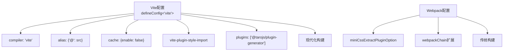

**图表来源**
- [config/index.ts:7-28](file://config/index.ts#L7-L28)
- [config/index.ts:29](file://config/index.ts#L29)

**章节来源**
- [config/index.ts:7-28](file://config/index.ts#L7-L28)
- [config/index.ts:29](file://config/index.ts#L29)

### 开发环境与生产环境配置策略
- **环境选择**：通过 process.env.NODE_ENV 判断当前环境，合并基础配置与对应环境配置。
- **开发环境**：H5 devServer 启用代理，使用 Vite 的 rewrite 函数将 /cmp-api 请求重写为目标URL。
- **生产环境**：保留扩展点注释，便于后续接入体积分析与预渲染等优化。

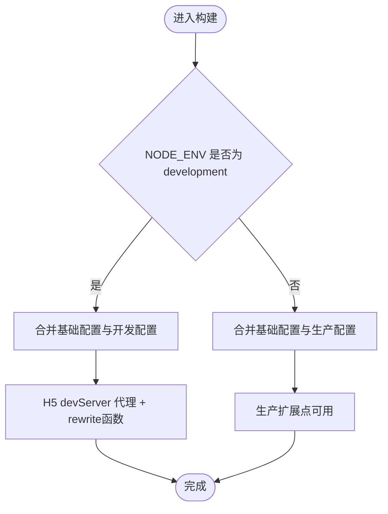

**图表来源**
- [config/index.ts:84-88](file://config/index.ts#L84-L88)
- [config/dev.ts:3-4](file://config/dev.ts#L3-L4)
- [config/dev.ts:8-20](file://config/dev.ts#L8-L20)
- [config/prod.ts:10-33](file://config/prod.ts#L10-L33)

**章节来源**
- [config/index.ts:84-88](file://config/index.ts#L84-L88)
- [config/dev.ts:1-21](file://config/dev.ts#L1-L21)
- [config/prod.ts:1-34](file://config/prod.ts#L1-L34)

### API代理配置的Vite迁移
**更新** API代理配置语法已完全迁移到Vite的rewrite函数形式：

- **rewrite函数**：使用 rewrite: (path) => path.replace(/^\/cmp-api/, '') 替代传统的路径替换
- **代理配置**：保持原有的 /cmp-api 代理规则，但语法更符合Vite标准
- **路径重写**：自动移除请求路径中的 /cmp-api 前缀

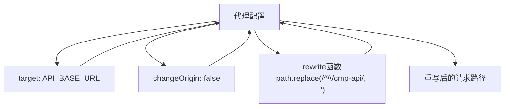

**图表来源**
- [config/dev.ts:10-16](file://config/dev.ts#L10-L16)

**章节来源**
- [config/dev.ts:10-16](file://config/dev.ts#L10-L16)

### Vite别名配置与路径映射
**新增** Vite别名配置是本次迁移的重要改进，提供更便捷的路径导入：

- **别名定义**：alias: { '@': path.resolve(process.cwd(), 'src') } 将@映射到项目根目录的src
- **路径简化**：支持 import { Button } from '@/components/Button' 等简洁导入语法
- **TypeScript集成**：配合tsconfig.json中的paths配置，确保类型检查正确识别别名路径

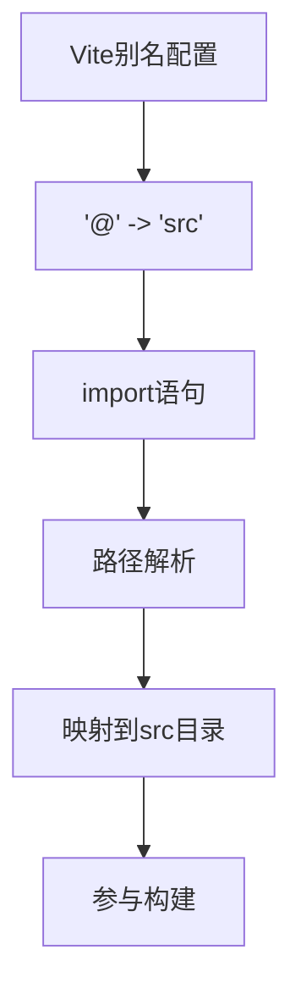

**图表来源**
- [config/index.ts:22-24](file://config/index.ts#L22-L24)
- [tsconfig.json:24-26](file://tsconfig.json#L24-L26)

**章节来源**
- [config/index.ts:22-24](file://config/index.ts#L22-L24)
- [tsconfig.json:24-26](file://tsconfig.json#L24-L26)

### Babel 转译配置与语法支持
- **预设**：使用 taro 预设，明确框架为 React，启用 TypeScript 支持，适配 webpack5。
- **作用范围**：驱动 Taro 内部的文件转译流程，确保 TSX、装饰器、JSX 等语法在目标平台正确转换。
- **兼容性**：虽然使用Vite构建，但Babel配置仍保持与Webpack 5的兼容性设置。

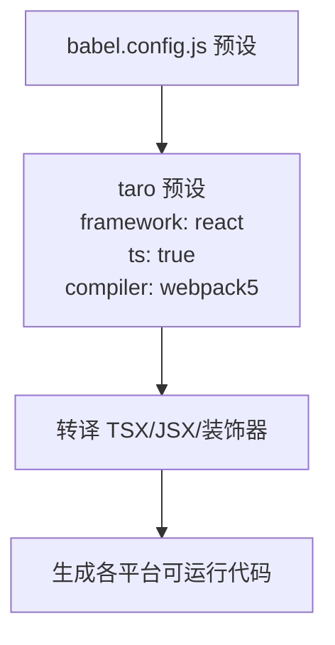

**图表来源**
- [babel.config.js:4-10](file://babel.config.js#L4-L10)

**章节来源**
- [babel.config.js:1-12](file://babel.config.js#L1-L12)

### TypeScript 编译配置与开发体验
- **关键选项**：experimentalDecorators、jsx react-jsx、sourceMap，确保装饰器语法、JSX 转换与 Source Map 生成。
- **路径别名**：配置 @/* 映射到 src，提升导入便捷性。
- **输出目录**：指定 commonjs 模块解析与输出目录，便于工具链识别。

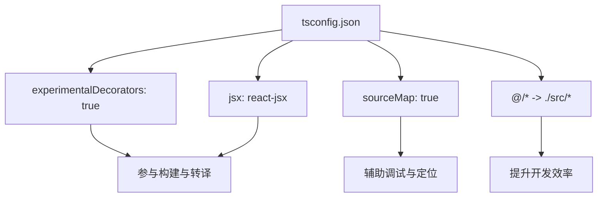

**图表来源**
- [tsconfig.json:8](file://tsconfig.json#L8)
- [tsconfig.json:17](file://tsconfig.json#L17)
- [tsconfig.json:15](file://tsconfig.json#L15)
- [tsconfig.json:25](file://tsconfig.json#L25)

**章节来源**
- [tsconfig.json:1-31](file://tsconfig.json#L1-L31)

### 多平台构建参数差异
- **微信小程序（mini）**
  - pxtransform：启用 px → rpx 转换，适配小程序设计规范。
  - CSS Modules：启用模块化命名，避免样式冲突。
- **H5（h5）**
  - autoprefixer：自动添加浏览器前缀，提升兼容性。
  - CSS Modules：同上，模块化命名策略一致。
  - publicPath 与 staticDirectory：控制资源路径与静态资源目录。
  - **更新** Vite原生CSS处理：移除Webpack特定的CSS提取配置，采用Vite原生处理。
  - **新增** 别名支持：Vite别名配置在H5平台同样生效。
  - **新增** devServer.port：设置开发服务器端口为 9000。
  - **新增** Taroify样式支持：H5平台完整支持Taroify组件样式。
- **React Native（rn）**
  - appName：RN 应用名称。
  - postcss.cssModules：关闭 CSS Modules，避免不必要开销。

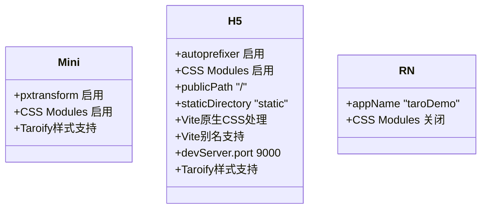

**图表来源**
- [config/index.ts:39-81](file://config/index.ts#L39-L81)

**章节来源**
- [config/index.ts:39-81](file://config/index.ts#L39-L81)

### 页面与应用配置
- **应用配置**：定义页面清单与全局窗口样式，如背景文案风格、导航栏颜色与标题文本。
- **页面配置**：定义页面级导航标题、分享能力等，例如首页开启分享能力，登录页使用自定义导航样式。

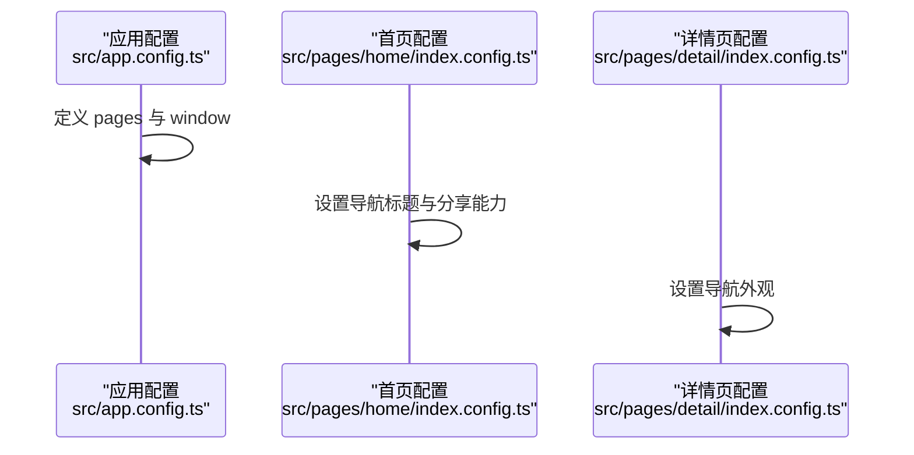

**图表来源**
- [src/app.config.ts:1-18](file://src/app.config.ts#L1-L18)
- [src/pages/home/index.config.ts:1-6](file://src/pages/home/index.config.ts#L1-L6)
- [src/pages/detail/index.config.ts:1-6](file://src/pages/detail/index.config.ts#L1-L6)

**章节来源**
- [src/app.config.ts:1-18](file://src/app.config.ts#L1-L18)
- [src/pages/home/index.config.ts:1-6](file://src/pages/home/index.config.ts#L1-L6)
- [src/pages/detail/index.config.ts:1-6](file://src/pages/detail/index.config.ts#L1-L6)

### 代码分割、懒加载与 Tree Shaking
- **代码分割与懒加载**
  - 在 Taro Vite 项目中，可通过路由级或组件级动态导入实现按需加载，减少首屏体积。
  - Vite的原生ES模块支持提供更好的代码分割效果。
  - 建议结合平台特性（如小程序分包）进一步优化启动速度。
  - **新增** Taroify组件支持按需加载，通过vite-plugin-style-import实现样式按需导入。
- **Tree Shaking**
  - 确保模块以 ES Module 形式导出，避免副作用（sideEffects）污染，提高摇树效果。
  - Vite的原生ESM支持和现代打包优化显著提升Tree Shaking效果。
  - 生产构建通常默认开启作用域提升与死代码消除，配合合理的模块组织可获得更好收益。
  - **新增** 样式Tree Shaking：通过vite-plugin-style-import移除未使用的Taroify组件样式。

### 开发体验相关配置
- **热重载与开发服务器**
  - H5 开发服务器已配置代理，使用Vite的rewrite函数便于前端联调后端接口。
  - **新增** 固定端口配置，避免端口冲突，提升开发稳定性。
  - **新增** Vite别名支持，提升导入便捷性。
  - **新增** Taroify组件样式实时预览，提升UI开发体验。
- **Source Map**
  - TypeScript 与构建工具均开启 Source Map，便于断点调试与错误定位。
- **压缩与混淆**
  - 生产构建默认启用压缩与混淆；如需进一步优化，可在 webpackChain 中引入对应插件并精细配置。

**章节来源**
- [config/dev.ts:8-20](file://config/dev.ts#L8-L20)
- [tsconfig.json:15](file://tsconfig.json#L15)
- [config/index.ts:55-57](file://config/index.ts#L55-L57)
- [config/index.ts:22-24](file://config/index.ts#L22-L24)

## 依赖关系分析
- **脚本与平台插件**：package.json 中声明了各平台的 Taro 插件与构建脚本，确保多端构建可用。
- **关键依赖**：@tarojs/cli、@tarojs/vite-runner、@tarojs/plugin-framework-react 等，支撑 Taro 4 + Vite 的构建链路。
- **转译依赖**：babel-preset-taro、@babel/core、@babel/plugin-proposal-decorators 等，保障 TS/JSX/装饰器转译。
- **Vite生态**：@vitejs/plugin-react、vite 等现代构建工具，提供更快的开发体验。
- **UI框架依赖**：@taroify/core、@taroify/hooks、@taroify/icons 提供完整的UI组件解决方案。
- **样式优化插件**：vite-plugin-style-import 实现按需样式导入优化。

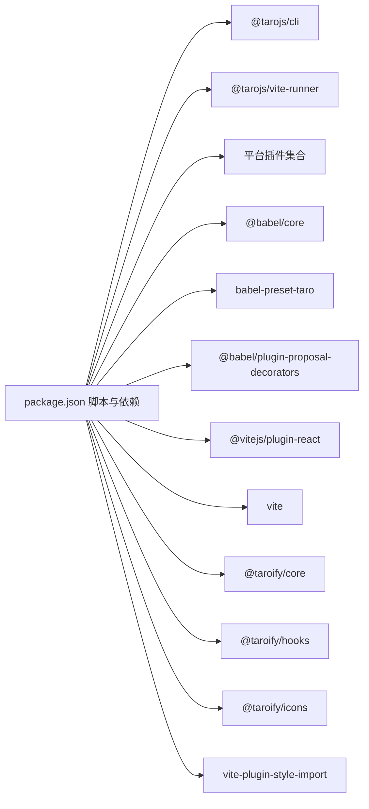

**图表来源**
- [package.json:12-33](file://package.json#L12-L33)
- [package.json:49-71](file://package.json#L49-L71)
- [package.json:52-55](file://package.json#L52-L55)
- [package.json:39-53](file://package.json#L39-L53)
- [package.json:95](file://package.json#L95)
- [babel.config.js:4-10](file://babel.config.js#L4-L10)

**章节来源**
- [package.json:12-97](file://package.json#L12-L97)
- [babel.config.js:1-12](file://babel.config.js#L1-L12)

## 性能考虑
- **构建性能**：Vite相比Webpack 5提供更快的冷启动和热重载性能，显著提升开发体验。
- **构建缓存**：当前基础配置禁用了Vite缓存，建议在 CI 或本地开发中评估开启缓存以缩短二次构建时间。
- **体积分析**：生产配置预留了 webpackChain 扩展点，可接入体积分析插件，定位大体积依赖与重复模块。
- **预渲染**：可按需启用预渲染插件，改善 H5 首屏加载表现。
- **依赖优化**：保持依赖精简，优先使用按需引入与动态导入，减少不必要的打包体积。
- **平台优化**：小程序端充分利用分包与资源压缩；H5 端关注首屏 CSS 与 JS 的分离与缓存策略。
- **别名优化**：Vite别名配置减少路径解析开销，提升构建性能。
- **CSS处理优化**：Vite原生CSS处理比Webpack的CSS提取更高效。
- **样式优化**：通过vite-plugin-style-import实现Taroify组件样式的按需加载，显著减少bundle体积。
- **UI框架优化**：Taroify组件支持Tree Shaking，未使用的组件和样式会被自动移除。

## 故障排查指南
- **开发代理无效**
  - 检查开发配置中的 devServer.proxy 是否正确指向 API 基础地址；确认环境变量 TARO_APP_API_BASE_URL 是否设置。
  - 确认rewrite函数语法正确，路径重写逻辑符合预期。
- **TypeScript 装饰器报错**
  - 确认 tsconfig.json 已启用 experimentalDecorators；Babel 装饰器插件版本与预设是否匹配。
- **H5 样式模块化异常**
  - 检查 CSS Modules 命名模式与生成规则是否一致；确认 scoped 名称冲突。
  - **新增** 检查Taroify组件样式导入是否正确，确认app.scss中的样式导入语句。
- **Vite别名导入失败**
  - 确认 config/index.ts 中的别名配置正确；检查TypeScript路径映射是否同步更新。
  - 验证@路径在所有平台（小程序、H5、RN）中的一致性。
- **生产构建体积过大**
  - 使用 webpackChain 扩展点接入体积分析插件，定位冗余模块；结合动态导入与分包策略优化。
  - **新增** 检查Taroify组件是否按需导入，确认vite-plugin-style-import配置正确。
- **Vite构建性能问题**
  - 检查cache配置是否合理；评估是否需要启用Vite缓存。
  - 确认依赖版本兼容性，避免不必要的包大小。
- **CSS处理异常**
  - 确认Vite原生CSS处理配置正确；检查PostCSS插件版本兼容性。
  - **新增** 检查SCSS变量导入是否正确，确认_variables.scss文件存在且格式正确。
- **端口冲突问题**
  - 检查是否有其他服务占用了 9000 端口；确认 H5 开发服务器配置正确。
- **环境变量未生效**
  - 确认 defineConstants 中的环境变量定义正确；检查 process.env 中的变量值。
- **Taroify组件样式问题**
  - **新增** 检查app.scss中的Taroify样式导入语句是否正确。
  - 确认vite-plugin-style-import插件配置是否正确。
  - 验证Taroify组件版本与依赖版本兼容性。

**章节来源**
- [config/dev.ts:3-4](file://config/dev.ts#L3-L4)
- [config/dev.ts:8-20](file://config/dev.ts#L8-L20)
- [tsconfig.json:8](file://tsconfig.json#L8)
- [babel.config.js:4-10](file://babel.config.js#L4-L10)
- [config/prod.ts:10-33](file://config/prod.ts#L10-L33)
- [config/index.ts:22-24](file://config/index.ts#L22-L24)
- [config/index.ts:55-57](file://config/index.ts#L55-L57)
- [src/app.scss:3-11](file://src/app.scss#L3-L11)

## 结论
红书项目的构建配置以 Taro 4 + Vite 为核心，通过统一入口与环境拆分实现清晰的开发与生产策略；Babel 与 TypeScript 协同保障多语法支持；多平台差异化配置满足小程序、H5、RN 的各自需求。本次重大升级实现了从Webpack 5到Vite的全面迁移，显著提升了构建性能和开发体验。新增的Taroify UI框架支持和vite-plugin-style-import插件优化，为项目提供了现代化的UI组件解决方案和按需样式导入能力。

新的Vite配置系统移除了Webpack特定配置，采用现代化的构建工具链，提供更快的热重载、更好的代码分割效果和更佳的开发体验。Taroify UI框架的完整集成，包括依赖管理、样式导入优化和按需加载配置，为项目提供了丰富的移动端UI组件选择。建议在保证开发体验的前提下，逐步引入体积分析与预渲染等优化手段，并持续评估缓存与依赖策略以提升整体构建性能。

**更新** Vite迁移和Taroify UI框架集成带来的性能提升和开发体验改进为团队协作提供了更好的基础，别名配置、原生CSS处理和样式优化等新特性进一步提升了开发效率和代码质量。按需样式导入和组件Tree Shaking等优化措施显著减少了bundle体积，提升了应用启动性能。