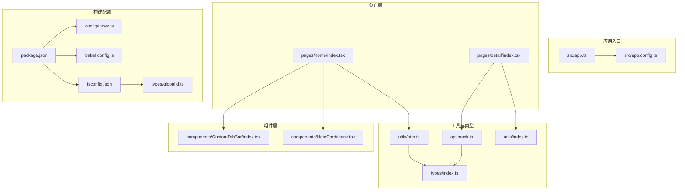
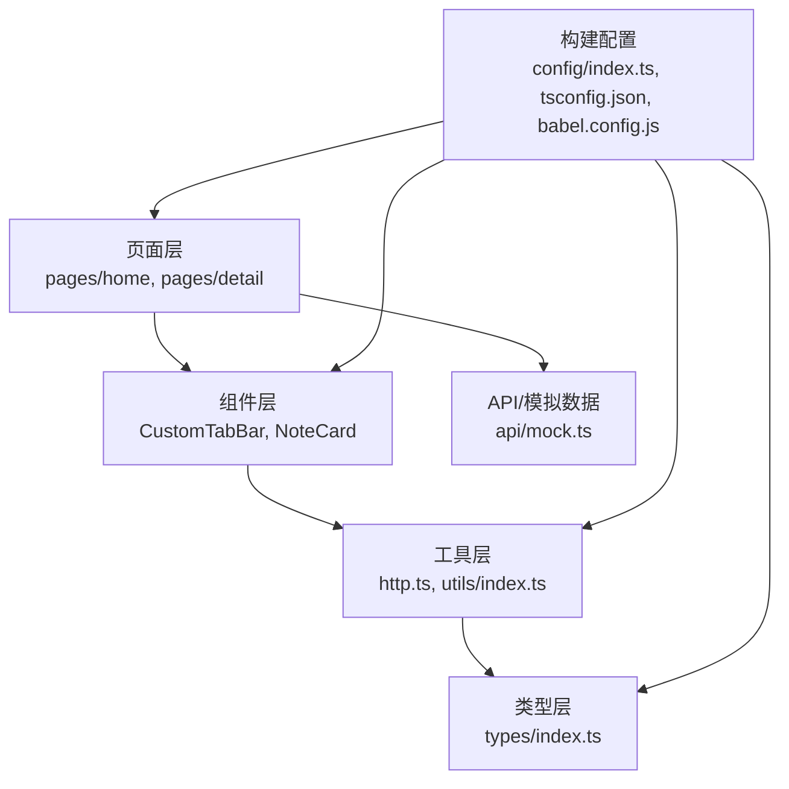
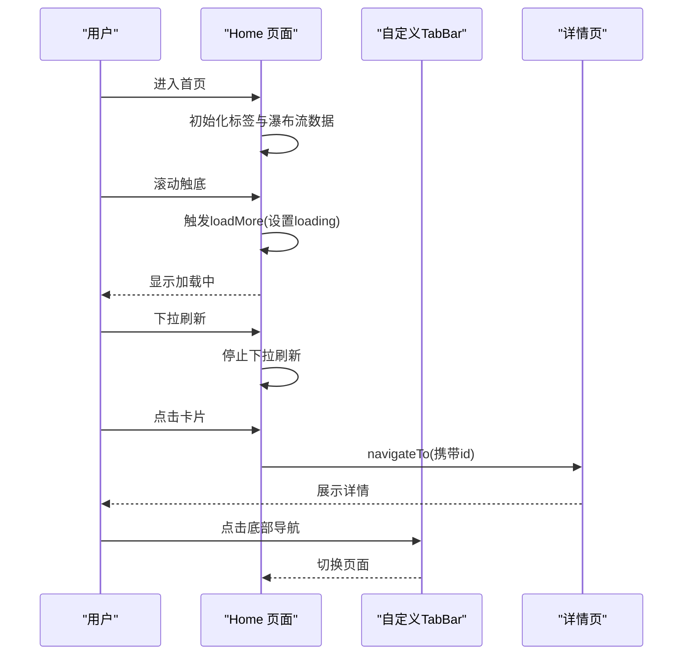
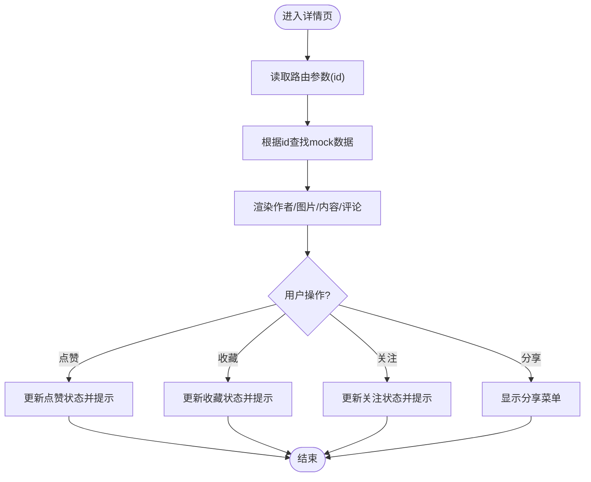
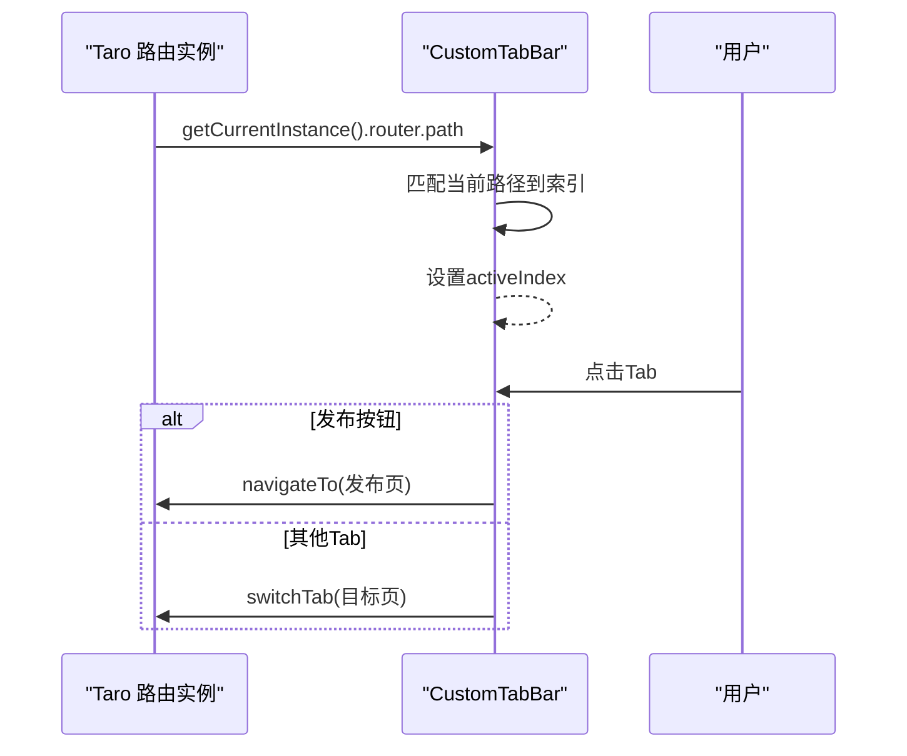
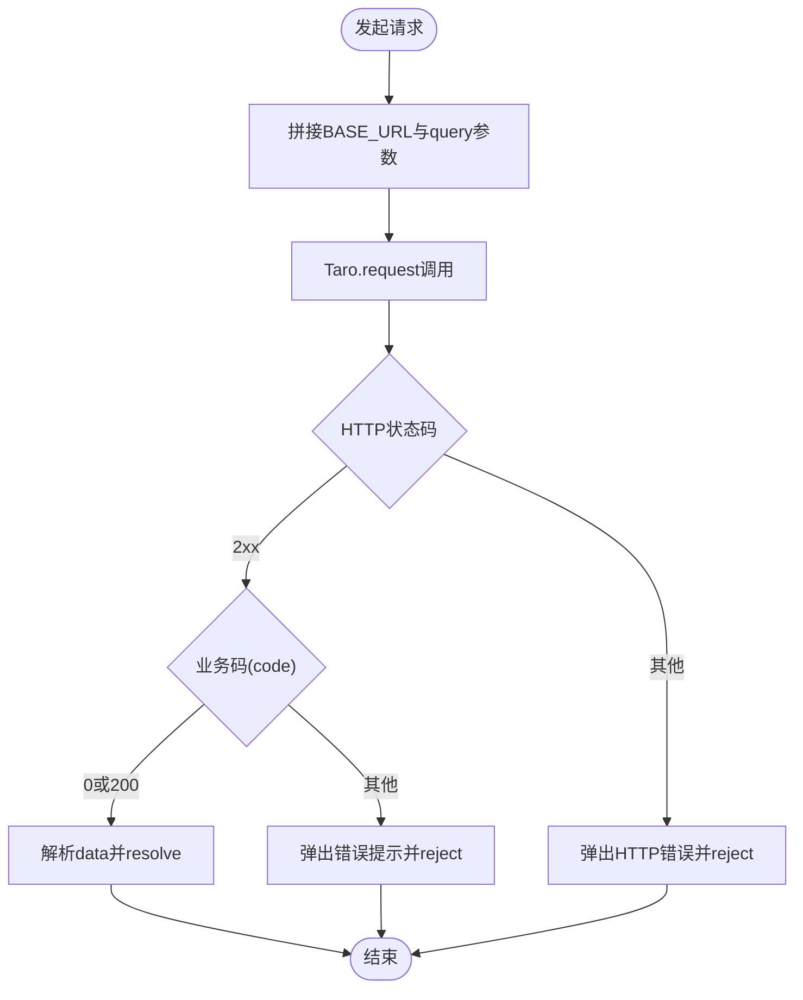
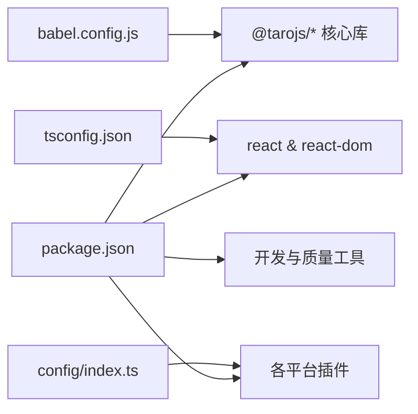

# 架构设计

<cite>
**本文引用的文件**
- [package.json](file://package.json)
- [tsconfig.json](file://tsconfig.json)
- [babel.config.js](file://babel.config.js)
- [config/index.ts](file://config/index.ts)
- [src/app.ts](file://src/app.ts)
- [src/app.config.ts](file://src/app.config.ts)
- [src/pages/home/index.tsx](file://src/pages/home/index.tsx)
- [src/pages/detail/index.tsx](file://src/pages/detail/index.tsx)
- [src/components/CustomTabBar/index.tsx](file://src/components/CustomTabBar/index.tsx)
- [src/components/NoteCard/index.tsx](file://src/components/NoteCard/index.tsx)
- [src/utils/http.ts](file://src/utils/http.ts)
- [src/utils/index.ts](file://src/utils/index.ts)
- [src/types/index.ts](file://src/types/index.ts)
- [src/api/mock.ts](file://src/api/mock.ts)
- [types/global.d.ts](file://types/global.d.ts)
</cite>

## 目录
1. [简介](#简介)
2. [项目结构](#项目结构)
3. [核心组件](#核心组件)
4. [架构总览](#架构总览)
5. [详细组件分析](#详细组件分析)
6. [依赖分析](#依赖分析)
7. [性能考虑](#性能考虑)
8. [故障排查指南](#故障排查指南)
9. [结论](#结论)
10. [附录](#附录)

## 简介
本项目采用 Taro 4.x + React 的多端统一开发方案，使用 TypeScript 强类型体系与 Webpack5 打包器，支持微信小程序、H5、快应用、百度智能小程序、支付宝小程序、抖音/头条小程序、QQ 小程序、京东小程序、Harmony Hybrid 等多平台编译输出。前端以组件化架构为核心，页面按功能域拆分，公共组件沉淀在 components 目录，工具方法集中在 utils，类型定义统一收敛于 types，API 层采用 mock 数据驱动演示。

## 项目结构
项目遵循“按功能域+按层次”的混合组织方式：
- pages：页面级模块，每个页面包含独立的入口、样式与配置文件
- components：可复用 UI 组件，如自定义 TabBar、卡片、加载、空状态等
- utils：通用工具函数（HTTP 请求、时间格式化、防抖节流等）
- api：接口与模拟数据，当前版本以 mock 数据为主
- types：全局与业务类型定义，统一约束数据结构
- config：Taro 构建配置，按平台开启 CSS Modules、px 转换、H5 公共路径等
- 根级配置：package.json、tsconfig.json、babel.config.js、global.d.ts

图表来源
- [src/app.ts:1-14](file://src/app.ts#L1-L14)
- [src/app.config.ts:1-18](file://src/app.config.ts#L1-L18)
- [src/pages/home/index.tsx:1-151](file://src/pages/home/index.tsx#L1-L151)
- [src/pages/detail/index.tsx:1-180](file://src/pages/detail/index.tsx#L1-L180)
- [src/components/CustomTabBar/index.tsx:1-67](file://src/components/CustomTabBar/index.tsx#L1-L67)
- [src/components/NoteCard/index.tsx:1-53](file://src/components/NoteCard/index.tsx#L1-L53)
- [src/utils/http.ts:1-157](file://src/utils/http.ts#L1-L157)
- [src/utils/index.ts:1-49](file://src/utils/index.ts#L1-L49)
- [src/types/index.ts:1-147](file://src/types/index.ts#L1-L147)
- [src/api/mock.ts:1-98](file://src/api/mock.ts#L1-L98)
- [package.json:1-93](file://package.json#L1-L93)
- [tsconfig.json:1-31](file://tsconfig.json#L1-L31)
- [babel.config.js:1-12](file://babel.config.js#L1-L12)
- [config/index.ts:1-82](file://config/index.ts#L1-L82)
- [types/global.d.ts:1-200](file://types/global.d.ts#L1-L200)

章节来源
- [package.json:1-93](file://package.json#L1-L93)
- [tsconfig.json:1-31](file://tsconfig.json#L1-L31)
- [babel.config.js:1-12](file://babel.config.js#L1-L12)
- [config/index.ts:1-82](file://config/index.ts#L1-L82)

## 核心组件
- 应用入口与生命周期：应用入口负责初始化与启动日志；页面通过 Taro 生命周期钩子实现下拉刷新、触底加载等能力
- 页面组件：Home 作为瀑布流首页，整合标签页、滚动容器、瀑布流布局与自定义 TabBar；Detail 作为详情页，承载作者信息、图片轮播、内容展示与互动区
- 通用组件：CustomTabBar 提供跨页面导航与发布按钮；NoteCard 作为内容卡片的通用展示组件
- 工具与类型：HTTP 工具封装统一请求与错误处理；格式化与防抖节流工具提升交互体验；类型系统统一约束数据结构

章节来源
- [src/app.ts:1-14](file://src/app.ts#L1-L14)
- [src/pages/home/index.tsx:1-151](file://src/pages/home/index.tsx#L1-L151)
- [src/pages/detail/index.tsx:1-180](file://src/pages/detail/index.tsx#L1-L180)
- [src/components/CustomTabBar/index.tsx:1-67](file://src/components/CustomTabBar/index.tsx#L1-L67)
- [src/components/NoteCard/index.tsx:1-53](file://src/components/NoteCard/index.tsx#L1-L53)
- [src/utils/http.ts:1-157](file://src/utils/http.ts#L1-L157)
- [src/utils/index.ts:1-49](file://src/utils/index.ts#L1-L49)
- [src/types/index.ts:1-147](file://src/types/index.ts#L1-L147)

## 架构总览
整体架构围绕“页面-组件-工具-类型-构建配置”展开，页面通过组件组合完成业务视图，组件间通过 props 传递数据与回调，工具层提供 HTTP、格式化与并发控制能力，类型系统贯穿全链路保障数据一致性，构建配置按平台启用差异化策略。

图表来源
- [src/pages/home/index.tsx:1-151](file://src/pages/home/index.tsx#L1-L151)
- [src/pages/detail/index.tsx:1-180](file://src/pages/detail/index.tsx#L1-L180)
- [src/components/CustomTabBar/index.tsx:1-67](file://src/components/CustomTabBar/index.tsx#L1-L67)
- [src/components/NoteCard/index.tsx:1-53](file://src/components/NoteCard/index.tsx#L1-L53)
- [src/utils/http.ts:1-157](file://src/utils/http.ts#L1-L157)
- [src/utils/index.ts:1-49](file://src/utils/index.ts#L1-L49)
- [src/types/index.ts:1-147](file://src/types/index.ts#L1-L147)
- [src/api/mock.ts:1-98](file://src/api/mock.ts#L1-L98)
- [config/index.ts:1-82](file://config/index.ts#L1-L82)
- [tsconfig.json:1-31](file://tsconfig.json#L1-L31)
- [babel.config.js:1-12](file://babel.config.js#L1-L12)

## 详细组件分析

### 页面组件：Home（瀑布流首页）
- 功能要点
  - 标签页切换与选中态管理
  - 触底加载与下拉刷新
  - 瀑布流布局（左右两列）
  - 内容卡片点击跳转详情页
- 数据与交互
  - 使用本地 mock 数据驱动瀑布流
  - 通过 Taro 导航跳转至详情页并传递参数
  - 使用自定义 TabBar 实现底部导航
- 性能与体验
  - 触底加载时设置 loading 状态避免重复触发
  - 图片懒加载与样式 hover 效果优化

图表来源
- [src/pages/home/index.tsx:70-151](file://src/pages/home/index.tsx#L70-L151)
- [src/components/CustomTabBar/index.tsx:14-67](file://src/components/CustomTabBar/index.tsx#L14-L67)
- [src/pages/detail/index.tsx:23-40](file://src/pages/detail/index.tsx#L23-L40)

章节来源
- [src/pages/home/index.tsx:1-151](file://src/pages/home/index.tsx#L1-L151)
- [src/components/CustomTabBar/index.tsx:1-67](file://src/components/CustomTabBar/index.tsx#L1-L67)

### 页面组件：Detail（内容详情页）
- 功能要点
  - 从路由参数读取目标内容并渲染
  - 图片横向滚动浏览与指示器
  - 作者信息、标签、时间格式化
  - 互动区：点赞、收藏、关注、分享
- 数据与交互
  - 使用 mock 数据填充页面内容
  - 通过工具函数进行数字与时间格式化
  - 通过 Taro API 展示分享菜单与 Toast 提示

图表来源
- [src/pages/detail/index.tsx:23-180](file://src/pages/detail/index.tsx#L23-L180)
- [src/api/mock.ts:1-98](file://src/api/mock.ts#L1-L98)
- [src/utils/index.ts:1-49](file://src/utils/index.ts#L1-L49)

章节来源
- [src/pages/detail/index.tsx:1-180](file://src/pages/detail/index.tsx#L1-L180)
- [src/api/mock.ts:1-98](file://src/api/mock.ts#L1-L98)
- [src/utils/index.ts:1-49](file://src/utils/index.ts#L1-L49)

### 组件：CustomTabBar（自定义底部导航）
- 功能要点
  - 根据当前路由高亮对应 Tab
  - 发布按钮单独处理跳转
  - 支持首页与其他页面的切换方式差异
- 交互与状态
  - 使用 Taro 获取当前路由并匹配 Tab 列表
  - 点击事件区分“切换 Tab”与“跳转发布页”

图表来源
- [src/components/CustomTabBar/index.tsx:14-67](file://src/components/CustomTabBar/index.tsx#L14-L67)

章节来源
- [src/components/CustomTabBar/index.tsx:1-67](file://src/components/CustomTabBar/index.tsx#L1-L67)

### 组件：NoteCard（内容卡片）
- 功能要点
  - 展示封面、标题、作者头像与昵称、点赞数
  - 可选视频角标
  - 点击跳转详情页
- 复用性
  - 通过 props 接收数据，便于在不同页面复用

章节来源
- [src/components/NoteCard/index.tsx:1-53](file://src/components/NoteCard/index.tsx#L1-L53)

### 工具：HTTP 请求封装
- 功能要点
  - 统一基址拼接（H5 代理前缀与非 H5 环境变量）
  - 统一响应结构与业务码判断
  - 成功/失败分支处理与 Toast 提示
  - GET/POST/PUT/DELETE 方法封装
- 平台适配
  - 通过环境变量区分 H5 与小程序环境
  - H5 下支持代理前缀，减少跨域问题

图表来源
- [src/utils/http.ts:38-102](file://src/utils/http.ts#L38-L102)

章节来源
- [src/utils/http.ts:1-157](file://src/utils/http.ts#L1-L157)

### 工具：格式化与并发控制
- 功能要点
  - 数字格式化（万级别处理）
  - 时间格式化（相对时间）
  - 防抖与节流（通用泛型封装）

章节来源
- [src/utils/index.ts:1-49](file://src/utils/index.ts#L1-L49)

### 类型系统：统一数据契约
- 功能要点
  - 定义 Post、User、Comment、Message、Topic 等核心实体
  - 登录认证相关类型（单 Token/双 Token、验证码、登录表单等）
  - 类型守卫函数用于运行时类型判断
- 价值
  - 在页面、组件、工具与 API 层形成强一致的数据契约，降低耦合并提升可维护性

章节来源
- [src/types/index.ts:1-147](file://src/types/index.ts#L1-L147)

## 依赖分析
- 构建与框架
  - Taro CLI 与 React 插件驱动多端编译
  - Webpack5 Runner 与 Babel 预设（含 TS 支持）
  - TypeScript 编译选项启用严格空检查与 JSX 转换
- 平台插件
  - 各平台插件按需安装，支持多端输出
- 开发与质量
  - ESLint、Stylelint、CommitLint、Husky 保证代码规范与提交质量

图表来源
- [package.json:1-93](file://package.json#L1-L93)
- [babel.config.js:1-12](file://babel.config.js#L1-L12)
- [tsconfig.json:1-31](file://tsconfig.json#L1-L31)
- [config/index.ts:1-82](file://config/index.ts#L1-L82)

章节来源
- [package.json:1-93](file://package.json#L1-L93)
- [babel.config.js:1-12](file://babel.config.js#L1-L12)
- [tsconfig.json:1-31](file://tsconfig.json#L1-L31)
- [config/index.ts:1-82](file://config/index.ts#L1-L82)

## 性能考虑
- 图片懒加载与滚动优化：首页与详情页均采用懒加载与纵向滚动容器，减少首屏压力
- 触底加载节流：通过 loading 状态避免重复触发加载
- CSS Modules 与 px 转换：小程序与 H5 分别启用 CSS Modules 与 pxtransform，确保样式隔离与尺寸一致性
- 构建缓存与产物优化：按平台配置静态资源目录与哈希命名，利于缓存与增量更新

## 故障排查指南
- 网络请求失败
  - 检查环境变量与基址拼接逻辑，确认 H5 代理前缀与非 H5 基址
  - 查看业务码与 HTTP 状态码分支，确认错误提示是否弹出
- 路由参数为空
  - 在详情页确认路由参数读取与数据回退逻辑
- 样式冲突或未生效
  - 检查 CSS Modules 命名规则与作用域
  - 确认 px 转换配置与设计稿宽度
- 构建异常
  - 核对 Babel 预设与 TypeScript 编译选项
  - 检查 Taro 配置中各平台开关与输出目录

章节来源
- [src/utils/http.ts:38-102](file://src/utils/http.ts#L38-L102)
- [src/pages/detail/index.tsx:23-40](file://src/pages/detail/index.tsx#L23-L40)
- [config/index.ts:30-75](file://config/index.ts#L30-L75)
- [tsconfig.json:1-31](file://tsconfig.json#L1-L31)
- [babel.config.js:1-12](file://babel.config.js#L1-L12)

## 结论
该架构以 Taro + React 为基础，结合 TypeScript 强类型体系与组件化设计，实现了多端统一与良好的可维护性。页面层通过组件复用与工具抽象降低重复逻辑，类型系统贯穿数据契约，构建配置按平台差异化适配。建议后续逐步替换 mock 数据为真实 API，并完善鉴权、缓存与埋点等基础设施，以支撑更复杂的业务场景。

## 附录
- 系统边界
  - 页面层：负责业务视图与用户交互
  - 组件层：负责可复用 UI 与交互
  - 工具层：负责网络、格式化与并发控制
  - 类型层：负责数据契约与运行时校验
  - 构建层：负责多端编译与平台适配
- 最佳实践
  - 保持组件无副作用，通过 props 传参
  - 使用类型守卫与严格空检查减少运行时风险
  - 为每个页面提供最小可运行的 mock 数据集
  - 为每个平台配置独立的样式与尺寸策略