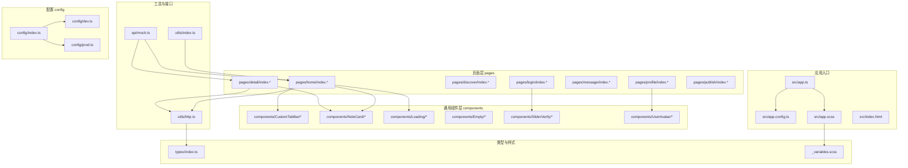
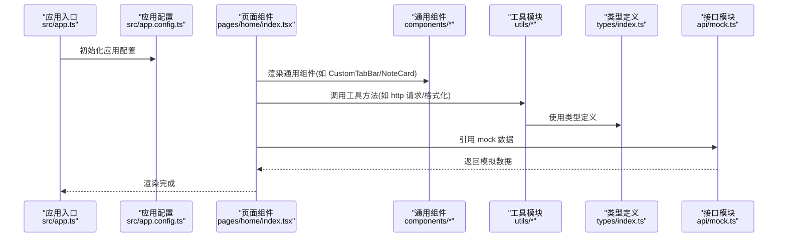
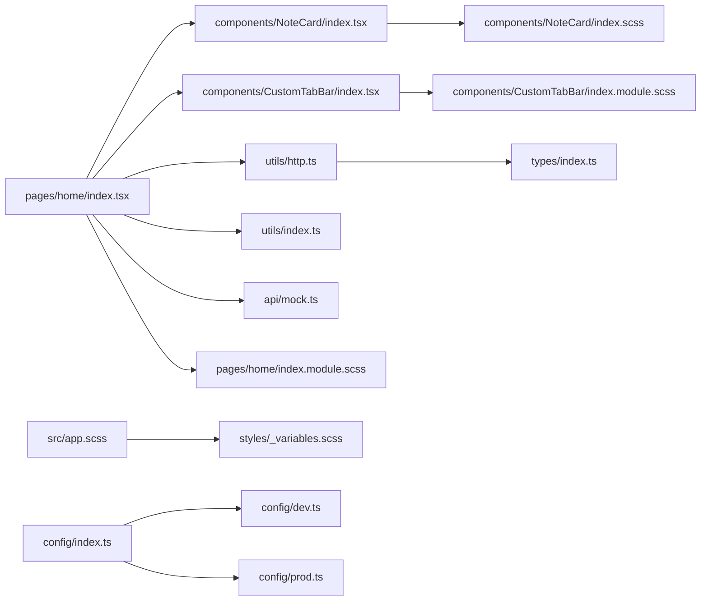

# 目录结构设计

<cite>
**本文引用的文件**
- [package.json](file://package.json)
- [tsconfig.json](file://tsconfig.json)
- [src/app.ts](file://src/app.ts)
- [src/app.config.ts](file://src/app.config.ts)
- [src/app.scss](file://src/app.scss)
- [src/index.html](file://src/index.html)
- [src/types/index.ts](file://src/types/index.ts)
- [src/utils/http.ts](file://src/utils/http.ts)
- [src/utils/index.ts](file://src/utils/index.ts)
- [src/api/mock.ts](file://src/api/mock.ts)
- [src/styles/_variables.scss](file://src/styles/_variables.scss)
- [src/components/CustomTabBar/index.tsx](file://src/components/CustomTabBar/index.tsx)
- [src/components/NoteCard/index.tsx](file://src/components/NoteCard/index.tsx)
- [src/components/Loading/index.tsx](file://src/components/Loading/index.tsx)
- [src/pages/home/index.tsx](file://src/pages/home/index.tsx)
- [config/index.ts](file://config/index.ts)
- [config/dev.ts](file://config/dev.ts)
- [config/prod.ts](file://config/prod.ts)
</cite>

## 目录

1. [简介](#简介)
2. [项目结构](#项目结构)
3. [核心组件](#核心组件)
4. [架构总览](#架构总览)
5. [详细组件分析](#详细组件分析)
6. [依赖分析](#依赖分析)
7. [性能考虑](#性能考虑)
8. [故障排查指南](#故障排查指南)
9. [结论](#结论)
10. [附录](#附录)

## 简介
本设计文档面向红书项目的开发者，系统性阐述 src 目录下的模块化组织原则与最佳实践，覆盖页面组件(pages)、通用组件(components)、工具模块(utils)、接口模块(api)、类型定义(types)、样式(styles)以及静态资源(assets)的职责划分；同时说明 config 配置目录的多环境配置方案，帮助团队在不同平台与环境下保持一致的开发体验与可维护性。

## 项目结构
红书项目采用基于功能域的模块化组织方式，结合 Taro 多端统一框架，实现一套代码适配微信小程序、H5 等多个平台。整体结构遵循“按功能分层 + 按职责分包”的原则，确保高内聚、低耦合，并通过 TypeScript 与 SCSS 提升类型安全与样式复用能力。

图表来源
- [src/app.ts:1-14](file://src/app.ts#L1-L14)
- [src/app.config.ts:1-18](file://src/app.config.ts#L1-L18)
- [src/app.scss:1-59](file://src/app.scss#L1-L59)
- [src/pages/home/index.tsx:1-151](file://src/pages/home/index.tsx#L1-L151)
- [src/components/CustomTabBar/index.tsx:1-67](file://src/components/CustomTabBar/index.tsx#L1-L67)
- [src/components/NoteCard/index.tsx:1-53](file://src/components/NoteCard/index.tsx#L1-L53)
- [src/components/Loading/index.tsx:1-16](file://src/components/Loading/index.tsx#L1-L16)
- [src/utils/http.ts:1-169](file://src/utils/http.ts#L1-L169)
- [src/utils/index.ts:1-49](file://src/utils/index.ts#L1-L49)
- [src/api/mock.ts:1-98](file://src/api/mock.ts#L1-L98)
- [src/styles/_variables.scss:1-9](file://src/styles/_variables.scss#L1-L9)
- [src/types/index.ts:1-147](file://src/types/index.ts#L1-L147)
- [config/index.ts:1-89](file://config/index.ts#L1-L89)
- [config/dev.ts:1-23](file://config/dev.ts#L1-L23)
- [config/prod.ts:1-34](file://config/prod.ts#L1-L34)

章节来源
- [package.json:1-93](file://package.json#L1-L93)
- [tsconfig.json:1-31](file://tsconfig.json#L1-L31)
- [src/app.ts:1-14](file://src/app.ts#L1-L14)
- [src/app.config.ts:1-18](file://src/app.config.ts#L1-L18)
- [src/app.scss:1-59](file://src/app.scss#L1-L59)
- [config/index.ts:1-89](file://config/index.ts#L1-L89)

## 核心组件
- 页面组件(pages)：承载具体业务页面，负责页面状态、生命周期与用户交互，典型如首页、详情页、发现页等。
- 通用组件(components)：跨页面复用的 UI 组件，如自定义 TabBar、卡片、加载态、空状态等。
- 工具模块(utils)：封装通用方法，如网络请求(http.ts)、日期格式化、防抖节流等。
- 接口模块(api)：封装数据访问层，当前包含 mock 数据，便于前后端解耦与联调。
- 类型定义(types)：集中声明业务与接口相关的 TypeScript 类型，保证类型一致性。
- 样式(styles)：全局样式与变量，支持 SCSS 模块化与变量复用。
- 静态资源(assets)：图标、图片等资源，按需引入与管理。
- 配置(config)：多环境构建配置，区分开发与生产环境。

章节来源
- [src/pages/home/index.tsx:1-151](file://src/pages/home/index.tsx#L1-L151)
- [src/components/CustomTabBar/index.tsx:1-67](file://src/components/CustomTabBar/index.tsx#L1-L67)
- [src/components/NoteCard/index.tsx:1-53](file://src/components/NoteCard/index.tsx#L1-L53)
- [src/utils/http.ts:1-169](file://src/utils/http.ts#L1-L169)
- [src/utils/index.ts:1-49](file://src/utils/index.ts#L1-L49)
- [src/api/mock.ts:1-98](file://src/api/mock.ts#L1-L98)
- [src/types/index.ts:1-147](file://src/types/index.ts#L1-L147)
- [src/styles/_variables.scss:1-9](file://src/styles/_variables.scss#L1-L9)
- [config/index.ts:1-89](file://config/index.ts#L1-L89)

## 架构总览
下图展示应用启动到页面渲染的关键流程，以及页面与组件、工具与接口之间的调用关系。

图表来源
- [src/app.ts:1-14](file://src/app.ts#L1-L14)
- [src/app.config.ts:1-18](file://src/app.config.ts#L1-L18)
- [src/pages/home/index.tsx:1-151](file://src/pages/home/index.tsx#L1-L151)
- [src/components/CustomTabBar/index.tsx:1-67](file://src/components/CustomTabBar/index.tsx#L1-L67)
- [src/components/NoteCard/index.tsx:1-53](file://src/components/NoteCard/index.tsx#L1-L53)
- [src/utils/http.ts:1-169](file://src/utils/http.ts#L1-L169)
- [src/utils/index.ts:1-49](file://src/utils/index.ts#L1-L49)
- [src/api/mock.ts:1-98](file://src/api/mock.ts#L1-L98)
- [src/types/index.ts:1-147](file://src/types/index.ts#L1-L147)

## 详细组件分析

### 页面组件(pages)
- 设计理念：页面即功能单元，负责状态管理、生命周期钩子与路由跳转；页面内部组合通用组件，避免重复逻辑。
- 命名规范：页面目录以功能命名，文件统一 index.*，样式与配置文件与页面同名。
- 典型页面：首页(home)、详情(detail)、发现(discover)、登录(login)、消息(message)、个人(profile)、发布(publish)。
- 依赖关系：页面依赖通用组件与工具模块，部分页面依赖类型定义与 mock 数据。

章节来源
- [src/pages/home/index.tsx:1-151](file://src/pages/home/index.tsx#L1-L151)
- [src/app.config.ts:1-18](file://src/app.config.ts#L1-L18)

### 通用组件(components)
- 设计理念：高内聚、低耦合，通过 props 传参实现复用；样式采用模块化，避免全局污染。
- 命名规范：组件目录采用 PascalCase，文件统一 index.*，样式文件与组件同名。
- 典型组件：
  - 自定义 TabBar：跨页面导航与状态同步。
  - 笔记卡片：内容卡片渲染与跳转。
  - 加载态/空状态：占位与提示。
  - 滑动验证/头像：特定场景复用组件。
- 依赖关系：组件依赖样式模块与通用工具，部分组件被页面直接引用。

章节来源
- [src/components/CustomTabBar/index.tsx:1-67](file://src/components/CustomTabBar/index.tsx#L1-L67)
- [src/components/NoteCard/index.tsx:1-53](file://src/components/NoteCard/index.tsx#L1-L53)
- [src/components/Loading/index.tsx:1-16](file://src/components/Loading/index.tsx#L1-L16)

### 工具模块(utils)
- 设计理念：将可复用的逻辑抽离为纯函数或封装器，降低页面复杂度。
- 命名规范：工具函数按功能命名，导出统一在 index.ts 中聚合。
- 典型工具：
  - http.ts：统一请求封装，支持多端环境与错误处理。
  - 工具函数：数字格式化、时间格式化、防抖/节流。
- 依赖关系：工具函数被页面与组件调用，类型定义被 http.ts 使用。

章节来源
- [src/utils/http.ts:1-169](file://src/utils/http.ts#L1-L169)
- [src/utils/index.ts:1-49](file://src/utils/index.ts#L1-L49)
- [src/types/index.ts:1-147](file://src/types/index.ts#L1-L147)

### 接口模块(api)
- 设计理念：抽象数据访问层，当前提供 mock 数据，便于前端独立开发与联调。
- 命名规范：接口文件按领域或用途命名，导出统一在 index.ts 中聚合。
- 典型接口：mock 数据集合，包含用户、笔记、话题等。
- 依赖关系：页面与组件通过工具模块调用接口，接口依赖类型定义。

章节来源
- [src/api/mock.ts:1-98](file://src/api/mock.ts#L1-L98)
- [src/types/index.ts:1-147](file://src/types/index.ts#L1-L147)

### 类型定义(types)
- 设计理念：集中管理业务与接口类型，提升类型安全与可维护性。
- 命名规范：接口以大写开头，工具函数用于类型守卫。
- 典型类型：Post、User、Comment、Message、Topic、认证相关类型等。
- 依赖关系：类型被工具模块与接口模块使用，页面与组件间接受益。

章节来源
- [src/types/index.ts:1-147](file://src/types/index.ts#L1-L147)

### 样式(styles)与静态资源(assets)
- 设计理念：全局样式与变量集中管理，组件样式模块化，静态资源按需引入。
- 命名规范：全局变量文件以下划线开头，组件样式采用模块化命名。
- 典型文件：全局变量、公共类名、布局样式等。
- 依赖关系：页面与组件样式依赖全局变量与公共类名。

章节来源
- [src/styles/_variables.scss:1-9](file://src/styles/_variables.scss#L1-L9)
- [src/app.scss:1-59](file://src/app.scss#L1-L59)

### 配置(config)多环境配置
- 设计理念：通过 Taro CLI 的 defineConfig 与环境变量实现多端、多环境配置。
- 命名规范：基础配置在 index.ts，开发/生产分别在 dev.ts 与 prod.ts。
- 典型配置：
  - 基础配置：项目名、设计稿尺寸、输出目录、框架与编译器、常量注入等。
  - 小程序端：pxr 转换与 CSS Modules 配置。
  - H5 端：autoprefixer、CSS Modules、静态目录与资源命名等。
  - 开发环境：代理配置，将 /cmp-api 前缀转发至后端服务。
  - 生产环境：预留打包优化插件扩展点。
- 依赖关系：配置影响构建产物与运行时行为，工具模块与页面通过环境变量与常量注入获取 API 地址。

章节来源
- [config/index.ts:1-89](file://config/index.ts#L1-L89)
- [config/dev.ts:1-23](file://config/dev.ts#L1-L23)
- [config/prod.ts:1-34](file://config/prod.ts#L1-L34)

## 依赖分析
- 模块内聚：页面与组件按功能内聚，工具与接口按职责内聚。
- 模块耦合：页面依赖组件与工具，组件依赖样式与工具，工具依赖类型，接口依赖类型。
- 外部依赖：Taro 多端框架、React 生态、SCSS 编译与样式模块化。
- 环境依赖：通过 defineConstants 注入 API 基础地址与代理前缀，配合 config 读取环境变量。

图表来源
- [src/pages/home/index.tsx:1-151](file://src/pages/home/index.tsx#L1-L151)
- [src/components/NoteCard/index.tsx:1-53](file://src/components/NoteCard/index.tsx#L1-L53)
- [src/components/CustomTabBar/index.tsx:1-67](file://src/components/CustomTabBar/index.tsx#L1-L67)
- [src/utils/http.ts:1-169](file://src/utils/http.ts#L1-L169)
- [src/utils/index.ts:1-49](file://src/utils/index.ts#L1-L49)
- [src/api/mock.ts:1-98](file://src/api/mock.ts#L1-L98)
- [src/types/index.ts:1-147](file://src/types/index.ts#L1-L147)
- [src/app.scss:1-59](file://src/app.scss#L1-L59)
- [src/styles/_variables.scss:1-9](file://src/styles/_variables.scss#L1-L9)
- [config/index.ts:1-89](file://config/index.ts#L1-L89)
- [config/dev.ts:1-23](file://config/dev.ts#L1-L23)
- [config/prod.ts:1-34](file://config/prod.ts#L1-L34)

## 性能考虑
- 代码分割与懒加载：页面与组件按需加载，减少首屏体积。
- 样式模块化：CSS Modules 避免全局污染，提升样式复用效率。
- 网络请求优化：统一请求封装，支持错误提示与重试策略（可扩展）。
- 打包优化：生产环境预留分析与预渲染插件扩展点（按需启用）。
- 图片懒加载：组件中使用懒加载属性，降低带宽占用。

## 故障排查指南
- 网络请求失败：检查环境变量与 defineConstants 注入值，确认代理配置与 API 基础地址。
- 页面无法切换：核对 app.config.ts 中 pages 列表与页面路径。
- 样式冲突：确认组件样式是否使用模块化命名，避免全局选择器污染。
- 类型报错：补充或修正 types/index.ts 中的类型定义，确保工具与接口使用一致。

章节来源
- [config/index.ts:1-89](file://config/index.ts#L1-L89)
- [config/dev.ts:1-23](file://config/dev.ts#L1-L23)
- [src/utils/http.ts:1-169](file://src/utils/http.ts#L1-L169)
- [src/app.config.ts:1-18](file://src/app.config.ts#L1-L18)
- [src/styles/_variables.scss:1-9](file://src/styles/_variables.scss#L1-L9)

## 结论
该目录结构以功能域为核心，结合 Taro 多端框架与 TypeScript/SCSS 技术栈，实现了清晰的职责划分与良好的可维护性。通过 config 的多环境配置与 utils 的统一请求封装，项目在不同平台与环境下具备一致的开发体验。建议后续持续完善接口模块的真实网络实现与测试覆盖，进一步提升系统的稳定性与扩展性。

## 附录
- 路径别名：tsconfig.json 中配置了 @/* 路径映射，便于在源码中使用相对路径导入。
- 构建脚本：package.json 中提供多端构建与监听脚本，便于快速启动与调试。

章节来源
- [tsconfig.json:1-31](file://tsconfig.json#L1-L31)
- [package.json:1-93](file://package.json#L1-L93)