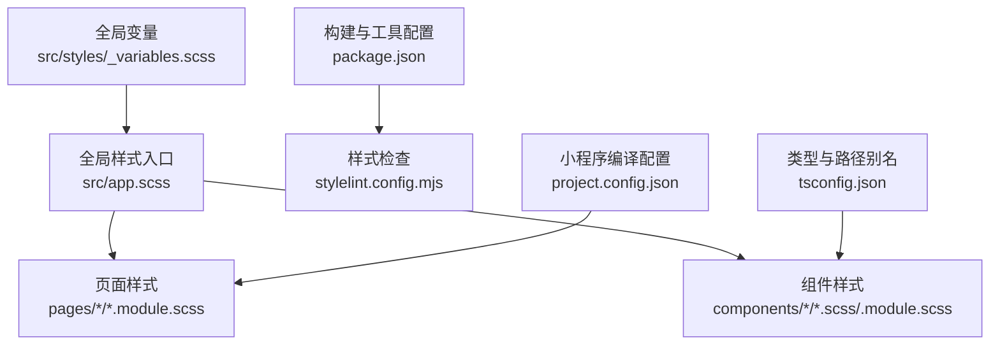
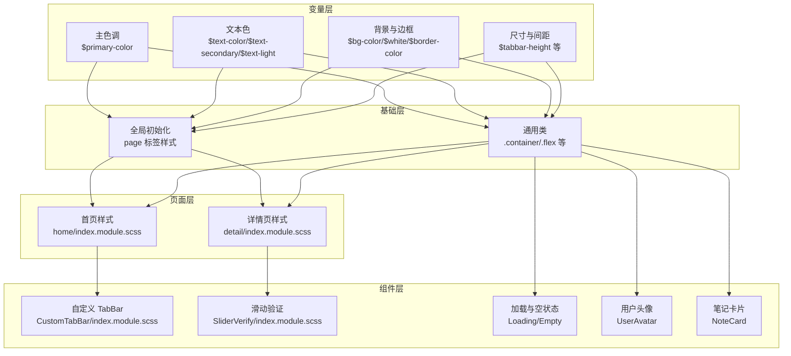
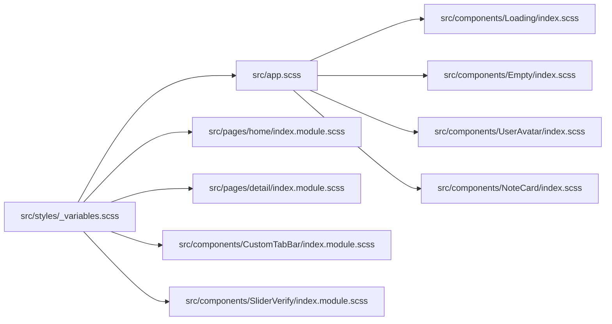

# 全局样式规范

<cite>
**本文引用的文件**
- [src/styles/_variables.scss](file://src/styles/_variables.scss)
- [src/app.scss](file://src/app.scss)
- [src/components/CustomTabBar/index.module.scss](file://src/components/CustomTabBar/index.module.scss)
- [src/pages/home/index.module.scss](file://src/pages/home/index.module.scss)
- [src/pages/detail/index.module.scss](file://src/pages/detail/index.module.scss)
- [src/components/NoteCard/index.scss](file://src/components/NoteCard/index.scss)
- [src/components/Loading/index.scss](file://src/components/Loading/index.scss)
- [src/components/Empty/index.scss](file://src/components/Empty/index.scss)
- [src/components/UserAvatar/index.scss](file://src/components/UserAvatar/index.scss)
- [src/components/SliderVerify/index.module.scss](file://src/components/SliderVerify/index.module.scss)
- [package.json](file://package.json)
- [stylelint.config.mjs](file://stylelint.config.mjs)
- [tsconfig.json](file://tsconfig.json)
- [project.config.json](file://project.config.json)
</cite>

## 目录
1. [引言](#引言)
2. [项目结构](#项目结构)
3. [核心组件](#核心组件)
4. [架构总览](#架构总览)
5. [详细组件分析](#详细组件分析)
6. [依赖分析](#依赖分析)
7. [性能考量](#性能考量)
8. [故障排查指南](#故障排查指南)
9. [结论](#结论)
10. [附录](#附录)

## 引言
本文件为“红书项目”的全局样式规范与设计系统文档，聚焦于设计系统的核心要素：主色调、文本色彩体系、背景与边框色彩；并给出全局 SCSS 变量的命名约定、作用域管理与维护策略。同时提供颜色语义化使用指南（品牌色、功能色、中性色）、全局样式初始化与基础排版规则、跨平台兼容性处理建议，并补充设计令牌版本管理、色彩对比度标准与无障碍设计考虑，帮助设计师与开发者建立统一的设计语言与最佳实践。

## 项目结构
红书项目采用 Taro 多端统一开发框架，样式以 Sass(SCSS) 为主，通过模块化样式文件组织页面与组件样式，全局变量集中管理，便于统一风格与维护。

图表来源
- [src/styles/_variables.scss](file://src/styles/_variables.scss)
- [src/app.scss](file://src/app.scss)
- [package.json](file://package.json)
- [stylelint.config.mjs](file://stylelint.config.mjs)
- [tsconfig.json](file://tsconfig.json)
- [project.config.json](file://project.config.json)

章节来源
- [src/styles/_variables.scss](file://src/styles/_variables.scss)
- [src/app.scss](file://src/app.scss)
- [package.json](file://package.json)
- [stylelint.config.mjs](file://stylelint.config.mjs)
- [tsconfig.json](file://tsconfig.json)
- [project.config.json](file://project.config.json)

## 核心组件
本节从设计系统角度，系统梳理全局样式中的关键元素与规范。

- 主色调与品牌色
  - 主色调定义为绿色系，用于强调、成功状态、按钮、选中态等品牌强调场景。
  - 在多个页面与组件中作为激活态、按钮背景、图标高亮等使用，确保品牌一致性。

- 文本色彩体系
  - 主文本色：用于正文、标题等主要信息展示。
  - 次级文本色：用于说明文字、辅助信息。
  - 轻文本色：用于弱提示、占位符、标签等低优先级信息。
  - 使用原则：在不同层级与语义下选择合适的文本色，保证可读性与层次感。

- 背景与边框色彩
  - 页面背景色：用于页面容器或大区块背景，提升内容对比度。
  - 白色背景：卡片、对话框、输入区等常用背景。
  - 边框色：用于分隔线、容器边框，建议与背景形成足够对比度。
  - 使用原则：背景与边框应与文本色形成至少 4.5:1 的 AA 级对比度，确保无障碍阅读。

- 全局排版与字号
  - 字号基准：页面整体字号以 28px 为基准，配合相对单位与语义化尺寸，保证在多端一致。
  - 字体族：优先使用系统字体栈，兼顾中英文与多端渲染一致性。
  - 行高与留白：通过合理的行高与间距，提升长文本可读性。

- 常用布局与通用类
  - 容器与弹性布局：提供 container、flex、flex-center、flex-between 等通用类，减少重复样式。
  - 文本省略：提供单行与两行省略的通用类，避免溢出与换行问题。

章节来源
- [src/styles/_variables.scss](file://src/styles/_variables.scss)
- [src/app.scss](file://src/app.scss)

## 架构总览
全局样式由“变量层—基础层—页面层—组件层”构成，变量层集中管理设计令牌，基础层负责全局初始化与通用样式，页面与组件层按需引入变量并扩展业务样式。

图表来源
- [src/styles/_variables.scss](file://src/styles/_variables.scss)
- [src/app.scss](file://src/app.scss)
- [src/pages/home/index.module.scss](file://src/pages/home/index.module.scss)
- [src/pages/detail/index.module.scss](file://src/pages/detail/index.module.scss)
- [src/components/CustomTabBar/index.module.scss](file://src/components/CustomTabBar/index.module.scss)
- [src/components/SliderVerify/index.module.scss](file://src/components/SliderVerify/index.module.scss)
- [src/components/Loading/index.scss](file://src/components/Loading/index.scss)
- [src/components/Empty/index.scss](file://src/components/Empty/index.scss)
- [src/components/UserAvatar/index.scss](file://src/components/UserAvatar/index.scss)
- [src/components/NoteCard/index.scss](file://src/components/NoteCard/index.scss)

## 详细组件分析

### 设计令牌与变量管理
- 命名约定
  - 使用语义化前缀：$text-*、$bg-*、$border-*、$white、$primary-color 等，避免直接使用颜色值。
  - 尺寸与间距：使用 $tabbar-height 等语义化变量，便于统一调整。
- 作用域管理
  - 全局变量集中于 _variables.scss，页面与组件通过 @use 导入，避免污染全局命名空间。
  - 组件内部局部变量（如 NoteCard）仅在组件内生效，避免跨组件影响。
- 维护策略
  - 变更流程：修改 _variables.scss 后，全量校验页面与组件样式，确保一致性。
  - 版本管理：通过包版本与变更日志记录设计令牌变更，配合 CI 进行样式检查。

章节来源
- [src/styles/_variables.scss](file://src/styles/_variables.scss)
- [src/components/NoteCard/index.scss](file://src/components/NoteCard/index.scss)

### 全局样式初始化与基础排版
- 初始化规则
  - page 标签设置背景色、字体族、字号、文本色与盒模型，确保页面基础一致性。
- 基础排版
  - 字号基准与行高：以 28px 为基础，标题与正文按层级递增。
  - 字体族：优先系统字体，兼顾多端渲染差异。
- 通用类
  - container 提供统一内边距；flex 系列提供常用布局；text-ellipsis 与 text-ellipsis-2 提供文本省略能力。

章节来源
- [src/app.scss](file://src/app.scss)

### 页面与组件中的颜色使用规范
- 首页（home）
  - 卡片背景使用白色，页面背景使用浅灰；文本色按层级选择主/次/轻文本色；激活态使用主色调。
  - 顶部导航与内容区域通过边框色区分层级。
- 详情页（detail）
  - 页面背景使用白色，评论区与底部栏使用浅灰背景；按钮与标签使用主色调；关注/已关注状态通过主色调与浅灰文本切换。
- 自定义 TabBar
  - 底部栏背景使用白色，激活项文本使用主色调，发布按钮使用渐变主色调。
- 滑动验证（SliderVerify）
  - 对话框背景使用白色；提示与按钮使用主色调与次级文本色；状态反馈使用成功/错误色块。
- 加载与空状态
  - 加载动画使用主色调与浅灰边框；空状态标题与描述使用轻文本色。
- 用户头像
  - 支持不同尺寸与带边框模式，边框使用主色调。
- 笔记卡片
  - 卡片背景使用白色；标题与作者信息使用主/次/轻文本色；省略类提供两行文本限制。

章节来源
- [src/pages/home/index.module.scss](file://src/pages/home/index.module.scss)
- [src/pages/detail/index.module.scss](file://src/pages/detail/index.module.scss)
- [src/components/CustomTabBar/index.module.scss](file://src/components/CustomTabBar/index.module.scss)
- [src/components/SliderVerify/index.module.scss](file://src/components/SliderVerify/index.module.scss)
- [src/components/Loading/index.scss](file://src/components/Loading/index.scss)
- [src/components/Empty/index.scss](file://src/components/Empty/index.scss)
- [src/components/UserAvatar/index.scss](file://src/components/UserAvatar/index.scss)
- [src/components/NoteCard/index.scss](file://src/components/NoteCard/index.scss)

### 颜色语义化使用指南
- 品牌色（主色调）
  - 场景：按钮、链接、选中态、强调图标、成功状态。
  - 规范：保持一致的饱和度与明度，避免过度装饰。
- 功能色
  - 成功：用于提交成功、完成任务等正向反馈。
  - 错误：用于表单错误、删除确认等负向反馈。
  - 警告：用于提示注意、风险提醒等。
  - 信息：用于说明性信息、辅助提示。
- 中性色
  - 主文本色：正文、标题主信息。
  - 次级文本色：说明、辅助信息。
  - 轻文本色：占位符、弱提示。
  - 背景色：页面背景、卡片背景、输入区背景。
  - 边框色：分割线、容器边框、输入边框。

章节来源
- [src/styles/_variables.scss](file://src/styles/_variables.scss)
- [src/app.scss](file://src/app.scss)
- [src/pages/home/index.module.scss](file://src/pages/home/index.module.scss)
- [src/pages/detail/index.module.scss](file://src/pages/detail/index.module.scss)
- [src/components/CustomTabBar/index.module.scss](file://src/components/CustomTabBar/index.module.scss)
- [src/components/SliderVerify/index.module.scss](file://src/components/SliderVerify/index.module.scss)

### 跨平台兼容性与构建配置
- 多端支持
  - 项目通过 Taro 多端构建，支持微信小程序、H5、RN 等平台，样式需遵循各平台渲染差异。
- 字体与字号
  - 使用系统字体栈，避免在小程序端强制加载外部字体导致性能与兼容问题。
- 样式检查
  - 使用 Stylelint 标准配置进行代码质量控制，避免不规范写法。
- 编译与打包
  - 小程序端开启 WXSS 压缩与 WXML 压缩，提升包体与运行效率。

章节来源
- [package.json](file://package.json)
- [stylelint.config.mjs](file://stylelint.config.mjs)
- [project.config.json](file://project.config.json)

## 依赖分析
全局样式依赖关系清晰：变量层集中管理，基础层统一初始化，页面与组件层按需引入并扩展。组件内部局部变量仅限组件作用域，避免全局污染。

图表来源
- [src/styles/_variables.scss](file://src/styles/_variables.scss)
- [src/app.scss](file://src/app.scss)
- [src/pages/home/index.module.scss](file://src/pages/home/index.module.scss)
- [src/pages/detail/index.module.scss](file://src/pages/detail/index.module.scss)
- [src/components/CustomTabBar/index.module.scss](file://src/components/CustomTabBar/index.module.scss)
- [src/components/SliderVerify/index.module.scss](file://src/components/SliderVerify/index.module.scss)
- [src/components/Loading/index.scss](file://src/components/Loading/index.scss)
- [src/components/Empty/index.scss](file://src/components/Empty/index.scss)
- [src/components/UserAvatar/index.scss](file://src/components/UserAvatar/index.scss)
- [src/components/NoteCard/index.scss](file://src/components/NoteCard/index.scss)

## 性能考量
- 减少重绘与回流
  - 使用 transform 与 opacity 控制动画，避免频繁改变布局属性。
  - 合理使用相对单位与媒体查询，减少复杂计算。
- 图片与图标
  - 使用矢量图标与系统字体图标，降低资源体积。
  - 图片采用懒加载与合适尺寸，避免超大图片影响首屏。
- 样式体积
  - 合并重复样式，使用通用类减少冗余。
  - 关闭不必要的样式检查与压缩，平衡构建时间与产物体积。

## 故障排查指南
- 样式未生效
  - 检查是否正确导入变量文件（@use），避免变量名冲突。
  - 确认组件作用域与页面作用域的样式优先级。
- 文本对比度不足
  - 使用对比度检测工具，确保文本与背景满足 AA 级标准。
  - 调整文本色或背景色，必要时引入中间过渡色。
- 多端显示异常
  - 检查小程序端 WXSS 压缩与兼容设置，避免样式被压缩破坏。
  - 使用系统字体栈，避免外部字体加载失败。
- 样式检查报错
  - 使用 Stylelint 标准配置修复语法与格式问题。
  - 在 CI 中启用样式检查，防止问题进入主分支。

章节来源
- [stylelint.config.mjs](file://stylelint.config.mjs)
- [project.config.json](file://project.config.json)

## 结论
通过集中管理设计令牌、统一全局初始化与通用类、在页面与组件中规范使用颜色语义，红书项目实现了跨平台的一致性与可维护性。建议持续完善设计令牌版本管理与无障碍标准，结合自动化检查与团队规范，保障长期演进中的设计一致性与用户体验。

## 附录
- 设计令牌版本管理建议
  - 以包版本号为基准，记录每次设计令牌变更（新增/修改/废弃）。
  - 在变更日志中明确影响范围与迁移指引。
- 色彩对比度与无障碍
  - 正文与背景对比度建议达到 AA 级（4.5:1），重要信息达到 AAA 级（7:1）。
  - 避免仅依赖颜色传达信息，辅以文本或图标。
- 最佳实践清单
  - 所有颜色使用变量而非硬编码。
  - 通用类优先，避免重复定义。
  - 组件内部变量仅限组件作用域。
  - 在 CI 中启用样式检查与构建校验。