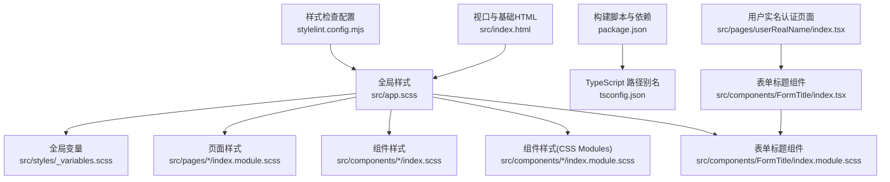
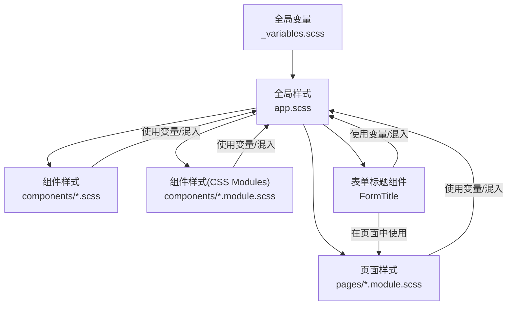
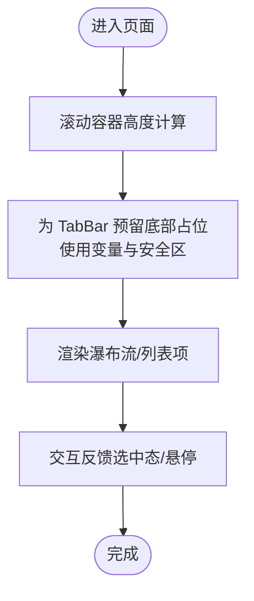
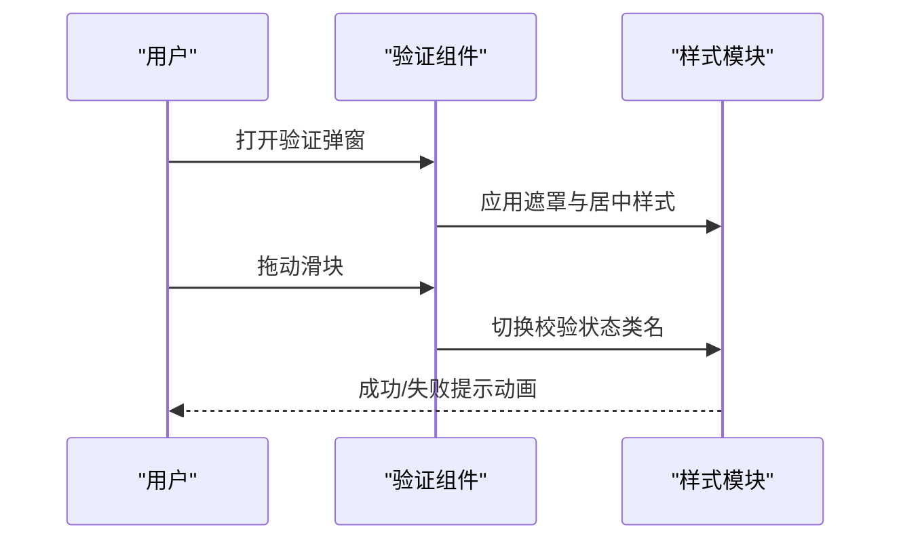
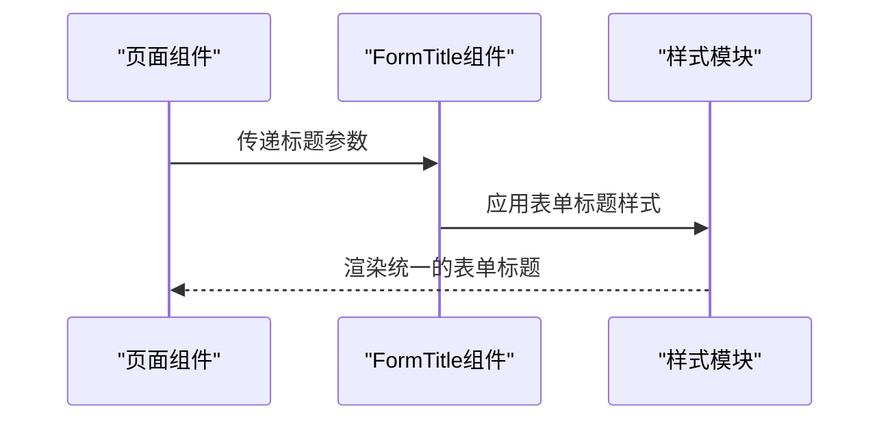
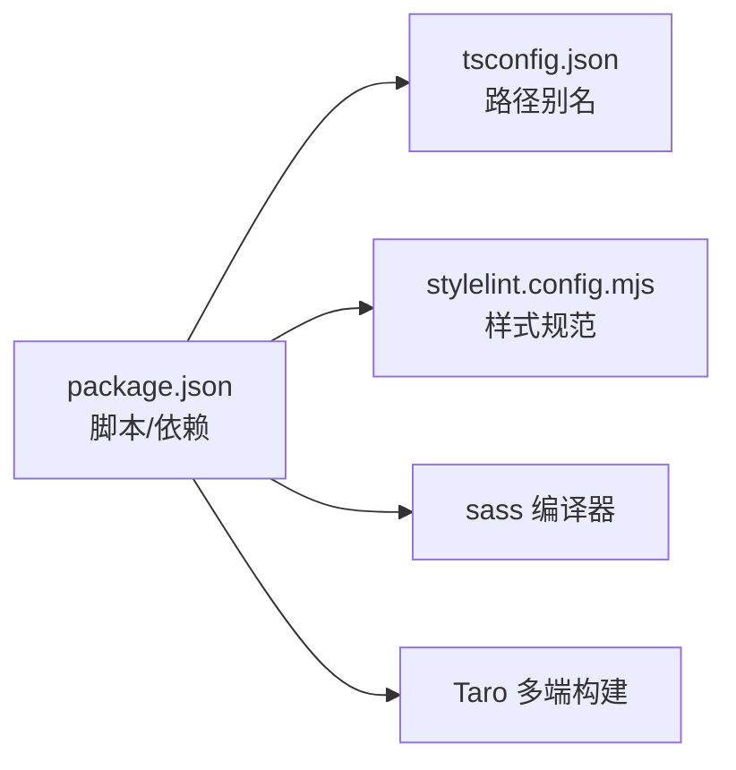

# 样式系统

<cite>
**本文引用的文件**
- [package.json](file://package.json)
- [tsconfig.json](file://tsconfig.json)
- [stylelint.config.mjs](file://stylelint.config.mjs)
- [src/styles/_variables.scss](file://src/styles/_variables.scss)
- [src/app.scss](file://src/app.scss)
- [src/components/FormTitle/index.module.scss](file://src/components/FormTitle/index.module.scss)
- [src/components/FormTitle/index.tsx](file://src/components/FormTitle/index.tsx)
- [src/components/CustomTabBar/index.module.scss](file://src/components/CustomTabBar/index.module.scss)
- [src/components/Empty/index.scss](file://src/components/Empty/index.scss)
- [src/components/Loading/index.scss](file://src/components/Loading/index.scss)
- [src/components/NoteCard/index.scss](file://src/components/NoteCard/index.scss)
- [src/components/SliderVerify/index.module.scss](file://src/components/SliderVerify/index.module.scss)
- [src/components/UserAvatar/index.scss](file://src/components/UserAvatar/index.scss)
- [src/pages/home/index.module.scss](file://src/pages/home/index.module.scss)
- [src/pages/detail/index.module.scss](file://src/pages/detail/index.module.scss)
- [src/pages/discover/index.module.scss](file://src/pages/discover/index.module.scss)
- [src/pages/publish/index.module.scss](file://src/pages/publish/index.module.scss)
- [src/pages/profile/index.module.scss](file://src/pages/profile/index.module.scss)
- [src/pages/userRealName/index.tsx](file://src/pages/userRealName/index.tsx)
- [src/index.html](file://src/index.html)
</cite>

## 更新摘要
**所做更改**
- 新增FormTitle组件样式系统，提供表单标题的统一视觉规范
- 完善Taroify框架样式覆盖，彻底移除蓝色焦点边框和轮廓
- 增强全局输入框样式统一性，确保一致的用户体验
- 优化表单组件的交互反馈样式

## 目录
1. [简介](#简介)
2. [项目结构](#项目结构)
3. [核心组件](#核心组件)
4. [架构总览](#架构总览)
5. [详细组件分析](#详细组件分析)
6. [依赖关系分析](#依赖关系分析)
7. [性能考量](#性能考量)
8. [故障排查指南](#故障排查指南)
9. [结论](#结论)
10. [附录](#附录)

## 简介
本文件为"红书项目"的样式系统文档，聚焦于基于 SCSS 的样式架构设计与落地实践。内容覆盖：
- 全局样式变量与命名空间
- 模块化样式组织（页面级与组件级）
- CSS Modules 的使用策略与隔离机制
- 设计系统规范（颜色、字体、间距、断点）
- 响应式与多端适配（移动端优先）
- 主题与可定制性建议
- 性能优化、代码组织最佳实践与团队协作规范

**更新** 新增FormTitle组件样式规范和Taroify框架样式覆盖系统的完善

## 项目结构
样式相关文件主要分布于以下位置：
- 全局样式：src/app.scss
- 全局变量：src/styles/_variables.scss
- 页面级样式：src/pages/*/index.module.scss
- 组件级样式：src/components/*/index.scss 或 index.module.scss
- 表单标题组件：src/components/FormTitle/index.module.scss
- 构建与工具链：package.json、tsconfig.json、stylelint.config.mjs
- 视口与基础 HTML：src/index.html

**图表来源**
- [src/app.scss:1-121](file://src/app.scss#L1-L121)
- [src/styles/_variables.scss:1-9](file://src/styles/_variables.scss#L1-L9)
- [src/components/FormTitle/index.module.scss:1-23](file://src/components/FormTitle/index.module.scss#L1-L23)
- [src/components/FormTitle/index.tsx:1-18](file://src/components/FormTitle/index.tsx#L1-L18)
- [src/pages/userRealName/index.tsx:170-176](file://src/pages/userRealName/index.tsx#L170-L176)

**章节来源**
- [src/app.scss:1-121](file://src/app.scss#L1-L121)
- [src/styles/_variables.scss:1-9](file://src/styles/_variables.scss#L1-L9)
- [package.json:12-33](file://package.json#L12-L33)
- [tsconfig.json:23-26](file://tsconfig.json#L23-L26)
- [stylelint.config.mjs:1-5](file://stylelint.config.mjs#L1-L5)
- [src/index.html:1-17](file://src/index.html#L1-L17)

## 核心组件
- 全局变量与命名空间
  - 使用 SCSS 的命名空间导入，集中管理主色、文本色、背景色、边框色与 TabBar 高度等变量，便于统一风格与主题切换。
- 全局样式
  - 定义页面基础排版、导航栏样式、容器与常用布局类（如 flex、居中、省略文本等），减少重复定义。
  - **新增** 完整的 Taroify 框架样式覆盖系统，彻底移除蓝色焦点边框和轮廓，确保统一的视觉体验。
- 页面级样式（CSS Modules）
  - 页面以模块化样式组织，避免全局污染；通过模块化命名空间确保类名唯一。
- 组件级样式
  - 大部分组件采用普通 SCSS 文件，少量交互复杂或需要严格作用域隔离的组件采用 CSS Modules。
- **新增** 表单标题组件（FormTitle）
  - 提供统一的表单标题样式规范，包含渐变色竖条和标题文本的组合设计。

**章节来源**
- [src/styles/_variables.scss:1-9](file://src/styles/_variables.scss#L1-L9)
- [src/app.scss:11-71](file://src/app.scss#L11-L71)
- [src/components/FormTitle/index.module.scss:1-23](file://src/components/FormTitle/index.module.scss#L1-L23)
- [src/components/CustomTabBar/index.module.scss:1-64](file://src/components/CustomTabBar/index.module.scss#L1-L64)
- [src/components/SliderVerify/index.module.scss:1-190](file://src/components/SliderVerify/index.module.scss#L1-L190)

## 架构总览
样式系统采用"全局变量 + 全局样式 + 页面模块 + 组件模块"的分层组织方式，并结合 CSS Modules 实现样式隔离。下图展示全局样式与页面/组件样式的依赖关系，包括新增的表单标题组件：

**图表来源**
- [src/styles/_variables.scss:1-9](file://src/styles/_variables.scss#L1-L9)
- [src/app.scss:1-121](file://src/app.scss#L1-L121)
- [src/components/FormTitle/index.module.scss:1-23](file://src/components/FormTitle/index.module.scss#L1-L23)
- [src/pages/userRealName/index.tsx:170-176](file://src/pages/userRealName/index.tsx#L170-L176)

## 详细组件分析

### 全局样式与变量
- 变量集中管理：主色、文本色阶、背景色、白色、边框色、TabBar 高度等，统一命名与取值，便于主题扩展。
- 全局排版与通用类：页面基础字号、字体族、盒模型、导航栏样式、容器与布局辅助类，减少重复代码。
- **新增** Taroify 框架样式覆盖系统：
  - 移除所有输入框的蓝色边框（Taroify Input 焦点样式）
  - 针对 Field、Input、Cell 组件的边框重置
  - 通用输入框样式覆盖，确保所有可能的焦点状态都被处理
  - 强制移除所有可能的边框和轮廓

**章节来源**
- [src/styles/_variables.scss:1-9](file://src/styles/_variables.scss#L1-L9)
- [src/app.scss:1-121](file://src/app.scss#L1-L121)

### 表单标题组件（FormTitle）
- **新增** 统一的表单标题样式规范
- 组件结构：包含渐变色竖条和标题文本的组合设计
- 样式特点：
  - 使用 Flex 布局实现垂直居中对齐
  - 渐变色竖条提供视觉引导和品牌识别
  - 大字号标题文本，强调重要信息
  - 统一的间距和对齐规范

**章节来源**
- [src/components/FormTitle/index.module.scss:1-23](file://src/components/FormTitle/index.module.scss#L1-L23)
- [src/components/FormTitle/index.tsx:1-18](file://src/components/FormTitle/index.tsx#L1-L18)

### 页面级样式（CSS Modules）
- 页面采用模块化样式，类名经构建后带哈希前缀，避免冲突。
- 典型页面结构：页面根容器、滚动区域、头部/内容/底部等区块，配合变量与通用类实现一致风格。
- **新增** 在用户实名认证页面中集成 FormTitle 组件，提供统一的表单标题体验。

**章节来源**
- [src/pages/home/index.module.scss:1-167](file://src/pages/home/index.module.scss#L1-L167)
- [src/pages/discover/index.module.scss:1-175](file://src/pages/discover/index.module.scss#L1-L175)
- [src/pages/detail/index.module.scss:1-258](file://src/pages/detail/index.module.scss#L1-L258)
- [src/pages/publish/index.module.scss:82-165](file://src/pages/publish/index.module.scss#L82-L165)
- [src/pages/profile/index.module.scss:163-252](file://src/pages/profile/index.module.scss#L163-L252)
- [src/pages/userRealName/index.tsx:170-176](file://src/pages/userRealName/index.tsx#L170-L176)

### 组件级样式（普通 SCSS 与 CSS Modules）
- 普通 SCSS 组件：适用于样式相对简单、无需严格作用域隔离的组件。
  - 示例：空状态、加载中、用户头像、卡片等。
- CSS Modules 组件：适用于交互复杂、需要强隔离的组件。
  - 示例：自定义 TabBar、滑动验证等。

**章节来源**
- [src/components/Empty/index.scss:1-24](file://src/components/Empty/index.scss#L1-L24)
- [src/components/Loading/index.scss:1-29](file://src/components/Loading/index.scss#L1-L29)
- [src/components/UserAvatar/index.scss:1-29](file://src/components/UserAvatar/index.scss#L1-L29)
- [src/components/NoteCard/index.scss:1-105](file://src/components/NoteCard/index.scss#L1-L105)
- [src/components/CustomTabBar/index.module.scss:1-64](file://src/components/CustomTabBar/index.module.scss#L1-L64)
- [src/components/SliderVerify/index.module.scss:1-190](file://src/components/SliderVerify/index.module.scss#L1-L190)

### 设计系统规范（颜色/字体/间距/断点）

- 颜色体系
  - 主色：用于强调、按钮、选中态等
  - 文本色阶：主文本、次级文本、弱文本
  - 背景色与边框色：页面背景、卡片背景、分割线等
  - 变量集中于全局，便于统一替换与主题扩展

- 字体规范
  - 页面基础字号与字体族在全局样式中统一设置
  - 各组件按层级与语义选择字号与字重，保持一致性

- 间距规则
  - 使用统一的间距基线，常见为 10–20px 的倍数
  - 容器内边距、元素间距、行高等遵循统一比例

- 断点设计
  - 当前代码未显式定义断点，建议在全局 SCSS 中引入断点变量，按移动端优先策略编写媒体查询

**章节来源**
- [src/styles/_variables.scss:1-9](file://src/styles/_variables.scss#L1-L9)
- [src/app.scss:1-121](file://src/app.scss#L1-L121)

### 响应式设计与多端适配
- 移动端优先
  - 基础视口已在 HTML 中声明，页面与组件样式优先满足移动端体验
- 安全区域与底部安全区
  - 多处使用环境变量以适配刘海屏/圆角屏底部安全区
- 多端适配
  - 项目基于 Taro 多端编译，样式需兼容微信小程序、H5、快应用等平台差异，建议：
    - 使用相对单位（rpx/百分比）与变量控制尺寸
    - 对平台差异进行条件样式处理（如导航栏高度、胶囊按钮等）

**章节来源**
- [src/index.html:5-11](file://src/index.html#L5-L11)
- [src/pages/home/index.module.scss:40](file://src/pages/home/index.module.scss#L40)
- [src/pages/detail/index.module.scss:212](file://src/pages/detail/index.module.scss#L212)
- [src/components/CustomTabBar/index.module.scss:14](file://src/components/CustomTabBar/index.module.scss#L14)

### 样式隔离与主题定制
- 样式隔离
  - 页面与组件广泛采用 CSS Modules，类名自动哈希，避免全局污染
  - 局部组件仍使用普通 SCSS，建议逐步迁移至 CSS Modules 提升隔离性
- 主题定制
  - 通过修改全局变量即可实现主题切换（如主色、文本色阶、背景色）
  - 建议在入口处注入变量覆盖，或在构建时传参生成不同主题包

**章节来源**
- [src/components/CustomTabBar/index.module.scss:1-64](file://src/components/CustomTabBar/index.module.scss#L1-L64)
- [src/components/SliderVerify/index.module.scss:1-190](file://src/components/SliderVerify/index.module.scss#L1-L190)
- [src/styles/_variables.scss:1-9](file://src/styles/_variables.scss#L1-L9)

### 关键流程与交互示意

#### 页面滚动与 TabBar 占位

**图表来源**
- [src/pages/home/index.module.scss:37-41](file://src/pages/home/index.module.scss#L37-L41)
- [src/styles/_variables.scss:8](file://src/styles/_variables.scss#L8)
- [src/components/CustomTabBar/index.module.scss:14](file://src/components/CustomTabBar/index.module.scss#L14)

#### 验证弹窗动画与状态

**图表来源**
- [src/components/SliderVerify/index.module.scss:13-164](file://src/components/SliderVerify/index.module.scss#L13-L164)

#### 表单标题组件集成流程

**图表来源**
- [src/components/FormTitle/index.tsx:8-15](file://src/components/FormTitle/index.tsx#L8-L15)
- [src/components/FormTitle/index.module.scss:1-23](file://src/components/FormTitle/index.module.scss#L1-L23)
- [src/pages/userRealName/index.tsx:170-176](file://src/pages/userRealName/index.tsx#L170-L176)

## 依赖关系分析
- 构建与脚本
  - 多端构建脚本由 Taro CLI 提供，支持微信小程序、H5、快应用等平台
- 工具链
  - TypeScript 路径别名指向 src，便于在样式中通过 @/ 引用资源
  - Stylelint 标准配置，保证样式规范与一致性
- 依赖
  - 开发依赖包含 sass、stylelint、eslint 等，支撑样式与代码质量

**图表来源**
- [package.json:12-33](file://package.json#L12-L33)
- [tsconfig.json:23-26](file://tsconfig.json#L23-L26)
- [stylelint.config.mjs:1-5](file://stylelint.config.mjs#L1-L5)

**章节来源**
- [package.json:12-33](file://package.json#L12-L33)
- [tsconfig.json:23-26](file://tsconfig.json#L23-L26)
- [stylelint.config.mjs:1-5](file://stylelint.config.mjs#L1-L5)

## 性能考量
- 减少全局样式体积：将通用布局类收敛到全局样式，组件内部仅保留必要样式
- CSS Modules 类名哈希：避免重复选择器与全局冲突，提升打包效率
- 变量复用：统一变量与函数，减少重复计算与冗余样式
- 渐进增强：对动画与阴影等视觉效果按需启用，避免影响低端设备性能
- 媒体查询优化：合并断点与条件样式，减少规则数量
- **新增** 样式覆盖优化：通过统一的 Taroify 样式覆盖减少重复的样式声明

## 故障排查指南
- 样式不生效
  - 检查是否正确导入全局样式与变量
  - 确认组件是否使用 CSS Modules 并正确引用类名
- 类名冲突
  - 将普通 SCSS 组件迁移至 CSS Modules
  - 使用更明确的命名空间或 BEM 风格
- 多端显示异常
  - 检查安全区变量使用与平台差异
  - 对导航栏、胶囊按钮等进行平台适配
- 规范检查报错
  - 使用 Stylelint 标准规则修正格式与命名问题
- **新增** Taroify 样式问题
  - 检查 app.scss 中的样式覆盖规则是否正确应用
  - 确认所有可能的焦点状态都被正确处理
- **新增** FormTitle 组件问题
  - 检查组件导入路径是否正确
  - 确认样式模块类名引用是否匹配

**章节来源**
- [stylelint.config.mjs:1-5](file://stylelint.config.mjs#L1-L5)
- [src/components/CustomTabBar/index.module.scss:1-64](file://src/components/CustomTabBar/index.module.scss#L1-L64)
- [src/pages/detail/index.module.scss:212](file://src/pages/detail/index.module.scss#L212)
- [src/app.scss:11-71](file://src/app.scss#L11-L71)
- [src/components/FormTitle/index.module.scss:1-23](file://src/components/FormTitle/index.module.scss#L1-L23)

## 结论
红书项目的样式系统以 SCSS 为核心，结合全局变量与全局样式，采用页面与组件模块化组织，并通过 CSS Modules 实现强隔离。整体遵循移动端优先与多端适配原则，具备良好的可维护性与扩展性。

**更新** 最新改进包括完善的 Taroify 框架样式覆盖系统，彻底解决了蓝色焦点边框问题，以及新增的 FormTitle 组件，提供了统一的表单标题样式规范。建议后续完善断点体系与主题变量覆盖能力，持续提升跨平台一致性与开发效率。

## 附录

### 团队协作规范（建议）
- 命名规范
  - 组件类名采用 BEM 或功能语义化命名，避免过深嵌套
  - 页面与组件样式文件命名与目录结构保持一致
- 变量与混入
  - 所有颜色、字号、间距统一从变量库获取，避免硬编码
- CSS Modules
  - 交互复杂或存在潜在冲突的组件优先采用 CSS Modules
- 提交与检查
  - 使用 husky + lint-staged 在提交前自动运行 Stylelint 与 ESLint
- 多端一致性
  - 对平台差异进行集中处理，避免分散在各组件中
- **新增** 样式覆盖规范
  - 所有第三方组件的样式覆盖都应在 app.scss 中统一管理
  - 确保样式覆盖的完整性和一致性
- **新增** 组件样式规范
  - 新增组件时，优先考虑使用 CSS Modules
  - 统一的组件样式命名和结构规范