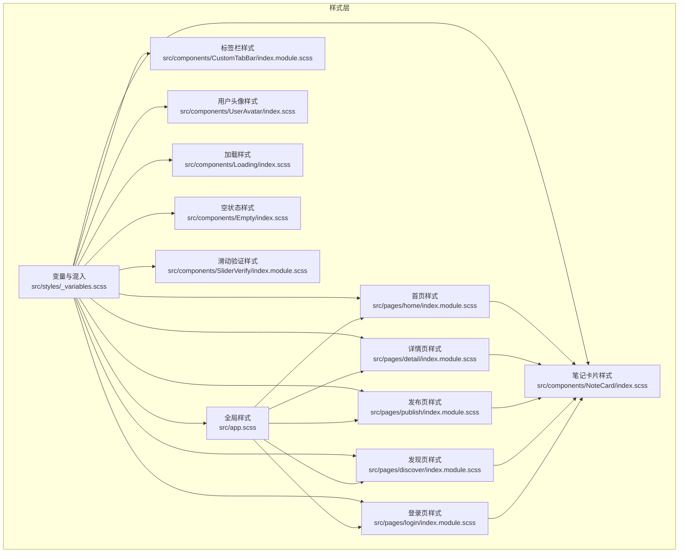
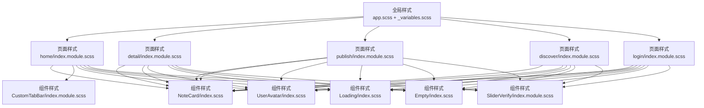
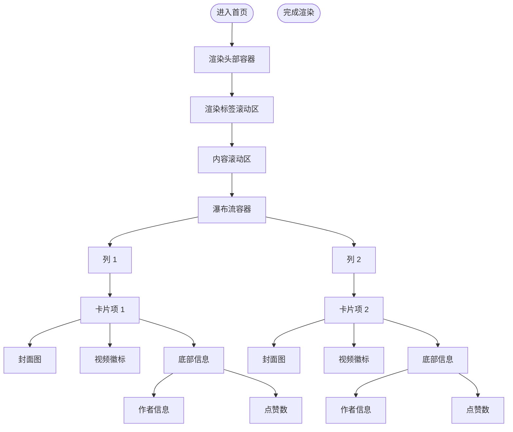
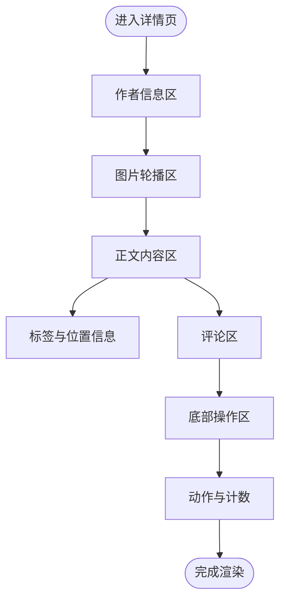
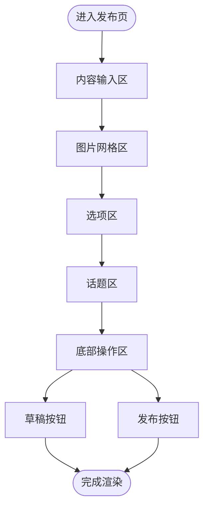
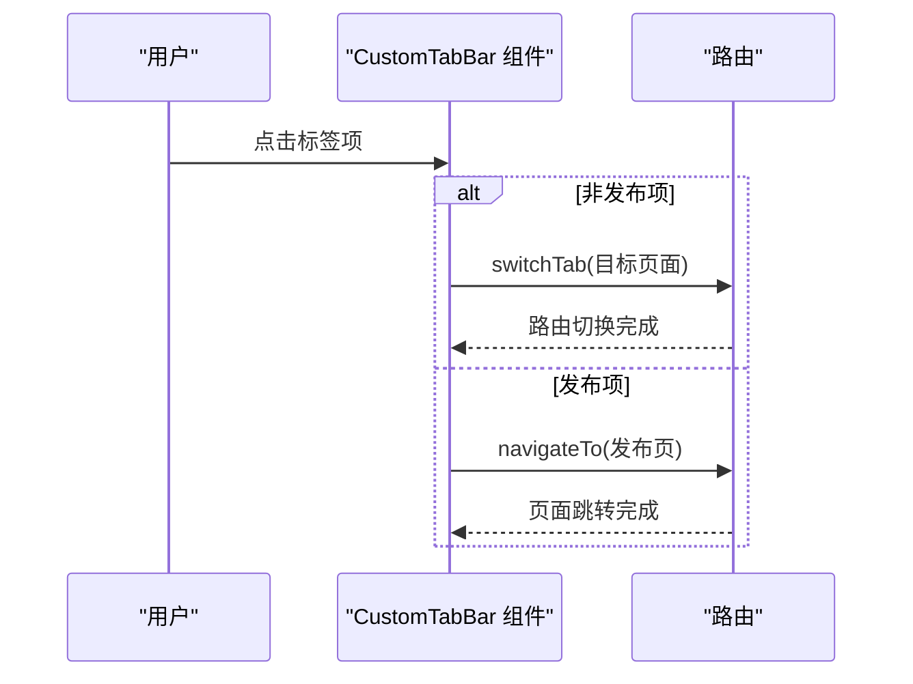
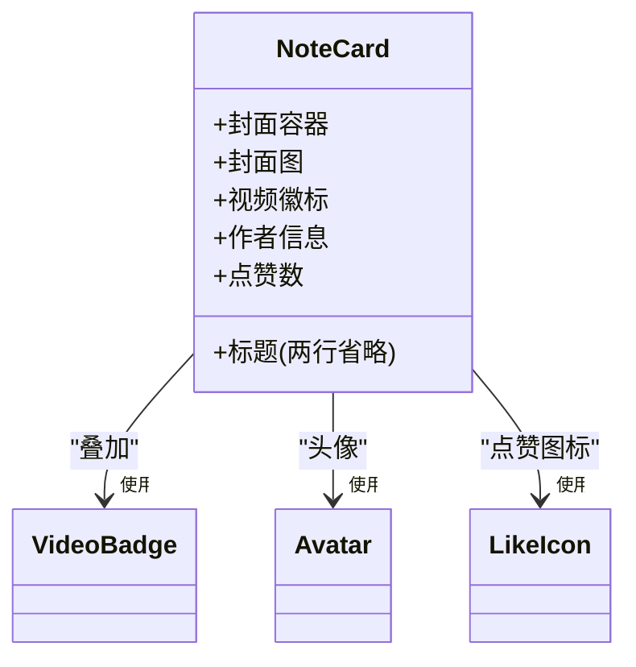
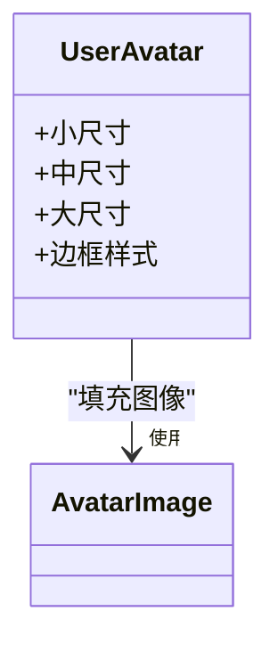
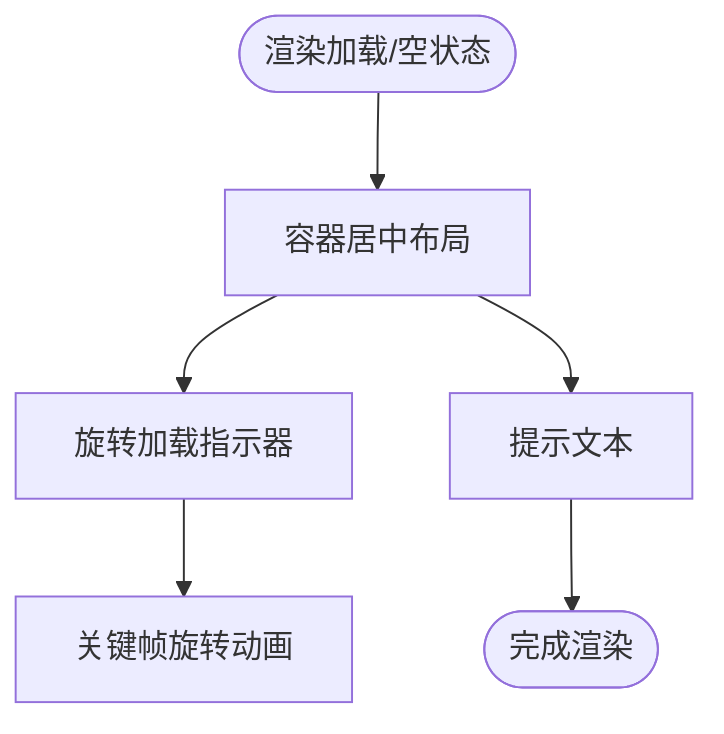
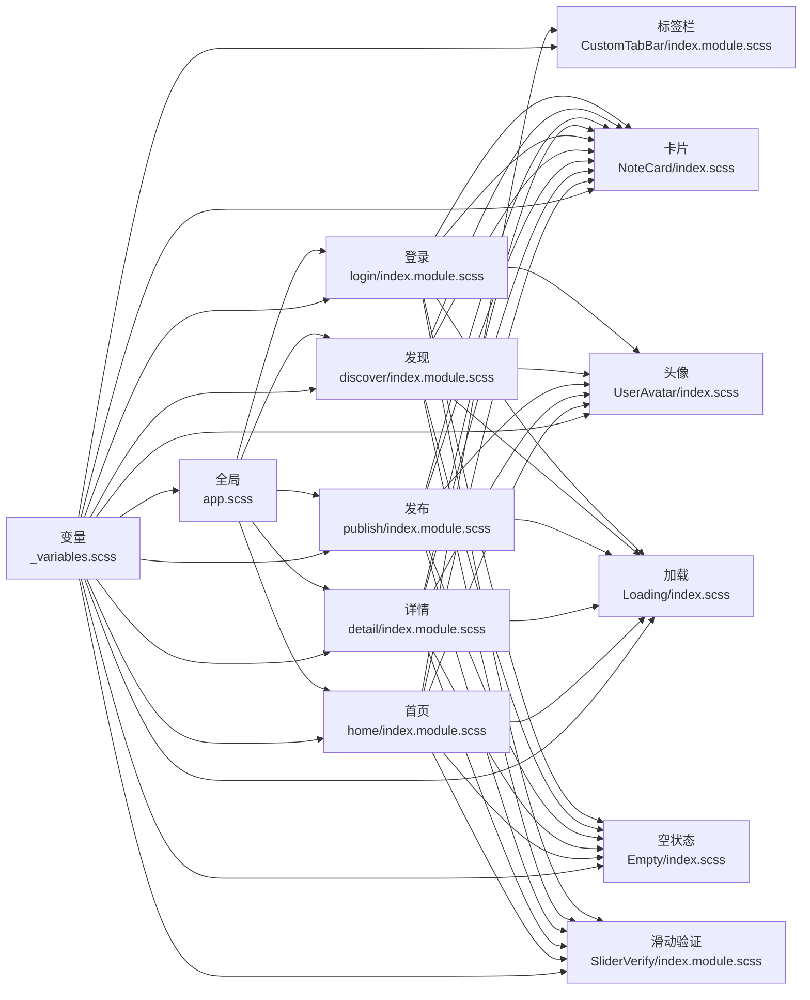

# 组件样式实现

<cite>
**本文引用的文件**
- [src/styles/_variables.scss](file://src/styles/_variables.scss)
- [src/app.scss](file://src/app.scss)
- [src/components/CustomTabBar/index.module.scss](file://src/components/CustomTabBar/index.module.scss)
- [src/components/CustomTabBar/index.tsx](file://src/components/CustomTabBar/index.tsx)
- [src/components/NoteCard/index.scss](file://src/components/NoteCard/index.scss)
- [src/components/NoteCard/index.tsx](file://src/components/NoteCard/index.tsx)
- [src/components/UserAvatar/index.scss](file://src/components/UserAvatar/index.scss)
- [src/components/UserAvatar/index.tsx](file://src/components/UserAvatar/index.tsx)
- [src/components/Loading/index.scss](file://src/components/Loading/index.scss)
- [src/components/Loading/index.tsx](file://src/components/Loading/index.tsx)
- [src/components/Empty/index.scss](file://src/components/Empty/index.scss)
- [src/components/Empty/index.tsx](file://src/components/Empty/index.tsx)
- [src/components/SliderVerify/index.module.scss](file://src/components/SliderVerify/index.module.scss)
- [src/pages/home/index.module.scss](file://src/pages/home/index.module.scss)
- [src/pages/detail/index.module.scss](file://src/pages/detail/index.module.scss)
- [src/pages/publish/index.module.scss](file://src/pages/publish/index.module.scss)
- [src/pages/discover/index.module.scss](file://src/pages/discover/index.module.scss)
- [src/pages/login/index.module.scss](file://src/pages/login/index.module.scss)
</cite>

## 目录
1. [简介](#简介)
2. [项目结构](#项目结构)
3. [核心组件](#核心组件)
4. [架构总览](#架构总览)
5. [详细组件分析](#详细组件分析)
6. [依赖分析](#依赖分析)
7. [性能考虑](#性能考虑)
8. [故障排查指南](#故障排查指南)
9. [结论](#结论)
10. [附录](#附录)

## 简介
本文件系统性梳理红书项目的组件样式实现，重点覆盖以下方面：
- CSS Modules 的模块化组织策略：命名规范、作用域隔离与类名冲突规避
- 页面级样式架构：首页瀑布流布局、详情页响应式设计、发布页表单样式
- 通用 UI 组件样式规范：笔记卡片、自定义标签栏、用户头像、加载与空状态
- 样式继承、覆盖与扩展机制
- 性能优化策略：CSS 压缩、关键 CSS 提取与懒加载
- 主题定制与跨平台适配实践

## 项目结构
项目采用按功能域划分的目录结构，样式以 SCSS 为主，结合 CSS Modules 在组件层面实现作用域隔离；全局基础样式与变量集中管理。

图表来源
- [src/styles/_variables.scss:1-9](file://src/styles/_variables.scss#L1-L9)
- [src/app.scss:1-59](file://src/app.scss#L1-L59)
- [src/pages/home/index.module.scss:1-167](file://src/pages/home/index.module.scss#L1-L167)
- [src/pages/detail/index.module.scss:1-258](file://src/pages/detail/index.module.scss#L1-L258)
- [src/pages/publish/index.module.scss:1-200](file://src/pages/publish/index.module.scss#L1-L200)
- [src/pages/discover/index.module.scss:1-175](file://src/pages/discover/index.module.scss#L1-L175)
- [src/pages/login/index.module.scss:1-217](file://src/pages/login/index.module.scss#L1-L217)
- [src/components/CustomTabBar/index.module.scss:1-64](file://src/components/CustomTabBar/index.module.scss#L1-L64)
- [src/components/NoteCard/index.scss:1-105](file://src/components/NoteCard/index.scss#L1-L105)
- [src/components/UserAvatar/index.scss:1-29](file://src/components/UserAvatar/index.scss#L1-L29)
- [src/components/Loading/index.scss:1-29](file://src/components/Loading/index.scss#L1-L29)
- [src/components/Empty/index.scss:1-24](file://src/components/Empty/index.scss#L1-L24)
- [src/components/SliderVerify/index.module.scss:1-190](file://src/components/SliderVerify/index.module.scss#L1-L190)

章节来源
- [src/styles/_variables.scss:1-9](file://src/styles/_variables.scss#L1-L9)
- [src/app.scss:1-59](file://src/app.scss#L1-L59)

## 核心组件
- 变量与混入：统一的颜色、字体、间距与尺寸变量，确保主题一致性与可维护性
- 全局样式：页面容器、导航栏、通用工具类（flex、文本省略等）
- 页面样式：各页面采用 CSS Modules，通过模块化作用域避免类名冲突，并结合变量提升一致性
- 通用组件样式：NoteCard、UserAvatar、Loading、Empty、CustomTabBar、SliderVerify 等，均以模块化方式组织

章节来源
- [src/styles/_variables.scss:1-9](file://src/styles/_variables.scss#L1-L9)
- [src/app.scss:1-59](file://src/app.scss#L1-L59)

## 架构总览
整体架构强调“全局统一 + 组件隔离”的双层样式体系：
- 全局层：变量与通用样式，保证跨页面一致的视觉与交互基线
- 组件层：CSS Modules 实现作用域隔离，避免样式污染与冲突
- 页面层：页面样式作为组件样式与全局样式的聚合层，负责布局与层级关系

图表来源
- [src/app.scss:1-59](file://src/app.scss#L1-L59)
- [src/styles/_variables.scss:1-9](file://src/styles/_variables.scss#L1-L9)
- [src/pages/home/index.module.scss:1-167](file://src/pages/home/index.module.scss#L1-L167)
- [src/pages/detail/index.module.scss:1-258](file://src/pages/detail/index.module.scss#L1-L258)
- [src/pages/publish/index.module.scss:1-200](file://src/pages/publish/index.module.scss#L1-L200)
- [src/pages/discover/index.module.scss:1-175](file://src/pages/discover/index.module.scss#L1-L175)
- [src/pages/login/index.module.scss:1-217](file://src/pages/login/index.module.scss#L1-L217)
- [src/components/CustomTabBar/index.module.scss:1-64](file://src/components/CustomTabBar/index.module.scss#L1-L64)
- [src/components/NoteCard/index.scss:1-105](file://src/components/NoteCard/index.scss#L1-L105)
- [src/components/UserAvatar/index.scss:1-29](file://src/components/UserAvatar/index.scss#L1-L29)
- [src/components/Loading/index.scss:1-29](file://src/components/Loading/index.scss#L1-L29)
- [src/components/Empty/index.scss:1-24](file://src/components/Empty/index.scss#L1-L24)
- [src/components/SliderVerify/index.module.scss:1-190](file://src/components/SliderVerify/index.module.scss#L1-L190)

## 详细组件分析

### CSS Modules 模块化与作用域隔离
- 文件命名规范
  - 页面样式：使用 index.module.scss，例如 home/index.module.scss、detail/index.module.scss
  - 通用组件样式：使用 index.scss 或 index.module.scss，例如 NoteCard/index.scss、CustomTabBar/index.module.scss
- 作用域隔离机制
  - 页面与组件样式通过 CSS Modules 导出类名映射，组件内部以 styles['class'] 方式引用，避免全局污染
  - 示例：组件导入样式后以模块对象形式使用类名，确保类名唯一且不冲突
- 类名冲突避免方案
  - 使用语义化类名前缀（如 .home-page、.detail-page、.custom-tabbar 等），并在子元素上采用 BEM 风格组合
  - 通过变量统一颜色与尺寸，减少硬编码导致的冲突

章节来源
- [src/components/CustomTabBar/index.tsx:4-4](file://src/components/CustomTabBar/index.tsx#L4-L4)
- [src/components/NoteCard/index.tsx:3-3](file://src/components/NoteCard/index.tsx#L3-L3)
- [src/components/UserAvatar/index.tsx:2-2](file://src/components/UserAvatar/index.tsx#L2-L2)
- [src/components/Loading/index.tsx:2-2](file://src/components/Loading/index.tsx#L2-L2)
- [src/components/Empty/index.tsx:2-2](file://src/components/Empty/index.tsx#L2-L2)

### 首页瀑布流布局
- 布局结构
  - 顶部容器与内容滚动区，内容区采用两列瀑布流，列间与列内使用 gap 控制间距
  - 列项卡片采用圆角背景与溢出隐藏，封面图使用 width: 100% 自适应
- 关键样式要点
  - .waterfall-column 与 .waterfall-item 实现列式布局与卡片样式
  - .cover、.video-badge、.content、.title、.author、.likes 等组合形成卡片信息展示
- 交互与视觉
  - 列项悬停时降低透明度，增强交互反馈
  - 视频标识使用绝对定位与半透明背景，突出视频属性

图表来源
- [src/pages/home/index.module.scss:43-67](file://src/pages/home/index.module.scss#L43-L67)
- [src/pages/home/index.module.scss:69-150](file://src/pages/home/index.module.scss#L69-L150)

章节来源
- [src/pages/home/index.module.scss:1-167](file://src/pages/home/index.module.scss#L1-L167)

### 详情页响应式设计
- 布局结构
  - 作者信息区、图片轮播区、正文内容区、评论区、底部操作区
  - 图片轮播使用 white-space: nowrap 与内联宽度，指示器绝对定位
- 关键样式要点
  - .images-scroll 与 .detail-image 实现横向滚动图片展示
  - .post-content 下的标题、正文、标签、位置与时间等信息分层排布
  - 底部操作区采用圆角输入框与图标按钮，支持安全区适配
- 交互与视觉
  - 评论项逐条展示，末尾项去除底边线，提升可读性
  - 点赞图标与计数在激活态改变主色，增强反馈

图表来源
- [src/pages/detail/index.module.scss:14-256](file://src/pages/detail/index.module.scss#L14-L256)

章节来源
- [src/pages/detail/index.module.scss:1-258](file://src/pages/detail/index.module.scss#L1-L258)

### 发布页表单样式
- 布局结构
  - 内容输入区、图片网格区、选项区、话题区、底部操作区
- 关键样式要点
  - .content-input 支持最小高度与多行输入
  - .images-grid 使用 flex 包裹与间隙控制网格
  - .topic-tag 在激活态使用主色高亮
  - 底部操作区采用双按钮布局，支持安全区适配
- 交互与视觉
  - 添加图片采用虚线边框与图标提示，移除按钮使用半透明背景与圆角
  - 选项项逐条展示，箭头与开关图标清晰表达操作入口

图表来源
- [src/pages/publish/index.module.scss:14-198](file://src/pages/publish/index.module.scss#L14-L198)

章节来源
- [src/pages/publish/index.module.scss:1-200](file://src/pages/publish/index.module.scss#L1-L200)

### 自定义标签栏样式
- 结构与行为
  - 固定底部，包含首页、发现、发布、消息、我的五个标签项
  - 发布按钮采用渐变背景与圆角，居中显示加号图标
  - 当前激活项文字使用主色，图标与文字颜色区分正常与激活态
- 交互流程
  - 点击非发布项触发切换标签页，点击发布项跳转到发布页
  - 通过路由路径匹配设置当前激活索引

图表来源
- [src/components/CustomTabBar/index.tsx:25-32](file://src/components/CustomTabBar/index.tsx#L25-L32)
- [src/components/CustomTabBar/index.module.scss:3-63](file://src/components/CustomTabBar/index.module.scss#L3-L63)

章节来源
- [src/components/CustomTabBar/index.tsx:1-67](file://src/components/CustomTabBar/index.tsx#L1-L67)
- [src/components/CustomTabBar/index.module.scss:1-64](file://src/components/CustomTabBar/index.module.scss#L1-L64)

### 笔记卡片样式
- 结构组成
  - 封面容器与封面图，视频徽标叠加于右上角
  - 标题采用两行省略显示，底部作者信息与点赞数
- 关键样式要点
  - 圆角背景与溢出隐藏，提升卡片边界感
  - 视频徽标使用半透明背景与居中对齐
  - 标题与作者信息使用省略类，避免长文本溢出

图表来源
- [src/components/NoteCard/index.scss:6-104](file://src/components/NoteCard/index.scss#L6-L104)
- [src/components/NoteCard/index.tsx:22-50](file://src/components/NoteCard/index.tsx#L22-L50)

章节来源
- [src/components/NoteCard/index.scss:1-105](file://src/components/NoteCard/index.scss#L1-L105)
- [src/components/NoteCard/index.tsx:1-53](file://src/components/NoteCard/index.tsx#L1-L53)

### 用户头像样式
- 尺寸与边框
  - 支持 small、medium、large 三种尺寸，通过类名组合实现
  - 可选边框样式，用于强调或特殊状态
- 关键样式要点
  - 圆形裁剪与溢出隐藏，配合 aspectFill 模式保证填充效果

图表来源
- [src/components/UserAvatar/index.scss:1-28](file://src/components/UserAvatar/index.scss#L1-L28)
- [src/components/UserAvatar/index.tsx:10-15](file://src/components/UserAvatar/index.tsx#L10-L15)

章节来源
- [src/components/UserAvatar/index.scss:1-29](file://src/components/UserAvatar/index.scss#L1-L29)
- [src/components/UserAvatar/index.tsx:1-17](file://src/components/UserAvatar/index.tsx#L1-L17)

### 加载与空状态样式
- 加载动画
  - 圆形边框旋转动画，使用 keyframes 定义，主色作为旋转边颜色
- 空状态
  - 居中布局，图标、标题与描述分层展示，颜色与字号层次分明

图表来源
- [src/components/Loading/index.scss:9-28](file://src/components/Loading/index.scss#L9-L28)
- [src/components/Empty/index.scss:1-23](file://src/components/Empty/index.scss#L1-L23)

章节来源
- [src/components/Loading/index.scss:1-29](file://src/components/Loading/index.scss#L1-L29)
- [src/components/Loading/index.tsx:1-16](file://src/components/Loading/index.tsx#L1-L16)
- [src/components/Empty/index.scss:1-24](file://src/components/Empty/index.scss#L1-L24)
- [src/components/Empty/index.tsx:1-19](file://src/components/Empty/index.tsx#L1-L19)

### 滑动验证样式
- 结构与行为
  - 弹窗遮罩与居中对话框，包含提示语、背景图、滑块图层与移动区域
  - 移动阴影动画与块按钮拖拽交互，状态提示区根据校验结果切换背景色
- 关键样式要点
  - 使用变量统一颜色与尺寸，关键动画通过 keyframes 实现
  - 按钮阴影与圆角提升触控反馈

章节来源
- [src/components/SliderVerify/index.module.scss:1-190](file://src/components/SliderVerify/index.module.scss#L1-L190)

## 依赖分析
- 变量依赖
  - 所有页面与组件样式均通过 @use 引入变量，确保颜色与尺寸的一致性
- 组件依赖
  - 页面样式依赖通用组件样式（如笔记卡片、头像、加载、空状态）
  - 标签栏样式独立于页面，但被页面布局所引用
- 样式导入
  - 组件通过相对路径导入样式文件，页面通过模块化导入样式对象

图表来源
- [src/styles/_variables.scss:1-9](file://src/styles/_variables.scss#L1-L9)
- [src/app.scss:1-59](file://src/app.scss#L1-L59)
- [src/pages/home/index.module.scss:1-167](file://src/pages/home/index.module.scss#L1-L167)
- [src/pages/detail/index.module.scss:1-258](file://src/pages/detail/index.module.scss#L1-L258)
- [src/pages/publish/index.module.scss:1-200](file://src/pages/publish/index.module.scss#L1-L200)
- [src/pages/discover/index.module.scss:1-175](file://src/pages/discover/index.module.scss#L1-L175)
- [src/pages/login/index.module.scss:1-217](file://src/pages/login/index.module.scss#L1-L217)
- [src/components/CustomTabBar/index.module.scss:1-64](file://src/components/CustomTabBar/index.module.scss#L1-L64)
- [src/components/NoteCard/index.scss:1-105](file://src/components/NoteCard/index.scss#L1-L105)
- [src/components/UserAvatar/index.scss:1-29](file://src/components/UserAvatar/index.scss#L1-L29)
- [src/components/Loading/index.scss:1-29](file://src/components/Loading/index.scss#L1-L29)
- [src/components/Empty/index.scss:1-24](file://src/components/Empty/index.scss#L1-L24)
- [src/components/SliderVerify/index.module.scss:1-190](file://src/components/SliderVerify/index.module.scss#L1-L190)

## 性能考虑
- CSS 压缩与构建
  - 通过构建工具对 SCSS 编译后的 CSS 进行压缩与去重，减少体积
- 关键 CSS 提取
  - 将首屏关键样式（如页面骨架、导航栏、首屏卡片）单独提取，优先加载以缩短感知等待
- 懒加载与按需加载
  - 组件样式按需导入，避免一次性加载所有页面样式
  - 图片资源使用懒加载，减少初始渲染压力
- 动画与过渡
  - 使用硬件加速的 transform 与 opacity 动画，避免频繁触发重排
  - 合理设置动画时长与缓动曲线，平衡流畅度与性能

## 故障排查指南
- 类名冲突
  - 确认页面与组件是否使用 CSS Modules，避免直接使用全局类名
  - 检查组件导入路径是否正确，确保 styles 对象存在对应类名
- 样式未生效
  - 检查变量是否正确引入，确认 @use 语法与变量名拼写
  - 确认组件内类名拼接是否包含正确的修饰符（如 active）
- 响应式异常
  - 检查安全区变量 env(safe-area-inset-bottom) 是否在目标设备上生效
  - 确认滚动容器高度计算是否包含 TabBar 高度与安全区补偿
- 动画卡顿
  - 检查动画关键帧是否使用 transform 与 opacity
  - 减少动画期间的复杂布局变化，避免强制同步布局

章节来源
- [src/components/CustomTabBar/index.tsx:35-63](file://src/components/CustomTabBar/index.tsx#L35-L63)
- [src/pages/home/index.module.scss:40-41](file://src/pages/home/index.module.scss#L40-L41)
- [src/pages/detail/index.module.scss:212-212](file://src/pages/detail/index.module.scss#L212-L212)

## 结论
本项目通过 CSS Modules 实现组件级样式隔离，结合全局变量与通用工具类，形成统一而灵活的样式体系。页面级样式以模块化方式组织，既保证了布局一致性，又便于扩展与维护。通用组件样式遵循语义化命名与 BEM 风格，提升了复用性与可读性。建议在后续迭代中持续完善关键 CSS 提取与动画性能优化，进一步提升用户体验与开发效率。

## 附录
- 命名规范建议
  - 页面样式：使用页面名作为根类前缀，子元素采用 BEM 风格
  - 组件样式：使用组件名作为根类前缀，子元素采用语义化命名
  - 变量命名：采用语义化单词，如 $primary-color、$text-color、$bg-color
- 主题定制
  - 通过修改变量文件快速调整品牌色、文字色与背景色
  - 使用变量统一尺寸与间距，保持视觉一致性
- 跨平台适配
  - 使用安全区变量适配刘海屏与底部胶囊栏
  - 图片与图标使用矢量或高分辨率资源，保证多设备清晰度