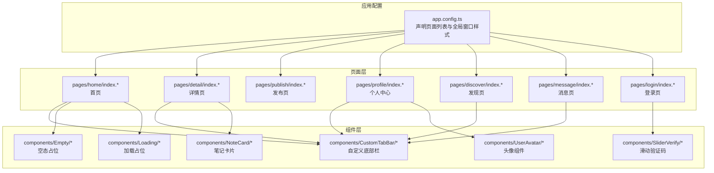
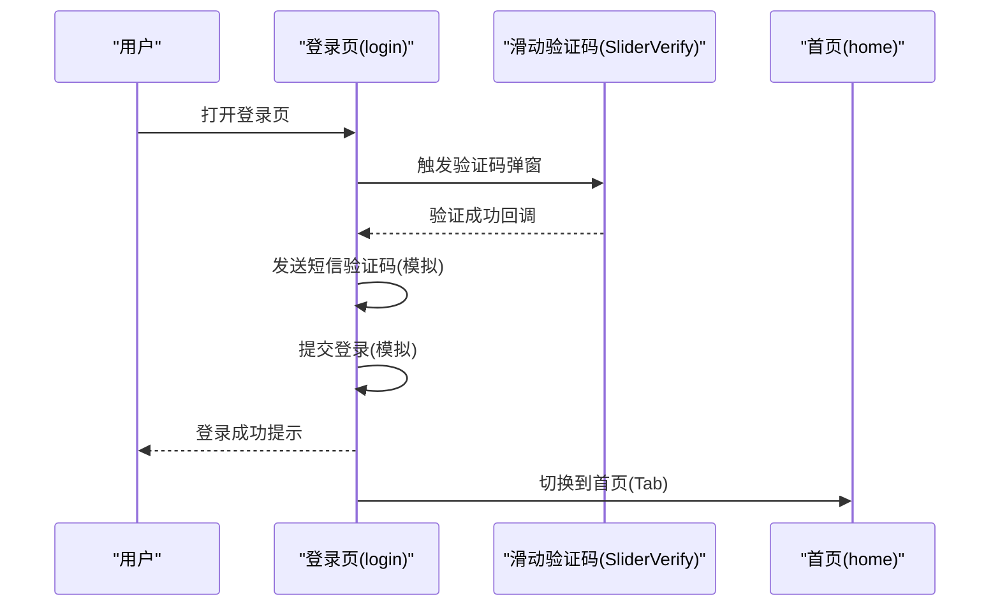
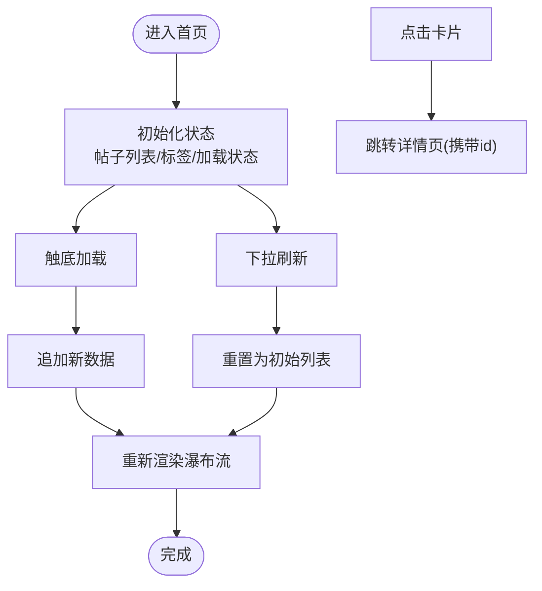
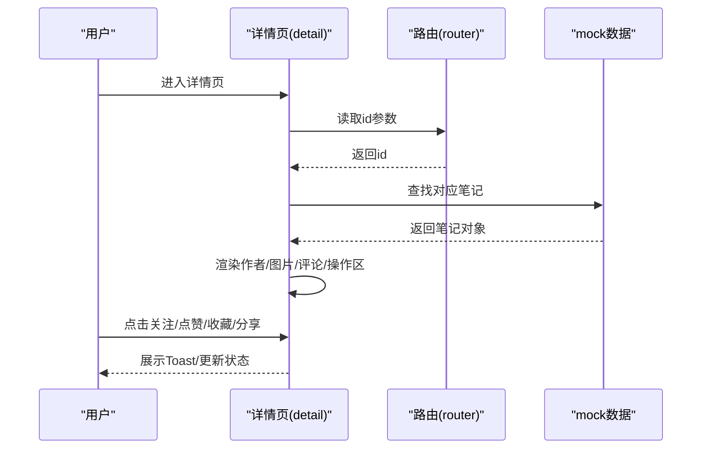
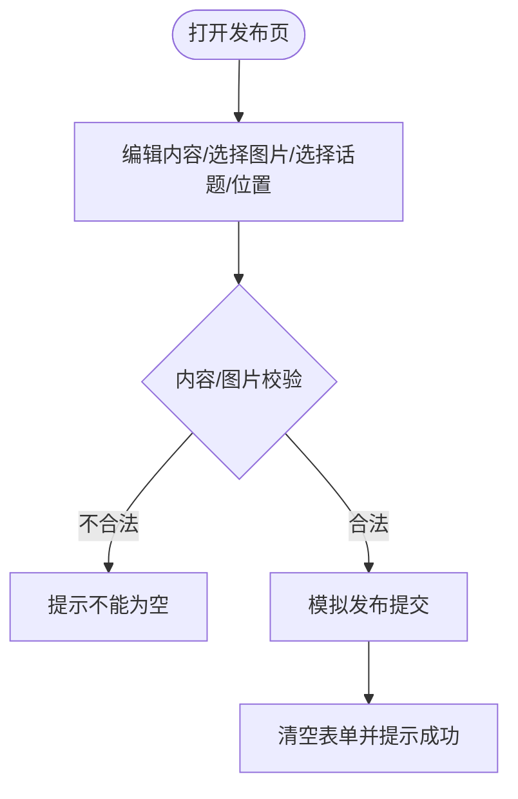
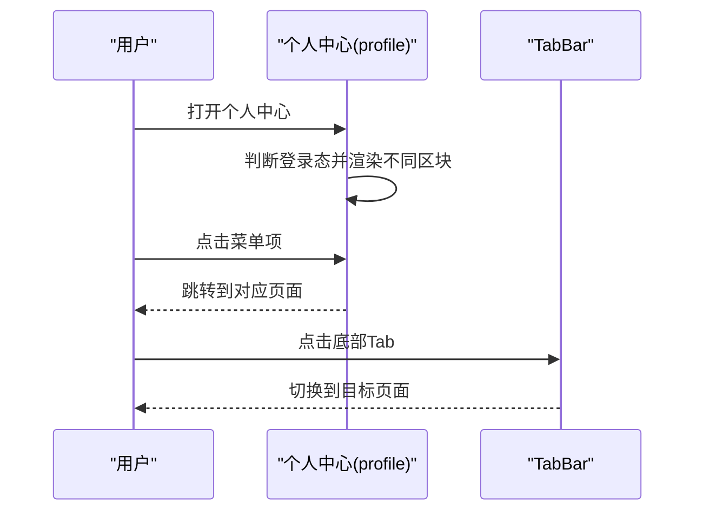
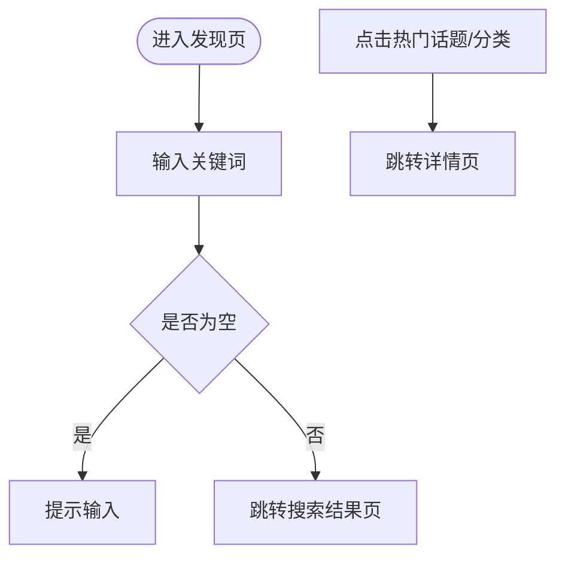
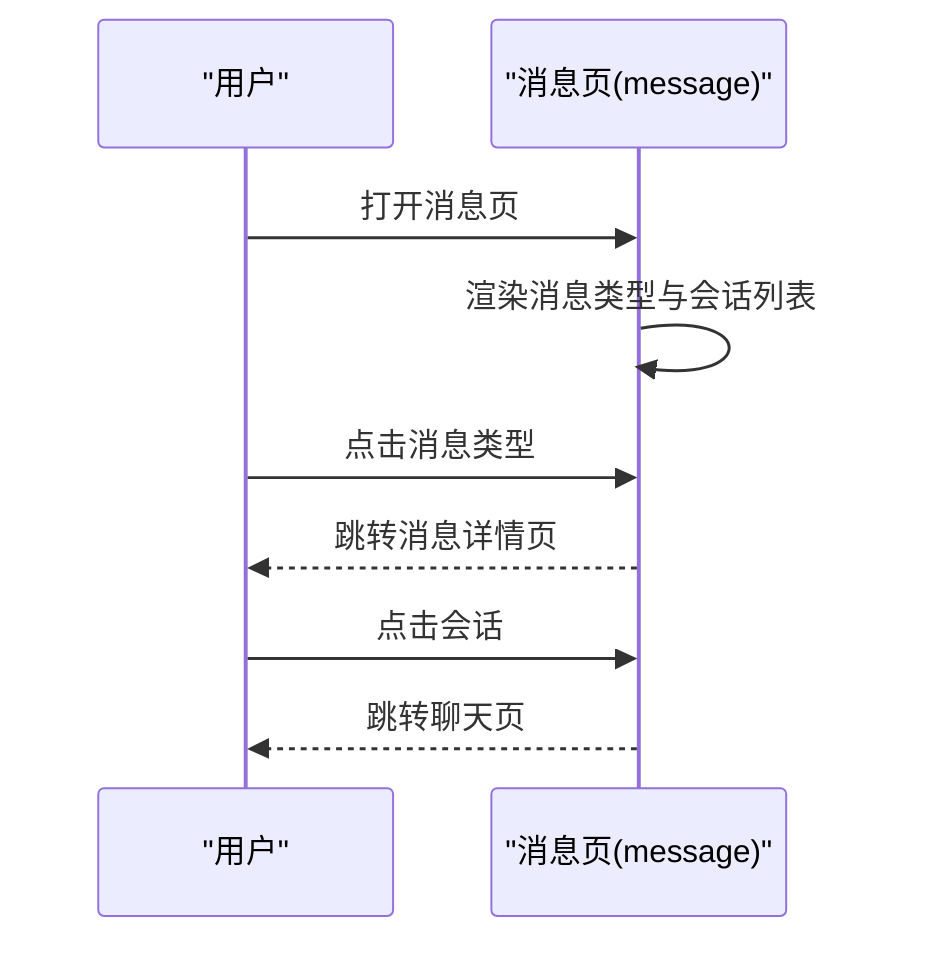
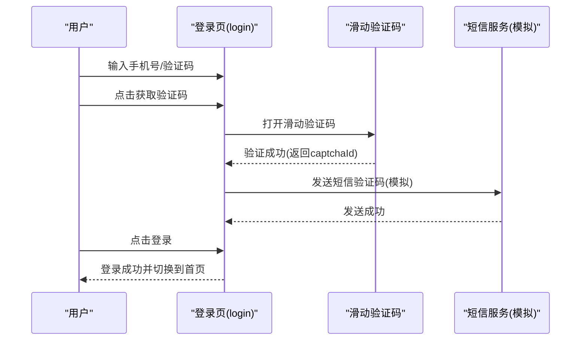
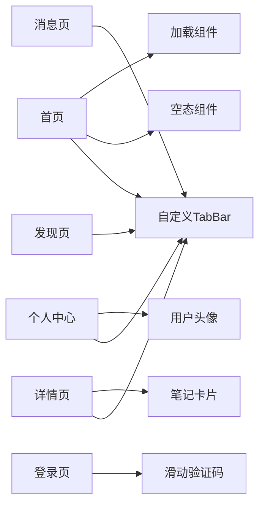

# 页面组件

<cite>
**本文引用的文件**
- [src/app.config.ts](file://src/app.config.ts)
- [src/pages/home/index.config.ts](file://src/pages/home/index.config.ts)
- [src/pages/detail/index.config.ts](file://src/pages/detail/index.config.ts)
- [src/pages/publish/index.config.ts](file://src/pages/publish/index.config.ts)
- [src/pages/profile/index.config.ts](file://src/pages/profile/index.config.ts)
- [src/pages/discover/index.config.ts](file://src/pages/discover/index.config.ts)
- [src/pages/message/index.config.ts](file://src/pages/message/index.config.ts)
- [src/pages/login/index.config.ts](file://src/pages/login/index.config.ts)
- [src/pages/home/index.tsx](file://src/pages/home/index.tsx)
- [src/pages/detail/index.tsx](file://src/pages/detail/index.tsx)
- [src/pages/publish/index.tsx](file://src/pages/publish/index.tsx)
- [src/pages/profile/index.tsx](file://src/pages/profile/index.tsx)
- [src/pages/discover/index.tsx](file://src/pages/discover/index.tsx)
- [src/pages/message/index.tsx](file://src/pages/message/index.tsx)
- [src/pages/login/index.tsx](file://src/pages/login/index.tsx)
- [src/components/CustomTabBar/index.tsx](file://src/components/CustomTabBar/index.tsx)
- [src/components/CustomTabBar/index.module.scss](file://src/components/CustomTabBar/index.module.scss)
- [src/components/Empty/index.tsx](file://src/components/Empty/index.tsx)
- [src/components/Empty/index.scss](file://src/components/Empty/index.scss)
- [src/components/Loading/index.tsx](file://src/components/Loading/index.tsx)
- [src/components/Loading/index.scss](file://src/components/Loading/index.scss)
- [src/components/NoteCard/index.tsx](file://src/components/NoteCard/index.tsx)
- [src/components/NoteCard/index.scss](file://src/components/NoteCard/index.scss)
- [src/components/SliderVerify/index.tsx](file://src/components/SliderVerify/index.tsx)
- [src/components/SliderVerify/index.module.scss](file://src/components/SliderVerify/index.module.scss)
- [src/components/UserAvatar/index.tsx](file://src/components/UserAvatar/index.tsx)
- [src/components/UserAvatar/index.scss](file://src/components/UserAvatar/index.scss)
- [src/utils/index.ts](file://src/utils/index.ts)
- [src/utils/http.ts](file://src/utils/http.ts)
- [src/types/index.ts](file://src/types/index.ts)
</cite>

## 目录
1. [简介](#简介)
2. [项目结构](#项目结构)
3. [核心组件](#核心组件)
4. [架构总览](#架构总览)
5. [详细组件分析](#详细组件分析)
6. [依赖分析](#依赖分析)
7. [性能考虑](#性能考虑)
8. [故障排查指南](#故障排查指南)
9. [结论](#结论)
10. [附录](#附录)

## 简介
本文件面向红书项目的页面组件，系统性梳理首页瀑布流、详情页、发布页、个人中心、发现页、消息页与登录页等核心页面的功能定位、用户交互流程与实现细节。文档覆盖路由配置、生命周期管理、状态管理与数据绑定、页面间导航与数据传递机制，并给出性能优化策略、用户体验设计原则与响应式布局建议，以及开发最佳实践与常见问题解决方案。

## 项目结构
项目采用基于页面的组织方式，页面位于 src/pages 下，每个页面包含独立的配置文件、样式与实现文件；公共组件位于 src/components 下，应用级配置在 src/app.config.ts 中统一声明。

图表来源
- [src/app.config.ts:1-18](file://src/app.config.ts#L1-L18)
- [src/pages/home/index.tsx:1-151](file://src/pages/home/index.tsx#L1-L151)
- [src/pages/detail/index.tsx:1-180](file://src/pages/detail/index.tsx#L1-L180)
- [src/pages/publish/index.tsx:1-142](file://src/pages/publish/index.tsx#L1-L142)
- [src/pages/profile/index.tsx:1-177](file://src/pages/profile/index.tsx#L1-L177)
- [src/pages/discover/index.tsx:1-119](file://src/pages/discover/index.tsx#L1-L119)
- [src/pages/message/index.tsx:1-117](file://src/pages/message/index.tsx#L1-L117)
- [src/pages/login/index.tsx:1-243](file://src/pages/login/index.tsx#L1-L243)

章节来源
- [src/app.config.ts:1-18](file://src/app.config.ts#L1-L18)

## 核心组件
- 自定义底部栏：用于在多个页面复用统一的 TabBar 布局与交互。
- 滑动验证码：登录页前置的安全校验组件，通过回调传递验证结果。
- 空态与加载：首页瀑布流在无数据或加载时的占位展示。
- 笔记卡片：详情页中用于展示作者信息、图片轮播、标签与评论等。
- 用户头像：统一的头像渲染组件，便于主题化与尺寸控制。

章节来源
- [src/components/CustomTabBar/index.tsx](file://src/components/CustomTabBar/index.tsx)
- [src/components/SliderVerify/index.tsx](file://src/components/SliderVerify/index.tsx)
- [src/components/Empty/index.tsx](file://src/components/Empty/index.tsx)
- [src/components/Loading/index.tsx](file://src/components/Loading/index.tsx)
- [src/components/NoteCard/index.tsx](file://src/components/NoteCard/index.tsx)
- [src/components/UserAvatar/index.tsx](file://src/components/UserAvatar/index.tsx)

## 架构总览
页面间导航以 Taro 的路由 API 为主，结合页面配置文件控制标题与分享能力。状态管理以 React Hooks 为主，部分页面使用本地状态驱动 UI 更新；全局窗口样式在应用配置中集中设定。

图表来源
- [src/pages/login/index.tsx:153-242](file://src/pages/login/index.tsx#L153-L242)
- [src/components/SliderVerify/index.tsx](file://src/components/SliderVerify/index.tsx)

## 详细组件分析

### 首页（瀑布流）
- 功能定位：信息流首页，支持多列瀑布流展示笔记，顶部横向标签切换，支持下拉刷新与上拉加载。
- 路由与配置：页面配置包含标题与分享能力。
- 生命周期与状态：
  - 使用下拉刷新与触底事件触发数据刷新与追加。
  - 使用本地状态维护帖子列表、加载状态与选中的标签。
- 数据绑定与交互：
  - 瀑布流按列渲染，每列使用过滤后的数组。
  - 点击卡片跳转至详情页并携带参数。
- 性能与体验：
  - 图片懒加载与分页加载减少首屏压力。
  - 加载状态与空态组件提升可用性。

图表来源
- [src/pages/home/index.tsx:70-151](file://src/pages/home/index.tsx#L70-L151)

章节来源
- [src/pages/home/index.config.ts:1-6](file://src/pages/home/index.config.ts#L1-L6)
- [src/pages/home/index.tsx:1-151](file://src/pages/home/index.tsx#L1-L151)

### 详情页（笔记详情）
- 功能定位：展示笔记内容、作者信息、图片轮播、评论区与互动操作。
- 路由与配置：页面配置包含标题与导航样式。
- 生命周期与状态：
  - 通过路由参数读取当前笔记 id 并匹配本地 mock 数据。
  - 维护点赞、收藏、关注等交互状态。
- 数据绑定与交互：
  - 图片轮播与指示器联动，支持多图浏览。
  - 评论列表渲染，时间与数字格式化工具使用。
  - 底部操作区支持点赞、收藏与分享。
- 性能与体验：
  - 图片宽度自适应，避免变形。
  - 分享菜单按页面配置启用。

图表来源
- [src/pages/detail/index.tsx:23-180](file://src/pages/detail/index.tsx#L23-L180)

章节来源
- [src/pages/detail/index.config.ts:1-6](file://src/pages/detail/index.config.ts#L1-L6)
- [src/pages/detail/index.tsx:1-180](file://src/pages/detail/index.tsx#L1-L180)

### 发布页
- 功能定位：支持输入文本、选择图片、选择话题与位置、设置可见性并提交发布。
- 路由与配置：页面配置包含标题。
- 生命周期与状态：
  - 文本输入、图片列表、话题与位置选择均使用本地状态管理。
- 数据绑定与交互：
  - 图片网格展示预览，支持移除与添加。
  - 发布按钮进行基础校验后模拟提交。
- 性能与体验：
  - 输入字数限制与实时统计，提升输入体验。

图表来源
- [src/pages/publish/index.tsx:6-142](file://src/pages/publish/index.tsx#L6-L142)

章节来源
- [src/pages/publish/index.config.ts:1-4](file://src/pages/publish/index.config.ts#L1-L4)
- [src/pages/publish/index.tsx:1-142](file://src/pages/publish/index.tsx#L1-L142)

### 个人中心
- 功能定位：用户资料展示、统计数据、菜单入口与内容分区。
- 路由与配置：页面配置包含标题。
- 生命周期与状态：
  - 登录态切换与 Tab 切换使用本地状态。
- 数据绑定与交互：
  - 登录态未登录时显示引导登录入口。
  - 点击菜单项跳转到对应页面。
- 性能与体验：
  - 统一的 TabBar 在页面底部复用，保证一致的交互。

图表来源
- [src/pages/profile/index.tsx:20-177](file://src/pages/profile/index.tsx#L20-L177)
- [src/components/CustomTabBar/index.tsx](file://src/components/CustomTabBar/index.tsx)

章节来源
- [src/pages/profile/index.config.ts:1-4](file://src/pages/profile/index.config.ts#L1-L4)
- [src/pages/profile/index.tsx:1-177](file://src/pages/profile/index.tsx#L1-L177)

### 发现页
- 功能定位：搜索入口、热门话题、分类与推荐关注。
- 路由与配置：页面配置包含标题。
- 生命周期与状态：
  - 搜索关键词使用本地状态管理。
- 数据绑定与交互：
  - 点击话题或分类跳转到对应页面。
  - 搜索框支持回车确认与跳转到搜索结果页。
- 性能与体验：
  - 横向滚动容器适配移动端交互。

图表来源
- [src/pages/discover/index.tsx:33-119](file://src/pages/discover/index.tsx#L33-L119)

章节来源
- [src/pages/discover/index.config.ts:1-4](file://src/pages/discover/index.config.ts#L1-L4)
- [src/pages/discover/index.tsx:1-119](file://src/pages/discover/index.tsx#L1-L119)

### 消息页
- 功能定位：消息类型入口与最近会话列表。
- 路由与配置：页面配置包含标题。
- 生命周期与状态：
  - 本地静态数据驱动消息类型与会话列表。
- 数据绑定与交互：
  - 点击消息类型跳转到消息详情页。
  - 点击会话跳转到聊天页。
- 性能与体验：
  - 未读数徽标提醒，提升信息密度。

图表来源
- [src/pages/message/index.tsx:49-117](file://src/pages/message/index.tsx#L49-L117)

章节来源
- [src/pages/message/index.config.ts:1-4](file://src/pages/message/index.config.ts#L1-L4)
- [src/pages/message/index.tsx:1-117](file://src/pages/message/index.tsx#L1-L117)

### 登录页
- 功能定位：手机号+短信验证码登录，滑动验证码前置校验，用户协议勾选。
- 路由与配置：页面配置包含自定义导航样式。
- 生命周期与状态：
  - 手机号、验证码、倒计时、协议勾选、加载状态均使用本地状态。
- 数据绑定与交互：
  - 发送验证码前进行手机号格式校验，打开滑动验证码。
  - 验证码成功后模拟发送短信并开始倒计时。
  - 登录成功后切换到首页 Tab。
- 安全与体验：
  - 倒计时防刷与输入限制提升安全性与易用性。

图表来源
- [src/pages/login/index.tsx:7-243](file://src/pages/login/index.tsx#L7-L243)
- [src/components/SliderVerify/index.tsx](file://src/components/SliderVerify/index.tsx)

章节来源
- [src/pages/login/index.config.ts:1-5](file://src/pages/login/index.config.ts#L1-L5)
- [src/pages/login/index.tsx:1-243](file://src/pages/login/index.tsx#L1-L243)

## 依赖分析
- 页面到组件：各页面通过导入公共组件实现功能复用与一致性。
- 页面到页面：通过路由 API 实现页面间跳转，传递查询参数或路径。
- 全局配置：应用配置集中声明页面列表与全局窗口样式，影响所有页面的导航与外观。

图表来源
- [src/pages/home/index.tsx:1-151](file://src/pages/home/index.tsx#L1-L151)
- [src/pages/detail/index.tsx:1-180](file://src/pages/detail/index.tsx#L1-L180)
- [src/pages/profile/index.tsx:1-177](file://src/pages/profile/index.tsx#L1-L177)
- [src/pages/discover/index.tsx:1-119](file://src/pages/discover/index.tsx#L1-L119)
- [src/pages/message/index.tsx:1-117](file://src/pages/message/index.tsx#L1-L117)
- [src/pages/login/index.tsx:1-243](file://src/pages/login/index.tsx#L1-L243)
- [src/components/CustomTabBar/index.tsx](file://src/components/CustomTabBar/index.tsx)
- [src/components/SliderVerify/index.tsx](file://src/components/SliderVerify/index.tsx)
- [src/components/Empty/index.tsx](file://src/components/Empty/index.tsx)
- [src/components/Loading/index.tsx](file://src/components/Loading/index.tsx)
- [src/components/NoteCard/index.tsx](file://src/components/NoteCard/index.tsx)
- [src/components/UserAvatar/index.tsx](file://src/components/UserAvatar/index.tsx)

章节来源
- [src/app.config.ts:1-18](file://src/app.config.ts#L1-L18)

## 性能考虑
- 图片优化
  - 首页瀑布流图片开启懒加载，减少首屏资源消耗。
  - 详情页图片使用宽度自适应模式，避免布局抖动与额外重绘。
- 列表渲染
  - 首页瀑布流按列分割渲染，降低单次渲染节点数量。
  - 使用稳定 key 与不可变更新策略，避免不必要的重渲染。
- 交互反馈
  - 登录与发布等异步操作使用加载状态与 Toast 提示，避免用户重复操作。
- 缓存与节流
  - 触底加载与下拉刷新需配合节流/去抖，防止频繁请求。
- 响应式布局
  - 使用横向滚动容器与弹性布局适配移动端屏幕尺寸变化。

## 故障排查指南
- 首页无法加载数据
  - 检查触底与下拉刷新逻辑是否被多次触发，确保加载状态互斥。
  - 确认 mock 数据结构与字段名一致。
- 详情页参数缺失
  - 确保从路由参数读取 id 并进行存在性判断与默认值处理。
  - 校验 mock 数据中是否存在对应 id 的条目。
- 发布页提交失败
  - 校验内容与图片数量的非空判断逻辑。
  - 确认模拟提交后的状态清空与提示逻辑正常执行。
- 个人中心跳转异常
  - 检查菜单项与页面路径映射关系，确保路径正确。
- 发现页搜索无效
  - 确认搜索框输入与跳转逻辑，避免空字符串跳转。
- 登录页验证码问题
  - 检查手机号格式校验与倒计时逻辑，确保验证码成功回调链路完整。
  - 确认滑动验证码组件的回调与状态联动。

章节来源
- [src/pages/home/index.tsx:83-102](file://src/pages/home/index.tsx#L83-L102)
- [src/pages/detail/index.tsx:32-40](file://src/pages/detail/index.tsx#L32-L40)
- [src/pages/publish/index.tsx:29-50](file://src/pages/publish/index.tsx#L29-L50)
- [src/pages/profile/index.tsx:51-53](file://src/pages/profile/index.tsx#L51-L53)
- [src/pages/discover/index.tsx:36-42](file://src/pages/discover/index.tsx#L36-L42)
- [src/pages/login/index.tsx:17-82](file://src/pages/login/index.tsx#L17-L82)

## 结论
本项目页面组件围绕“信息流 + 社交互动”的核心场景构建，通过清晰的页面职责划分、统一的组件复用与完善的路由配置，实现了良好的可维护性与扩展性。建议后续在真实接口接入时完善错误处理与缓存策略，并持续优化图片与列表渲染性能，以进一步提升用户体验。

## 附录
- 页面路由清单
  - 登录页、首页、发现页、发布页、消息页、个人中心、详情页
- 页面配置要点
  - 标题文本、导航样式、分享能力等在各页面配置文件中统一声明
- 工具与类型
  - 工具函数与网络请求封装位于 utils 目录，类型定义位于 types 目录

章节来源
- [src/app.config.ts:1-18](file://src/app.config.ts#L1-L18)
- [src/utils/index.ts](file://src/utils/index.ts)
- [src/utils/http.ts](file://src/utils/http.ts)
- [src/types/index.ts](file://src/types/index.ts)