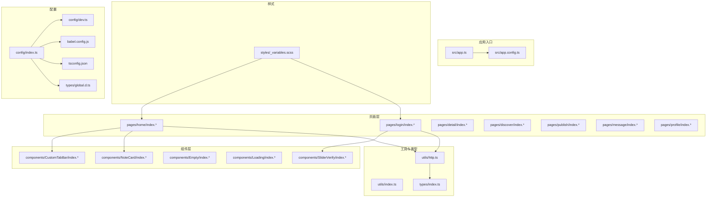
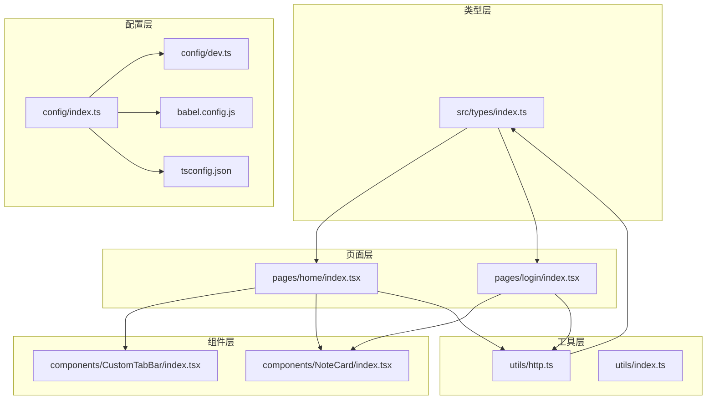
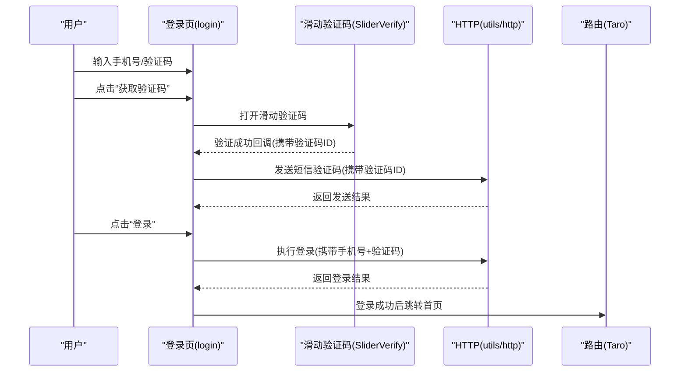
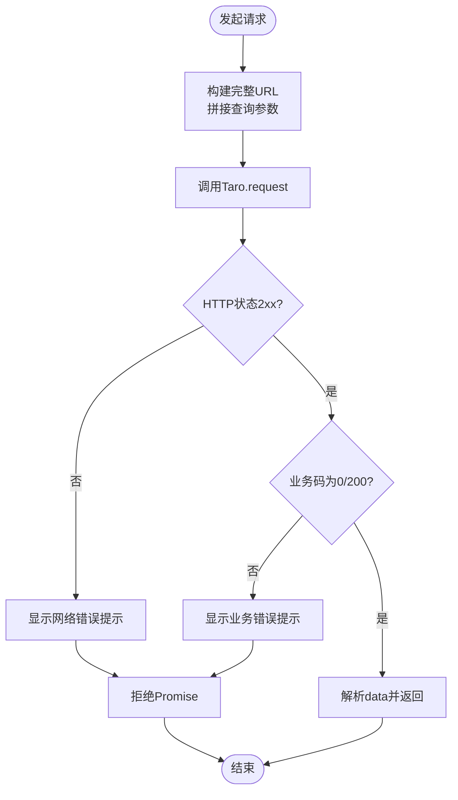
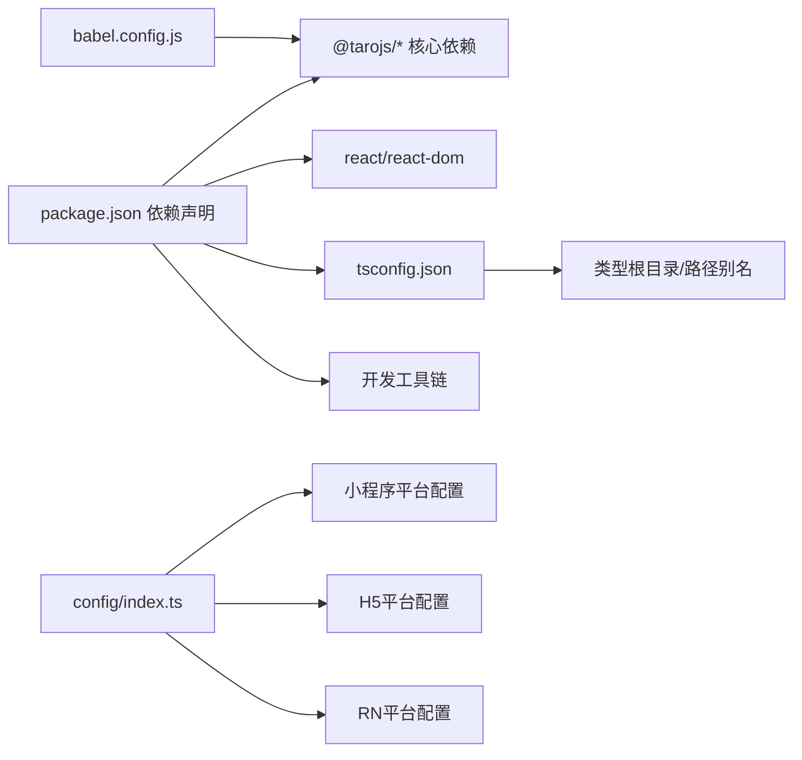

# 项目概述

<cite>
**本文引用的文件**
- [package.json](file://package.json)
- [tsconfig.json](file://tsconfig.json)
- [babel.config.js](file://babel.config.js)
- [config/index.ts](file://config/index.ts)
- [config/dev.ts](file://config/dev.ts)
- [src/app.ts](file://src/app.ts)
- [src/app.config.ts](file://src/app.config.ts)
- [src/types/index.ts](file://src/types/index.ts)
- [src/utils/http.ts](file://src/utils/http.ts)
- [src/utils/index.ts](file://src/utils/index.ts)
- [src/pages/home/index.tsx](file://src/pages/home/index.tsx)
- [src/pages/login/index.tsx](file://src/pages/login/index.tsx)
- [src/components/NoteCard/index.tsx](file://src/components/NoteCard/index.tsx)
- [src/components/CustomTabBar/index.tsx](file://src/components/CustomTabBar/index.tsx)
- [src/styles/_variables.scss](file://src/styles/_variables.scss)
- [types/global.d.ts](file://types/global.d.ts)
</cite>

## 目录
1. [引言](#引言)
2. [项目结构](#项目结构)
3. [核心组件](#核心组件)
4. [架构总览](#架构总览)
5. [详细组件分析](#详细组件分析)
6. [依赖关系分析](#依赖关系分析)
7. [性能考虑](#性能考虑)
8. [故障排查指南](#故障排查指南)
9. [结论](#结论)
10. [附录](#附录)

## 引言
本项目是一个基于 Taro 4.1.11 的多端社交应用，核心目标是通过一套代码实现微信小程序、H5、React Native 等多个平台的统一开发，为用户提供一致的社交内容体验（如首页瀑布流、详情页、发布、消息与个人中心等）。项目采用 React + TypeScript + SCSS 技术栈，结合 Taro 的多端编译能力与组件化架构，实现跨平台一致性与可维护性。

## 项目结构
项目采用“页面-组件-工具-类型-样式”分层组织，遵循 Taro 的约定式路由与模块化目录结构：
- 页面层：pages 下按功能划分页面，每个页面包含独立的配置、样式与入口文件
- 组件层：components 提供可复用 UI 组件（如自定义 TabBar、卡片、空状态、加载态）
- 工具层：utils 提供通用方法（HTTP 请求、时间格式化、防抖节流）
- 类型层：types 定义业务与认证相关类型，确保类型安全
- 样式层：styles 提供全局变量与页面级样式，支持 SCSS 与 CSS Modules
- 配置层：config 提供 Taro 编译配置与开发代理设置

图表来源
- [src/app.ts:1-14](file://src/app.ts#L1-L14)
- [src/app.config.ts:1-18](file://src/app.config.ts#L1-L18)
- [config/index.ts:1-82](file://config/index.ts#L1-L82)
- [config/dev.ts:1-22](file://config/dev.ts#L1-L22)
- [babel.config.js:1-12](file://babel.config.js#L1-L12)
- [tsconfig.json:1-31](file://tsconfig.json#L1-L31)
- [types/global.d.ts:1-27](file://types/global.d.ts#L1-L27)
- [src/utils/http.ts:1-157](file://src/utils/http.ts#L1-L157)
- [src/utils/index.ts:1-49](file://src/utils/index.ts#L1-L49)
- [src/types/index.ts:1-147](file://src/types/index.ts#L1-L147)
- [src/pages/home/index.tsx:1-151](file://src/pages/home/index.tsx#L1-L151)
- [src/pages/login/index.tsx:1-243](file://src/pages/login/index.tsx#L1-L243)
- [src/components/CustomTabBar/index.tsx:1-67](file://src/components/CustomTabBar/index.tsx#L1-L67)
- [src/components/NoteCard/index.tsx:1-53](file://src/components/NoteCard/index.tsx#L1-L53)
- [src/styles/_variables.scss:1-9](file://src/styles/_variables.scss#L1-L9)

章节来源
- [package.json:1-93](file://package.json#L1-L93)
- [config/index.ts:1-82](file://config/index.ts#L1-L82)
- [tsconfig.json:1-31](file://tsconfig.json#L1-L31)
- [babel.config.js:1-12](file://babel.config.js#L1-L12)
- [types/global.d.ts:1-27](file://types/global.d.ts#L1-L27)

## 核心组件
- 应用入口与生命周期：应用入口负责初始化与启动日志；页面通过 Taro 生命周期钩子实现下拉刷新与上拉触底等交互
- 页面与导航：首页展示瀑布流布局与标签切换；登录页集成滑动验证码与短信登录流程；底部自定义 TabBar 支持中间发布按钮
- 通用组件：卡片组件封装内容封面、作者信息与点赞数；空状态与加载态组件提供占位与反馈
- 工具与类型：HTTP 封装统一处理基础 URL、查询参数、响应体与错误提示；通用工具提供数字格式化、时间格式化、防抖与节流
- 样式体系：SCSS 变量集中管理主题色与排版，页面级样式采用 CSS Modules 实现作用域隔离

章节来源
- [src/app.ts:1-14](file://src/app.ts#L1-L14)
- [src/pages/home/index.tsx:1-151](file://src/pages/home/index.tsx#L1-L151)
- [src/pages/login/index.tsx:1-243](file://src/pages/login/index.tsx#L1-L243)
- [src/components/CustomTabBar/index.tsx:1-67](file://src/components/CustomTabBar/index.tsx#L1-L67)
- [src/components/NoteCard/index.tsx:1-53](file://src/components/NoteCard/index.tsx#L1-L53)
- [src/utils/http.ts:1-157](file://src/utils/http.ts#L1-L157)
- [src/utils/index.ts:1-49](file://src/utils/index.ts#L1-L49)
- [src/styles/_variables.scss:1-9](file://src/styles/_variables.scss#L1-L9)

## 架构总览
项目采用“类型驱动 + 组件化 + 模块化”的架构设计：
- 类型驱动：通过统一的类型定义（用户、帖子、评论、消息、认证等）保证前后端契约一致与开发效率
- 组件化：页面由可复用组件组合而成，降低重复代码，提升可测试性与可维护性
- 模块化：页面与组件按功能拆分，样式采用 CSS Modules，避免命名冲突
- 多端统一：Taro 在编译期将 React 代码转换为各平台可执行代码，配合配置实现 H5、小程序、RN 等平台的一致体验

图表来源
- [src/types/index.ts:1-147](file://src/types/index.ts#L1-L147)
- [src/pages/home/index.tsx:1-151](file://src/pages/home/index.tsx#L1-L151)
- [src/pages/login/index.tsx:1-243](file://src/pages/login/index.tsx#L1-L243)
- [src/components/CustomTabBar/index.tsx:1-67](file://src/components/CustomTabBar/index.tsx#L1-L67)
- [src/components/NoteCard/index.tsx:1-53](file://src/components/NoteCard/index.tsx#L1-L53)
- [src/utils/http.ts:1-157](file://src/utils/http.ts#L1-L157)
- [src/utils/index.ts:1-49](file://src/utils/index.ts#L1-L49)
- [config/index.ts:1-82](file://config/index.ts#L1-L82)
- [config/dev.ts:1-22](file://config/dev.ts#L1-L22)
- [babel.config.js:1-12](file://babel.config.js#L1-L12)
- [tsconfig.json:1-31](file://tsconfig.json#L1-L31)

## 详细组件分析

### 页面与导航组件
- 首页（瀑布流）：实现标签切换、左右两列瀑布流布局、下拉刷新与上拉加载更多；通过 Taro 导航跳转到详情页
- 登录页：集成手机号输入、短信验证码发送、滑动验证码校验、协议勾选与登录提交；模拟登录成功后跳转首页
- 自定义 TabBar：根据当前路由高亮对应 Tab，中间项作为发布入口，其余项支持底部切换

图表来源
- [src/pages/login/index.tsx:1-243](file://src/pages/login/index.tsx#L1-L243)
- [src/utils/http.ts:1-157](file://src/utils/http.ts#L1-L157)

章节来源
- [src/pages/home/index.tsx:1-151](file://src/pages/home/index.tsx#L1-L151)
- [src/pages/login/index.tsx:1-243](file://src/pages/login/index.tsx#L1-L243)
- [src/components/CustomTabBar/index.tsx:1-67](file://src/components/CustomTabBar/index.tsx#L1-L67)

### HTTP 请求与类型系统
- HTTP 封装：统一处理基础 URL（H5 通过代理前缀）、查询参数拼接、响应体结构与错误提示；提供 GET/POST/PUT/DELETE 方法
- 类型系统：定义用户、帖子、评论、消息、话题、认证模式与 Token 结构，提供类型守卫以区分单/双 Token 响应

图表来源
- [src/utils/http.ts:1-157](file://src/utils/http.ts#L1-L157)

章节来源
- [src/utils/http.ts:1-157](file://src/utils/http.ts#L1-L157)
- [src/types/index.ts:1-147](file://src/types/index.ts#L1-L147)

### 工具函数与样式体系
- 工具函数：数字格式化（单位转换）、时间格式化（相对时间）、防抖与节流，用于优化用户体验与性能
- 样式体系：SCSS 变量集中管理主色、文本色、背景色与 TabBar 高度；页面样式采用 CSS Modules，避免全局污染

章节来源
- [src/utils/index.ts:1-49](file://src/utils/index.ts#L1-L49)
- [src/styles/_variables.scss:1-9](file://src/styles/_variables.scss#L1-L9)

## 依赖关系分析
- 运行时依赖：@tarojs 系列插件与 React 生态，支撑多端渲染与框架能力
- 开发时依赖：TypeScript、ESLint、Stylelint、Vite、Babel 预设等，保障类型安全、代码规范与构建效率
- 构建配置：Taro 配置文件定义项目名、设计稿宽度、设备比、源输出路径、缓存策略、平台特定的 CSS Modules 与 PostCSS 设置；开发环境提供 H5 代理配置

图表来源
- [package.json:1-93](file://package.json#L1-L93)
- [config/index.ts:1-82](file://config/index.ts#L1-L82)
- [babel.config.js:1-12](file://babel.config.js#L1-L12)
- [tsconfig.json:1-31](file://tsconfig.json#L1-L31)

章节来源
- [package.json:1-93](file://package.json#L1-L93)
- [config/index.ts:1-82](file://config/index.ts#L1-L82)
- [babel.config.js:1-12](file://babel.config.js#L1-L12)
- [tsconfig.json:1-31](file://tsconfig.json#L1-L31)

## 性能考虑
- 懒加载与滚动优化：图片懒加载减少首屏压力；瀑布流分栏渲染与上拉加载更多避免一次性渲染大量节点
- 请求与交互节流：登录与发送验证码流程中加入倒计时与状态控制，避免重复请求
- 样式作用域：CSS Modules 与 SCSS 变量减少全局样式冲突，提升样式维护效率
- 构建优化：关闭缓存开关以确保开发时变更及时生效；H5 使用代理与公共路径配置优化开发体验

## 故障排查指南
- 网络请求失败：检查环境变量与基础 URL 配置，确认 H5 代理是否正确指向后端服务
- 平台差异问题：确认 Taro 环境变量与平台插件版本一致，避免运行时 API 不兼容
- 样式冲突：检查 CSS Modules 命名与作用域，避免全局样式污染
- 类型错误：依据类型定义修正接口字段，必要时使用类型守卫进行分支判断

章节来源
- [config/dev.ts:1-22](file://config/dev.ts#L1-L22)
- [src/utils/http.ts:1-157](file://src/utils/http.ts#L1-L157)
- [types/global.d.ts:1-27](file://types/global.d.ts#L1-L27)

## 结论
本项目以 Taro 为核心，结合 React + TypeScript + SCSS，实现了多端统一开发与组件化架构。通过类型驱动与模块化组织，项目在保持高度一致性的同时提升了可维护性与扩展性。建议在后续迭代中逐步接入真实后端 API、完善鉴权与缓存策略，并持续优化首屏性能与交互细节。

## 附录
- 实际使用场景示例
  - 登录流程：手机号输入 → 滑动验证码验证 → 发送短信验证码 → 登录提交 → 成功跳转首页
  - 首页交互：标签切换 → 瀑布流展示 → 下拉刷新 → 上拉加载更多 → 点击卡片跳转详情
  - 发布入口：点击中间发布按钮进入发布页，完成内容创作与提交